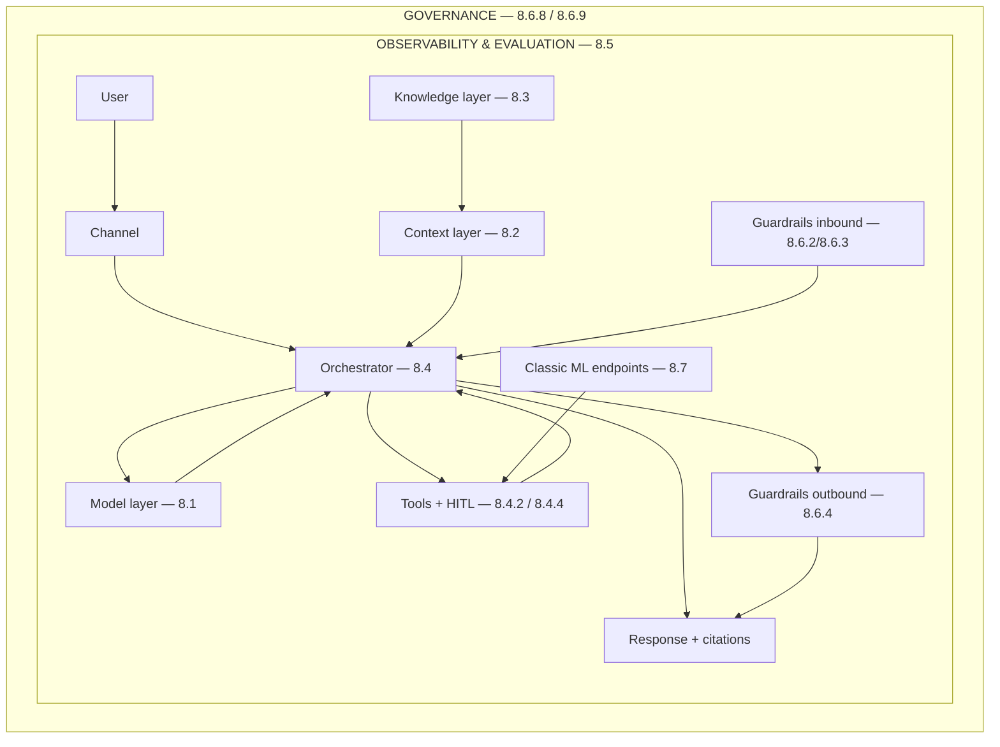

# Part 8 — AI / Generative AI Core: The Map

*Read this file first. It is the index, the architecture, and the study order for everything
in files 01–07.*

---

## 1. How this material is organised

Seven files. **File order = learning order**, so read them 01 → 07. The section numbers (8.x)
stay inside, in your original numbering.

There is also an optional drill file after the seven stages: `08-Interview-Questions-Model-Answers.md`.
Use it after studying the reference files to practise spoken panel answers.

| File | Section | What it adds to the system |
|---|---|---|
| `01-Stage1-LLM-Fundamentals.md` | 8.1 | A model that answers reliably |
| `02-Stage2-Prompt-Context-Engineering.md` | 8.2 | Prompts and a managed context window |
| `03-Stage3-RAG.md` | 8.3 | Our actual documents |
| `04-Stage4-Agentic-AI.md` | 8.4 | Actions and human approvals |
| `05-Stage5-Guardrails-AI-Security.md` | 8.6 | Guardrails, permissions, audit |
| `06-Stage6-LLMOps-Evaluation-Telemetry.md` | 8.5 | Proof that it works |
| `07-Stage7-Classic-ML-MLOps.md` | 8.7 | The non-LLM half, and the full lifecycle |
| `08-Interview-Questions-Model-Answers.md` | Drill | Tough panel questions and spoken model answers |

Your original numbering is preserved throughout. Topics marked **`+`** are additions to the
original outline — gaps that a technical or public-sector panel will reach for.

### Every file has two layers, cross-linked

**Layer 1 — THE BUILD (the spine).** One system, built from nothing to production across all
seven files. Each file opens with its stage of that build, written as a continuous story. Every
topic is introduced at the exact moment you would hit it while building, with a link into its
reference entry.

**Layer 2 — THE REFERENCE (complete coverage).** Every topic from the outline, in your
numbering, with full detail. Each entry carries a `> In the build:` line pointing back to the
step it came from.

So you can read it as one story, or use it as a lookup table, and neither mode loses anything.

### The system being built, across all seven files

**An internal AI assistant for a government entity.** Staff ask questions in English and Arabic
about policies, procedures and their own entitlements. It answers with citations to the source
document. It can perform a small number of actions — raise a ticket, submit a leave request —
but only with human approval. It must never show one employee another employee's data,
everything it does must be auditable, and the data may not leave the country.

That single system exercises every topic in 8.1 through 8.7. Nothing in this material is
hypothetical: every concept earns its place by solving a problem the build has just hit.

---

## 2. The master architecture

**Every topic in all seven files has a coordinate on this one diagram.** That is the whole
point of it. When you meet an unfamiliar question, the first move is not to recall a fact — it
is to locate the question on this map. Once you know which layer it lives in, you know which
concepts are adjacent to it, and the answer follows.

```
┌═ GOVERNANCE LAYER ══════════════════════════════ 8.6.8 · 8.6.9 ═════════════════┐
║  AI register · use-case intake · approval workflow · Responsible AI standards    ║
║  NIST AI RMF · ISO 42001 · UAE National AI Strategy · vendor & model risk        ║
║                                                                                  ║
║ ┌═ OBSERVABILITY & EVALUATION LAYER ══════════════ 8.5 ════════════════════════┐ ║
║ ║  traces · token & cost accounting · TTFT/p95 latency · quality metrics       ║ ║
║ ║  golden sets · CI regression · user feedback · canary & shadow deployment    ║ ║
║ ║                                                                              ║ ║
║ ║   ┌──────────┐   ┌────────────┐   ┌──────────────────┐   ┌───────────────┐  ║ ║
║ ║   │  USER    │──►│  CHANNEL   │──►│  ORCHESTRATOR    │──►│   RESPONSE    │  ║ ║
║ ║   │          │   │ web · Teams│   │  8.4 agent loop  │   │  + citations  │  ║ ║
║ ║   └──────────┘   │ API · bot  │   │  or fixed chain  │   └───────────────┘  ║ ║
║ ║                  └────────────┘   └────┬────────▲────┘                      ║ ║
║ ║                                        │        │                           ║ ║
║ ║        ┌───────────────────────────────┴──┐     │                           ║ ║
║ ║        │  CONTEXT LAYER            8.2    │     │                           ║ ║
║ ║        │  system prompt · history         │     │                           ║ ║
║ ║        │  context budget · compaction     │     │                           ║ ║
║ ║        │  memory tiers · prompt caching   │     │                           ║ ║
║ ║        └───────────────┬──────────────────┘     │                           ║ ║
║ ║                        │                        │                           ║ ║
║ ║        ┌───────────────┴──────────────────┐     │                           ║ ║
║ ║        │  KNOWLEDGE LAYER          8.3    │     │                           ║ ║
║ ║        │  ingest → chunk → embed →        │     │                           ║ ║
║ ║        │  index → retrieve → rerank       │     │                           ║ ║
║ ║        │  ▲ security trimming 8.3.5.8     │     │                           ║ ║
║ ║        └──────────────────────────────────┘     │                           ║ ║
║ ║                                                 │                           ║ ║
║ ║   ┌─────────────────────────────────────────────┴───────────────────────┐   ║ ║
║ ║   │  MODEL LAYER                                                  8.1   │   ║ ║
║ ║   │  tokenizer · transformer · decoding knobs · structured output       │   ║ ║
║ ║   │  hosted API │ managed platform (Azure OpenAI/Foundry) │ self-hosted │   ║ ║
║ ║   └─────────────────────────────────────────────────────────────────────┘   ║ ║
║ ║                                                                              ║ ║
║ ║   ┌──────────────────────────┐        ┌──────────────────────────────────┐  ║ ║
║ ║   │  TOOLS & ACTIONS  8.4.2  │        │  CLASSIC ML MODELS         8.7   │  ║ ║
║ ║   │  tool registry · schemas │        │  forecasting · classification    │  ║ ║
║ ║   │  scoped permissions      │        │  scoring · anomaly detection     │  ║ ║
║ ║   │  HUMAN APPROVAL  8.4.4   │        │  served as endpoints, called     │  ║ ║
║ ║   └──────────────────────────┘        │  like any other tool             │  ║ ║
║ ║                                       └──────────────────────────────────┘  ║ ║
║ ║                                                                              ║ ║
║ ║   ▲ GUARDRAILS INBOUND    8.6.2 · 8.6.3      GUARDRAILS OUTBOUND  8.6.4 ▲    ║ ║
║ ║     prompt shields · content filter            schema · citations · PII      ║ ║
║ ║     injection detection · rate limits          safe rendering · groundedness ║ ║
║ ╚══════════════════════════════════════════════════════════════════════════════╝ ║
╚══════════════════════════════════════════════════════════════════════════════════╝
```



**Nine layers. Learn them as a list, because it doubles as the answer to "walk me through your
architecture":**

1. **Channel** — where the request enters (web, Teams, API, bot)
2. **Orchestrator** — the loop or chain that decides what happens *(8.4)*
3. **Context** — what goes into the window and in what order *(8.2)*
4. **Knowledge** — how your data becomes retrievable *(8.3)*
5. **Model** — the thing that generates *(8.1)*
6. **Tools & actions** — how it affects the world, and who approves *(8.4.2, 8.4.4)*
7. **Guardrails** — inbound and outbound safety *(8.6)*
8. **Observability & evaluation** — proof that it works *(8.5)*
9. **Governance** — permission for it to exist at all *(8.6.8, 8.6.9)*

---

## 3. How to read a topic card

Every reference entry has the same fields, every time, so you can scan for the one you need.

**CORE topics** get the full nine-block treatment:

```
## 8.x.y  Topic name
> In the build: Stage N, Step M — "the problem that forced this"

1. Definition        Plain English first, then precise.
2. Scenario          The real situation that makes it necessary.
3. Example           Concrete, with real values. Never abstract.
4. How it works      The mechanics. Enough to reason from.
5. Where it fits     The architecture diagram with this box marked.
6. Libraries & code  Exact library, exact call, fully commented.
7. Knobs & numbers   Defaults, ranges, real production values.
8. Perspectives      Theory · engineering · operations · cost · security · decision.
9. Trade-offs        When not to, and what visibly breaks.
```

**WORKING and AWARENESS topics** get the compact six-field card:

```
### 8.x.y.z  Topic name                                          [TIER]

Definition     One line. What it is.
Example        Concrete, with real values.
Where it fits  Which layer, at which step — what enters, what leaves.
Library        The exact library and call. Python primary, .NET/JS named.
Used when      The situation that makes you reach for it.
Fails when     The failure mode. Usually the real question.
```

---

## 4. Tiers — what to actually do with 400 topics

Four hundred topics is not learnable. Sixty deeply, one hundred and fifty competently, and the
rest recognisably — that *is* learnable, and it is also how real technical knowledge is
actually distributed.

| Tier | Count | What it means | Effort |
|---|---|---|---|
| **[CORE]** | ~60 | Explain the mechanism, defend it under three follow-up questions, draw it | Full card + practice out loud |
| **[WORKING]** | ~150 | Define it, say when you'd use it, name the library | Full card, read twice |
| **[AWARENESS]** | ~190 | Recognise the name, say one accurate sentence, know where to look | Read once |

**The rule for judging yourself:** for a CORE topic, you should be able to explain it, then
answer *"and what breaks when you get that wrong?"* without pausing. If you can only recite the
definition, it isn't CORE yet.

---

## 5. The learning order

**This is deliberately not the numbering order.** The numbering is a filing system; this is a
build order. Each stage assumes the one before it, and mirrors how you would actually construct
a system.

```
STAGE 1  The model itself            8.1     ── what it is, how you call it
   ↓
STAGE 2  Talking to it               8.2     ── prompts, context, caching
   ↓
STAGE 3  Giving it your data         8.3     ── the whole RAG pipeline
   ↓
STAGE 4  Letting it act              8.4     ── tools, agents, human approval
   ↓
STAGE 5  Stopping it going wrong     8.6     ── guardrails, injection, permissions, audit
   ↓
STAGE 6  Proving it works            8.5     ── evaluation, telemetry, cost, deployment
   ↓
STAGE 7  The non-LLM half            8.7     ── classic ML, MLOps, and the lifecycle
```

**Why 8.6 comes before 8.5** — the one place the order departs from the numbering. Guardrails
are a *design* concern: you cannot evaluate a system's safety until you know what controls it
was supposed to have. Learn what can go wrong, then learn how to measure whether it did.

**Why 8.7 comes last, not first.** Classic ML is older and more established, so it looks like
the natural foundation. It isn't, for this material — nothing in 8.1–8.6 depends on it. But it
*closes* the loop: section 8.7.7's lifecycle (assessment → data prep → build → test → validate
→ deploy → monitor → support) is the frame that contains everything in all seven files, which
is exactly why it works better as a summary than as an introduction.

---

## 6. The complete index

Ordered for learning within each section. `+` marks additions to the original outline.

### Stage 1 — 8.1 LLM Fundamentals → `01-Stage1-LLM-Fundamentals.md` ✅ *written*

| # | Topic | Tier |
|---|---|---|
| 8.1.1 | Transformers, attention, tokenization, context window, embeddings vs generation | **CORE** |
| 8.1.2 | Generation parameters: temperature, top-p, max tokens, stop, seeds, determinism | **CORE** |
| 8.1.3 | Model selection: capability vs cost vs latency; small vs frontier; open-weight vs API | **CORE** |
| 8.1.4 | Structured outputs: JSON Schema, function-call mode, constrained decoding, retries | **CORE** |
| 8.1.5 | Fine-tuning vs RAG vs prompting vs distillation | **CORE** |
| 8.1.6 | PEFT/LoRA, quantization, self-hosting (Ollama/vLLM) vs managed | WORKING |
| 8.1.7 | Hallucination: causes, detection, mitigation | **CORE** |
| 8.1.8 | Azure OpenAI / AI Foundry: deployments, PTU vs PAYG, quotas & TPM, content filters, regions, private networking, residency | **CORE** |
| **+ 8.1.9** | Reasoning models and hidden thinking tokens | WORKING |
| **+ 8.1.10** | Streaming: TTFT, server-sent events, partial-output handling | WORKING |
| **+ 8.1.11** | Multimodal input: vision, documents, audio | AWARENESS |

### Stage 2 — 8.2 Prompt & Context Engineering → `02-Stage2-Prompt-Context-Engineering.md` ✅ *written*

| # | Topic | Tier |
|---|---|---|
| 8.2.1 | Prompt roles: system, user, assistant | WORKING |
| 8.2.2 | Techniques: few-shot, chain-of-thought, ReAct, self-consistency | **CORE** |
| 8.2.6 | Output control: formatting, delimiters, refusal handling | WORKING |
| 8.2.4 | Context engineering: budgeting, compaction, summarization, retrieval placement, lost-in-the-middle, tool-result pruning, memory tiers | **CORE** |
| 8.2.5 | Prompt caching: mechanism, cost and latency implications | **CORE** |
| 8.2.3 | Prompt management: templating, versioning, prompt-as-code, A/B testing | WORKING |

*(Order note: output control moves up next to techniques because it is the same skill; prompt management moves last because it is an operational concern that only makes sense once you have prompts worth managing.)*

### Stage 3 — 8.3 RAG → `03-Stage3-RAG.md` ✅ *written*

| # | Topic | Tier |
|---|---|---|
| 8.3.1 | Ingestion: connectors, incremental sync, change detection, OCR/Document Intelligence, PDF/Office/scanned, tables, images | WORKING |
| 8.3.1.4 | Arabic document handling: OCR, extraction, RTL, multilingual | WORKING |
| 8.3.2 | Chunking: fixed, recursive, semantic, layout-aware; size & overlap; parent-child; metadata enrichment | **CORE** |
| 8.3.3 | Embeddings: model choice, dimensionality, normalization, multilingual, Arabic, re-embedding, cost | **CORE** |
| 8.3.4 | Vector stores: Azure AI Search, pgvector, HNSW/IVFFlat, filters, hybrid indexes, scaling, refresh | **CORE** |
| 8.3.5 | Retrieval: hybrid search, reranking, query rewriting/expansion, HyDE, multi-query, metadata filtering | **CORE** |
| 8.3.5.8 | **Security trimming / permission-aware retrieval** | **CORE** |
| 8.3.6 | Generation: grounding prompts, citations, "I don't know", answer verification | **CORE** |
| **+ 8.3.9** | Index lifecycle: deletions, freshness, right-to-erasure, re-index strategy | **CORE** |
| **+ 8.3.10** | Retrieval caching: semantic cache, exact-match cache, invalidation | WORKING |
| 8.3.7 | Advanced: GraphRAG, agentic RAG, contextual retrieval, multi-hop, Table RAG, SQL RAG / text-to-SQL | WORKING |
| 8.3.8 | Evaluation: groundedness, faithfulness, answer relevance, context precision/recall, hit rate, RAGAS, Azure AI Evaluation SDK | **CORE** |
| **+ 8.3.8.10** | Building the golden question set — how to actually construct one | **CORE** |

### Stage 4 — 8.4 Agentic AI → `04-Stage4-Agentic-AI.md` ✅ *written*

| # | Topic | Tier |
|---|---|---|
| 8.4.1 | Agent loop: plan → tool call → observe → repeat; ReAct, plan-and-execute, reflection | **CORE** |
| 8.4.2 | Tool/function calling: schema design, descriptions as prompts, argument validation, error feedback, parallel calls, selection at scale | **CORE** |
| 8.4.3.7 | Deterministic workflow vs agent — when each is right | **CORE** |
| 8.4.3 | Orchestration: LangGraph, Semantic Kernel, AutoGen, CrewAI, Foundry Agent Service, Durable Functions/Temporal | WORKING |
| 8.4.5 | State & memory: short-term, long-term, episodic, persistence, multi-turn recovery | WORKING |
| 8.4.4 | **Human-in-the-loop**: approval gates, interrupt/resume, checkpointing, escalation, approval UI, approval audit, Power Automate mapping | **CORE** |
| 8.4.8 | **Agentic harness**: sandboxing, tool registries, permission scoping, execution limits, loop caps, timeouts, budget caps, replayability, determinism, testing | **CORE** |
| 8.4.9 | Failure modes: infinite loops, tool thrashing, injection via tool output, over-agency | **CORE** |
| 8.4.6 | Multi-agent: supervisor/worker, handoffs, shared state, failure modes, cost explosion | WORKING |
| 8.4.7 | MCP: servers, tools, resources, transport, auth | WORKING |

### Stage 5 — 8.6 AI Guardrails & Security → `05-Stage5-Guardrails-AI-Security.md` ✅ *written*

| # | Topic | Tier |
|---|---|---|
| 8.6.1 | OWASP Top 10 for LLM Applications — all ten | **CORE** |
| 8.6.2 | Prompt injection: direct, indirect, and the defence stack | **CORE** |
| **+ 8.6.11** | Jailbreak taxonomy: roleplay, encoding, many-shot, obfuscation | WORKING |
| 8.6.3 | Content filtering: Azure AI Content Safety, prompt shields, groundedness detection, protected material, blocklists, severity thresholds | **CORE** |
| 8.6.4 | Output validation: schema, business rules, citation verification, PII redaction, safe rendering | **CORE** |
| 8.6.5 | **Tool permission scoping**: per-agent identity, on-behalf-of, scoped tokens, read vs write, approval-required, blast radius | **CORE** |
| **+ 8.6.12** | Per-user rate limiting and quota as an abuse control | WORKING |
| 8.6.6 | **Audit logging**: prompt/response retention, who-asked-what, PII in logs, immutability, retention periods, log access control | **CORE** |
| 8.6.7 | Data protection: no training on tenant data, residency, private endpoints, redaction before the call | **CORE** |
| **+ 8.6.13** | DLP integration: sensitivity labels, classification-aware retrieval and output | WORKING |
| **+ 8.6.10** | Red-teaming: adversarial test suites, automated attack generation, findings triage | WORKING |
| 8.6.8 | Responsible AI: Microsoft RAI Standard, NIST AI RMF, ISO/IEC 42001, EU AI Act, UAE National AI Strategy 2031, Dubai AI ethics principles | WORKING |
| 8.6.9 | AI governance: model risk, vendor risk, use-case intake, approval process, AI register/inventory | **CORE** |

### Stage 6 — 8.5 LLMOps, Evaluation & Telemetry → `06-Stage6-LLMOps-Evaluation-Telemetry.md` ✅ *written*

| # | Topic | Tier |
|---|---|---|
| **+ 8.5.10** | Eval-driven development: the practice that frames everything below | **CORE** |
| 8.5.1 | Evaluation harness: golden datasets, CI regression suites, LLM-as-judge and its biases, human review, pairwise comparison, offline vs online | **CORE** |
| 8.5.2 | Metrics: groundedness, relevance, coherence, toxicity, task success, tool-call accuracy, retrieval metrics | **CORE** |
| 8.5.4 | Latency telemetry: TTFT, tokens/sec, p50/p95/p99, streaming, timeouts, fallback models | **CORE** |
| 8.5.3 | Cost & token monitoring: per-request and per-tenant accounting, budget alerts, routing, downgrading, caching, batching, context trimming | **CORE** |
| 8.5.5 | Tracing: LangSmith, OpenTelemetry GenAI semantic conventions, Azure AI Foundry tracing | **CORE** |
| **+ 8.5.8** | SLOs for AI systems: what you can and cannot promise | WORKING |
| **+ 8.5.9** | Telemetry retention policy: what you keep, how long, and why that is a compliance decision | WORKING |
| 8.5.6 | Feedback loops: thumbs up/down, incident triage for bad answers, prompt regression management | WORKING |
| 8.5.7 | Deployment: canary for prompts and models, shadow deployment, version pinning, deprecation handling | **CORE** |

### Stage 7 — 8.7 Classic ML & MLOps → `07-Stage7-Classic-ML-MLOps.md` ✅ *written*

| # | Topic | Tier |
|---|---|---|
| 8.7.1 | ML fundamentals: supervised, unsupervised, train/val/test, overfitting, cross-validation | WORKING |
| 8.7.2 | Metrics: precision, recall, F1, ROC-AUC, RMSE, MAE, and choosing by business problem | **CORE** |
| 8.7.3 | Data & features: feature engineering, leakage, class imbalance | **CORE** |
| **+ 8.7.10** | Fairness and bias testing: protected attributes, disparity metrics, mitigation | **CORE** |
| **+ 8.7.9** | Explainability: SHAP, LIME, global vs local explanation, "why was I refused?" | **CORE** |
| **+ 8.7.11** | Model cards and documentation: intended use, limitations, evaluation record | WORKING |
| 8.7.4 | Azure ML: workspaces, compute, pipelines, model registry, managed online and batch endpoints | WORKING |
| 8.7.5 | MLflow: experiment tracking, model versioning, reproducibility | WORKING |
| 8.7.6 | Deployment & monitoring: data drift, concept drift, model decay, retraining triggers, shadow deployment, A/B testing | **CORE** |
| 8.7.7 | The end-to-end lifecycle: assessment → data prep → build → test → validate → deploy → monitor → support | **CORE** |
| 8.7.8 | Telling it as one continuous narrative on a real example | **CORE** |

---

## 7. Three cross-cutting threads

Some ideas appear in every file. Watching them recur is how the seven sections become one
subject rather than seven:

**Thread 1 — the context window is a contested resource.** Chunking (8.3.2), context budgeting
(8.2.4), prompt caching (8.2.5), tool schemas (8.4.2), memory (8.4.5) and conversation history
all compete for the same finite space, and all of them cost money on every single call. Every
design decision in this material is partly a decision about that budget.

**Thread 2 — the model proposes, your code authorises.** Structured output (8.1.4), tool
calling (8.4.2), permission scoping (8.6.5), human-in-the-loop (8.4.4) and output validation
(8.6.4) are all the same principle wearing different clothes: *model output is an untrusted
input to your system.* If you internalise one sentence from all seven files, make it that one.

**Thread 3 — you cannot manage what you do not measure.** Model selection (8.1.3), RAG
evaluation (8.3.8), the eval harness (8.5.1), cost accounting (8.5.3) and drift monitoring
(8.7.6) are all the same discipline applied at different layers. "It seems better" is not an
engineering statement.

---

## 8. Suggested study sessions

If you are working through this in order, these are natural stopping points:

| Session | Cover | You should be able to |
|---|---|---|
| 1 | 8.1.1–8.1.4 | Explain what a token is, what temperature does, and force valid JSON |
| 2 | 8.1.5–8.1.11 | Answer "fine-tune or RAG?" correctly and defend it |
| 3 | 8.2 all | Explain what goes in the context window and why it costs what it costs |
| 4 | 8.3.1–8.3.4 | Draw the ingestion pipeline from document to vector index |
| 5 | 8.3.5–8.3.10 | Explain permission-aware retrieval, unprompted |
| 6 | 8.4.1–8.4.4 | Draw an agent loop with a human approval gate |
| 7 | 8.4.5–8.4.9 | Explain what an agentic harness is and every limit it enforces |
| 8 | 8.6 all | Walk the OWASP LLM Top 10 and name a control for each |
| 9 | 8.5 all | Describe an evaluation harness running in CI |
| 10 | 8.7 all | Narrate one use case end to end through all eight lifecycle stages |
