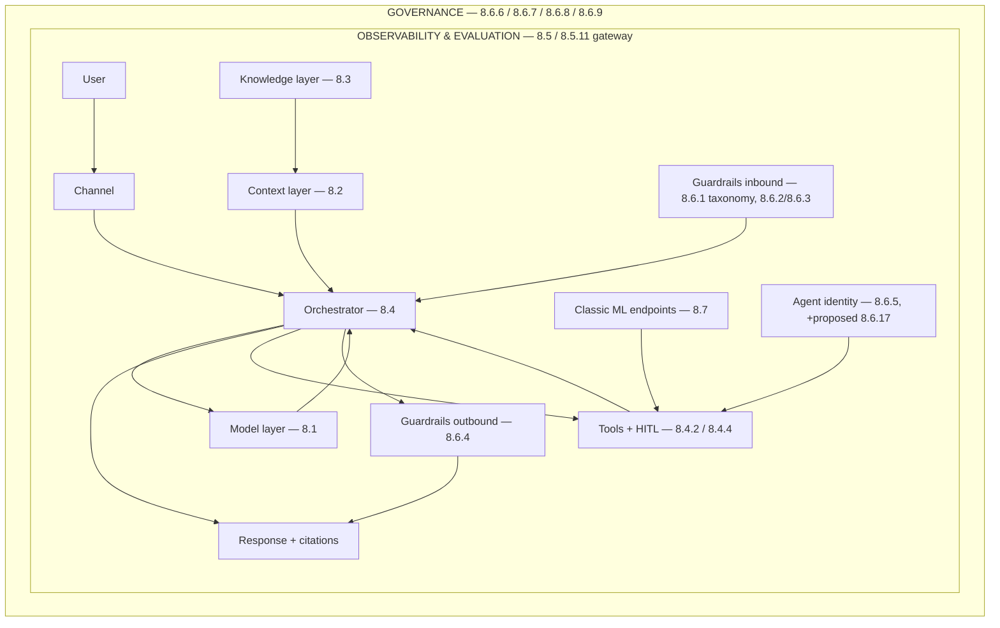

# Part 8 — AI / Generative AI Core: The Map

*Read this file first. It is the index, the architecture, and the study order for everything
in files 01–07.*

*Writing or upgrading any of these files? Use `00-Authoring-Rules.md` v2.0 alongside this map — it
is the production spec for how each Part A/B/C gets written. Stage 2 is the current reference
example for the generalized format; do not copy its topic content into other stages.*

---

## 1. How this material is organised

Seven files. **File order = learning order**, so read them 01 → 07. The section numbers (8.x)
stay inside, in your original numbering.

There is also an optional drill file after the seven stages: `08-Interview-Questions-Model-Answers.md`.
Use it after studying the reference files to practise spoken panel answers.

| File | Section | What it adds to the system |
|---|---|---|
| `01-Stage1-LLM-Fundamentals.md` | 8.1 | A model that answers reliably |
| `02-Stage2-Prompt-Context-Engineering.md` | 8.2 | Prompts and a managed context window |
| `03-Stage3-RAG.md` | 8.3 | Our actual documents |
| `04-Stage4-Agentic-AI.md` | 8.4 | Actions and human approvals |
| `05-Stage5-Guardrails-AI-Security.md` | 8.6 | Guardrails, permissions, audit |
| `06-Stage6-LLMOps-Evaluation-Telemetry.md` | 8.5 | Proof that it works |
| `07-Stage7-Classic-ML-MLOps.md` | 8.7 | The non-LLM half, and the full lifecycle |
| `08-Interview-Questions-Model-Answers.md` | Drill | Tough panel questions and spoken model answers |

**Note the swap at files 05/06:** file `05` covers section `8.6`, file `06` covers section `8.5`
— file order is learning order (§5 explains why guardrails come before evaluation), section
number is a fixed filing ID. Don't assume file number matches section number; every in-file
citation uses the `8.x.y` tag for exactly this reason.

Your original numbering is preserved throughout. Topics marked **`+`** are additions to the
original outline — gaps that a technical or public-sector panel will reach for.

### Every file has two layers, cross-linked

**Layer 1 — THE BUILD (the spine).** One system, built from nothing to production across all
seven files. Each file opens with its stage of that build, written as a continuous story. Every
topic is introduced at the exact moment you would hit it while building, with a link into its
reference entry.

**Layer 2 — THE REFERENCE (complete coverage).** Every topic from the outline, in your
numbering, with full detail. Each entry carries a `> In the build:` line pointing back to the
step it came from.

So you can read it as one story, or use it as a lookup table, and neither mode loses anything.

### The system being built, across all seven files

**An internal AI assistant for a government entity.** Staff ask questions in English and Arabic
about policies, procedures and their own entitlements. It answers with citations to the source
document. It can perform a small number of actions — raise a ticket, submit a leave request —
but only with human approval. It must never show one employee another employee's data,
everything it does must be auditable, and the data may not leave the country.

That single system exercises every topic in 8.1 through 8.7. Nothing in this material is
hypothetical: every concept earns its place by solving a problem the build has just hit.

---

## 2. The master architecture

**Every topic in all seven files has a coordinate on this one diagram.** That is the whole
point of it. When you meet an unfamiliar question, the first move is not to recall a fact — it
is to locate the question on this map. Once you know which layer it lives in, you know which
concepts are adjacent to it, and the answer follows.

```
┌═ GOVERNANCE LAYER ══════════════════════════════ 8.6.8 · 8.6.9 ═════════════════┐
║  AI register · use-case intake · approval workflow · Responsible AI standards    ║
║  NIST AI RMF · ISO 42001 · UAE National AI Strategy · vendor & model risk        ║
║                                                                                  ║
║ ┌═ OBSERVABILITY & EVALUATION LAYER ══════════════ 8.5 ════════════════════════┐ ║
║ ║  traces · token & cost accounting · TTFT/p95 latency · quality metrics       ║ ║
║ ║  golden sets · CI regression · user feedback · canary & shadow deployment    ║ ║
║ ║                                                                              ║ ║
║ ║   ┌──────────┐   ┌────────────┐   ┌──────────────────┐   ┌───────────────┐  ║ ║
║ ║   │  USER    │──►│  CHANNEL   │──►│  ORCHESTRATOR    │──►│   RESPONSE    │  ║ ║
║ ║   │          │   │ web · Teams│   │  8.4 agent loop  │   │  + citations  │  ║ ║
║ ║   └──────────┘   │ API · bot  │   │  or fixed chain  │   └───────────────┘  ║ ║
║ ║                  └────────────┘   └────┬────────▲────┘                      ║ ║
║ ║                                        │        │                           ║ ║
║ ║        ┌───────────────────────────────┴──┐     │                           ║ ║
║ ║        │  CONTEXT LAYER            8.2    │     │                           ║ ║
║ ║        │  system prompt · history         │     │                           ║ ║
║ ║        │  context budget · compaction     │     │                           ║ ║
║ ║        │  memory tiers · prompt caching   │     │                           ║ ║
║ ║        └───────────────┬──────────────────┘     │                           ║ ║
║ ║                        │                        │                           ║ ║
║ ║        ┌───────────────┴──────────────────┐     │                           ║ ║
║ ║        │  KNOWLEDGE LAYER          8.3    │     │                           ║ ║
║ ║        │  ingest → chunk → embed →        │     │                           ║ ║
║ ║        │  index → retrieve → rerank       │     │                           ║ ║
║ ║        │  ▲ security trimming 8.3.5.8     │     │                           ║ ║
║ ║        └──────────────────────────────────┘     │                           ║ ║
║ ║                                                 │                           ║ ║
║ ║   ┌─────────────────────────────────────────────┴───────────────────────┐   ║ ║
║ ║   │  MODEL LAYER                                                  8.1   │   ║ ║
║ ║   │  tokenizer · transformer · decoding knobs · structured output       │   ║ ║
║ ║   │  hosted API │ managed platform (Azure OpenAI/Foundry) │ self-hosted │   ║ ║
║ ║   └─────────────────────────────────────────────────────────────────────┘   ║ ║
║ ║                                                                              ║ ║
║ ║   ┌──────────────────────────┐        ┌──────────────────────────────────┐  ║ ║
║ ║   │  TOOLS & ACTIONS  8.4.2  │        │  CLASSIC ML MODELS         8.7   │  ║ ║
║ ║   │  tool registry · schemas │        │  forecasting · classification    │  ║ ║
║ ║   │  scoped permissions      │        │  scoring · anomaly detection     │  ║ ║
║ ║   │  HUMAN APPROVAL  8.4.4   │        │  served as endpoints, called     │  ║ ║
║ ║   └──────────────────────────┘        │  like any other tool             │  ║ ║
║ ║                                       └──────────────────────────────────┘  ║ ║
║ ║                                                                              ║ ║
║ ║   ▲ GUARDRAILS INBOUND    8.6.2 · 8.6.3      GUARDRAILS OUTBOUND  8.6.4 ▲    ║ ║
║ ║     prompt shields · content filter            schema · citations · PII      ║ ║
║ ║     injection detection · rate limits          safe rendering · groundedness ║ ║
║ ╚══════════════════════════════════════════════════════════════════════════════╝ ║
╚══════════════════════════════════════════════════════════════════════════════════╝
```

*Topics that don't fit the box art without crowding it, but still have a coordinate:* the OWASP
Top 10 for LLM Applications (`8.6.1`, already in the file — the taxonomy the whole GUARDRAILS
band's inbound/outbound controls exist to answer) sits in the GUARDRAILS band alongside `8.6.2`/
`8.6.3`/`8.6.4`; audit logging and data protection (`8.6.6`, `8.6.7`, both already in the file)
sit in the GOVERNANCE band alongside `8.6.8`/`8.6.9`; model-level attacks (`8.6.14`, already in
the file) sits with `8.6.1` in the same GUARDRAILS band, as its model-side companion; the AI
gateway (`8.5.11`, already in the file) sits inside the OBSERVABILITY & EVALUATION band, since
every request now passes through it before reaching the model. Of the three `◇`-marked proposed
topics: `8.6.15` would sit with `8.6.1`/`8.6.14` in the GUARDRAILS band (it's the third member of
the same taxonomy family); `8.6.16` would sit nearest the MODEL LAYER box, next to its
structured-output line, since content provenance is the generation-side counterpart to that;
`8.6.17` would sit with `8.6.5` just above TOOLS & ACTIONS. None are drawn in the box art itself
since none are in the file yet — the Mermaid diagram below draws the identity-scoping and
gateway coordinates explicitly.



**Nine layers. Learn them as a list, because it doubles as the answer to "walk me through your
architecture":**

1. **Channel** — where the request enters (web, Teams, API, bot)
2. **Orchestrator** — the loop or chain that decides what happens *(8.4)*
3. **Context** — what goes into the window and in what order *(8.2)*
4. **Knowledge** — how your data becomes retrievable *(8.3)*
5. **Model** — the thing that generates *(8.1)*
6. **Tools & actions** — how it affects the world, who approves, and who it acts *as* *(8.4.2,
   8.4.4, 8.6.5, 8.6.17)*
7. **Guardrails** — inbound and outbound safety *(8.6)*
8. **Observability & evaluation** — proof that it works, and what it routes through to get there
   *(8.5, 8.5.11)*
9. **Governance** — permission for it to exist at all *(8.6.6, 8.6.7, 8.6.8, 8.6.9)*

---

## 3. How to read a topic card

Every reference entry has the same learning contract, but not necessarily the same headings. The
current standard is `00-Authoring-Rules.md` v2.0: teach from beginner-simple explanation to
production implementation and senior judgment. Stage 2 is the reference example for this adaptive
shape.

**CORE topics** get the full beginner-to-production treatment:

```
## 8.x.y Topic name `[CORE]`
> **In the build:** Stage N, Step M — "the problem that forced this"

1. Simple idea                         Plain-English entry point.
2. Why it exists                       The build symptom it fixes.
3. Exact example                       Concrete payloads, values, tables or failure messages.
4. Where it fits                       Owning layer; what enters and leaves.
5. Implementation pattern              Python/.NET/JS examples where app-code implementation fits.
6. Practical rules                     Use-X-when-Y decisions.
7. Libraries, tools and cloud          Topic-specific ecosystem and managed-service roles.
8. Senior metrics                      Quality, latency, cost, reliability, security, release impact.
9. Trade-offs and failure modes        Wrong setup plus visible symptom.
```

Topic type can change the shape. A lifecycle may use lifecycle stages; a protocol may start with
the contract; a quantifiable mechanism may add worked arithmetic and an optional Perspectives
grid. The required perspectives above still have to be covered.

**WORKING, AWARENESS and ADVANCED topics** get a compact treatment unless the topic's type earns
more depth:

```
### 8.x.y.z Topic name `[TIER]`

Simple idea          What it is, in plain words.
Exact example        Concrete, with real values.
Where it fits        Which layer owns it; what enters and leaves.
Implementation note  Library, API, service, schema, config or small code pattern.
Used when            The situation that makes you reach for it.
Fails when           Wrong setup and visible symptom.
Senior note          Metric, release concern, cost/security issue or production limit.
```

Perspectives grids are optional. Use them when they clarify a complex CORE topic; do not require
them mechanically. Code examples are required where the concept can reasonably be implemented in
app code; governance or policy topics may need schemas, audit logs, config or release gates
instead.

Heading level follows role and nesting, not only number depth: CORE topics and standalone topic
cards are usually `##`; nested WORKING/AWARENESS subtopics inside a parent topic are usually `###`.
For example, `8.3.5.8` is four-level but CORE, so it is an H2; `8.3.1.4` is four-level and nested
WORKING, so it is an H3.

---

## 4. Tiers — what to actually do with 400 topics

Four hundred topics is not learnable. Sixty deeply, one hundred and fifty competently, and the
rest recognisably — that *is* learnable, and it is also how real technical knowledge is
actually distributed.

| Tier | Count | What it means | Effort |
|---|---|---|---|
| **[CORE]** | ~60 | Explain the mechanism, defend it under three follow-up questions, draw it | Full card + practice out loud |
| **[WORKING]** | ~150 | Define it, say when you'd use it, name the library | Full card, read twice |
| **[AWARENESS]** | ~190 | Recognise the name, say one accurate sentence, know where to look | Read once |
| [ADVANCED] | a handful | Extends a CORE topic for high-stakes or edge cases the core four/five don't cover; know it exists and when to reach for it — don't build default fluency | Read once, return to it when the CORE technique stops being enough |

**Why §6's index doesn't add up to 400:** §6 only gives a numbered row to topics that earn their
own card. Most of the AWARENESS tier is not meant to surface there at all — it's the "recognise
the name, one sentence, know where to look" content mentioned in passing *inside* a CORE or
WORKING entry's own prose, not a separate entry. So §6's row count will always undercount the true
AWARENESS exposure by design; treat the ~400/~60/~150/~190 figures as the planning-level shape of
the whole subject, and §6 as the subset that's important enough to index and track by number.

**The rule for judging yourself:** for a CORE topic, you should be able to explain it, then
answer *"and what breaks when you get that wrong?"* without pausing. If you can only recite the
definition, it isn't CORE yet.

---

## 5. The learning order

**This is deliberately not the numbering order.** The numbering is a filing system; this is a
build order. Each stage assumes the one before it, and mirrors how you would actually construct
a system.

```
STAGE 1  The model itself            8.1     ── what it is, how you call it
   ↓
STAGE 2  Talking to it               8.2     ── prompts, context, caching
   ↓
STAGE 3  Giving it your data         8.3     ── the whole RAG pipeline
   ↓
STAGE 4  Letting it act              8.4     ── tools, agents, human approval
   ↓
STAGE 5  Stopping it going wrong     8.6     ── guardrails, injection, permissions, audit
   ↓
STAGE 6  Proving it works            8.5     ── evaluation, telemetry, cost, deployment
   ↓
STAGE 7  The non-LLM half            8.7     ── classic ML, MLOps, and the lifecycle
```

**Why guardrails (Stage 5) comes after agentic AI (Stage 4), not before or alongside it.** Stage 4
already builds in the minimum safety a working agent needs as it's built — human approval
(`8.4.4`) and the agentic harness (`8.4.8`) aren't deferred to Stage 5. What Stage 5 adds is the
*systematic, cross-cutting* treatment: the full threat taxonomy, defence-in-depth, audit and
governance that apply to the whole system built in Stages 1–4, not just to agents. Build the
capability with baseline safety already in it, then do the dedicated hardening pass — not build
first and lock down after, which the numbering-departure paragraph below might otherwise suggest.

**Why 8.6 comes before 8.5** — the one place the order departs from the numbering. Guardrails
are a *design* concern: you cannot evaluate a system's safety until you know what controls it
was supposed to have. Learn what can go wrong, then learn how to measure whether it did.

**Why 8.7 comes last, not first.** Classic ML is older and more established, so it looks like
the natural foundation. It isn't, for this material — no *prerequisite depth* from 8.1–8.6 depends
on it. (One shallow forward-reference exists: §2's diagram shows classic ML endpoints as one kind
of tool Stage 4's agents can call — but that only requires knowing such endpoints exist, not
Stage 7's actual content.) 8.7 *closes* the loop instead: section 8.7.7's lifecycle (assessment →
data prep → build → test → validate → deploy → monitor → support) is the frame that contains
everything in all seven files, which is exactly why it works better as a summary than as an
introduction.

**Ordering questions logged for a future file-level review, not resolved here.** These require
reordering actual file content, not just the map's index, so they're deliberately left as-is
pending a dedicated Review-mode pass on the file in question, with the user's sign-off:
- ~~Stage 1 clusters all four `+` topics (`8.1.9`–`8.1.12`) at the tail regardless of topical
  fit.~~ **Resolved, keep as-is** (Stage 1 v2.0 migration pass, 2026-08-28): the file's own Part A
  order note already defends the clustering — each of the four is *a capability you add once the
  reliable path works*, not a problem you hit on the way to it, which is a different relationship
  to the build than Stage 3's `8.3.9`. Reordering would break a documented authoring choice.
- ~~Stage 3's `8.3.9` (index lifecycle) and `8.3.10` (retrieval caching) sit after `8.3.6`
  (generation) rather than nearer the store/retrieval topics they're actually about.~~
  **Resolved, keep as-is** (Stage 3 v2.0 migration pass, 2026-08-28): the file's own order note
  already states the reason — the index must be *honest and fast* before advanced techniques or
  evaluation are worth discussing — which is the build-narrative reading suspected here.
- Stage 5's `8.6.14` (model-level attacks) is the direct "model side" companion to `8.6.1`'s
  taxonomy but sits after all the defence and governance content instead of near `8.6.1`. Its
  map-only sibling `8.6.15` has already been moved next to `8.6.1` in this index (§6) — moving
  `8.6.14` itself is the remaining half of this fix, and it requires touching the file.
- Stage 5's `8.6.10` (red-teaming) sits between DLP and Responsible AI without a clear link to
  either neighbour — it reads more like validation-of-everything-above or a companion to `8.6.1`.
- Stage 6 orders `8.5.4` (latency) before `8.5.3` (cost) with no order note explaining why,
  unlike Stages 2 and 4 which document their numeric-order departures explicitly. Stages 1, 3, 5
  and 6 all have at least one non-obvious ordering choice with no equivalent note — worth adding
  one per stage the next time that file gets a Review-mode pass, rather than guessing the
  original author's reasoning here.

---

## 6. The complete index

Ordered for learning within each section. `+` marks additions to the original outline — these
are already drafted in the file unless marked otherwise. **`◇` marks a topic identified as a real
industry-adopted gap (named vendor products, a published framework, or a live incident — not a
research trend) that is NOT yet drafted in any stage file.** Its row exists here as a placeholder
so the gap isn't lost, not as a claim that the file covers it — check the file before relying on
one of these in an answer.

### Stage 1 — 8.1 LLM Fundamentals → `01-Stage1-LLM-Fundamentals.md` ✅ *written*

| # | Topic | Tier |
|---|---|---|
| 8.1.1 | Transformers, attention, tokenization, context window, embeddings vs generation | **CORE** |
| 8.1.2 | Generation parameters: temperature, top-p, max tokens, stop, seeds, determinism | **CORE** |
| 8.1.3 | Model selection: capability vs cost vs latency; small vs frontier; open-weight vs API | **CORE** |
| 8.1.4 | Structured outputs: JSON Schema, function-call mode, constrained decoding, retries — already covers strict mode vs. legacy JSON mode in-file | **CORE** |
| 8.1.5 | Fine-tuning vs RAG vs prompting vs distillation | **CORE** |
| 8.1.6 | PEFT/LoRA, quantization, self-hosting (Ollama/vLLM) vs managed | WORKING |
| 8.1.7 | Hallucination: causes, detection, mitigation | **CORE** |
| 8.1.8 | Azure OpenAI / AI Foundry: deployments, PTU vs PAYG, quotas & TPM, content filters, regions, private networking, residency | **CORE** |
| **+ 8.1.9** | Reasoning models and hidden thinking tokens | WORKING |
| **+ 8.1.10** | Streaming: TTFT, server-sent events, partial-output handling | WORKING |
| **+ 8.1.11** | Multimodal input: vision, documents, audio | AWARENESS |
| **+ 8.1.12** | Multimodal generation: image and audio output — separate-pipeline vs natively-multimodal shapes | AWARENESS |

### Stage 2 — 8.2 Prompt & Context Engineering → `02-Stage2-Prompt-Context-Engineering.md` ✅ *written*

| # | Topic | Tier |
|---|---|---|
| 8.2.1 | Prompt roles: system, user, assistant | **CORE** |
| 8.2.2 | Techniques: few-shot, chain-of-thought, ReAct, self-consistency | **CORE** |
| 8.2.6 | Output control: formatting, delimiters, refusal handling | **CORE** |
| 8.2.4 | Context engineering: budgeting, compaction, summarization, retrieval placement, lost-in-the-middle, tool-result pruning, memory tiers | **CORE** |
| 8.2.5 | Prompt caching: mechanism, cost and latency implications | **CORE** |
| 8.2.3 | Prompt management: templating, versioning, prompt-as-code, A/B testing | **CORE** |
| **+ 8.2.7** | Advanced prompting & reliability: Tree-of-Thought, step-back, automatic prompt engineering, debiasing, ensembling, self-evaluation, calibration | [ADVANCED] |

*(Order note: output control moves up next to techniques because it is the same skill; prompt management moves last because it is an operational concern that only makes sense once you have prompts worth managing.)*

### Stage 3 — 8.3 RAG → `03-Stage3-RAG.md` ✅ *written*

| # | Topic | Tier |
|---|---|---|
| 8.3.1 | Ingestion: connectors, incremental sync, change detection, OCR/Document Intelligence, PDF/Office/scanned, tables, images | WORKING |
| 8.3.1.4 | Arabic document handling: OCR, extraction, RTL, multilingual | WORKING |
| 8.3.2 | Chunking: fixed, recursive, semantic, layout-aware; size & overlap; parent-child; metadata enrichment | **CORE** |
| 8.3.3 | Embeddings: model choice, dimensionality, normalization, multilingual, Arabic, re-embedding, cost | **CORE** |
| 8.3.4 | Vector stores: Azure AI Search, pgvector, HNSW/IVFFlat, filters, hybrid indexes, scaling, refresh | **CORE** |
| 8.3.5 | Retrieval: hybrid search, reranking, query rewriting/expansion, HyDE, multi-query, metadata filtering | **CORE** |
| 8.3.5.8 | **Security trimming / permission-aware retrieval** | **CORE** |
| 8.3.6 | Generation: grounding prompts, citations, "I don't know", answer verification | **CORE** |
| **+ 8.3.9** | Index lifecycle: deletions, freshness, right-to-erasure, re-index strategy | **CORE** |
| **+ 8.3.10** | Retrieval caching: semantic cache, exact-match cache, invalidation | WORKING |
| 8.3.7 | Advanced: GraphRAG, agentic RAG, contextual retrieval, multi-hop, Table RAG, SQL RAG / text-to-SQL | WORKING |
| 8.3.8 | Evaluation: groundedness, faithfulness, answer relevance, context precision/recall, hit rate, RAGAS, Azure AI Evaluation SDK | **CORE** |
| **+ 8.3.8.10** | Building the golden question set — how to actually construct one | **CORE** |

### Stage 4 — 8.4 Agentic AI → `04-Stage4-Agentic-AI.md` ✅ *written*

| # | Topic | Tier |
|---|---|---|
| 8.4.2 | Tool/function calling: schema design, descriptions as prompts, argument validation, error feedback, parallel calls, selection at scale | **CORE** |
| 8.4.1 | Agent loop: plan → tool call → observe → repeat; ReAct, plan-and-execute, reflection | **CORE** |
| 8.4.3.7 | Deterministic workflow vs agent — when each is right | **CORE** |
| 8.4.3 | Orchestration: LangGraph, Semantic Kernel, AutoGen, CrewAI, Foundry Agent Service, Durable Functions/Temporal | WORKING |
| 8.4.5 | State & memory: short-term, long-term, episodic, persistence, multi-turn recovery | WORKING |
| 8.4.4 | **Human-in-the-loop**: approval gates, interrupt/resume, checkpointing, escalation, approval UI, approval audit, Power Automate mapping | **CORE** |
| 8.4.8 | **Agentic harness**: sandboxing, tool registries, permission scoping, execution limits, loop caps, timeouts, budget caps, replayability, determinism, testing | **CORE** |
| 8.4.9 | Failure modes: infinite loops, tool thrashing, injection via tool output, over-agency | **CORE** |
| 8.4.6 | Multi-agent: supervisor/worker, handoffs, shared state, failure modes, cost explosion | WORKING |
| 8.4.7 | MCP: servers, tools, resources, transport, auth | WORKING |
| **+ 8.4.10** | A2A — Agent2Agent protocol: agent discovery via Agent Card, cross-team/cross-vendor task handoff (distinct from MCP's agent→tool connection) | WORKING |
| **◇ 8.4.11** | Agentic commerce & payment protocols (AP2, x402) — agent transacts under a signed mandate | AWARENESS |

*(Order note, carried over from the file's own note: 8.4.2 comes first because nothing else is
possible without tool calling; 8.4.3.7 is pulled forward out of 8.4.3 because the workflow-vs-agent
decision precedes the orchestration framework; 8.4.4/8.4.8/8.4.9 precede the optional topics
because they are what make any of this safe to run.)*

### Stage 5 — 8.6 AI Guardrails & Security → `05-Stage5-Guardrails-AI-Security.md` ✅ *written*

| # | Topic | Tier |
|---|---|---|
| 8.6.1 | OWASP Top 10 for LLM Applications — all ten | **CORE** |
| **◇ 8.6.15** | OWASP Top 10 for Agentic Applications (ASI) — risk when the model is an actor with tools/memory/consequences, distinct from 8.6.1's component-risk framing. Read together with 8.6.1; its other companion, 8.6.14 (model-level attacks), sits later in this stage — see the note there. | **CORE** |
| 8.6.2 | Prompt injection: direct, indirect, and the defence stack | **CORE** |
| **+ 8.6.11** | Jailbreak taxonomy: roleplay, encoding, many-shot, obfuscation | WORKING |
| 8.6.3 | Content filtering: Azure AI Content Safety, prompt shields, groundedness detection, protected material, blocklists, severity thresholds; open-source alternative/complement already covered in-file (Guardrails AI, NeMo Guardrails) | **CORE** |
| 8.6.4 | Output validation: schema, business rules, citation verification, PII redaction, safe rendering | **CORE** |
| 8.6.5 | **Tool permission scoping**: per-agent identity *token*, on-behalf-of, scoped tokens, read vs write, approval-required, blast radius | **CORE** |
| **+ 8.6.12** | Per-user rate limiting and quota as an abuse control | WORKING |
| 8.6.6 | **Audit logging**: prompt/response retention, who-asked-what, PII in logs, immutability, retention periods, log access control | **CORE** |
| 8.6.7 | Data protection: no training on tenant data, residency, private endpoints, redaction before the call | **CORE** |
| **+ 8.6.13** | DLP integration: sensitivity labels, classification-aware retrieval and output | WORKING |
| **+ 8.6.10** | Red-teaming: adversarial test suites, automated attack generation, findings triage | WORKING |
| 8.6.8 | Responsible AI: Microsoft RAI Standard, NIST AI RMF, ISO/IEC 42001, EU AI Act, UAE National AI Strategy 2031, Dubai AI ethics principles | WORKING |
| 8.6.9 | AI governance: model risk, vendor risk, use-case intake, approval process, AI register/inventory | **CORE** |
| **+ 8.6.14** | Model-level attacks: extraction, poisoning, adversarial examples, inversion — attacks on the model itself, not the application around it. Companion to 8.6.1/8.6.15 (see the note there); logged as a candidate to move nearer them on a future file-level pass. | AWARENESS |
| **◇ 8.6.16** | AI-generated content provenance & watermarking (C2PA, SynthID-style) | WORKING |
| **◇ 8.6.17** | Agent / non-human identity *lifecycle* governance (Entra Agent ID, Okta for AI Agents) — provisioning, deprovisioning, conditional access and kill-switches for an agent as a standing principal, not the per-call scoped token 8.6.5 already covers | **CORE** |

**Proposed enrichments below existing rows, not yet drafted in the file — verify before citing
as fact, and treat the dates/figures as illustrative of *why the gap matters*, not as durable
numbers to memorise:** `8.6.2` — EchoLeak/CVE-2025-32711 as a concrete zero-click indirect-
injection case study. `8.6.8` — Gartner AI TRiSM as a named framework, and that EU AI Act
enforcement went live 2 Aug 2026 with real fines. `8.6.9` — shadow AI discovery/governed
enablement as distinct from register/intake, which only governs what's already sanctioned.
`8.6.17`'s "OWASP NHI Top 10" reference is single-sourced in my research (one blog, not
corroborated the way the LLM/Agentic Top 10s were) — confirm it exists before citing it by name.

### Stage 6 — 8.5 LLMOps, Evaluation & Telemetry → `06-Stage6-LLMOps-Evaluation-Telemetry.md` ✅ *written*

| # | Topic | Tier |
|---|---|---|
| **+ 8.5.10** | Eval-driven development: the practice that frames everything below | **CORE** |
| 8.5.1 | Evaluation harness: golden datasets, CI regression suites, LLM-as-judge and its biases, human review, pairwise comparison, offline vs online | **CORE** |
| 8.5.2 | Metrics: groundedness, relevance, coherence, toxicity, task success, tool-call accuracy, retrieval metrics | **CORE** |
| 8.5.4 | Latency telemetry: TTFT, tokens/sec, p50/p95/p99, streaming, timeouts, fallback models | **CORE** |
| 8.5.3 | Cost & token monitoring: per-request and per-tenant accounting, budget alerts, routing, downgrading, caching, batching, context trimming | **CORE** |
| 8.5.5 | Tracing: LangSmith, OpenTelemetry GenAI semantic conventions, Azure AI Foundry tracing | **CORE** |
| **+ 8.5.8** | SLOs for AI systems: what you can and cannot promise | WORKING |
| **+ 8.5.9** | Telemetry retention policy: what you keep, how long, and why that is a compliance decision | WORKING |
| 8.5.6 | Feedback loops: thumbs up/down, incident triage for bad answers, prompt regression management | WORKING |
| 8.5.7 | Deployment: canary for prompts and models, shadow deployment, version pinning, deprecation handling | **CORE** |
| **+ 8.5.11** | AI gateway: centralizing routing, auth, cost and observability once a second GenAI app exists (LiteLLM, Portkey, Kong already named in-file) | WORKING |

**Proposed enrichment, not yet drafted in the file:** `8.5.11` as a supply-chain attack surface in
its own right — a gateway sees all provider traffic, and LiteLLM shipped two malicious PyPI
releases in March 2026 harvesting credentials. Verify the incident before citing it by name.

### Stage 7 — 8.7 Classic ML & MLOps → `07-Stage7-Classic-ML-MLOps.md` ✅ *written*

| # | Topic | Tier |
|---|---|---|
| 8.7.1 | ML fundamentals: supervised, unsupervised, train/val/test, overfitting, cross-validation | WORKING |
| 8.7.2 | Metrics: precision, recall, F1, ROC-AUC, RMSE, MAE, and choosing by business problem | **CORE** |
| 8.7.3 | Data & features: feature engineering, leakage, class imbalance | **CORE** |
| **+ 8.7.10** | Fairness and bias testing: protected attributes, disparity metrics, mitigation | **CORE** |
| **+ 8.7.9** | Explainability: SHAP, LIME, global vs local explanation, "why was I refused?" | **CORE** |
| **+ 8.7.11** | Model cards and documentation: intended use, limitations, evaluation record | WORKING |
| 8.7.4 | Azure ML: workspaces, compute, pipelines, model registry, managed online and batch endpoints | WORKING |
| 8.7.5 | MLflow: experiment tracking, model versioning, reproducibility | WORKING |
| 8.7.6 | Deployment & monitoring: data drift, concept drift, model decay, retraining triggers, shadow deployment, A/B testing | **CORE** |
| 8.7.7 | The end-to-end lifecycle: assessment → data prep → build → test → validate → deploy → monitor → support | **CORE** |
| 8.7.8 | Telling it as one continuous narrative on a real example | **CORE** |

---

## 7. Three cross-cutting threads

Some ideas appear in every file. Watching them recur is how the seven sections become one
subject rather than seven:

**Thread 1 — the context window is a contested resource.** Chunking (8.3.2), context budgeting
(8.2.4), prompt caching (8.2.5), tool schemas (8.4.2), memory (8.4.5) and conversation history
all compete for the same finite space, and all of them cost money on every single call. Every
design decision in this material is partly a decision about that budget.

**Thread 2 — the model proposes, your code authorises.** Structured output (8.1.4), tool
calling (8.4.2), permission scoping (8.6.5), human-in-the-loop (8.4.4) and output validation
(8.6.4) are all the same principle wearing different clothes: *model output is an untrusted
input to your system.* If you internalise one sentence from all seven files, make it that one.

**Thread 3 — you cannot manage what you do not measure.** Model selection (8.1.3), RAG
evaluation (8.3.8), the eval harness (8.5.1), cost accounting (8.5.3) and drift monitoring
(8.7.6) are all the same discipline applied at different layers. "It seems better" is not an
engineering statement.

**Thread 4 — data residency and sovereignty is a constraint, not a feature.** It's one of the
five hard constraints the running example itself states (§1: "the data may not leave the
country"), and it recurs at every layer that touches storage or transit: model hosting and
region selection (8.1.8), prompt-cache and log storage (8.2.5), vector store region (8.3.4), and
data protection (8.6.7). "Access-controlled" and "region-scoped" are different guarantees —
every one of these topics has to answer both questions separately.

**Thread 5 — bilingual support is a design constraint, not a formatting afterthought.** Also
stated in §1 as a hard requirement, it shows up as Arabic document handling and multilingual
embeddings (8.3.1.4, 8.3.3), output-language matching (8.2.6), and the RTL/transparency
considerations inside content filtering and disclosure (8.6.3, 8.6.8). Treat it as a thread to
check at every layer, not a checkbox on the output-formatting step alone.

---

## 8. Suggested study sessions

If you are working through this in order, these are natural stopping points:

| Session | Cover | You should be able to |
|---|---|---|
| 1 | 8.1.1–8.1.4 | Explain what a token is, what temperature does, and force valid JSON |
| 2 | 8.1.5–8.1.12 | Answer "fine-tune or RAG?" correctly and defend it |
| 3 | 8.2 all | Explain what goes in the context window and why it costs what it costs |
| 4 | 8.3.1–8.3.4 | Draw the ingestion pipeline from document to vector index |
| 5 | 8.3.5–8.3.10 | Explain permission-aware retrieval, unprompted |
| 6 | 8.4.1–8.4.4 | Draw an agent loop with a human approval gate |
| 7 | 8.4.5–8.4.9 | Explain what an agentic harness is and every limit it enforces |
| 8 | 8.6 all | Walk the OWASP LLM Top 10 and name a control for each |
| 9 | 8.5 all | Describe an evaluation harness running in CI |
| 10 | 8.7 all | Narrate one use case end to end through all eight lifecycle stages |
