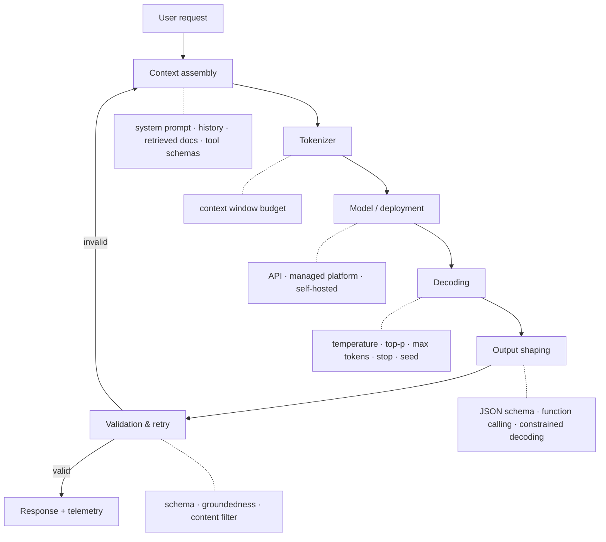
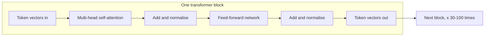
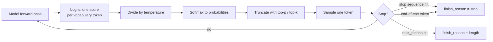
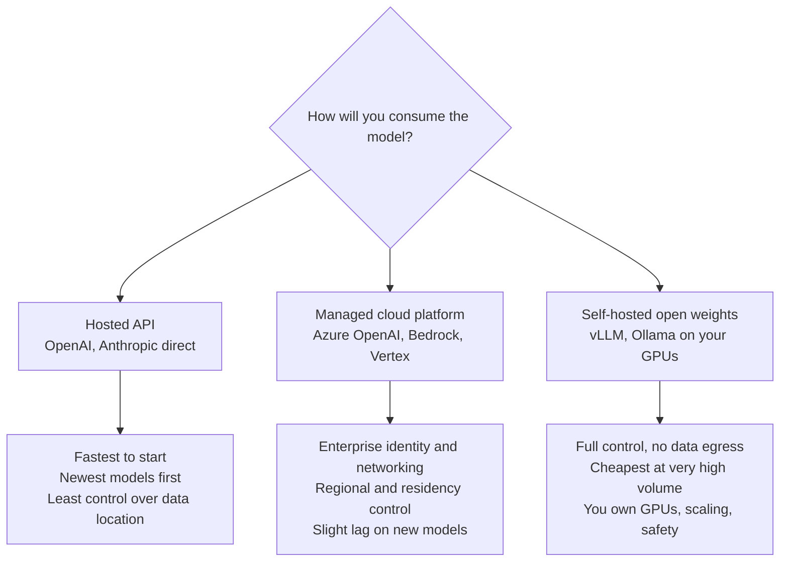
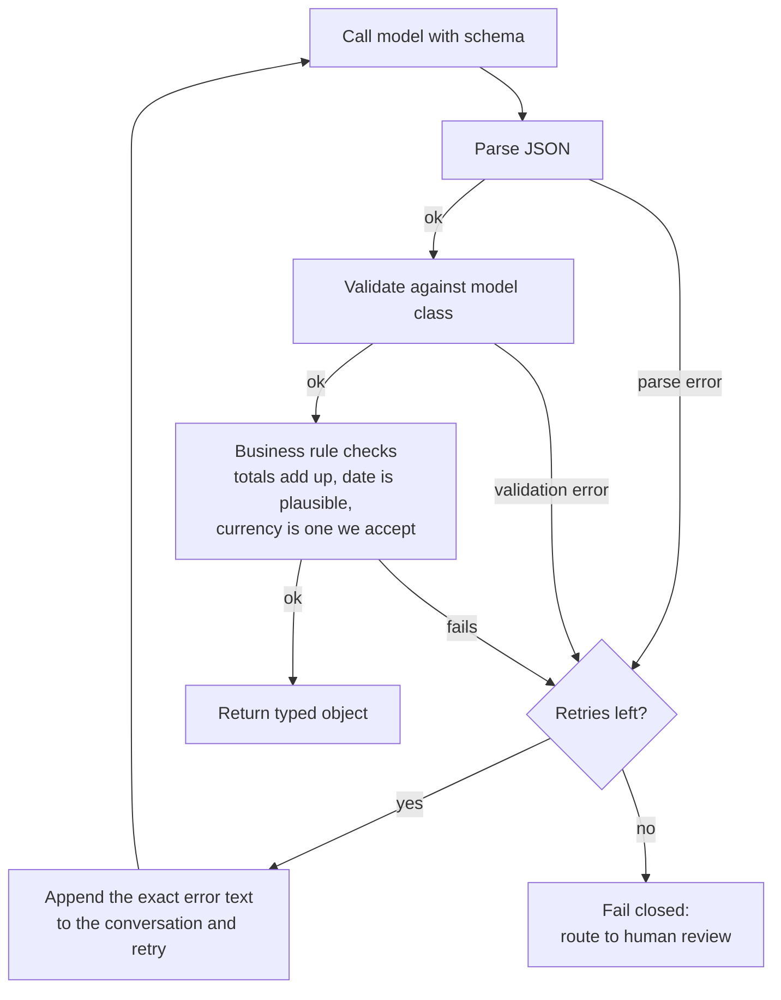
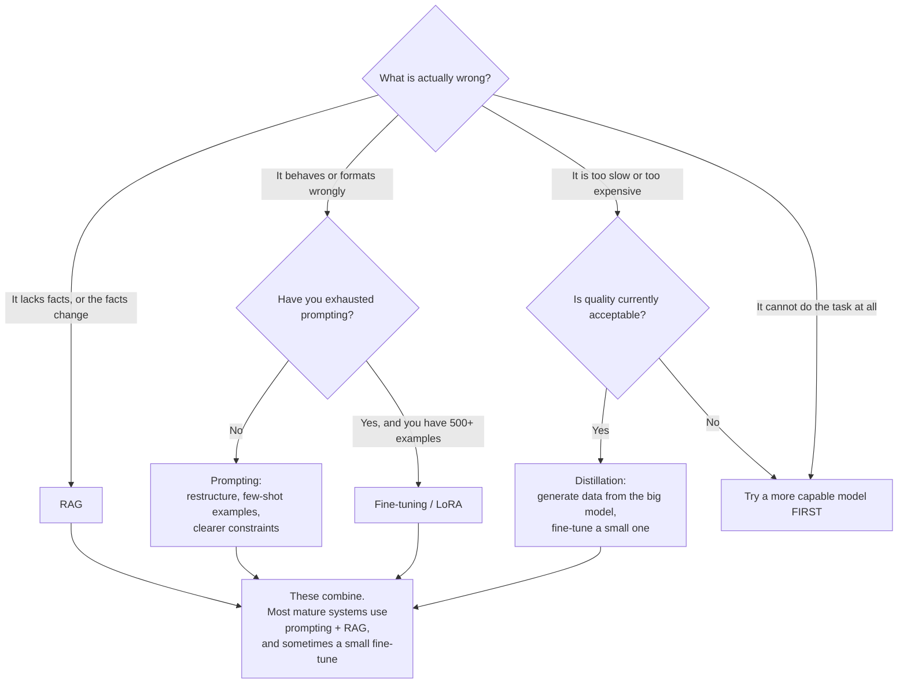
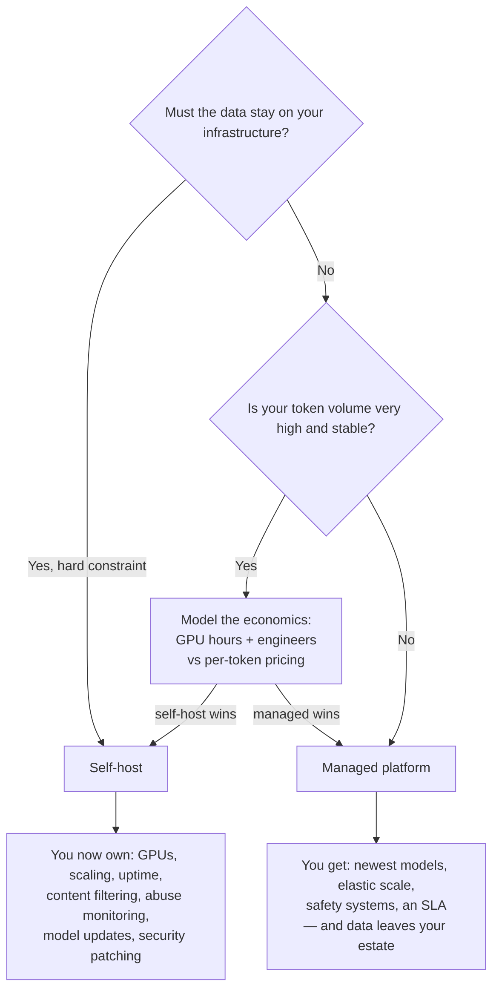
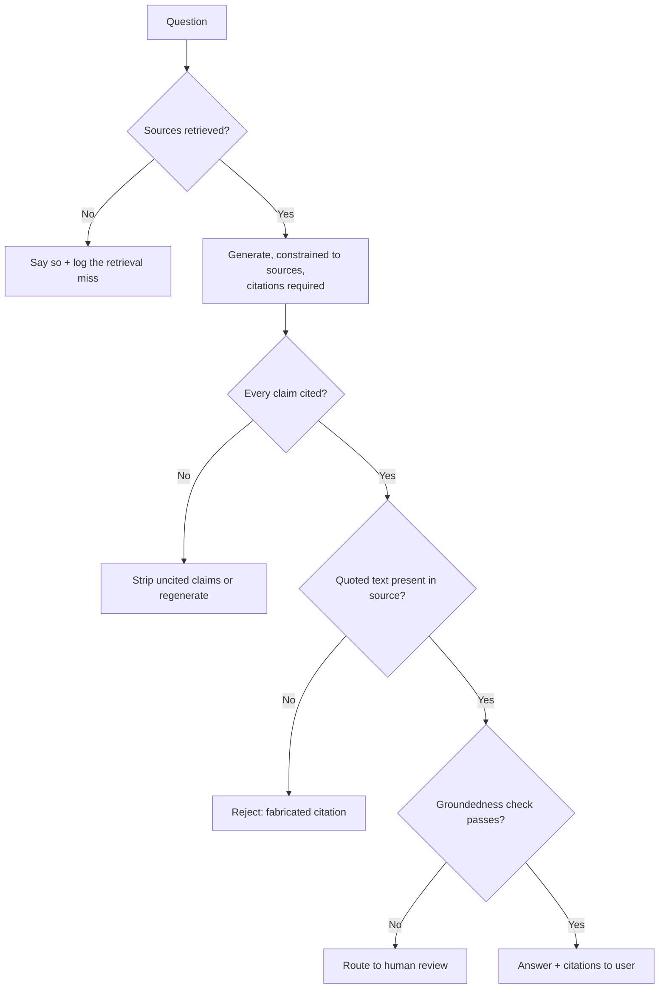

# LLM Fundamentals

*A general reference. Definition → example → where it fits → which library actually does it.*

---

## A1. How to read this file

**Part A** is front matter: one master diagram and one library map. Read it once. Everything
after refers back to it.

**Part B** is the concept reference, with each topic built from the same nine blocks. Read
linearly the first time, then use it as lookup.

**Part C** puts the concepts together into one working system, then re-architects that
same system four ways. This is the part that turns eight facts into one mental model — don't
skip it.

Code is written to be **read, not run**. Every line is commented. You should be able to
understand the implementation without typing any of it.

Two honesty notes that apply throughout:

- Prices, quotas, region availability and product names change constantly. Anything cloud-
  specific in this file is marked *verify* — treat it as the shape of the answer, not the
  current value.
- Numbers labelled "typical" are typical, not documented defaults. Documented defaults are
  labelled as such.

---

## A2. The master diagram — anatomy of an LLM application

Every LLM application, from a one-line script to a production platform, is this pipeline.
Some stages are collapsed or hidden by a framework, but they are all there.

```
┌─────────────────────────────────────────────────────────────────┐
│                                                                 │
│   [User request]                                                │
│        │                                                        │
│        ▼                                                        │
│   [Context assembly]  ◄── system prompt, chat history,          │
│        │                   retrieved documents, tool schemas    │
│        ▼                                                        │
│   [Tokenizer]  ──────────► text becomes tokens;                 │
│        │                   context-window budget is spent here  │
│        ▼                                                        │
│   [Model / deployment] ◄── hosted API, managed platform,        │
│        │                   or self-hosted weights on your GPU   │
│        ▼                                                        │
│   [Decoding]  ◄─────────── temperature, top-p, max tokens,      │
│        │                   stop sequences, seed                 │
│        ▼                                                        │
│   [Output shaping] ◄────── JSON schema, function calling,       │
│        │                   constrained decoding                 │
│        ▼                                                        │
│   [Validation & retry] ◄── schema check, groundedness check,    │
│        │                   content filter, repair loop          │
│        ▼                                                        │
│   [Response + telemetry] ─► tokens, cost, latency, trace        │
│                                                                 │
└─────────────────────────────────────────────────────────────────┘
```

The same thing as a graph:



**Why this matters more than any single fact:** every question you will ever be asked about
LLMs is a question about one of these eight boxes, or about the wiring between two of them.
"Why is my output non-deterministic?" is a *decoding* question. "Why did it invent a policy
number?" is a *context assembly* and *validation* question. "Why is it slow at 9am?" is a
*model/deployment* question. Learn the map, and unfamiliar questions become findable.

Each chapter below re-draws this map vertically with its own stage marked, so you always know
where you are.

---

## A3. The library landscape map

"Which library actually does this?" only has a sensible answer once you can see the layers.
Most confusion about the LLM ecosystem comes from comparing libraries that live on different
layers — LangChain is not an alternative to `tiktoken`, and vLLM is not an alternative to the
`openai` SDK.

| Layer | What it does | Python | .NET | JavaScript / TS |
|---|---|---|---|---|
| **Tokenization** | text ↔ tokens, counting | `tiktoken`, `transformers` | `Microsoft.ML.Tokenizers` | `js-tiktoken`, `gpt-tokenizer` |
| **Model call** | send request, receive tokens | `openai`, `anthropic`, `azure-ai-inference`, `google-genai` | `Azure.AI.OpenAI`, `OpenAI` | `openai`, `@anthropic-ai/sdk` |
| **Orchestration** | chains, agents, memory, tools | LangChain, LlamaIndex, LangGraph | Semantic Kernel | LangChain.js, Vercel AI SDK |
| **Structured output** | force valid, typed JSON | `instructor`, `outlines`, `guidance`, native schema mode | SK function calling | `zod` + native schema mode |
| **Embeddings & vectors** | text → vector, similarity search | `sentence-transformers`, vector-DB clients | vector-DB clients | vector-DB clients |
| **Fine-tuning** | adapt model weights | `peft`, `trl`, `transformers`, Axolotl | — (use a managed service) | — |
| **Quantization** | shrink model to fit hardware | `bitsandbytes`, GPTQ, AWQ, GGUF / llama.cpp | — | — |
| **Serving** | host weights yourself | vLLM, TGI, Ollama, llama.cpp | — | — |
| **Evaluation & tracing** | measure quality, cost, latency | RAGAS, DeepEval, LangSmith, OpenTelemetry | OpenTelemetry | LangSmith |
| **Managed platform** | run it in production | Azure OpenAI / AI Foundry, AWS Bedrock, Google Vertex | same | same |

**Read the table as a stack, bottom to top.** A production system usually touches: a managed
platform (or a serving layer if self-hosting), the model-call SDK, a tokenizer for budgeting,
a structured-output library, and an evaluation/tracing layer. Orchestration frameworks are
optional — they wrap the layers above, and plenty of production systems skip them entirely.

**A note on frameworks.** LangChain, LlamaIndex and Semantic Kernel are convenience layers
over the model-call SDK. They speed up the first version and can obscure the second. Knowing
what they do *underneath* — which is exactly the master diagram — is what lets you debug them,
and what lets you decide not to use them.

---

## A4. Glossary

One line each. Lookup, not reading.

| Term | Meaning |
|---|---|
| **Adapter** | A small set of extra weights trained on top of a frozen base model (see LoRA). |
| **Attention** | The mechanism by which each token looks at other tokens and decides which matter. |
| **Autoregressive** | Generating one token at a time, each conditioned on all previous tokens. |
| **BPE** | Byte-Pair Encoding — the algorithm most tokenizers use to split text into subword tokens. |
| **Constrained decoding** | Restricting which tokens the model may emit, so output is guaranteed to match a grammar or schema. |
| **Context window** | The maximum number of tokens (input + output) a model can handle in one call. |
| **Cosine similarity** | A measure of how close two embedding vectors are in direction; the standard similarity metric. |
| **Decoding** | Turning the model's probability distribution into an actual chosen token. |
| **Deployment** | On a managed platform, a named instance of a model that you call by name. |
| **Distillation** | Training a smaller model to imitate a larger one's outputs. |
| **Embedding** | A fixed-length vector of numbers representing the meaning of a piece of text. |
| **Fine-tuning** | Further training a model on your own examples to change its behaviour. |
| **Finish reason** | Why generation stopped: `stop`, `length`, `tool_calls`, `content_filter`. |
| **Frontier model** | The largest, most capable current generation of model. |
| **Function calling** | Giving the model tool schemas so it can emit a structured request to call one. |
| **GGUF** | A file format for quantized models, used by llama.cpp and Ollama. |
| **Grounding** | Supplying source material so the answer is based on facts rather than memory. |
| **Hallucination** | Fluent, confident output that is not supported by fact or source. |
| **Inference** | Running a trained model to produce output (as opposed to training it). |
| **KV cache** | Stored attention keys/values for tokens already processed, so they aren't recomputed. |
| **Latency (TTFT)** | Time to first token — how long before output starts appearing. |
| **Logits** | The raw, unnormalized scores the model produces over every token in its vocabulary. |
| **LoRA** | Low-Rank Adaptation — fine-tuning by training small low-rank matrices instead of all weights. |
| **Managed platform** | A cloud service that hosts models for you (Azure OpenAI, Bedrock, Vertex). |
| **max_tokens** | A cap on how many tokens the model may generate in its reply. |
| **MoE** | Mixture of Experts — an architecture that routes each token through a subset of the network. |
| **Nucleus sampling** | See top-p. |
| **Open-weight** | A model whose weights you can download and run yourself. |
| **PEFT** | Parameter-Efficient Fine-Tuning — the family of techniques LoRA belongs to. |
| **Prefill** | The phase where the model processes your entire input before generating anything. |
| **Prompt caching** | Reusing computation for a repeated prompt prefix, cutting cost and latency. |
| **PTU** | Provisioned Throughput Unit — reserved model capacity billed by time rather than per token. |
| **Quantization** | Storing model weights at lower numeric precision to save memory. |
| **RAG** | Retrieval-Augmented Generation — fetching relevant documents and putting them in the prompt. |
| **Rate limit** | A cap on requests or tokens per minute; exceeding it returns HTTP 429. |
| **Sampling** | Choosing the next token randomly according to the model's probability distribution. |
| **Seed** | A number that makes sampling repeatable — on a best-effort basis only. |
| **Softmax** | The function that turns logits into probabilities summing to 1. |
| **Stop sequence** | A string that, when generated, causes the model to stop immediately. |
| **System prompt** | Instructions given to the model that frame the whole conversation. |
| **Temperature** | A knob that flattens or sharpens the probability distribution before sampling. |
| **Token** | The unit a model actually reads and writes — roughly ¾ of an English word. |
| **Tokenizer** | The component that converts text to tokens and back. |
| **Tool calling** | See function calling. |
| **top-k** | Sampling restricted to the k most likely tokens. |
| **top-p** | Sampling restricted to the smallest set of tokens whose probabilities sum to p. |
| **TPM** | Tokens Per Minute — the usual unit of a managed platform's rate limit. |
| **Transformer** | The neural network architecture underneath essentially all modern LLMs. |
| **vLLM** | A high-throughput open-source server for self-hosting models. |
| **Vocabulary** | The complete set of tokens a model knows, typically 100k–200k entries. |

---

# Part A2 — THE BUILD: Stage 1

*This is the spine. Every topic in 8.1 is introduced below at the exact moment you would hit
it while building a real system. Read this first for the story; then read Part B for the depth
on any topic it raises. Each reference chapter links back to the step it came from.*

## The system we are building, across all seven files

**An internal AI assistant for a government entity.** Staff ask questions in English and
Arabic about policies, procedures and their own entitlements. It answers with citations to the
source document. It can also perform a small number of actions — raise a ticket, submit a
leave request — but only with human approval. It must never show one employee another
employee's data, everything it does must be auditable, and the data may not leave the country.

That one system exercises every topic in 8.1 through 8.7. We build it stage by stage:

| Stage | File | What we add | What forces us to |
|---|---|---|---|
| **1** | 01 | A model that answers reliably | this file |
| 2 | 02 | Prompts and a managed context window | it forgets, and costs too much |
| 3 | 03 | Our actual documents | it invents policies |
| 4 | 04 | Actions and approvals | staff want it to *do* things |
| 5 | 05 | Guardrails and permissions | it leaks, and it can be tricked |
| 6 | 06 | Evaluation and telemetry | nobody can prove it works |
| 7 | 07 | Classic ML and the full lifecycle | some problems are not LLM problems |

## Stage 1 — getting a model to answer reliably

### Step 1. The first call, and what it actually costs

We send a question and get an answer. Before anything else: what did we just send, and what
will this cost at scale? The model does not read words — it reads **tokens**. The whole
conversation, the instructions, the documents and the answer all compete for one finite
**context window**, and every token is billed on every call.

> **Everything here → [8.1.1](#811-transformers-attention-tokenization-context-window-embeddings-vs-generation)**
> — tokens, attention, context window, and the separate idea of embeddings, which is how we
> will *find* documents in Stage 3.

### Step 2. It answered differently the second time

We run the same question twice and get two different answers. A stakeholder asks why, and
whether it can be relied upon. The answer lives in the **decoding** step: the model produces
probabilities, and a separate sampling stage chooses. Extraction tasks need one setting;
drafting tasks need the opposite.

> **Everything here → [8.1.2](#812-temperature-top-p-max-tokens-stop-sequences-seeds--determinism)**
> — temperature, top-p, max tokens, stop sequences, and the honest position on determinism.

### Step 3. Our code needs data, not prose

The assistant must return a leave balance our system can use, not a friendly sentence. We ask
for JSON and get JSON wrapped in code fences with a preamble. We need a **guarantee**, not a
tendency — and a repair loop for when we do not get one.

> **Everything here → [8.1.4](#814-structured-outputs--json-schema-function-calling-constrained-decoding-retries)**
> — JSON Schema, function calling, constrained decoding, retries. This is also the foundation
> of tool calling in Stage 4, so it repays the depth.

### Step 4. Which model, and what does this cost at 500 users?

Four different jobs inside one request — classify, rewrite, answer, verify — and we have been
sending all four to the most expensive model available. Now we choose deliberately, on
capability, cost and latency, and we do the arithmetic before finance does.

> **Everything here → [8.1.3](#813-model-selection--capability-vs-cost-vs-latency)**
> — tiers, the routing pattern, and a full worked cost calculation.

### Step 5. It doesn't know our policies — the fork in the road

The model answers confidently about a 2023 policy that was replaced last year. Someone
suggests fine-tuning it on our documents. This is the single most consequential decision in
the whole build, and the popular answer is the wrong one.

> **Everything here → [8.1.5](#815-fine-tuning-vs-rag-vs-prompting-vs-distillation)**
> — and the answer sends us to Stage 2 (prompting) and Stage 3 (RAG), not to training.

### Step 6. The data may not leave the country

Legal review returns a hard constraint. Managed APIs are now conditional, and self-hosting is
on the table — which means open-weight models, fitting them on procurable hardware, and
adapting them without a training cluster.

> **Everything here → [8.1.6](#816-peftlora-quantization-and-self-hosting-vs-managed)**
> — LoRA, quantization, vLLM and Ollama, and the honest accounting of what self-hosting costs.

### Step 7. It invented a policy, and cited a section that does not exist

Retrieval failed, the prompt still demanded an answer, and the model produced a fluent
falsehood with a fabricated citation. This is not a bug in the model. It is a missing design.

> **Everything here → [8.1.7](#817-hallucination--causes-detection-mitigation)**
> — causes, detection, and the mitigation checklist mapped box by box onto the architecture.

### Step 8. Production review asks six questions

Where is the data processed? Is it used for training? How is this authenticated? Does traffic
cross the public internet? What happens at 09:00 on Monday? Who reviews what it blocks? None
of these are model questions — they are platform questions.

> **Everything here → [8.1.8](#818-azure-openai--azure-ai-foundry--running-a-model-in-production)**
> — deployments, PTU vs pay-as-you-go, quotas and TPM, content filters, regions, private
> networking, residency.

### Step 9. Some questions need real reasoning

Overlapping allowances, multi-step eligibility. A standard model gets it wrong more often than
we can accept. A reasoning model gets it right — slowly, and at a cost that does not appear in
our token logs.

> **Everything here → [8.1.9](#819-reasoning-models-and-hidden-thinking-tokens-)**

### Step 10. Users are staring at a spinner

The answer takes six seconds. Nothing appears until it is finished. Users reload the page.

> **Everything here → [8.1.10](#8110-streaming-)**

### Step 11. Half the source material is a photograph

Scanned contracts, photographed ID documents, Arabic forms. Some of it can go to the model as
an image; some of it should not.

> **Everything here → [8.1.11](#8111-multimodal-input-)**

**End of Stage 1.** We now have a model that answers reliably, in a shape our code can use, at
a cost we understand, on a platform that passes review. It still doesn't know anything about
our organisation. That is Stage 2 and Stage 3.

---

# Part B — The concept reference

---

## 8.1.1 Transformers, attention, tokenization, context window, embeddings vs generation
> **In the build:** Stage 1, Step 1 — *"what am I actually sending, and what does it cost?"*

### 1. Definition

**Plain English:** A large language model is a very large pattern-completion machine. You give
it a sequence of text, and it predicts what comes next — one small piece at a time, over and
over, until it decides to stop.

**Precisely:** An LLM is a *decoder-only transformer* trained on next-token prediction. Text is
split into **tokens** by a tokenizer. Each token becomes a vector. Those vectors pass through
a stack of transformer blocks, each containing a **self-attention** layer (where every token
looks at every earlier token and weights how much each one matters) and a feed-forward layer.
The final layer produces a score for every token in the vocabulary; the highest-scoring tokens
are the most likely continuations. The **context window** is the maximum number of tokens the
model can hold in one call. An **embedding** is a different use of the same machinery: instead
of generating text, you take the internal vector representing a piece of text and use it as a
coordinate in meaning-space.

### 2. Scenario

You're building a document assistant. Someone types *"summarise the leave policy"*. Three
things immediately become practical problems, and each one is a concept in this chapter:

- The system charges you per token, not per word — and the policy document is 40 pages. **How
  many tokens is that, and will it even fit?** → tokenization, context window.
- Before you can summarise anything, you have to *find* the leave policy among 8,000
  documents. Keyword search fails, because the document is titled *"Annual Entitlement
  Framework"* and never uses the word "leave". → embeddings.
- The model writes a fluent summary of a policy it half-remembers from training rather than
  the one you gave it. → attention over the context you actually supplied, and everything in
  Chapter B7.

### 3. Example

Take the sentence: `The employee's annual leave entitlement is 30 days.`

A modern tokenizer splits it roughly like this (spaces shown as `·`):

```
["The", "·employee", "'s", "·annual", "·leave", "·entitlement", "·is", "·", "30", "·days", "."]
= 11 tokens for 8 words
```

Useful rules of thumb for English:

| Measure | Rough value |
|---|---|
| 1 token | ≈ 4 characters |
| 1 token | ≈ 0.75 words |
| 100 words | ≈ 130 tokens |
| 1 page of prose (~500 words) | ≈ 650 tokens |
| 40-page document | ≈ 26,000 tokens |

**This ratio is language-dependent, and that matters enormously.** English is the best-served
language in every mainstream tokenizer. Arabic, Hindi, Thai and CJK languages fragment into
far more tokens for the same meaning — historically 2–3× worse, improved but not eliminated in
newer vocabularies. The practical consequences: the same document costs more in Arabic, fits
less comfortably in the context window, and leaves less room for the answer.

Now the embedding side. The same sentence, passed to an *embedding* model instead, returns
something like:

```
[0.0213, -0.0561, 0.1122, ..., 0.0074]     ← 3072 numbers, one vector
```

That vector means nothing on its own. Its value is *comparative*: the vector for "annual leave
entitlement" sits close to the vector for "vacation days policy" and far from the vector for
"fire evacuation procedure" — even though they share no words. That closeness is what makes
semantic search work.

### 4. How it works

**Tokenization (BPE).** The tokenizer is built by scanning a huge corpus and repeatedly merging
the most frequent adjacent character pairs into single units. Common words end up as one token
(`·the`); rare words split into pieces (`·entitle` + `ment`); unusual strings split into many.
This is why models are bad at counting the letters in a word — they never see letters, they see
tokens. It's also why a typo can change the token count dramatically.

**Attention, in one paragraph.** Every token produces three vectors: a **query** (what am I
looking for?), a **key** (what do I offer?), and a **value** (what do I contribute?). To decide
how much token A should care about token B, you take the dot product of A's query with B's key.
Run that across all pairs, scale it, softmax it into weights that sum to 1, and use those
weights to mix the value vectors together. That mixture becomes A's new representation. Do it
with several independent sets of query/key/value in parallel (**multi-head attention**), so
different heads can track different relationships — one head follows grammatical subjects,
another tracks quoted spans, another long-range references.



**Two crucial consequences of attention:**

1. **Cost grows with the square of the sequence.** Every token attends to every other token, so
   doubling your prompt roughly quadruples attention work. This is the real reason long
   contexts are expensive and slow, and why "just put everything in the prompt" stops working.
2. **Causal masking.** In a generative model, a token may only attend to tokens *before* it.
   That's what makes generation left-to-right and one-directional.

**Prefill vs decode — the source of all latency intuition.** A model call has two phases:

- **Prefill:** the whole input is processed in one parallel pass. This determines **time to
  first token (TTFT)**. Long prompt → slow start.
- **Decode:** tokens are generated one at a time, each requiring a full forward pass. This
  determines **tokens per second**. Long answer → slow finish.

The **KV cache** stores the key and value vectors of tokens already processed so they're not
recomputed for every new token. It's why generation doesn't get quadratically slower as it
goes — and it's why the KV cache, not the weights, is often what exhausts GPU memory when
self-hosting long-context workloads.

**Context window** is the total budget: system prompt + history + retrieved documents + tool
schemas + the generated answer. All of it competes for the same space. A "128k context" model
with a 120k-token prompt has 8k left to answer in.

Two things people get wrong about big context windows:

- **Fitting is not the same as using.** Models attend unevenly across a long context —
  information in the middle is recalled less reliably than information at the start or end.
  This is the "lost in the middle" effect. Placement matters.
- **Bigger is not cheaper.** You pay for every input token on every call.

**Embeddings vs generation.** Same architecture family, different head, entirely different job:

| | Generation model | Embedding model |
|---|---|---|
| **Input** | tokens | tokens |
| **Output** | more tokens, one at a time | one fixed-length vector |
| **You use it to** | write, answer, reason, call tools | search, cluster, classify, deduplicate |
| **Cost** | high (per input *and* output token) | very low (input tokens only) |
| **Typical latency** | hundreds of ms to seconds | tens of ms |
| **Example dimension** | — | 1536 or 3072 numbers |

The relationship between them is the whole basis of RAG: use the cheap embedding model to
*find* the right five paragraphs, then spend the expensive generation model on those five
paragraphs only.

### 5. Where it fits

```
   request
      │
   context assembly
      │
▶  TOKENIZER  ◀ ─── you are here
      │
   model / deployment       ◄─ and here (the transformer itself)
      │
   decoding
      │
   output shaping
      │
   validation & retry
      │
   response + telemetry
```

**In:** assembled text (prompt + history + documents + tool schemas).
**Out:** a token sequence, a token count, and a decision about whether it fits the window.

Embeddings sit *before* the diagram entirely — they are how the "retrieved documents" arrive at
the context-assembly stage in the first place.

### 6. Libraries & code

| Job | Python | .NET | JavaScript |
|---|---|---|---|
| Count / inspect tokens | `tiktoken` | `Microsoft.ML.Tokenizers` | `js-tiktoken` |
| Open-model tokenizers | `transformers.AutoTokenizer` | — | `@huggingface/transformers` |
| Generate text | `openai`, `anthropic` | `Azure.AI.OpenAI` | `openai` |
| Create embeddings | `openai`, `sentence-transformers` | `Azure.AI.OpenAI` | `openai` |
| Run models locally | `transformers`, `vLLM`, Ollama | — | — |

```python
# ── Tokenization: seeing what the model actually sees ──────────────────────
import tiktoken

# An "encoding" is a specific vocabulary. Different model families use different
# ones, so you must ask for the encoding that matches the model you will call —
# counting with the wrong vocabulary gives you a wrong budget.
enc = tiktoken.encoding_for_model("gpt-4o")          # returns the o200k_base encoding

text = "The employee's annual leave entitlement is 30 days."

tokens = enc.encode(text)                            # text -> list of integer token IDs
print(len(tokens))                                   # -> 11 : your billable input size

# Decode each ID back on its own to SEE the split. This is the single most
# useful debugging trick in this chapter: it shows you why a word cost 4 tokens.
print([enc.decode([t]) for t in tokens])
# -> ['The', " employee", "'s", ' annual', ' leave', ' entitlement', ' is', ' ', '30', ' days', '.']


# ── Budgeting against the context window ──────────────────────────────────
CONTEXT_WINDOW = 128_000                             # the model's total capacity
RESERVED_FOR_ANSWER = 2_000                          # you MUST hold space back for output

def fits(prompt: str) -> bool:
    used = len(enc.encode(prompt))                   # what the input will consume
    return used + RESERVED_FOR_ANSWER <= CONTEXT_WINDOW
    # If this returns False you have three options, in order of preference:
    #   1. retrieve less (send 5 chunks, not 50)  -> see RAG
    #   2. summarise the history                  -> context compaction
    #   3. move to a larger-context model         -> costs more per call


# ── Embeddings: the other use of the same machinery ───────────────────────
from openai import OpenAI
client = OpenAI()

resp = client.embeddings.create(
    model="text-embedding-3-large",                  # an EMBEDDING model, not a chat model
    input=["annual leave entitlement", "vacation days policy", "fire evacuation"],
    dimensions=1024,                                 # optional: shrink 3072 -> 1024 to cut
                                                     # storage and speed up search, at a small
                                                     # cost in accuracy. Must stay consistent
                                                     # across your whole index.
)

vectors = [d.embedding for d in resp.data]           # three vectors of 1024 floats each

# Similarity is just the angle between two vectors. Vectors from these models are
# already normalised to length 1, so the dot product IS the cosine similarity.
import numpy as np
def similarity(a, b):
    return float(np.dot(a, b))                       # 1.0 = identical meaning, 0 = unrelated

print(similarity(vectors[0], vectors[1]))            # ~0.7 : different words, same meaning
print(similarity(vectors[0], vectors[2]))            # ~0.1 : unrelated
```

### 7. Knobs & real numbers

| Thing | Typical value | Notes |
|---|---|---|
| Vocabulary size | 100k–200k tokens | Larger vocabulary → fewer tokens per word, better non-English coverage |
| Context window | 128k (common), up to 1M+ | *Verify per model*; total for input **and** output |
| English tokens per word | ~1.3 | 4 characters per token |
| Arabic / CJK tokens per word | ~2–3× English | Budget and cost accordingly |
| Embedding dimensions | 1536 or 3072 | Reducible (e.g. to 256/1024) if the model supports it |
| Layers in a large model | 30–100+ transformer blocks | Not something you tune; explains depth of cost |
| KV cache memory | Grows linearly with context length | Often the binding constraint when self-hosting |

### 8. Perspectives grid

| Lens | What matters here |
|---|---|
| **Theory** | Next-token prediction over tokens, not words. Attention mixes information across positions. Embeddings and generation are two heads on the same idea. |
| **Engineering** | Always count tokens with the *matching* encoding. Reserve output space explicitly. Put the most important context at the start or the end, never buried in the middle. |
| **Operations** | TTFT is driven by input length (prefill); tokens/sec by output length (decode). Streaming hides decode latency from users but not prefill. Long contexts inflate both. |
| **Cost** | You pay per token, both directions, on every single call. Long system prompts are a recurring tax. Prompt caching makes a stable prefix far cheaper — structure prompts so the stable part comes first. |
| **Security** | Everything in the context window is visible to the model and may surface in output — never place secrets, other users' data, or unfiltered records in a prompt. Token counting is also a denial-of-wallet control point: cap input size before you call. |
| **Decision** | Reach for an embedding model when the task is *find / compare / group*; a generation model when the task is *write / decide / reason*. Choosing generation for a search problem is the most common and most expensive beginner mistake. |

### 9. Trade-offs & failure modes

- **Sending too much context.** Cost rises linearly, latency rises faster, and accuracy can
  *fall* because the relevant fact is buried. More context is not more quality.
- **Counting tokens with the wrong encoding.** Your budget silently drifts, and you get
  truncation or 400 errors in production but not in testing.
- **Forgetting to reserve output space.** The request fits, the answer gets cut off mid-
  sentence, and `finish_reason` comes back as `length`. Always check that field.
- **Letter- and digit-level tasks.** Counting characters, reversing strings, exact arithmetic —
  these fail because the model never sees characters. Use code for these, not the model.
- **Assuming embedding vectors are interchangeable.** Vectors from different models, or the
  same model at different dimensions, are not comparable. Changing embedding model means
  re-embedding your entire corpus — plan for it as a migration.
- **Treating a large context window as a substitute for retrieval.** It works until volume,
  cost or the lost-in-the-middle effect catches up, and it always catches up.

---

## 8.1.2 Temperature, top-p, max tokens, stop sequences, seeds & determinism
> **In the build:** Stage 1, Step 2 — *"why did it answer differently the second time?"*

### 1. Definition

**Plain English:** The model never picks a next word. It produces a *score for every possible
next word*, and then a separate step chooses one. These knobs control that choosing step —
how adventurous it is, when it stops, and whether it does the same thing twice.

**Precisely:** The model outputs **logits** — one raw score per token in the vocabulary.
**Temperature** divides those logits before they're converted to probabilities by softmax,
flattening (high) or sharpening (low) the distribution. **top-p** (nucleus sampling) then
discards the long tail, keeping only the most likely tokens whose probabilities sum to *p*.
A token is sampled from what remains. **max_tokens** caps how many times this loop runs.
**Stop sequences** end the loop early when specific text appears. **Seed** requests that the
random draw be repeatable — on a best-effort basis that is not a guarantee.

### 2. Scenario

Two features in the same application, needing opposite settings:

- **Feature A — extract the invoice total.** It must return `4,750.00` every single time.
  Yesterday it returned `4750`, today `AED 4,750.00`, and the downstream system rejected both.
  You need the *most likely* token every time, and nothing creative.
- **Feature B — draft three alternative replies to a complaint.** If all three come back
  identical, the feature is pointless. You need variety on purpose.

Same model, same prompt structure, completely different decoding settings. Getting this
backwards — creative settings on an extraction endpoint — is one of the most common production
bugs in LLM systems, and it presents as "the AI is unreliable" rather than as a config error.

### 3. Example

The model has processed *"The capital of France is"* and produced these probabilities:

| Token | Probability at T=1.0 |
|---|---|
| ` Paris` | 0.90 |
| ` located` | 0.05 |
| ` the` | 0.03 |
| ` a` | 0.015 |
| *…50,000 others* | 0.005 total |

Now watch what each knob does to that same distribution:

| Setting | Effect on the numbers above | Result |
|---|---|---|
| `temperature = 0` | Ignore probabilities, take the highest | ` Paris`, always |
| `temperature = 0.7` | Slight flattening: 0.90 → ~0.85 | ` Paris` almost always |
| `temperature = 1.5` | Heavy flattening: 0.90 → ~0.55, tail rises | ` Paris` often, oddities appear |
| `top_p = 0.9` | Keep tokens until cumulative ≥ 0.90 → only ` Paris` survives | ` Paris`, always |
| `top_p = 0.95` | Keep ` Paris` + ` located` | Almost always ` Paris` |

The important insight: **temperature and top-p do different things to the same distribution.**
Temperature *reshapes* it; top-p *truncates* it. Turning both up compounds unpredictably, which
is why the standard advice is to change one and leave the other at its default.

Stop sequences, concretely:

```
prompt:  "List three risks:\n1."
stop:    ["\n4."]
output:  " Data loss\n2. Downtime\n3. Cost overrun\n"   ← generation halted at "\n4."
```

The stop text itself is **not included** in the output. People lose an hour to this regularly.

### 4. How it works

The generation loop, one iteration:



**Temperature** divides each logit by T before softmax. Low T exaggerates differences between
scores (the leader wins by more); high T compresses them (underdogs get a real chance). T=0 is
implemented as taking the maximum directly — often called *greedy decoding*.

**top-p** sorts tokens by probability, accumulates from the top, and cuts off once the running
total reaches p. Its virtue over **top-k** (keep the best k) is that it adapts: when the model
is confident, the nucleus is one or two tokens; when genuinely uncertain, it widens.

**max_tokens** caps *output only*. Two things follow. It doesn't make your input cheaper. And
it is a hard cut, not a graceful ending — the model doesn't know it's coming, so hitting the
cap truncates mid-sentence and, worse, mid-JSON.

**Why determinism is hard even at temperature 0.** This is the subtle part, and it's worth
understanding properly:

1. **Floating-point addition isn't associative.** `(a+b)+c` can differ from `a+(b+c)` in the
   last bits. GPUs sum in whatever order the kernel schedules, and that order depends on batch
   shape — which depends on *who else* is hitting the same server at the same moment.
2. Tiny differences occasionally flip which of two near-tied tokens wins, and once one token
   differs, the rest of the generation diverges.
3. **Mixture-of-Experts** models route tokens to different sub-networks, and routing can be
   affected by batch composition.
4. Providers silently update model versions behind a stable alias.

So: `temperature=0` gives you *near*-determinism, `seed` gives you *best-effort* repeatability
(check the returned `system_fingerprint` — if it changed, the backend changed and reproducibility
is void), and **neither is a guarantee**. If your architecture requires byte-identical output,
don't get it from the model — cache the result, or validate the output against a schema so that
variation becomes harmless.

### 5. Where it fits

```
   request
      │
   context assembly
      │
   tokenizer
      │
   model / deployment
      │
▶  DECODING  ◀ ─── you are here
      │
   output shaping
      │
   validation & retry
      │
   response + telemetry
```

**In:** a probability distribution over the vocabulary, once per generated token.
**Out:** one chosen token, and eventually a `finish_reason` explaining why the loop ended.

### 6. Libraries & code

| Job | Python | .NET | JavaScript |
|---|---|---|---|
| Set decoding params | `openai` / `anthropic` client kwargs | `ChatCompletionsOptions` | `openai` client options |
| Local model decoding | `transformers.generate()`, vLLM `SamplingParams` | — | — |
| Inspect token probabilities | `logprobs=True` | `Logprobs` | `logprobs` |

```python
from openai import OpenAI
client = OpenAI()

# ── Feature A: extraction. Must be repeatable and boring. ─────────────────
extraction = client.chat.completions.create(
    model="gpt-4o",
    messages=[{"role": "user", "content": "Extract the total from: Invoice ... AED 4,750.00"}],

    temperature=0,          # take the highest-probability token every time.
                            # NOT a guarantee of identical output (see section 4),
                            # but the closest you can get.
    top_p=1,                # leave at default: never tune both knobs at once.
    max_tokens=50,          # a total is short. A low cap is also a cost guard
                            # against a runaway generation loop.
    stop=["\n\n"],          # halt at a blank line so it can't ramble on.
    seed=42,                # best-effort reproducibility. Check system_fingerprint.
)

print(extraction.choices[0].finish_reason)
# ALWAYS check this. "stop" = finished naturally. "length" = you truncated it,
# and if the output was JSON, it is now broken JSON.
print(extraction.system_fingerprint)
# If this value changes between runs, the backend changed and your seed is void.


# ── Feature B: three genuinely different drafts. ──────────────────────────
drafts = client.chat.completions.create(
    model="gpt-4o",
    messages=[{"role": "user", "content": "Draft a reply to this complaint: ..."}],

    temperature=0.9,        # flatten the distribution so alternatives get a real chance
    top_p=1,                # again: one knob only
    max_tokens=400,         # long enough for a complete reply, capped for cost
    n=3,                    # ask the API for three independent samples in ONE request.
                            # Cheaper than three calls: the input is only charged once.
)
for choice in drafts.choices:
    print(choice.message.content)


# ── Seeing the actual probabilities (the best way to build intuition) ─────
inspect = client.chat.completions.create(
    model="gpt-4o",
    messages=[{"role": "user", "content": "The capital of France is"}],
    max_tokens=1,
    logprobs=True,          # return log-probabilities...
    top_logprobs=5,         # ...for the top 5 candidates at each position
)
for alt in inspect.choices[0].logprobs.content[0].top_logprobs:
    print(alt.token, round(2.718 ** alt.logprob, 4))   # exp(logprob) = probability
# -> ' Paris' 0.9012   ' located' 0.0503   ' the' 0.0301 ...
# This is also a cheap, useful CONFIDENCE SIGNAL: a flat distribution here means
# the model is genuinely unsure, which is worth logging or escalating on.
```

### 7. Knobs & real numbers

| Knob | Range | Default | Use it at | For |
|---|---|---|---|---|
| `temperature` | 0–2 | 1.0 | **0** | extraction, classification, routing, tool calls, SQL |
| | | | **0.2–0.4** | factual Q&A, summarisation, grounded answers |
| | | | **0.7–1.0** | drafting, brainstorming, alternatives |
| | | | **>1.2** | almost never — quality degrades fast |
| `top_p` | 0–1 | 1.0 | **0.9–0.95** | a gentler alternative to temperature |
| `top_k` | 1–∞ | off / model-specific | **20–50** | open-weight models; not exposed by all APIs |
| `max_tokens` | 1 → context limit | model-specific | always set it | cost cap and runaway protection |
| `stop` | up to ~4 strings | none | as needed | ending lists, sections, delimited formats |
| `seed` | any integer | none | when debugging | best-effort reproducibility only |
| `n` | 1+ | 1 | 3–5 | multiple samples; input billed once, output billed per sample |
| `frequency_penalty` | -2 to 2 | 0 | 0.1–0.5 | reduce verbatim repetition |
| `presence_penalty` | -2 to 2 | 0 | 0.1–0.5 | push toward new topics |

### 8. Perspectives grid

| Lens | What matters here |
|---|---|
| **Theory** | Sampling is a separate step from the model. The model expresses uncertainty; decoding decides how much of that uncertainty reaches the user. |
| **Engineering** | Set decoding per *task*, not per application. Tune one knob. Always set `max_tokens`. Always read `finish_reason`. |
| **Operations** | `finish_reason: length` is an alertable event, not a curiosity — it usually means silently corrupted output downstream. Log the distribution of finish reasons. |
| **Cost** | `max_tokens` is your only hard cap on output spend. `n=3` bills input once and output three times — often much cheaper than three separate calls. |
| **Security** | `max_tokens` limits denial-of-wallet from a malicious long-output prompt. Stop sequences can be used to enforce format boundaries an attacker is trying to escape. High temperature widens the range of outputs a guardrail must handle. |
| **Decision** | Ask one question: *does this task have a right answer?* If yes → temperature 0. If no → raise it. Everything else follows from that. |

### 9. Trade-offs & failure modes

- **Creative settings on a deterministic task.** The classic. Extraction at temperature 0.7
  produces "mostly correct" output — the worst possible kind, because it passes testing.
- **Temperature 0 on a creative task.** Every draft comes back identical and flat; `n=3`
  returns three copies of the same answer.
- **Tuning temperature and top-p together.** The effects compound non-obviously; you lose the
  ability to reason about either.
- **Unset or too-low `max_tokens`.** Truncated JSON is the most expensive failure in this
  chapter, because a JSON parser fails *after* you've already paid for the call.
- **Trusting `seed` as a guarantee.** It's best-effort. Building a reconciliation or audit
  process on the assumption of byte-identical replay will fail eventually, and confusingly.
- **Ignoring `finish_reason`.** It is the single cheapest reliability signal the API gives you,
  and it is routinely discarded.
- **Assuming low temperature prevents hallucination.** It doesn't. It makes the model
  *consistently* state whatever it was going to state. Grounding fixes hallucination;
  temperature only controls variety. See B7.

---

## 8.1.3 Model selection — capability vs cost vs latency
> **In the build:** Stage 1, Step 4 — *"which model, and what will this cost at 500 users?"*

### 1. Definition

**Plain English:** Choosing which model to use is an engineering trade-off with three axes:
how good it is, how much it costs, and how fast it answers. You can't max all three, and the
best model is almost never the biggest one.

**Precisely:** Model selection means matching a *task's difficulty profile* to a model's
capability tier, price per million tokens, and latency characteristics — then deciding whether
to consume it through a **hosted API**, a **managed cloud platform**, or **self-hosted
open weights**. In a real system this is rarely one choice: mature applications route different
tasks to different models.

### 2. Scenario

Your document assistant does four things per user request:

1. Decide whether the question is about HR, IT or finance. *(trivial classification)*
2. Rewrite the question into a good search query. *(easy)*
3. Read eight retrieved paragraphs and answer with citations. *(hard)*
4. Check the answer is supported by the sources. *(medium)*

The obvious build sends all four to the best available model. It works, and it costs perhaps
eight times what it needs to, while being noticeably slower than it needs to be, because steps
1 and 2 are being handled by a model built for step 3.

The mature build routes each step to the cheapest model that passes evaluation for that step.
That single decision is often the largest cost lever in an LLM system — larger than caching,
larger than prompt tuning.

### 3. Example

A worked cost calculation, on numbers you can adapt. Illustrative prices — *verify current
rates before quoting them*.

**Workload:** an internal assistant, 500 staff, 20 questions each per working day.

```
10,000 requests/day × 22 working days       = 220,000 requests/month
Per request: 3,000 input tokens  (system prompt + 8 retrieved chunks + history)
                400 output tokens (the answer)

Monthly input:  220,000 × 3,000 = 660,000,000 tokens = 660M
Monthly output: 220,000 ×   400 =  88,000,000 tokens =  88M
```

| Model tier | Input $/1M | Output $/1M | Monthly input | Monthly output | **Total/month** |
|---|---|---|---|---|---|
| Frontier | $2.50 | $10.00 | $1,650 | $880 | **$2,530** |
| Mid-tier | $0.50 | $1.50 | $330 | $132 | **$462** |
| Small | $0.15 | $0.60 | $99 | $53 | **$152** |

Then apply two structural savings that don't require changing model:

- **Prompt caching.** The system prompt is identical on every call. If 1,500 of the 3,000 input
  tokens are a stable prefix, caching that prefix typically cuts its cost by 50–90%. On the
  frontier row that's roughly $1,650 → ~$900 in input cost.
- **Routing.** Send the two easy steps to the small model and only the hard step to the
  frontier model. A realistic blended result is 40–70% below the all-frontier figure.

**The lesson in the numbers:** the gap between tiers is roughly 15×, and the volume is entirely
predictable. Model selection is a budgeting decision made at design time, not an optimisation
you bolt on later.

### 4. How it works

Three axes, and what actually drives each:

**Capability.** Follows model size and training, and shows up most on multi-step reasoning,
long-context recall, instruction-following under pressure, code, and non-English languages.
The gap between tiers is small on easy tasks and large on hard ones — which is precisely why
routing works.

**Cost.** Priced per million tokens, separately for input and output; output is typically 3–5×
the input price. Reasoning models add a third category — hidden "thinking" tokens you pay for
but never see — which can dominate the bill on hard prompts.

**Latency.** Two separate numbers, and conflating them causes bad decisions:

- **TTFT** (time to first token) — dominated by prefill, so by input length. Streaming makes
  this the number the user actually feels.
- **Tokens/sec** — how fast the answer flows once started. Smaller models are dramatically
  faster here.

A small model with 200ms TTFT feels instant; a frontier model with 3s TTFT feels broken in a
chat UI — even when its answer is better.

**The three consumption models:**



**The selection procedure that actually works**, and the one you should be able to describe:

1. Write down the task's **hard constraints** first — data residency, maximum latency, budget
   ceiling, required context length, language coverage.
2. Eliminate every model that fails a hard constraint. This is usually most of them.
3. Build a **small evaluation set from your own data** — 50–200 real examples with known good
   answers. Public benchmarks tell you about public benchmarks.
4. Run the *cheapest surviving model* first. Measure quality, p95 latency and cost per request.
5. Move up a tier only when the measured quality is insufficient — and record what changed.
6. Re-run when models change. They change often, and the cheap tier keeps absorbing tasks that
   used to require the expensive one.

### 5. Where it fits

```
   request
      │
   context assembly
      │
   tokenizer
      │
▶  MODEL / DEPLOYMENT  ◀ ─── you are here
      │
   decoding
      │
   output shaping
      │
   validation & retry
      │
   response + telemetry
```

**In:** a token sequence and a set of parameters.
**Out:** generated tokens, plus the usage record that drives your entire cost model.

### 6. Libraries & code

| Job | Python | .NET | JavaScript |
|---|---|---|---|
| Call any of several providers | `openai`, `anthropic`, `litellm` | `Microsoft.Extensions.AI` | `openai`, Vercel AI SDK |
| Provider-agnostic routing | `litellm`, LangChain | Semantic Kernel | LangChain.js |
| Evaluate candidates | `promptfoo`, DeepEval, RAGAS | — | `promptfoo` |
| Measure latency & cost | OpenTelemetry, LangSmith | OpenTelemetry | LangSmith |

```python
# ── A routing layer: the single highest-value pattern in this chapter ─────
from openai import OpenAI
client = OpenAI()

# Map each task to the CHEAPEST model that passed evaluation for that task.
# This table is the output of step 4-5 of the selection procedure — it is a
# record of measurements, not of opinions.
ROUTES = {
    "classify":  "gpt-4o-mini",   # trivial: small model is indistinguishable
    "rewrite":   "gpt-4o-mini",   # easy: small model is fine
    "answer":    "gpt-4o",        # hard: needs the frontier tier
    "verify":    "gpt-4o-mini",   # medium: checking is easier than generating
}

# Price table in dollars per single token. Keep it in config, never inline in
# business logic, because these change and you want cost to be observable.
PRICES = {
    "gpt-4o":      {"in": 2.50 / 1_000_000, "out": 10.00 / 1_000_000},
    "gpt-4o-mini": {"in": 0.15 / 1_000_000, "out":  0.60 / 1_000_000},
}

def run(task: str, messages: list) -> tuple[str, float]:
    model = ROUTES[task]                       # choose by task, not by habit
    r = client.chat.completions.create(model=model, messages=messages, temperature=0)

    u = r.usage                                # EVERY response carries a usage record.
                                               # Capturing it is what makes cost visible.
    cost = (u.prompt_tokens     * PRICES[model]["in"]
          + u.completion_tokens * PRICES[model]["out"])

    # Emit this to your telemetry with the task name attached, so you can answer
    # "which feature is spending the money?" — the question that always comes.
    return r.choices[0].message.content, cost


# ── Fallback: what to do when the primary model is unavailable ───────────
def with_fallback(messages: list):
    try:
        return client.chat.completions.create(
            model="gpt-4o", messages=messages, timeout=10   # ALWAYS set a timeout
        )
    except Exception:
        # Degrade to a smaller/other-region model rather than failing the request.
        # A slightly worse answer beats an error page for most workloads — but this
        # is a product decision, so make it explicitly rather than by accident.
        return client.chat.completions.create(model="gpt-4o-mini", messages=messages)
```

### 7. Knobs & real numbers

*Illustrative, order-of-magnitude, verify before relying on any figure.*

| | Small / fast | Mid-tier | Frontier | Reasoning |
|---|---|---|---|---|
| Input $/1M | $0.10–0.30 | $0.30–1.00 | $2–5 | $2–15 |
| Output $/1M | $0.40–1.00 | $1–3 | $8–20 | $8–75 |
| TTFT | 100–400ms | 300–800ms | 0.5–2s | 2–30s+ |
| Tokens/sec | 100–300 | 60–150 | 30–90 | varies |
| Good for | classify, route, extract, rewrite | summarise, standard Q&A | reasoning, code, nuance | maths, planning, hard analysis |
| Cost multiplier vs small | 1× | ~3× | ~15× | ~20–100× |

### 8. Perspectives grid

| Lens | What matters here |
|---|---|
| **Theory** | Capability scales with size and training, but the *marginal* benefit depends entirely on task difficulty — which is why one model for everything is always wrong. |
| **Engineering** | Never hardcode a model name in business logic. Route by task; keep the mapping in config; make the model swappable and the swap measurable. |
| **Operations** | Track p95 TTFT separately from throughput. Have a fallback model and a timeout on every call. Expect models to be deprecated on a schedule — pin versions and diary the migration. |
| **Cost** | Model choice, prompt caching and routing are the three big levers, in that order. Capture the `usage` object on every call, tagged by feature, or you cannot manage spend. |
| **Security** | Where the model runs determines where your data goes. Sovereignty and residency are *hard* constraints applied in step 1 of selection, never a later optimisation. Self-hosting removes egress but transfers the entire safety burden to you. |
| **Decision** | Start at the cheapest tier and move up only on measured evidence. The default of "use the best model" is a decision to pay ~15× for capability most of your requests don't use. |

### 9. Trade-offs & failure modes

- **Choosing on public benchmarks.** Benchmarks are proxies. A 50-example set from your own
  data beats every leaderboard for your decision.
- **One model for everything.** Simple, and consistently the most expensive architecture.
- **Optimising cost before quality.** Get it right first, then get it cheap. The reverse
  produces a system nobody trusts.
- **Ignoring latency in interactive contexts.** The better answer that arrives after four
  seconds loses to the good answer that starts streaming in three hundred milliseconds.
- **Forgetting reasoning tokens.** Hidden thinking tokens are billed. A reasoning model can
  cost several times its headline rate on hard prompts.
- **No fallback path.** Single-provider, single-region, no timeout is a design that has an
  outage scheduled in its future.
- **Never re-evaluating.** The cheap tier gets better every few months. A routing table set
  once and never revisited is silently leaving a large amount of money on the table.

---

## 8.1.4 Structured outputs — JSON schema, function calling, constrained decoding, retries
> **In the build:** Stage 1, Step 3 — *"my code needs data, not prose."*

### 1. Definition

**Plain English:** Most of the time you don't want prose — you want data your code can use. A
structured output is the model returning a shape you defined, reliably enough that the next
line of your program can just use it.

**Precisely:** Structured output means constraining generation to conform to a schema. Three
mechanisms, in ascending order of guarantee: **asking in the prompt** (no guarantee),
**function/tool calling** (the model emits arguments matching a JSON Schema you supplied), and
**constrained decoding** (the decoder is prevented from emitting any token that would break the
schema — a structural guarantee, not a probabilistic one). Around all three sits a
**validate-and-repair loop** that parses the result, and on failure feeds the error back for a
bounded number of retries.

### 2. Scenario

You're extracting supplier invoices into a finance system. The model must return the invoice
number, date, currency, total, and line items.

The first version asks nicely in the prompt: *"Reply with JSON."* In testing it works. In
production, over 10,000 invoices, you get: JSON wrapped in ```` ```json ```` fences; a
conversational preamble before the JSON; `"total": "AED 4,750.00"` where you expected a number;
a missing `currency` field; a date as `15/03/2026` in one document and `March 15, 2026` in
another; and — once every few hundred calls — output truncated mid-object because it hit
`max_tokens`.

Every one of those is a *format* failure, not an intelligence failure. The model understood the
invoice perfectly. This chapter is entirely about closing that gap.

### 3. Example

The same task at each of the three tiers.

**Tier 1 — prompt and hope.** ❌ Works most of the time, which is the problem.

```
Prompt:  "Extract the invoice as JSON with keys invoice_no, total, currency."
Output:  Sure! Here's the extracted data:
         ```json
         {"invoice_no": "INV-2291", "total": "AED 4,750.00"}
         ```
         Let me know if you need anything else!
```
Three defects: preamble, code fence, `total` is a string with a currency inside it, and
`currency` is missing entirely.

**Tier 2 — function / tool calling.** ✅ Reliable shape, model-chosen values.

```
Output: tool_call → record_invoice({
          "invoice_no": "INV-2291",
          "total": 4750.00,
          "currency": "AED"
        })
```
No prose, no fences, correct types — because the model is filling in a schema rather than
writing text.

**Tier 3 — strict structured output / constrained decoding.** ✅✅ Guaranteed shape.

```
Output: {"invoice_no":"INV-2291","total":4750.0,"currency":"AED","line_items":[...]}
```
Guaranteed to parse and to match the schema, because tokens that would violate it were never
selectable in the first place.

**The caveat that matters more than any of the above:** all three tiers guarantee *shape*, and
none of them guarantee *truth*. `{"total": 4750.00}` is perfectly valid when the real total was
5,470.00. Schema validation and semantic validation are different problems — this chapter
solves the first, and only the first.

### 4. How it works

**Function calling.** You pass a list of tool definitions, each with a JSON Schema for its
parameters. Those schemas are injected into the model's context. The model, instead of emitting
prose, emits a structured call with an arguments object. The API returns it in a `tool_calls`
field. Nothing is executed automatically — *your code* decides whether to run anything, which is
the security boundary of the entire feature.

**Constrained decoding — the mechanism worth understanding.** Recall from B2 that at each step
the model produces a probability over the whole vocabulary. Constrained decoding inserts a
filter: given the schema and the tokens generated so far, compute which tokens are *legal next*,
and set every illegal token's probability to zero before sampling.

```
Schema requires:  {"total": <number>, ...}
Generated so far: {"total":
Legal next tokens: digits, '-', '.'          ← everything else is masked out
Result:           it is structurally impossible to emit "AED" here
```

This is why strict mode is a guarantee rather than a strong tendency. It's the same technique as
grammar-constrained generation in `outlines` and llama.cpp's GBNF grammars.

Practical constraints of strict schema modes (*verify current details per provider*): only a
subset of JSON Schema is supported; every property usually must be listed as required (use a
nullable union to express "optional"); `additionalProperties: false` is typically mandatory;
deeply nested or recursive schemas may be rejected; and the first call with a new schema can
carry extra latency while the grammar is compiled and cached.

**The validate-and-repair loop**, which you need regardless of tier:



Two rules for that loop. **Feed the actual error text back** — "field 'currency' is required"
gives the model something to act on, "invalid output" does not. And **bound the retries** at two
or three, then fail into a human path. An unbounded repair loop is a cost incident waiting to
happen.

### 5. Where it fits

```
   request
      │
   context assembly        ◄─ tool schemas are injected here
      │
   tokenizer
      │
   model / deployment
      │
   decoding                ◄─ constrained decoding masks illegal tokens here
      │
▶  OUTPUT SHAPING  ◀ ─── you are here
      │
   validation & retry      ◄─ and here (the repair loop)
      │
   response + telemetry
```

This is the one concept that spans three boxes: the schema enters at context assembly, is
enforced during decoding, and is checked after generation.

### 6. Libraries & code

| Job | Python | .NET | JavaScript |
|---|---|---|---|
| Define the shape | `pydantic` | records + `System.Text.Json` | `zod` |
| Native structured output | `openai` `response_format` | `Azure.AI.OpenAI` | `openai` + `zodResponseFormat` |
| Schema + auto-retry wrapper | `instructor` | Semantic Kernel | `instructor-js` |
| Grammar-constrained decoding | `outlines`, `guidance`, llama.cpp GBNF | — | — |

```python
from pydantic import BaseModel, Field, field_validator
from openai import OpenAI

client = OpenAI()

# ── 1. The schema IS the contract. Define it once, in code. ──────────────
class LineItem(BaseModel):
    description: str
    quantity: int
    unit_price: float

class Invoice(BaseModel):
    invoice_no: str
    currency: str = Field(description="ISO 4217 code, e.g. AED")  # descriptions are
                                                                  # sent to the model —
                                                                  # they are prompt text,
                                                                  # so write them for the
                                                                  # model, not for humans
    total: float
    line_items: list[LineItem]

    # Business rules that a JSON schema CANNOT express. This is the boundary
    # between "valid shape" and "sensible data", and it is where most real
    # extraction bugs are actually caught.
    @field_validator("total")
    @classmethod
    def total_must_be_positive(cls, v: float) -> float:
        if v <= 0:
            raise ValueError("total must be positive")
        return v


# ── 2. Native structured output: the strongest guarantee available ───────
completion = client.beta.chat.completions.parse(
    model="gpt-4o",
    messages=[{"role": "user", "content": invoice_text}],
    response_format=Invoice,   # the SDK converts the Pydantic model to JSON Schema,
                               # sends it, and enables strict constrained decoding.
                               # Output cannot violate this shape.
    temperature=0,             # extraction has a right answer -> see B2
    max_tokens=2000,           # generous: truncated JSON is unparseable JSON
)

invoice = completion.choices[0].message.parsed    # already a typed Invoice object
print(invoice.total + 0)                          # a float. No parsing, no cleaning.

# Strict mode can still legitimately decline. Check for it rather than assuming.
if completion.choices[0].message.refusal:
    handle_refusal(completion.choices[0].message.refusal)


# ── 3. The repair loop, for providers or models without strict mode ──────
from pydantic import ValidationError
import json

def extract_with_repair(text: str, max_attempts: int = 3) -> Invoice:
    messages = [{"role": "user", "content": f"Extract this invoice as JSON:\n{text}"}]

    for attempt in range(max_attempts):          # BOUNDED. Never while True.
        r = client.chat.completions.create(
            model="gpt-4o",
            messages=messages,
            response_format={"type": "json_object"},   # weaker: guarantees valid JSON,
                                                       # but not YOUR schema
            temperature=0,
        )
        raw = r.choices[0].message.content
        try:
            return Invoice(**json.loads(raw))    # parse + validate + business rules
        except (json.JSONDecodeError, ValidationError) as e:
            # Feed the EXACT error back. This is the whole trick: a specific,
            # machine-generated error message is a far better instruction than
            # any hand-written retry prompt.
            messages += [
                {"role": "assistant", "content": raw},
                {"role": "user", "content": f"That failed validation: {e}. Return corrected JSON only."},
            ]

    # Attempts exhausted -> FAIL CLOSED. Never return a half-parsed guess into
    # a finance system; route it to a human queue and log it as an eval case.
    raise ValueError("Could not extract a valid invoice after 3 attempts")
```

### 7. Knobs & real numbers

| Setting | Value | Why |
|---|---|---|
| `temperature` | 0 | Structured extraction has a right answer |
| `max_tokens` | 2–4× your expected output | Truncation is the top cause of unparseable JSON |
| Retries | 2–3, then fail closed | Beyond 3 the model is not going to succeed; you are just spending |
| Schema depth | keep shallow, 2–3 levels | Deep nesting raises rejection and error rates |
| Tools per request | keep under ~10–20 | Every schema consumes context; large tool sets degrade selection accuracy |
| Field descriptions | 1 short line each | They are prompt tokens: useful, but billed on every call |
| First-call latency (strict) | +100–500ms | Grammar compilation; cached for subsequent calls with the same schema |

### 8. Perspectives grid

| Lens | What matters here |
|---|---|
| **Theory** | Constrained decoding turns a probabilistic system into one with a structural guarantee — by removing illegal options rather than by asking more nicely. |
| **Engineering** | Define the schema once in typed code and generate the JSON Schema from it. Hand-written schemas drift from the classes they're supposed to describe. |
| **Operations** | Track parse-failure and retry rates as first-class metrics. A rising repair rate is an early warning that a prompt, a model version or an input distribution has changed. |
| **Cost** | Each retry is a full billed call including all input tokens. A 20% retry rate is a 20% cost increase. Long tool schemas are billed on every request, forever. |
| **Security** | A tool call is a *request*, never an authorisation. Validate arguments, check the caller's permissions, and execute under the user's identity — this is the single most important boundary in agentic systems. Never `eval` model output; never interpolate it into SQL. |
| **Decision** | Use strict structured output whenever available. Use function calling when the model must choose *between* actions. Use prompt-and-parse only for prototypes. |

### 9. Trade-offs & failure modes

- **Confusing valid with correct.** A schema-perfect object with the wrong number in it is more
  dangerous than malformed output, because nothing downstream complains.
- **Truncation.** `max_tokens` too low → JSON cut mid-object → parse failure after you've paid.
  Check `finish_reason == "length"` and treat it as a distinct error class.
- **Over-nested schemas.** Deep or recursive structures raise rejection rates and confuse the
  model. Flatten, and split into multiple calls if you must.
- **Too many tools.** Selection accuracy degrades as the tool list grows; context cost rises
  with it. Group tools, or retrieve the relevant subset per request.
- **Unbounded repair loops.** A malformed edge case retried forever is a runaway bill.
- **Executing tool calls automatically.** The model proposes; your code authorises. Anything
  else hands your permission set to whoever wrote the input document.
- **Optional fields in strict mode.** Many implementations require every property to be
  required — express optionality as a nullable type, or your schema will be rejected.

---

## 8.1.5 Fine-tuning vs RAG vs prompting vs distillation
> **In the build:** Stage 1, Step 5 — the fork in the road that sends us to Stage 2 and 3.

### 1. Definition

**Plain English:** Four different ways to make a model do what you want. Prompting tells it.
RAG shows it the facts. Fine-tuning trains it into a habit. Distillation teaches a cheaper
model to copy an expensive one.

**Precisely:**

- **Prompting** — change the instructions and examples in the context. No training, instant,
  reversible.
- **RAG (Retrieval-Augmented Generation)** — fetch relevant documents at query time and place
  them in the context, so the answer is grounded in *your* current data.
- **Fine-tuning** — continue training the model's weights on your own input/output pairs, so
  the desired behaviour becomes intrinsic and no longer needs to be explained in the prompt.
- **Distillation** — use a large model to generate training data, then fine-tune a small model
  on it, so you keep most of the quality at a fraction of the cost and latency.

### 2. Scenario

Four complaints from four teams, on the same platform, in the same week:

1. *"It answers in a chatty tone. We need clipped, formal, official language."*
2. *"It doesn't know our 2026 leave policy — it's quoting the 2023 one."*
3. *"It ignores the instruction to always cite a section number."*
4. *"It works, but it costs too much and takes four seconds."*

These look like one problem — "the AI isn't good enough" — and they have four different
answers. Diagnosing which is which is the actual skill, and it is the most reliably asked
question about LLM systems.

| Complaint | Root cause | Solution |
|---|---|---|
| 1. Wrong tone | Behaviour / style | **Prompting** first; **fine-tuning** if it must hold across thousands of calls |
| 2. Doesn't know current facts | Missing knowledge | **RAG** — and *only* RAG |
| 3. Ignores an instruction | Behaviour under load | **Prompting** (restructure, add examples); **fine-tuning** if it persists |
| 4. Too slow and expensive | Cost / latency | **Distillation**, or route to a smaller model |

### 3. Example

Take complaint 2 — the 2026 leave policy — and watch each approach applied to it:

**Prompting.** Paste the policy into the system prompt.
→ Works for one policy. Fails at ten thousand documents: it won't fit, and you'd pay for the
entire corpus on every unrelated question.

**RAG.** Embed all policies, retrieve the 3 relevant chunks per question, put those in context.
→ Correct approach. New policy published Monday, correct answers Monday. No retraining.

**Fine-tuning.** Train the model on 500 Q&A pairs about the 2026 policy.
→ **This is the classic mistake.** It partially works, in the worst way: the model becomes
*more confident* about policy answers while still mixing in remembered 2023 details, and there
is no citation and no way to update it when the policy changes in June. Fine-tuning teaches
*form*, not *facts*.

**Distillation.** Not applicable — this is a knowledge problem, not a cost problem.

Now complaint 1 — the tone — and the honest comparison:

| | Prompting | Fine-tuning |
|---|---|---|
| Time to first result | minutes | days |
| Cost to set up | ~0 | training + hosting |
| Cost per call | higher (the style instructions are billed every call) | lower (shorter prompt) |
| Consistency at scale | good | better |
| Changing your mind | edit a string | retrain |
| Needs examples | 3–5 | 500–10,000 |

The correct sequence is almost always: **prompt first, measure, and only fine-tune when you can
show that prompting has plateaued.**

### 4. How it works



**Why fine-tuning doesn't reliably install facts.** Training adjusts weights to make your
example outputs more likely. A fact seen a handful of times in fine-tuning data competes with
patterns seen millions of times in pre-training. The result is a model that *sounds* like it
knows, blends old and new, and cannot cite a source. RAG puts the fact directly in the context
window, where attention can read it verbatim — which is also what makes citation possible.

**What fine-tuning is genuinely excellent at:**
- Output format and structure that must hold across every call
- Tone, register, house style, a specific language variety
- Narrow classification where you have lots of labelled examples
- Domain vocabulary and phrasing conventions
- Shortening prompts — moving a 2,000-token instruction block into the weights, which cuts
  per-call cost and latency
- Teaching a small model a task the big model does well (which is distillation)

**Distillation, concretely:** run the frontier model over 10,000 real inputs, keep the outputs
that pass review, fine-tune a small model on those pairs. You are not copying weights — you are
copying *behaviour on your distribution*. The typical result is a model at roughly frontier
quality on your narrow task, at small-model cost and latency.

**They compose, and in production they usually do:** a good system prompt (prompting) + current
documents retrieved per query (RAG) + optionally a small fine-tune for house format. These are
not competing options; the question is only which one your current problem needs.

### 5. Where it fits

Each technique modifies a *different box*, which is the cleanest way to keep them straight:

```
   request
      │
   context assembly     ◄── PROMPTING changes what goes here
      │                 ◄── RAG adds retrieved documents here
   tokenizer
      │
   model / deployment   ◄── FINE-TUNING changes the weights here
      │                 ◄── DISTILLATION replaces this with a cheaper model
   decoding
      │
   output shaping
      │
   validation & retry
      │
   response + telemetry
```

If you remember nothing else from this chapter: **RAG edits the input, fine-tuning edits the
model.** That single sentence resolves most of the confusion around it.

### 6. Libraries & code

| Job | Python | .NET | Managed service |
|---|---|---|---|
| Prompting | any SDK | Semantic Kernel | — |
| RAG | LangChain, LlamaIndex, vector-DB clients | Semantic Kernel | Azure AI Search, Bedrock KB |
| Fine-tuning (API models) | `openai` fine-tuning endpoints | — | Azure OpenAI fine-tuning |
| Fine-tuning (open weights) | `peft`, `trl`, Axolotl, `transformers` | — | Azure ML, SageMaker |
| Distillation | any SDK to generate + `peft`/`trl` to train | — | provider distillation features |

```python
# ── The decision, as code you can actually reason about ──────────────────
def choose_approach(problem: str) -> str:
    """
    The order of these checks matters. Each one is cheaper and more reversible
    than the next, so you exhaust the cheap options before the expensive ones.
    """
    if problem == "missing or changing facts":
        return "RAG"                 # the ONLY correct answer for knowledge
    if problem == "wrong format, tone or behaviour":
        return "prompting first; fine-tune only after prompting plateaus"
    if problem == "too slow or expensive at acceptable quality":
        return "distillation, or route to a smaller model"
    if problem == "cannot do the task at all":
        return "a more capable model before any training"
    return "measure first — you do not yet know which problem you have"


# ── Fine-tuning an API model: the data is the whole job ──────────────────
# Training file is JSONL, one conversation per line, in the SAME shape you will
# use at inference time. Mismatch between training and serving format is the
# single most common reason a fine-tune underperforms.
#
# {"messages":[{"role":"system","content":"You are an official correspondence assistant."},
#              {"role":"user","content":"Draft a reply about a delayed permit."},
#              {"role":"assistant","content":"Dear Sir/Madam,\n\nFurther to your ..."}]}
#
# Rules of thumb:
#   - 500-1,000 examples for tone/format; 5,000+ for harder behaviour
#   - quality beats quantity: 200 excellent examples beat 2,000 mediocre ones
#   - hold back 10-20% as a validation set you never train on
#   - your examples ARE the specification; ambiguity in them becomes model behaviour

from openai import OpenAI
client = OpenAI()

training = client.files.create(file=open("train.jsonl", "rb"), purpose="fine-tune")

job = client.fine_tuning.jobs.create(
    training_file=training.id,
    model="gpt-4o-mini-2024-07-18",   # pin the EXACT base version. A fine-tune is
                                       # bound to its base; unpinned bases move under you.
    hyperparameters={"n_epochs": 3},   # too many epochs -> memorisation and brittleness
)

# The result is a new model ID you call exactly like any other model.
# It is a deployed asset with a cost and a lifecycle: version it, evaluate it
# against the base model, and diary a re-evaluation when the base is deprecated.


# ── Distillation in three steps ──────────────────────────────────────────
# 1. Generate: run the expensive model over real production inputs.
# 2. Filter:   keep only outputs that pass evaluation or human review.
#              Skipping this step teaches the small model the big model's mistakes.
# 3. Train:    fine-tune the small model on the surviving pairs.
# Then measure the small model against the big one on a held-out set BEFORE
# switching traffic. Distillation without that comparison is just hoping.
```

### 7. Knobs & real numbers

| | Prompting | RAG | Fine-tuning | Distillation |
|---|---|---|---|---|
| Time to first result | minutes | days | days–weeks | weeks |
| Examples needed | 0–5 | 0 (needs a corpus) | 500–10,000 | 5,000–50,000 generated |
| Fixes missing facts | ✗ | **✓** | ✗ | ✗ |
| Fixes tone / format | partly | ✗ | **✓** | inherits it |
| Cuts per-call cost | ✗ (adds tokens) | ✗ (adds tokens) | ✓ (shorter prompts) | **✓✓** |
| Cuts latency | ✗ | ✗ | slightly | **✓✓** |
| Update when data changes | edit a string | re-index | **retrain** | retrain |
| Provides citations | ✗ | **✓** | ✗ | ✗ |
| Typical epochs | — | — | 2–4 | 2–4 |

### 8. Perspectives grid

| Lens | What matters here |
|---|---|
| **Theory** | Attention reads the context directly; weights encode statistical tendency. That difference is exactly why RAG delivers facts and fine-tuning delivers behaviour. |
| **Engineering** | Exhaust prompting before training — it is free, instant and reversible. If you fine-tune, training and serving formats must match exactly. |
| **Operations** | A fine-tuned model is a deployed asset: version it, evaluate it, and track the deprecation of its base model. RAG's operational burden is the index — freshness, deletions, re-embedding. |
| **Cost** | Prompting and RAG raise per-call cost (more tokens) with no setup cost. Fine-tuning and distillation add setup cost and lower per-call cost — so they pay back only above a volume threshold. Compute that threshold before starting. |
| **Security** | Fine-tuning data becomes part of the model and can resurface in outputs — never train on unfiltered personal data. RAG keeps data external, which is what makes per-user permission-trimmed retrieval possible; that is a decisive advantage in any regulated environment. |
| **Decision** | Ask: *does the answer change when my data changes?* If yes, it is RAG, always. If it's about how the model behaves rather than what it knows, prompt first and fine-tune only on evidence. |

### 9. Trade-offs & failure modes

- **"Let's fine-tune it on our documents."** The single most common wrong answer in this
  field. It produces a confidently wrong, un-citable, un-updatable model. The correct answer
  is RAG.
- **Fine-tuning before prompting is exhausted.** Weeks of work to fix something a restructured
  prompt and four examples would have fixed in an afternoon.
- **Training/serving format mismatch.** The fine-tune quietly underperforms and nobody can say
  why. Serve it with exactly the message shape you trained on.
- **Too many epochs, or too few examples.** Memorisation, brittleness, and degraded general
  ability — the model gets worse at everything it wasn't trained on.
- **Distilling unfiltered outputs.** You faithfully reproduce the big model's errors in a
  cheaper package.
- **Ignoring the payback threshold.** Fine-tuning at low volume costs more than it saves.
- **Fine-tuning a moving base.** The base model is deprecated, and your fine-tune goes with it.
  Pin versions and plan the migration on day one.
- **Assuming RAG is free of behaviour problems.** RAG fixes knowledge; it does nothing for tone,
  format or instruction-following. Different problem, different tool.

---

## 8.1.6 PEFT/LoRA, quantization, and self-hosting vs managed
> **In the build:** Stage 1, Step 6 — *"the data may not leave the country."*

### 1. Definition

**Plain English:** Three related questions about running models yourself. *LoRA*: how to train
a model without retraining the whole thing. *Quantization*: how to squeeze a model onto
hardware you can afford. *Self-hosting*: whether to run it on your own machines at all.

**Precisely:**

- **PEFT (Parameter-Efficient Fine-Tuning)** — train a small number of new parameters while
  the base model stays frozen. **LoRA** is the dominant method: inject a pair of low-rank
  matrices alongside existing weight matrices and train only those.
- **Quantization** — store weights at lower numeric precision (16-bit → 8-bit → 4-bit) to cut
  memory and increase speed, at some cost in accuracy.
- **Self-hosting** — running open-weight models on infrastructure you control, using a serving
  engine like **vLLM** (production throughput) or **Ollama** (local development), instead of
  calling a managed API.

### 2. Scenario

A regulator informs you that a class of documents may not leave national territory, under any
circumstance, including to a cloud region operated inside the country by a foreign provider.

Every managed-API option is now eliminated by a *hard constraint* — no amount of quality or
convenience recovers it. So the questions become: which open-weight model is good enough, will
it fit on the two GPUs you can actually procure, and how do you adapt it to your domain without
a training cluster?

Answers, in order: model selection (B3), **quantization**, and **LoRA**. And a fourth question
that people discover late: everything a managed platform was silently providing — content
filtering, abuse monitoring, rate limiting, autoscaling, uptime, model updates — is now your
team's responsibility.

### 3. Example

**LoRA, in numbers.** A 7-billion-parameter model:

```
Full fine-tuning:   7,000,000,000 trainable parameters
                    ~80-120 GB of GPU memory (weights + gradients + optimizer state)
                    multiple high-end GPUs, hours to days

LoRA (rank 16):        ~20,000,000 trainable parameters   (~0.3% of the model)
                    ~16-24 GB of GPU memory
                    a single GPU, often under an hour
                    adapter file on disk: ~40 MB, versus ~14 GB for the full model
```

Same task, roughly comparable quality on narrow adaptations, about 1/300th of the trainable
parameters.

**Quantization, in numbers.** The same 7B model, weights only:

| Precision | Bytes/parameter | Weights size | Fits on | Quality |
|---|---|---|---|---|
| FP32 | 4 | ~28 GB | 2× 24GB GPUs | reference |
| FP16 / BF16 | 2 | ~14 GB | 1× 24GB GPU | effectively identical |
| INT8 | 1 | ~7 GB | 1× 12GB GPU | very close |
| 4-bit (NF4 / Q4_K_M) | 0.5 | ~3.5 GB | 1× 8GB GPU, or a laptop | slight, usually acceptable |

**The estimate people get wrong:** weights are not the whole memory requirement. Add the **KV
cache**, which grows with context length and concurrency, plus activations and framework
overhead. A practical planning rule is *weights × 1.2, plus KV cache sized for your concurrency
and context length*. A 4-bit 7B model with a long context and 20 concurrent users needs far
more than 3.5 GB.

### 4. How it works

**LoRA.** During fine-tuning you want to learn a weight update ΔW for a large matrix W. The
insight is that ΔW for a narrow adaptation is *low-rank* — it carries much less information
than its dimensions suggest. So instead of storing a full d×k update, store two thin matrices:

```
    Frozen base weight W  (d × k, e.g. 4096 × 4096 = 16.8M numbers)
                 +
    B (d × r) @ A (r × k)  with r = 16   →  4096×16 + 16×4096 = 131k numbers

    Output = W·x  +  (B·A)·x × (alpha / r)
             ↑          ↑
        unchanged   the only part that trains
```

Key practical points:
- **rank (r)** controls capacity: 8–16 for style and format, 32–64 for harder adaptations.
  Higher rank means more parameters and more overfitting risk.
- **alpha** scales the adapter's influence; a common convention is alpha = 2×r.
- **target modules** — which matrices get adapters. Attention projections are the usual choice.
- Adapters are **swappable and mergeable**: serve one base model with many small adapters, or
  merge an adapter into the base for a standalone model with zero inference overhead.
- **QLoRA** = a 4-bit quantized frozen base plus LoRA adapters at higher precision — how large
  models get fine-tuned on single GPUs.

**Quantization.** Weights are stored with fewer bits, mapped through a scale factor per block
of values. Modern 4-bit formats (NF4, GPTQ, AWQ, GGUF's Q4_K_M) are calibrated so the loss is
small on most tasks — but it is not zero, and it concentrates in exactly the hard cases:
long-context recall, multi-step reasoning, and less-represented languages. **Evaluate a
quantized model on your own task before deploying it**; the average benchmark drop will not
tell you what happened to your specific workload.

**Serving.** The naive loop — load the model, handle one request at a time — wastes almost all
GPU capacity. Production servers use **continuous batching** (new requests join a running batch
rather than waiting for it to drain) and **paged KV cache** (memory managed in pages, as an OS
does), which together lift throughput by an order of magnitude. That is what vLLM provides and
what a hand-rolled server will not.



### 5. Where it fits

```
   request
      │
   context assembly
      │
   tokenizer
      │
▶  MODEL / DEPLOYMENT  ◀ ─── you are here: this box is now YOUR server
      │                       LoRA changes its weights
      │                       Quantization changes how those weights are stored
      │                       vLLM / Ollama is the process serving it
   decoding
      │
   output shaping         ◄─ constrained decoding is now yours to provide too
      │
   validation & retry     ◄─ and so is content filtering
      │
   response + telemetry   ◄─ and so is all of this
```

Self-hosting doesn't remove boxes from the diagram. It transfers ownership of several of them
from your provider to your team — which is precisely the cost that gets underestimated.

### 6. Libraries & code

| Job | Library | Notes |
|---|---|---|
| LoRA fine-tuning | `peft` + `transformers` + `trl` | The standard stack |
| Config-driven training | Axolotl, Unsloth | Wraps the above; faster to get right |
| Quantized loading | `bitsandbytes` | 4-bit and 8-bit at load time |
| Pre-quantized formats | GPTQ, AWQ, GGUF | Quantized ahead of time, faster to load |
| Production serving | **vLLM**, TGI | Continuous batching, paged KV cache, OpenAI-compatible API |
| Local development | **Ollama**, llama.cpp | Single command, CPU or small GPU, not for production |
| Managed training | Azure ML, SageMaker | Self-hosted weights without owning the training cluster |

```python
# ── QLoRA: fine-tune a 7B model on ONE consumer GPU ──────────────────────
from transformers import AutoModelForCausalLM, BitsAndBytesConfig
from peft import LoraConfig, get_peft_model

# Step 1 - load the base model in 4-bit. This is what makes it fit at all.
quant = BitsAndBytesConfig(
    load_in_4bit=True,
    bnb_4bit_quant_type="nf4",              # NF4 is calibrated for normally-distributed
                                            # weights; it beats naive 4-bit rounding
    bnb_4bit_compute_dtype="bfloat16",      # store in 4-bit, COMPUTE in 16-bit.
                                            # Storage precision and compute precision
                                            # are separate decisions.
    bnb_4bit_use_double_quant=True,         # also quantize the quantization constants
)
base = AutoModelForCausalLM.from_pretrained(
    "meta-llama/Llama-3.1-8B-Instruct",
    quantization_config=quant,
    device_map="auto",
)

# Step 2 - attach LoRA adapters. The base stays frozen; only these train.
lora = LoraConfig(
    r=16,                                   # rank: 8-16 for style/format,
                                            # 32-64 for harder adaptations
    lora_alpha=32,                          # scaling; convention is roughly 2 x r
    lora_dropout=0.05,                      # regularisation on the adapter
    target_modules=["q_proj", "v_proj"],    # which matrices get adapters.
                                            # Attention projections are the standard
                                            # choice; adding more raises capacity and cost.
    task_type="CAUSAL_LM",
)
model = get_peft_model(base, lora)
model.print_trainable_parameters()
# -> trainable params: 20,971,520 || all params: 8,051,232,768 || trainable%: 0.26
#    That 0.26% is the entire point of this chapter.

# Step 3 - train as normal, then save. The saved artefact is ~40 MB of adapter,
# not 16 GB of model. You can keep dozens of these and hot-swap them per tenant.


# ── Serving for real: vLLM exposes an OpenAI-compatible API ──────────────
#   $ vllm serve meta-llama/Llama-3.1-8B-Instruct \
#       --quantization awq \                  # pre-quantized weights
#       --max-model-len 8192 \                # caps KV cache per request -> caps memory
#       --gpu-memory-utilization 0.90 \       # how much VRAM vLLM may claim
#       --enable-lora --lora-modules hr=/adapters/hr-style
#
# The payoff of OpenAI compatibility: your application code does not change.
from openai import OpenAI
client = OpenAI(base_url="http://gpu-node:8000/v1", api_key="not-used")
# Same call as every other chapter in this file. Only base_url moved.
# This is the strongest argument for keeping your model layer swappable:
# self-hosting becomes a configuration change, not a rewrite.
```

### 7. Knobs & real numbers

| Knob | Typical | Effect |
|---|---|---|
| LoRA rank `r` | 8–64 | Capacity vs overfitting. Start at 16. |
| `lora_alpha` | 2× rank | Adapter influence |
| Target modules | `q_proj`, `v_proj` (+`k_proj`, `o_proj`) | More modules = more capacity, more memory |
| Trainable share | 0.1–1% of parameters | The whole point of PEFT |
| Adapter file size | 10–200 MB | vs 14+ GB for a full model |
| Quantization for serving | 4-bit or 8-bit | 4-bit ≈ ¼ the memory of FP16 |
| Memory planning rule | weights × 1.2 + KV cache | KV cache is the part people forget |
| `--max-model-len` | set it deliberately | Directly caps KV cache and therefore memory |
| GPU for a 7–8B model | 1× 24GB (FP16) or 1× 8–12GB (4-bit) | Concurrency raises this |
| GPU for a 70B model | 2× 80GB (FP16) or 1× 48GB (4-bit) | Verify against your serving config |

### 8. Perspectives grid

| Lens | What matters here |
|---|---|
| **Theory** | A narrow behavioural adaptation is low-rank — which is why 0.3% of the parameters can carry it. Quantization trades numeric precision for memory, and the loss lands hardest on the hardest tasks. |
| **Engineering** | Keep the model layer behind an OpenAI-compatible interface so self-hosted and managed are a config swap. Use vLLM for production, Ollama for laptops, and never confuse the two. |
| **Operations** | You now own GPU capacity planning, autoscaling (cold starts are minutes, not milliseconds), upgrades, and uptime. KV cache is usually what actually OOMs you. Cap `max-model-len` and concurrency deliberately. |
| **Cost** | GPUs bill by the hour whether or not anyone is asking questions. Self-hosting wins on high, steady volume and loses badly on spiky or low volume. Include engineer time — it usually exceeds the hardware bill. |
| **Security** | Self-hosting is often *chosen* for security: no data egress, full residency control, complete audit. But every safety system a managed platform provided — content filtering, abuse monitoring, jailbreak detection, rate limiting — is now yours to build. Also treat downloaded weights as a supply-chain artefact: verify the source and pin the revision. |
| **Decision** | Self-host when a hard constraint demands it, or when high steady volume makes the economics clear. Otherwise use a managed platform. "We could run it ourselves" is true and usually not the point. |

### 9. Trade-offs & failure modes

- **Underestimating the operational burden.** Getting a model answering on a GPU is a day.
  Running it reliably for 500 users, with safety controls and an upgrade path, is a team.
- **Sizing on weights alone.** The model "fits" until real concurrency arrives and the KV
  cache exhausts VRAM. Size for weights + KV cache at your target concurrency.
- **Deploying a quantized model without task evaluation.** Average benchmarks look fine while
  your long-context or Arabic use case degrades noticeably.
- **Ollama in production.** It is excellent for development and not built for concurrent
  production serving. Use vLLM or TGI.
- **LoRA rank too high.** Overfits the training set and degrades general ability — the same
  failure as over-training in B5.
- **Losing the base-model pin.** An adapter is bound to the exact base it was trained on.
  Record base model, revision, tokenizer and training format alongside the adapter.
- **Forgetting the safety layer.** A self-hosted model with no content filtering and no
  logging is a compliance finding waiting to be written up.
- **GPUs idling.** Reserved capacity at 5% utilisation is the most common way self-hosting
  turns out more expensive than the API it replaced.

---

## 8.1.7 Hallucination — causes, detection, mitigation
> **In the build:** Stage 1, Step 7 — *"it invented a policy and cited a section that doesn't exist."*

### 1. Definition

**Plain English:** The model produces something fluent, confident and wrong. Not a crash, not
an error message — a well-written falsehood delivered in exactly the same tone as the truth.

**Precisely:** A hallucination is generated content not supported by the model's training data,
the provided context, or reality. It is not a bug awaiting a fix — it is a *direct consequence
of the training objective*. The model was optimised to produce likely-sounding continuations,
not true ones. A plausible-sounding policy number is a good next-token prediction; whether it
exists was never part of the objective.

The critical property: **confidence is uncorrelated with correctness.** There is no tremor in
the voice. That is what makes this the defining risk of the entire field.

### 2. Scenario

Our assistant is asked: *"How many days of paternity leave am I entitled to?"*

Retrieval finds nothing — the policy exists but sits in a scanned PDF that never got OCR'd. The
context arrives empty. The prompt still says *"answer the employee's question."*

The model answers: *"Employees are entitled to 5 working days of paid paternity leave, as per
Section 4.2 of the HR Policy Manual."*

Fluent. Specific. Cites a section. Formatted exactly like every correct answer the system has
ever produced. Entirely invented — and an employee is about to plan their life around it.

Note what actually failed. The model behaved as designed. The *system* failed: it demanded an
answer when it had no source, and had no check that the answer was supported. Both are ours to
fix, and neither is fixed by choosing a better model.

### 3. Example

The same question under four designs:

| Design | Output | Verdict |
|---|---|---|
| No grounding | "5 working days, per Section 4.2." | Invented, unfalsifiable |
| Grounding, no abstention instruction | "Based on the documents, 5 working days." | Invented *and* falsely attributed — worse |
| Grounding + abstention permitted | "The provided documents don't cover paternity leave. Contact HR." | **Correct behaviour** |
| Grounding + abstention + citation check | Same, and the pipeline logs a retrieval miss | **Correct, and it improves itself** |

The difference between rows one and three is not model capability. It is two sentences of
prompt plus one design decision — that *"I don't know"* is a permitted, expected, **successful**
outcome rather than a failure.

### 4. How it works

**Causes, grouped by root cause — because each group has a different fix:**

*Group A — the model doesn't have the knowledge*
1. The fact was never in training data (too new, too internal, too obscure).
2. It was there but sparsely, so it is remembered weakly and blends with similar facts.
3. Knowledge cutoff: anything after training simply does not exist to the model.

*Group B — the system didn't supply the knowledge*
4. Retrieval returned nothing, or returned the wrong documents.
5. The right document was retrieved but buried mid-context (lost in the middle).
6. Context was truncated and the relevant part was dropped.

*Group C — the prompt demanded an answer*
7. No permission to abstain: "answer the question" leaves exactly one path.
8. A false premise in the question ("what's the penalty under Section 9?" when there is no
   Section 9) — the model tends to accept the premise and build on it.
9. Sycophancy: user pushback flips a correct answer into an incorrect one.

*Group D — decoding and mechanics*
10. High temperature widens the range of plausible-but-wrong continuations.
11. Tokenizer artifacts: character counting, digit-level arithmetic, exact string manipulation.
12. Over-long generation — the further it goes, the further it drifts from its grounding.

**Detection — five techniques, ascending in cost:**

| Technique | How it works | Cost |
|---|---|---|
| **Citation verification** | Every claim maps to a retrieved chunk; check the quoted text actually appears | Very low — string matching |
| **Confidence signals** | Low token probabilities (`logprobs`, 8.1.2) at a factual claim | Low — one extra field |
| **Self-consistency** | Sample 3–5 times at temperature > 0; disagreement means uncertainty | Medium — 3–5× cost |
| **LLM-as-judge groundedness** | A second model checks the answer is entailed by the sources | Medium — one extra call |
| **Human review** | A person checks it | High — but mandatory for high-stakes decisions |

Self-consistency deserves attention: it is the cheapest *general* detector, because a model
that knows a fact reproduces it, while a model inventing one invents differently each time.

**Mitigations, mapped to the box they defend** — memorise this table, because it converts a
vague topic into a checklist:

| Box | Mitigation |
|---|---|
| **Context assembly** | Ground with retrieval. Put sources in the prompt. Say *answer only from these sources*. Grant permission to abstain. Place key material at the start or end. |
| **Tokenizer** | Don't overflow the window. Reserve output space. Use code, not the model, for arithmetic and character-level work. |
| **Model** | A more capable model hallucinates less, never zero. Never treat model choice as *the* mitigation. |
| **Decoding** | Low temperature for factual tasks. Cap output length — drift grows with length. |
| **Output shaping** | A schema with a `sources` array and a **nullable** answer, so "unknown" is *representable*. A schema with no way to say "I don't know" guarantees invention. |
| **Validation** | Verify citations exist and are quoted accurately. Run a groundedness check. Fail closed to a human path. |
| **Telemetry** | Log every abstention and failed groundedness check. These are your highest-value evaluation cases — free, real, labelled failures. |



**The honest position, and the one to state plainly:** hallucination cannot be eliminated. It
is intrinsic. What you can do is **bound** it (grounding), **detect** it (verification), and
**contain** it (abstention paths and human review for anything consequential). A design that
assumes the model will sometimes be confidently wrong is robust. A design that assumes it won't
is not — no matter how good the model is.

### 5. Where it fits

```
   request
      │
   context assembly      ◄── PRIMARY DEFENCE: grounding, sources, permission to abstain
      │
   tokenizer             ◄── don't truncate away the evidence
      │
   model / deployment    ◄── capability helps; it does not solve
      │
   decoding              ◄── low temperature, capped length
      │
   output shaping        ◄── a schema that can express "unknown", with a sources field
      │
▶  VALIDATION & RETRY  ◀ ─── SECOND DEFENCE: citation and groundedness checks
      │
   response + telemetry  ◄── log abstentions and failures as evaluation data
```

Hallucination is the one topic that touches every box — which is exactly why no single change
fixes it.

### 6. Libraries & code

| Job | Library |
|---|---|
| Groundedness / faithfulness scoring | RAGAS, DeepEval, Azure AI Evaluation SDK |
| Managed groundedness detection | Azure AI Content Safety — groundedness detection |
| Confidence signals | `logprobs` on any major SDK |
| Citation enforcement | your own code — a schema plus a string check |
| Tracing failures for review | LangSmith, OpenTelemetry |

```python
# ── A grounded answer with an enforced abstention path ───────────────────
from pydantic import BaseModel
from typing import Optional

class GroundedAnswer(BaseModel):
    # Optional/nullable is the important part. If the schema CANNOT express
    # "I don't know", the model is structurally forced to invent something.
    answer: Optional[str]
    source_ids: list[str]          # which retrieved chunks support the answer
    quotes: list[str]              # the exact sentences relied on — this is what makes
                                   # verification possible rather than aspirational
    sufficient_context: bool       # did the model believe it had enough to answer?


SYSTEM = """Answer ONLY from the numbered sources below.
For every claim, cite the source id and quote the exact sentence you used.
If the sources do not contain the answer, set answer to null and
sufficient_context to false. Saying you do not know is a CORRECT outcome —
never guess, and never use knowledge from outside the sources."""
# Three instructions, each closing one cause from Group C:
#   1. "ONLY from sources"      -> no outside knowledge
#   2. "cite and quote"         -> makes fabrication detectable
#   3. "not knowing is correct" -> removes the pressure to invent


def answer_question(question: str, chunks: list[dict]) -> GroundedAnswer | None:
    if not chunks:
        # NEVER call the model with no sources and still demand an answer.
        # This single guard prevents the most common hallucination in production.
        log_retrieval_miss(question)      # free, labelled, real evaluation data
        return None

    sources = "\n".join(f"[{c['id']}] {c['text']}" for c in chunks)

    result = client.beta.chat.completions.parse(
        model="gpt-4o",
        messages=[{"role": "system", "content": SYSTEM},
                  {"role": "user", "content": f"{sources}\n\nQuestion: {question}"}],
        response_format=GroundedAnswer,
        temperature=0,                     # factual task -> no creativity (8.1.2)
    ).choices[0].message.parsed

    # ── Verification: the model claimed a quote. Check it actually exists. ──
    # Cheap string matching that catches fabricated citations, which are
    # otherwise indistinguishable from real ones to a reader.
    corpus = " ".join(c["text"] for c in chunks)
    for q in result.quotes:
        if q not in corpus:
            log_fabricated_citation(question, q)
            return None                    # fail closed rather than pass it on

    return result
```

### 7. Knobs & real numbers

| Lever | Setting | Effect on hallucination |
|---|---|---|
| Grounding (RAG) | on | The single largest reduction available |
| Explicit abstention permission | in system prompt | Large; costs nothing |
| `temperature` | 0–0.3 for factual tasks | Moderate |
| `max_tokens` | keep tight | Moderate — drift increases with length |
| Citation requirement | enforced in schema | Large, and makes the rest measurable |
| Self-consistency samples | 3–5 | Good detector, 3–5× cost |
| Groundedness check | one extra call | Good detector |
| Model tier | higher | Real but modest; never sufficient alone |
| Retrieved chunks | 3–8 typically | Too few → no evidence; too many → dilution and drift |

### 8. Perspectives grid

| Lens | What matters here |
|---|---|
| **Theory** | The objective rewards plausibility, not truth. Confidence and correctness are unrelated in the output. Intrinsic, not a defect awaiting a patch. |
| **Engineering** | Ground, cite, verify, and make abstention a first-class representable outcome. Never call the model with empty context and a demand for an answer. |
| **Operations** | Abstentions and failed groundedness checks are your best free evaluation dataset. Track the abstention rate — a sudden drop usually means retrieval broke and the model started guessing. |
| **Cost** | Verification adds calls; self-consistency multiplies them. Budget it as an explicit QA line and apply it selectively to high-stakes answers. |
| **Security** | This is OWASP LLM *Misinformation* (8.6.1.9). In a public-sector context a fabricated policy citation is potentially an official misstatement with legal weight. Anything that could drive a decision about a person needs a human in the loop. |
| **Decision** | For anything factual, grounding is not optional. Ask early: *what is the cost of one confidently wrong answer?* That number sets how much verification is justified. |

### 9. Trade-offs & failure modes

- **Assuming a better model solves it.** It reduces frequency and changes nothing structural.
- **Prompting "do not hallucinate."** The model has no reliable access to whether it is doing
  so. Grounding and verification work; instruction alone does not.
- **No abstention path.** The most common design error in the field. If the only permitted
  output is an answer, you get an answer every time — including when there isn't one.
- **Trusting citations without checking them.** Fabricated citations read exactly like real ones.
- **Over-retrieving.** Fifty chunks dilute the evidence and increase drift.
- **Confusing fluency with confidence.** A hedging tone is a stylistic choice, not calibration.
- **Skipping verification because it costs money.** The cost lands on the user instead, and
  eventually on your organisation's credibility.

---

## 8.1.8 Azure OpenAI / Azure AI Foundry — running a model in production
> **In the build:** Stage 1, Step 8 — *"production review asked six questions and none were about the model."*

### 1. Definition

**Plain English:** The difference between calling a model API and *operating a model service* —
capacity you have reserved, limits you have been given, filters you have configured, networks
you have locked down, and a documented answer to "where does our data actually go?"

**Precisely:** A managed LLM platform hosts models inside your cloud tenancy under your
identity, networking and compliance controls. You create **deployments** (named instances of a
model version), consume them under a **capacity model** (per-token pay-as-you-go, or reserved
**provisioned throughput**), within **quotas** expressed in **tokens per minute**, filtered by
**content safety** policies, reachable over **private networking**, in a **region** chosen for
**data-residency** reasons.

Azure OpenAI is the worked example. AWS Bedrock and Google Vertex AI have the same shape with
different nouns — learn the shape and the vendor becomes a detail.

### 2. Scenario

Our prototype works: a key in an environment variable, and it answers. Then production review
asks six questions:

1. *"Where is the data processed, physically?"*
2. *"Is our data used to train the model?"*
3. *"How is this authenticated — is that key in source control?"*
4. *"Does this traffic cross the public internet?"*
5. *"What happens when 400 people use it at 09:00?"*
6. *"Who reviews what it refuses, and what it fails to refuse?"*

None are answered by the model. All six are answered by this section — and in a regulated or
public-sector environment they are asked *before* anyone asks how good the answers are.

### 3. Example

**Prototype:**
```python
client = OpenAI(api_key=os.environ["OPENAI_API_KEY"])
client.chat.completions.create(model="gpt-4o", messages=[...])
# key-based auth · public internet · unknown region · shared capacity
```

**Production:**
```python
client = AzureOpenAI(
    azure_endpoint="https://my-aoai.privatelink.openai.azure.com",  # private endpoint
    azure_ad_token_provider=token_provider,                          # no keys at all
    api_version="2024-10-21",
)
client.chat.completions.create(model="gpt4o-prod-uaenorth", messages=[...])
#                                     ↑ a DEPLOYMENT name, not a model name
```

Everything material changed; the business logic did not move.

### 4. How it works

**Deployments — the concept that trips people up.** On Azure you don't call `gpt-4o`. You
create a *deployment*: a named instance of a specific model **version**, with its own capacity
allocation, content-filter policy and rate limits. Your code passes the deployment name where
other SDKs expect a model name.

This is a feature. `gpt4o-prod` can be pinned to a known version while `gpt4o-canary` points at
a newer one, and traffic switches by configuration rather than code. It is what makes model
version management possible at all — see 8.5.7.

**Capacity models:**

| | Pay-as-you-go (Standard) | Provisioned (PTU) |
|---|---|---|
| Billing | per token consumed | per hour of reserved capacity |
| Latency | variable under shared load | predictable — the main reason to buy it |
| Throughput | subject to shared limits | guaranteed for what you reserved |
| Idle cost | zero | full — you pay whether or not anyone asks anything |
| Fits | spiky, low or unpredictable volume | steady, high, latency-sensitive volume |

**The break-even calculation** — be able to do this on a whiteboard:

```
PTU cost:   reserved units × hourly rate × 730 hours/month  = fixed monthly cost
PAYG cost:  monthly tokens × per-token price                = variable monthly cost

Break-even: the token volume at which the two are equal.
Below it PAYG is cheaper; above it PTU is cheaper AND faster.

THE TRAP: PTU bills 24/7. An internal tool used 09:00-17:00 on working days is
live for roughly 25% of the hours you are paying for, so its real break-even
volume is about four times the naive calculation. Always compute against ACTUAL
utilisation, never against peak.
```

A common production shape is hybrid: PTU sized for steady baseline, PAYG spillover for peaks.

**Quotas, TPM and rate limits.** Quota is allocated per subscription, per region, per model
family, and you distribute it across deployments. The unit is **TPM** — tokens per minute — and
a requests-per-minute limit is typically derived from it by a fixed ratio (*verify the current
ratio*). Exceeding either returns **HTTP 429** with a `Retry-After` header.

Handling 429 properly is the difference between a service that degrades and one that falls
over: exponential backoff **with jitter**, honour `Retry-After`, queue non-interactive work,
and keep a spillover deployment in a second region. Note TPM counts *both* input and output —
so a long system prompt consumes rate-limit headroom on every call, not just money.

**Content filters.** A safety system running *around* the model, independent of it. Categories
(hate, sexual, violence, self-harm) each assessed at severity levels (safe / low / medium /
high) against a configurable threshold — default typically medium. Additional detections
include jailbreak/prompt-injection shields, protected-material detection and custom blocklists.
A blocked request returns an error or a `content_filter` finish reason.

Two operational realities: filters produce **false positives** on legitimate content — medical,
legal, security and incident-report text especially — so you need a review path; and reduced
filtering must be *applied for*, not switched on.

**Regions and data residency — the part that matters most in government.** Three things people
routinely conflate:

1. **Where the resource lives** — the region you created it in.
2. **Where inference actually runs** — determined by *deployment type*. Global deployments may
   process requests anywhere in the provider's fleet; regional and data-zone deployments
   constrain it. **If residency is a requirement, deployment type is the control**, not the
   resource's region.
3. **Where data is stored at rest** — including any abuse-monitoring retention.

Model availability varies by region, and newer models reach the largest regions first. Hence
the standard tension: your residency-compliant region may not offer the model you want. That
trade-off is a decision for your risk owner, taken openly — not made silently by an engineer
picking an endpoint.

**Data handling commitments** (*verify current contractual terms — this is the shape, and it
changes*): prompts and completions are not used to train the foundation models; data stays
within the service boundary; inputs and outputs may be retained for a limited period for abuse
monitoring, reviewable by authorised personnel; and customers with a qualifying use case can
apply for **modified abuse monitoring** with no human review and no retention — frequently the
deciding factor for government workloads.

**Private networking.** Private endpoints put the service on your VNet with a private IP;
public network access is disabled; traffic never traverses the public internet. Pair with Entra
ID authentication using managed identity so no API key exists anywhere, and key rotation stops
being a problem you have.

**Azure AI Foundry** is the layer above: projects and hubs, a multi-vendor model catalogue, an
agent service, evaluation tooling, tracing, content safety and prompt management in one place.
The distinction to hold: *Azure OpenAI is the model endpoint; AI Foundry is the platform you
build, evaluate and operate on.*

### 5. Where it fits

```
   request
      │
   context assembly
      │
   tokenizer                ◄── TPM is consumed here, by input as well as output
      │
▶  MODEL / DEPLOYMENT  ◀ ─── you are here: deployment name, capacity, quota,
      │                       region, network path, identity
   decoding
      │
   output shaping
      │
   validation & retry       ◄── the platform's content filter also acts here
      │
   response + telemetry     ◄── usage records, filter annotations, traces
```

### 6. Libraries & code

| Job | Python | .NET | JavaScript |
|---|---|---|---|
| Call Azure OpenAI | `openai` (`AzureOpenAI`) | `Azure.AI.OpenAI` | `openai` with Azure config |
| Entra ID auth | `azure-identity` | `Azure.Identity` | `@azure/identity` |
| Manage deployments | `azure-mgmt-cognitiveservices`, Bicep, Terraform | same | same |
| Content safety | `azure-ai-contentsafety` | `Azure.AI.ContentSafety` | `@azure-rest/ai-content-safety` |
| Foundry projects & eval | `azure-ai-projects`, `azure-ai-evaluation` | — | — |

```python
# ── Production-shaped client: identity, private endpoint, pinned version ──
from azure.identity import DefaultAzureCredential, get_bearer_token_provider
from openai import AzureOpenAI

# Managed identity in Azure, developer credentials locally. No API key exists,
# so there is no key to leak, rotate, or find later in a git history.
token_provider = get_bearer_token_provider(
    DefaultAzureCredential(),
    "https://cognitiveservices.azure.com/.default",
)

client = AzureOpenAI(
    azure_endpoint="https://my-aoai.privatelink.openai.azure.com",  # private endpoint:
                                                                    # traffic stays on the VNet
    azure_ad_token_provider=token_provider,
    api_version="2024-10-21",       # PIN the API version. It is a contract; unpinned
                                    # versions change response shapes underneath you.
)

# ── The call: deployment name, not model name ────────────────────────────
r = client.chat.completions.create(
    model="gpt4o-prod-uaenorth",    # DEPLOYMENT name. It encodes model + version +
                                    # capacity + filter policy + region, all changeable
                                    # without touching this code.
    messages=[{"role": "user", "content": question}],
    temperature=0,
    max_tokens=800,
    timeout=30,
)

# ── Handling the two failures that only appear in production ─────────────
import time, random
from openai import RateLimitError, BadRequestError

def call_with_backoff(**kwargs):
    for attempt in range(5):
        try:
            return client.chat.completions.create(**kwargs)

        except RateLimitError as e:
            # 429 = TPM or RPM exceeded. Honour Retry-After if present, otherwise
            # exponential backoff WITH JITTER — without jitter your whole fleet
            # retries in lockstep and recreates the spike it is recovering from.
            wait = float(getattr(e, "retry_after", 0) or (2 ** attempt))
            time.sleep(wait + random.uniform(0, 1))

        except BadRequestError as e:
            # A content-filter block arrives as a 400 with a content_filter code.
            # NOT a bug to retry — it is a policy decision needing a user-facing
            # message and a review queue, because false positives on legitimate
            # professional content are routine.
            if "content_filter" in str(e):
                log_for_safety_review(kwargs["messages"], e)
                raise ContentBlocked("That request was blocked by our safety policy.")
            raise
    raise RuntimeError("Rate limited after 5 attempts")


# ── Always capture what the platform tells you ───────────────────────────
print(r.usage.prompt_tokens, r.usage.completion_tokens)   # cost + TPM accounting
print(r.choices[0].finish_reason)                          # stop / length / content_filter
# Filter annotations (when enabled) report which category triggered and at what
# severity — the raw material for tuning thresholds instead of guessing.
```

### 7. Knobs & real numbers

*Shapes, not current values — **verify everything here before quoting it.***

| Thing | Typical / shape |
|---|---|
| Deployment types | Standard · Global Standard · Data Zone · Provisioned (PTU) |
| Quota unit | TPM per subscription, per region, per model family |
| RPM derivation | a fixed ratio from TPM (*verify current ratio*) |
| Rate-limit error | HTTP 429 with `Retry-After` |
| Retry strategy | exponential backoff + jitter, 3–5 attempts, then fail or spill over |
| Content-filter categories | hate · sexual · violence · self-harm (+ jailbreak, protected material) |
| Severity levels | safe · low · medium · high; default block threshold typically medium |
| PTU billing | hourly, 24/7, regardless of utilisation |
| Abuse-monitoring retention | limited period (commonly cited as 30 days); exemption available on application |
| Training on your data | not used to train foundation models |
| Auth options | API key · Entra ID managed identity — prefer the latter, always |
| Network | public · service endpoint · **private endpoint** |
| API version | pin it explicitly |

### 8. Perspectives grid

| Lens | What matters here |
|---|---|
| **Theory** | A deployment is an indirection layer between your code and a model version. That indirection is what makes capacity, filtering, versioning and regional control independently manageable. |
| **Engineering** | Pin API version and model version. Never hardcode a deployment name in business logic. Set timeouts. Implement 429 backoff before you need it. Keep client construction in one place so another provider is a config change. |
| **Operations** | Four standing dashboards: TPM utilisation, 429 rate, p95 latency, filter-block rate. Keep a second region ready. Diary model deprecations the day you deploy. |
| **Cost** | PTU is a capacity commitment, not a discount — break even on *actual* utilisation. Prompt caching and routing (8.1.3, 8.2.5) usually beat capacity restructuring. Tag deployments per workload so cost is attributable. |
| **Security** | Managed identity over keys; private endpoint over public; **deployment type** as the residency control. Know your abuse-monitoring retention position before you are asked. Log filter events — both what was blocked and what should have been. |
| **Decision** | Managed platform unless a hard constraint says otherwise. PAYG until measured volume justifies PTU. Region by residency requirement first, model availability second — and where they conflict, escalate rather than quietly choosing. |

### 9. Trade-offs & failure modes

- **Assuming the resource's region controls where inference happens.** Global deployment types
  may process elsewhere. This is the residency mistake found in an audit, not in testing.
- **No 429 handling.** Works with one user; falls over at 09:00 on Monday.
- **API keys in configuration.** Rotation, leakage, and no per-user attribution.
- **Buying PTU on peak numbers.** Reserved capacity idle 75% of the time, at full price.
- **Unpinned model versions.** Behaviour changes under you, and your evaluation results now
  describe a model you are no longer running.
- **Treating a content-filter block as a bug.** It is a policy outcome needing a user-facing
  message and a review queue.
- **Ignoring deprecation notices.** Models retire on a published schedule; unmigrated
  deployments stop working on a date known months in advance.
- **Not knowing your data-handling position.** In a government review, "I'd have to check" is
  the answer that stops the project.

---

## 8.1.9 Reasoning models and hidden thinking tokens `+`
> **In the build:** Stage 1, Step 9 — *"some questions need real reasoning."*

### 1. Definition

**Plain English:** A class of model that works through a problem internally before answering.
You pay for that thinking, you usually cannot see it, and it can be most of your bill.

**Precisely:** Reasoning models are trained to generate an extended internal chain of thought
before producing a final answer. The thinking tokens are generated, **billed as output tokens**,
and typically not returned in full. Effort is controllable via a reasoning-effort or
thinking-budget parameter, and quality on multi-step problems rises materially — at a large
cost in latency and price.

### 2. Scenario

We swap in a reasoning model for a complex eligibility assessment. Accuracy improves from 71%
to 89% — a genuine win. Then two things arrive: average response time goes from 2 to 14
seconds, and the monthly bill is six times higher than our token logs suggested.

The logs were not wrong. We counted the tokens we could see. The model generated several
thousand more that we paid for and never received.

### 3. Example

```
Question:      "Given these three overlapping allowances, what is the net entitlement?"

Standard model:   in 800 · out 150 · visible 150 · ~1.5s
Reasoning model:  in 800 · out 3,400 · visible 200 · ~12s
                             ↑ 3,200 reasoning tokens — billed, never shown

At $10/1M output: $0.0015 vs $0.034 — roughly 22× the cost for that one call.
```

### 4. How it works

The model produces a long internal deliberation — exploring approaches, checking itself,
backtracking — then a final answer. Training rewards *arriving at the correct answer*, so the
deliberation is instrumental rather than decorative. Providers usually return a summary or
nothing at all, partly to protect the training approach and partly because raw chains are long
and rarely useful to read.

Practical consequences that differ from standard models:

- **Reasoning effort is a knob**, and it is the primary cost and latency control.
- **Prompting style inverts.** "Think step by step" is redundant and can hurt — it already
  does. Give it the problem and the constraints, not a method.
- **Few-shot examples often help less**, sometimes actively worse.
- **Temperature is frequently ignored or restricted** on these models.
- **Streaming is less useful** — a long silence during thinking, then a fast answer. The UI
  needs a "working…" state, not a token stream.

### 5. Where it fits

```
   model / deployment   ◄── a different KIND of model in the same box
      │
▶  DECODING  ◀ ─── thinking tokens are generated here, billed here, hidden here
```

### 6. Libraries & code

```python
r = client.chat.completions.create(
    model="o-series-reasoning-model",
    messages=[{"role": "user", "content": complex_problem}],
    reasoning_effort="medium",      # low | medium | high — your primary cost and latency
                                    # control. Start low and raise only on evidence.
    max_completion_tokens=8000,     # NOTE: this budget covers reasoning tokens AND the
                                    # answer. Set it too low and the model can spend the
                                    # entire budget thinking and return nothing at all —
                                    # billed in full.
)

# The usage object breaks reasoning tokens out separately. Log this field, or your
# cost model will be wrong by an order of magnitude.
print(r.usage.completion_tokens_details.reasoning_tokens)
```

### 7. Knobs & real numbers

| Knob | Range | Effect |
|---|---|---|
| `reasoning_effort` | low / medium / high | Roughly linear in cost and latency |
| Reasoning tokens per hard call | 1,000–20,000+ | Often dominates total spend |
| Latency | 2–60s+ | Usually unsuitable for interactive chat |
| Accuracy gain | material on hard tasks | Near zero on easy tasks — hence routing |

### 8. Perspectives grid

| Lens | What matters here |
|---|---|
| **Theory** | Trading inference-time compute for accuracy — a different scaling axis from model size. |
| **Engineering** | Route to it, never default to it. Different prompting style. Design the UI for a long silent wait. |
| **Operations** | Latency is high and variable. Generous timeouts. Never on a synchronous interactive path without a progress state. |
| **Cost** | Log `reasoning_tokens` explicitly. A cost model built on visible output will be badly wrong. |
| **Security** | Hidden reasoning is not auditable. For a decision that must be explainable to a citizen or a regulator, an unseen chain of thought is a governance problem, not a feature — see 8.7.9. |
| **Decision** | Use where a wrong answer is expensive and a slow answer is acceptable: analysis, planning, complex eligibility. Never for classification or routing. |

### 9. Trade-offs & failure modes

- **Defaulting to it.** Enormous cost for no gain on easy tasks.
- **Budgeting only visible tokens.** The classic bill shock.
- **`max_completion_tokens` too low.** It thinks until the budget is gone and returns an empty
  or truncated answer — paid for in full.
- **Using it in interactive chat.** Users abandon at ten seconds of silence.
- **Relying on it for explainability.** The chain is hidden or summarised; it is not an audit
  trail.

---

## 8.1.10 Streaming `+`
> **In the build:** Stage 1, Step 10 — *"users are staring at a spinner."*

### 1. Definition

**Plain English:** Instead of waiting for the whole answer and sending it at once, send each
piece as it is generated. The total time does not change. The *felt* time changes completely.

**Precisely:** Streaming returns tokens incrementally over a persistent connection (server-sent
events for HTTP APIs). The user sees output beginning after **TTFT** rather than after full
generation, converting a long wait into a short wait followed by visible progress.

### 2. Scenario

An 800-token answer takes 6 seconds to generate. Without streaming the user watches a spinner
for 6 seconds and half of them reload the page. With streaming, text appears after 400
milliseconds and flows steadily. Identical total time; the second version is judged fast and
the first broken.

### 3. Example

```
Non-streaming:  [────────── 6.0s silence ──────────] full answer
Streaming:      [0.4s] "Employees are"  "entitled to"  "30 days" ... [6.0s] done
                  ↑ TTFT — the only latency number the user actually experiences
```

### 4. How it works

The API holds the connection open and emits chunks carrying small deltas; your client
accumulates them. Consequences you must design for:

- **Errors can arrive mid-stream**, after you have already shown text to the user.
- **You do not know the full response until it ends** — so anything needing the complete output
  (schema validation, groundedness checks, PII redaction) cannot run until then.
- **`usage` typically arrives only in the final chunk**, or requires an explicit option, so cost
  accounting must be written against stream completion.
- **Streaming and output validation are in direct tension.** Streaming raw tokens means showing
  the user content your outbound guardrails have not inspected.

That last point is the real engineering decision here. The standard resolutions: stream only on
low-risk surfaces; buffer-and-scan in small windows before releasing; or stream to the UI while
validating in parallel and retracting on failure.

### 5. Where it fits

```
   decoding
      │
▶  RESPONSE TRANSPORT  ◀ ─── you are here, between the model and the user
      │
   validation & retry     ◄── ⚠ conflict: this wants the WHOLE output first
```

### 6. Libraries & code

```python
stream = client.chat.completions.create(
    model="gpt-4o",
    messages=messages,
    stream=True,
    stream_options={"include_usage": True},   # otherwise you get NO usage record and
                                              # cannot account for the cost at all
)

buffer = []
for chunk in stream:
    if chunk.choices and chunk.choices[0].delta.content:
        piece = chunk.choices[0].delta.content
        buffer.append(piece)        # keep the whole thing for post-hoc validation
        yield piece                 # and send it onward immediately

    if chunk.usage:                 # arrives in the FINAL chunk only
        record_cost(chunk.usage)

full = "".join(buffer)
# Only NOW can schema validation, citation checks and PII redaction run — which is
# exactly why streaming and strict output validation are in tension.
```

### 7. Knobs & real numbers

| Thing | Typical |
|---|---|
| TTFT | 200ms–2s, driven by input length (prefill) |
| Tokens/sec | 30–300 depending on model tier |
| Perceived-latency improvement | large — TTFT is what users judge |
| Actual total time | unchanged, or marginally worse |

### 8. Perspectives grid

| Lens | What matters here |
|---|---|
| **Theory** | Prefill sets TTFT; decode sets throughput. Streaming exposes that boundary to the user. |
| **Engineering** | Handle mid-stream errors. Buffer for validation. Ask for usage explicitly. |
| **Operations** | Measure TTFT separately from total duration — different SLOs, different causes. Long-lived connections interact badly with some proxies and gateways; test through your real network path. |
| **Cost** | Identical. Streaming changes perception, not spend. |
| **Security** | ⚠ Streaming can show content before outbound guardrails have inspected it. On a high-risk surface, buffer first or accept the exposure knowingly. |
| **Decision** | Stream anything a human reads in real time. Never stream to a machine consumer — all the complexity, none of the benefit. |

### 9. Trade-offs & failure modes

- **Streaming unvalidated content.** The guardrail runs after the user has read it.
- **No mid-stream error handling.** A half-answer freezes on screen with no explanation.
- **Forgetting `include_usage`.** A silent gap in cost accounting.
- **Streaming to a batch or API consumer.** Complexity without benefit.

---

## 8.1.11 Multimodal input `+`
> **In the build:** Stage 1, Step 11 — *"half the source material is a photograph."*

### 1. Definition

**Plain English:** The same model, but you can hand it an image, a scanned page or audio
alongside the text.

**Precisely:** Multimodal models accept non-text inputs encoded into the same token space as
text. Images are converted into visual tokens by an encoder and attended over exactly like
words — which is why images consume context window and cost tokens.

### 2. Scenario

A citizen submits a photographed Emirates ID and a scanned tenancy contract, and we need the
fields extracted. Two routes: a purpose-built OCR / document-intelligence service, or a
multimodal LLM shown the image directly. Different accuracy profiles, different costs,
different failure modes — and the right answer is usually both.

### 3. Example

```python
r = client.chat.completions.create(
    model="gpt-4o",
    messages=[{"role": "user", "content": [
        {"type": "text", "text": "Extract the contract dates and parties as JSON."},
        {"type": "image_url", "image_url": {
            "url": f"data:image/jpeg;base64,{b64_image}",
            "detail": "high",   # "low" = a fixed small token cost, coarse detail.
                                # "high" tiles the image -> far more tokens, fine detail.
                                # This one parameter can swing image cost by ~10x.
        }},
    ]}],
    response_format=ContractFields,   # structured output applies unchanged (8.1.4)
)
```

A high-detail page image can consume the same context budget as several pages of text. Images
are not cheap attachments; they are large token payloads.

### 4. How it works

An encoder converts the image into embedding vectors placed into the same sequence as the text
tokens. Attention operates across both, which is what allows *"what does clause 4 say?"* to work
against a picture. Cost is driven by resolution and the detail setting.

Strengths: layout understanding, charts and diagrams, handwriting in context, open-ended
questions about a page. Weaknesses relative to dedicated OCR: dense small print, long
multi-page documents, precise bounding boxes and confidence scores — and notably weaker on
non-Latin scripts including **Arabic**, where document-intelligence services with explicit
Arabic support usually still win.

The common production pattern is a pipeline: dedicated OCR / document intelligence for accurate
text and layout extraction, then the LLM for interpretation of that extracted text — reserving
the multimodal path for cases where layout or visual context genuinely carries meaning. This is
picked up properly in 8.3.1.3 and 8.3.1.4.

### 5. Where it fits

```
   context assembly    ◄── images enter here, as tokens, competing for the same budget
      │
   model / deployment  ◄── a multimodal-capable deployment is required
```

### 6. Libraries & code

| Job | Library |
|---|---|
| Vision input | `openai`, `anthropic` — content parts on the message |
| Dedicated OCR / layout | Azure AI Document Intelligence, AWS Textract |
| Local OCR | Tesseract, PaddleOCR (Arabic support varies) |
| PDF handling | `pypdf`, `pdfplumber`, `PyMuPDF` |

### 7. Knobs & real numbers

| Knob | Effect |
|---|---|
| `detail: low` | Fixed, small token cost; coarse |
| `detail: high` | Tiled; token cost scales with resolution — often 10× low |
| Images per request | Each adds full token cost |
| Max resolution | Downscaled above a limit; oversized uploads waste bandwidth, not tokens |

### 8. Perspectives grid

| Lens | What matters here |
|---|---|
| **Theory** | Images become tokens in the same sequence, so everything about context budgeting applies unchanged. |
| **Engineering** | Downscale before upload. Choose `detail` deliberately. Combine with dedicated OCR rather than replacing it. |
| **Operations** | Raises latency and payload size; validate and size-limit uploads at the edge. |
| **Cost** | The most commonly underestimated cost in this file — a high-detail page can cost more than the entire text conversation around it. |
| **Security** | Uploaded images are untrusted input and a prompt-injection vector: text *inside* an image is read by the model. Scan, size-limit, and treat extracted text as untrusted (8.6.2.2). |
| **Decision** | Dedicated document intelligence for extraction at volume; multimodal LLMs where visual layout carries the meaning. |

### 9. Trade-offs & failure modes

- **Replacing OCR entirely.** Accuracy on dense or Arabic text disappoints, and you lose
  confidence scores and bounding boxes.
- **Uploading full-resolution photographs.** Enormous token cost for no accuracy gain.
- **Forgetting images are an injection vector.** Instructions printed inside an image are read
  and can be followed.
- **Assuming every deployment is multimodal.** It is a model capability — check before routing.

---

# Part C — Stage 1 assembled

## C1. One request, end to end

Everything in this file, in the order it executes, on a single real request.

```
USER: "How many days of annual leave do I have left this year?"

 1. CONTEXT ASSEMBLY
    system prompt (280 tokens) + conversation history (0) + question (14)
    → nothing retrieved yet: that is Stage 3                          [8.1.1]

 2. TOKENIZE & BUDGET
    294 input tokens against a 128,000 window, 800 reserved for output
    → fits comfortably; log the count for cost accounting             [8.1.1]

 3. CHOOSE THE MODEL
    this is a simple factual lookup, not reasoning
    → route to the small tier, not the frontier tier                  [8.1.3]
    → NOT a reasoning model: no multi-step logic here                 [8.1.9]

 4. CALL THE DEPLOYMENT
    deployment "gpt4o-mini-prod-uaenorth", pinned version
    managed identity, private endpoint, 30s timeout                   [8.1.8]
    on 429 → backoff with jitter, then spill to the second region     [8.1.8]

 5. DECODE
    temperature 0 (this has a right answer), max_tokens 800,
    stop sequence on a blank line                                     [8.1.2]

 6. SHAPE THE OUTPUT
    response_format = LeaveBalance schema, strict mode
    answer field is NULLABLE so "unknown" is representable            [8.1.4]

 7. STREAM (or not)
    this answer is short and feeds a UI card, not prose
    → do NOT stream: we need the whole object to validate it          [8.1.10]

 8. VALIDATE
    schema parsed? finish_reason == "stop", not "length"?             [8.1.2/8.1.4]
    sources present and quotes verifiable against the corpus?         [8.1.7]
    → on failure: one bounded repair retry, then fail to a human      [8.1.4]

 9. RESPOND + RECORD
    usage.prompt_tokens, usage.completion_tokens, latency, model,
    finish_reason, abstained?, tagged by feature                      [8.1.3/8.1.8]
```

Nine steps. Every one of them is a topic in this file, and every one of them is a place the
request can fail. That mapping — step → topic → failure mode — is the thing worth being able to
produce from memory.

## C2. The same request, four ways

The identical use case under four different constraints. This is where the trade-offs compound.

| | **Cheapest** | **Fastest** | **Most private** | **Highest quality** |
|---|---|---|---|---|
| Model | small tier | small tier | self-hosted open weights | frontier, or reasoning |
| Hosting | managed, PAYG | managed, PTU | your GPUs, in-country | managed, PTU |
| Decoding | temp 0, tight `max_tokens` | temp 0, short output | temp 0 | temp 0, longer output |
| Output | JSON mode | JSON mode | JSON mode + repair loop | strict schema |
| Streaming | no | yes | yes | yes, with buffering |
| Verification | schema only | schema only | schema + citations | schema + citations + groundedness + self-consistency |
| Relative cost | 1× | ~3× | GPU hours + a team | ~15–30× |
| Relative latency | fast | fastest | depends on your hardware | slowest |
| What you give up | nuance on hard questions | nothing much | newest models, elastic scale, vendor safety systems | money and speed |
| Reach for it when | high volume, low stakes | interactive chat | residency is a hard constraint | the answer drives a decision about a person |

**The point of this table:** there is no "best" configuration. There is a configuration that
matches your constraint, and the constraint is a business fact, not an engineering preference.

## C3. What Stage 1 hands to Stage 2

We now have a model that answers reliably, in a shape our code can use, at a known cost, on a
platform that passes review. Three problems remain, and each opens the next file:

| Problem | Goes to |
|---|---|
| The system prompt is 280 tokens on every call, the history grows without limit, and we have no strategy for what belongs in the window | **Stage 2 — 8.2** context engineering, prompt caching |
| It still knows nothing about our organisation, and 8.1.5 told us the answer is retrieval, not training | **Stage 3 — 8.3** the RAG pipeline |
| It can only talk. Staff want it to raise tickets and submit requests | **Stage 4 — 8.4** tools, agents, approvals |

## C4. Self-test

Answer out loud. If you can only recite the definition and not the failure mode, it is not
learned yet.

1. Why is a model bad at counting the letters in a word?
2. What are the two phases of a model call, and which one does streaming help?
3. Your extraction endpoint returns different JSON on identical input. Give three possible
   causes.
4. What does `finish_reason: "length"` mean, and why is it dangerous with JSON?
5. Temperature 0 and a seed — is the output guaranteed identical? Why not?
6. Where does the "lost in the middle" effect come from, and what do you do about it?
7. You have 660M input and 88M output tokens a month. Frontier vs small tier — roughly what is
   the difference, and what two structural changes cut it further?
8. What is the difference between an embedding model and a generation model, and when do you
   reach for each?
9. Explain constrained decoding in one sentence, mechanically.
10. A schema-valid object with the wrong total in it — which is worse, that or malformed JSON?
11. Someone says "let's fine-tune the model on our policy documents." What do you say?
12. What does fine-tuning genuinely do well?
13. Explain LoRA in terms of rank, and say why the adapter file is 40MB rather than 14GB.
14. You have 4-bit quantized a 7B model to 3.5GB. Why does it still not fit on an 8GB GPU under
    load?
15. Name four causes of hallucination in four different boxes of the architecture.
16. What is the cheapest reliable detector of a fabricated citation?
17. Why is "I don't know" a design decision rather than a model behaviour?
18. What is a *deployment*, and why is that indirection useful?
19. Your PTU break-even calculation says 12M tokens/month, and you use 15M. Why might PTU still
    be the wrong choice?
20. Which single setting controls where inference physically runs — the resource region, or
    something else?
21. You get a 429. What do you do, in order?
22. A content filter blocks a legitimate incident report. Is that a bug? What do you build?
23. Why can a reasoning model cost 20× its headline rate?
24. Name the tension between streaming and output validation, and two ways to resolve it.
25. Why is an uploaded image a prompt-injection vector?

---

*End of Stage 1. Continue to `02-Stage2-Prompt-Context-Engineering.md`.*


