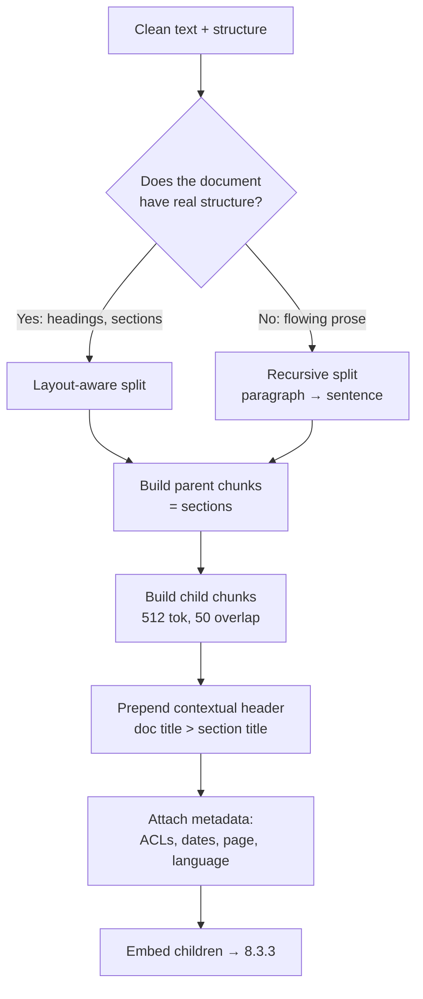
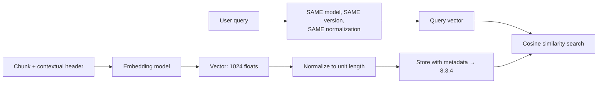
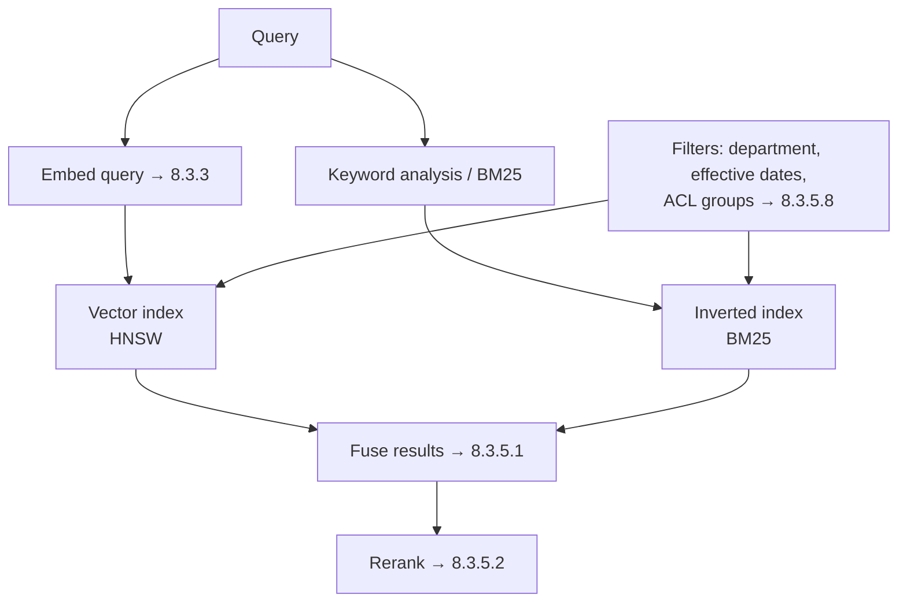
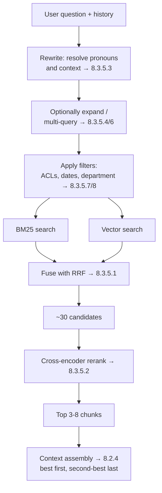
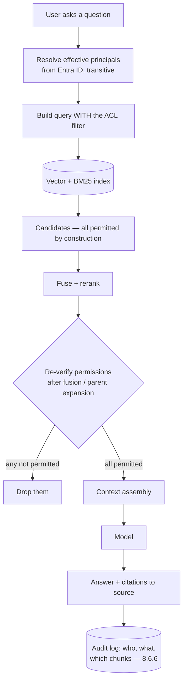
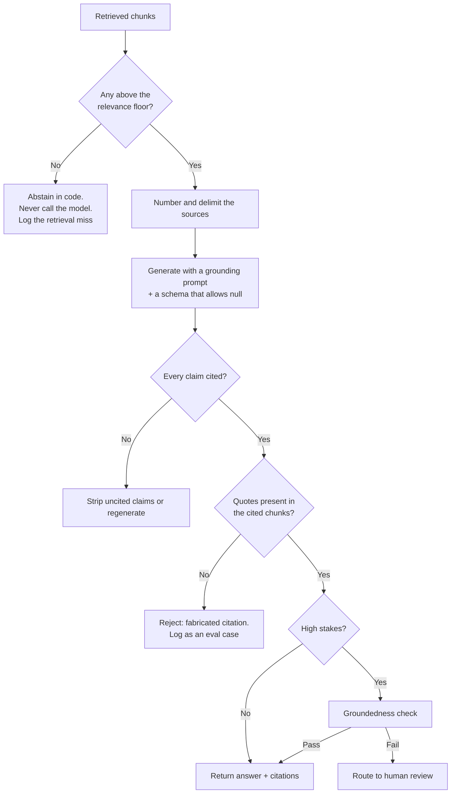
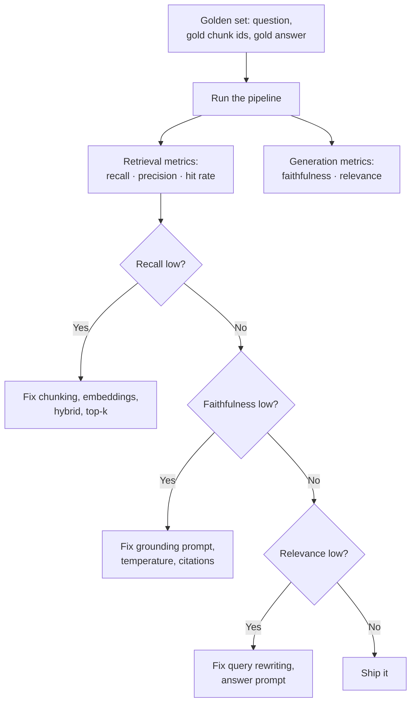

# Stage 3 — Retrieval-Augmented Generation (8.3)

**Rules status:** v2.0 migrated

*How to read this file. **Part A** is the story of the build — the problems, in the order we hit
them. **Part B** is the full reference — one card per topic, everything in it. **Part C** puts it
all back together as one live request you can revise from. Every Part B card links back to the
Part A step that caused it.*

**Where we are:** Stage 1 gave us a model we can trust. Stage 2 gave us a context window we
control, with one slot still empty: "retrieved documents". Stage 3 fills that slot. It is the
biggest stage in the build, because retrieval is the point where an LLM stops being clever
autocomplete and starts being useful to an organisation.

*Order note: topics are in **pipeline order**, not number order.*
*8.3.5.8 (security trimming) sits right after 8.3.5, because it is part of retrieval.*
*8.3.9 and 8.3.10 (lifecycle, caching) come before 8.3.7 and 8.3.8, because the index has to be*
*honest and fast before advanced tricks or scoring are worth talking about.*
*The numbers themselves never change.*

---

# Part A — THE BUILD: Stage 3

Part A is one story: a real backend becoming production-ready. Each step starts with something
that broke, or a question someone asked. It names the thing that fixes it, then points you to the
full explanation in Part B.

## Step 1. We need our own documents in the system

8.1.5 already settled the argument: knowledge that changes lives in retrieval, not in the model's
weights.

So we need every HR policy, circular and procedure pulled in and made searchable. Right now they
are scattered across three places: SharePoint, a file share, and an old document management
system.

The hard part is not loading them. The hard part is **keeping them current**:

- Load everything once → that is a demo.
- Notice a policy changed on Sunday and reflect it on Monday → that is a system.

> **→ [8.3.1 Ingestion](#831-ingestion)** — connectors, incremental sync, change detection

## Step 2. Half of them are scans, not documents

About a third of the corpus is scanned PDFs: signed circulars, stamped forms, photographed pages.

- There is no text inside them at all. Only pixels.
- Several of the most-asked-about policies are tables — and in a table, the **reading order**
  decides whether the extracted text means anything or nothing.

> **→ [8.3.1.3 Document processing](#8313-document-processing)** — OCR, Document Intelligence, tables, images

## Step 3. And half of *those* are in Arabic

Arabic OCR is much harder than English OCR:

- The script is cursive — letters join up.
- The same letter is drawn differently depending on where it sits in the word.
- Diacritics may or may not be there.
- Text runs right-to-left, and many tools reverse the string while extracting it.

Some documents are also bilingual, with Arabic and English side by side in parallel columns.

> **→ [8.3.1.4 Arabic document handling](#8314-arabic-document-handling)**

## Step 4. A 40-page policy will not fit, and should not

We now have clean text. One policy is 26,000 tokens (8.1.1).

- We cannot paste that into the prompt on every question — too big, too expensive.
- We should not, either. The answer is usually in one paragraph. The other 39 pages are cost and
  noise.

So we cut documents into pieces. And *where we cut* sets the quality ceiling for the whole
system — because you cannot retrieve a good answer out of a badly cut piece.

> **→ [8.3.2 Chunking](#832-chunking)** — fixed, recursive, semantic, layout-aware; size, overlap, parent-child, metadata

## Step 5. Keyword search doesn't find it

Someone asks about "leave".

- The policy is titled *Annual Entitlement Framework*.
- It never uses the word "leave".
- Keyword search returns nothing.

We need to search by **meaning**, not by words. That means turning every chunk into a vector
(8.1.1) and comparing directions instead of characters. And because our corpus is bilingual, the
embedding model must put the Arabic and the English version of the same idea close together.

> **→ [8.3.3 Embeddings](#833-embeddings)** — model choice, dimensions, normalization, multilingual, Arabic, re-embedding, cost

## Step 6. Where do 400,000 vectors live?

We have 400,000 chunks. Each one is a vector of 1,024 numbers.

We need the nearest few in under 100 milliseconds — while also filtering by department, document
type, and, the important one, who is allowed to see them.

> **→ [8.3.4 Vector stores](#834-vector-stores)** — Azure AI Search, pgvector, HNSW/IVFFlat, filters, hybrid indexes, scale, refresh

## Step 7. Semantic search alone is not enough either

Meaning search finds the *Annual Entitlement Framework* beautifully. Then it fails on two things:

- `Circular 2024/17` — an exact ID. Meaning is irrelevant here; the characters are everything.
- A vague question — the top result is about the right *topic*, but it does not actually answer
  the question.

Two different fixes are needed: combine word search with meaning search, then re-score the
combined shortlist with something smarter than a vector distance.

> **→ [8.3.5 Retrieval](#835-retrieval)** — hybrid search, reranking, query rewriting, expansion, HyDE, multi-query, metadata filtering

## Step 8. Ali just retrieved the CEO's salary

Our retriever is working perfectly. That is exactly the problem.

The executive compensation document is a great match for Ali's question about pay scales. So it
was retrieved, put in the context window, and summarised back to him.

Nothing was hacked. The system did precisely what we built it to do. We simply never told it that
**who is asking** changes **what may be found**.

**This is the single most important topic in this file, and the first thing a
government panel will ask about.**

> **→ [8.3.5.8 Security trimming / permission-aware retrieval](#8358-security-trimming--permission-aware-retrieval)**

## Step 9. It still invents things, just more convincingly now

Now that real documents are in the context, the answers *sound* sourced. Some of them are not:

- It mixes one retrieved fact with one remembered fact.
- It cites a section number that exists — in a different document.

Retrieval reduced hallucination (8.1.7). It did not remove it.

> **→ [8.3.6 Generation](#836-generation)** — grounding prompts, citations, "I don't know", answer verification

## Step 10. A policy was withdrawn last month and it is still answering from it

Someone deleted the document from SharePoint. Our copy never noticed:

- The chunks are still in the index.
- They are still retrievable.
- They are still being quoted as current policy.

Then the data protection officer asks whether we can delete one person's data on request, and we
find we have no way to do it at all.

> **→ [8.3.9 Index lifecycle](#839-index-lifecycle--deletions-freshness-right-to-erasure-re-index-strategy)** `+`

## Step 11. The same forty questions, two hundred times a day

Traffic analysis shows the top forty questions are more than half of all volume — and every one
of them runs a full retrieve → rerank → generate cycle, every single time.

> **→ [8.3.10 Retrieval caching](#8310-retrieval-caching)** `+`

## Step 12. Some questions don't fit the pattern

Three real questions the normal pipeline cannot answer:

- *"How does the new remote-work circular change the old attendance policy?"* → spans two
  documents and needs a comparison.
- *"How many staff took more than 20 days last year?"* → the answer is in no document at all. It
  is in a database.
- *"Who approves an exception to clause 7?"* → you have to follow a chain of references to find
  out.

> **→ [8.3.7 Advanced RAG](#837-advanced-rag)** — GraphRAG, agentic RAG, contextual retrieval, multi-hop, Table RAG, SQL RAG

## Step 13. How do we actually know any of this works?

Every decision above was a judgement call: chunk size, overlap, top-k, hybrid weighting,
reranking, which embedding model.

Any of them could be wrong. And "it seems better" is not an engineering statement.

> **→ [8.3.8 RAG evaluation](#838-rag-evaluation)** — groundedness, faithfulness, relevance, context precision/recall, hit rate, RAGAS, Azure AI Evaluation SDK
> **→ [8.3.8.10 Building the golden set](#83810-building-the-golden-question-set)** `+`

**End of Stage 3.** The assistant now answers from our real, current, permission-filtered
documents, with citations, and we can measure whether it is getting better. It still cannot *do*
anything — it only reads and answers. Doing things is Stage 4.

---

# Part B — THE REFERENCE

Part B is ordered for the RAG pipeline, not strict numbering. First build the corpus, then split
and embed it, then retrieve permission-filtered candidates, generate grounded answers, keep the
index current, cache only what is safe, and evaluate the whole pipeline.

**A note on the code samples below:** names like `chunk_document`, `embed_batch`,
`secure_retrieve`, `verify_citations`, `cache_key`, and helper functions such as `fetch_parent`
or `log_parent_denied` are illustrative application-level wrappers this reference invents to
keep every language sample readable — they are not real methods on any provider SDK. Check your
actual SDK's method and type names before copying a call signature verbatim; what should transfer
directly is the shape of the pattern, not the exact identifier.

## 8.3.1 Ingestion  `[WORKING]`
> **In the build:** Stage 3, Steps 1–3 — *"we need our documents, half are scans, half of those are Arabic."*

<!-- beginner-card:8.3.1 -->

### 1. Simple idea

Ingestion means bringing documents into the RAG system. It pulls files from places like
SharePoint, file shares, databases and wikis, then keeps the text and the important metadata.
The metadata is not optional: permissions, source URL, modified date, language and document ID
are needed later.

### 2. Why it matters

Every later step depends on ingestion. If ingestion misses a document, the assistant cannot find
it. If ingestion misses permissions, security trimming cannot work. If ingestion misses deletes,
old policy keeps being answered as current policy.

### 3. Exact example

A SharePoint policy should enter the system with this kind of information: document ID, title,
source URL, modified date, ACL groups, classification, language, clean text, page numbers and any
tables. The connector gets it, document processing cleans it, and chunking keeps the metadata on
every chunk.

### 4. Where this is used in the system

Ingestion is an index-time pipeline. It runs before users ask questions: source system to
connector to change detection to document processing to chunking to embeddings to the index.

### 5. Implementation pattern

The basic pattern is: read changed files, delete removed files, process new or changed files,
create chunks, embed chunks, upsert into the index, then save the sync token only after success.
Broken files go to a dead-letter queue instead of stopping the whole crawl.

### 6. Practical rules

Capture ACLs, source IDs, URLs, modified dates, language, page numbers, section names and content
hashes. Handle scans with OCR. Preserve tables as tables. Apply Arabic normalization in one shared
module used by both indexing and query-time search.

### 7. Library mapping

Common tools include Microsoft Graph, Azure AI Search indexers, Azure AI Document Intelligence,
AWS Textract, Unstructured.io, LlamaIndex readers, LangChain loaders, SQL CDC, Azure Data Factory
and custom crawlers.

### 8. Senior metrics

Track crawl coverage, sync lag, failed documents, dead-letter depth, ACL capture rate, delete
event handling, permission-change handling, OCR confidence, table extraction defects and Arabic
extraction quality.

### 9. Fails when

Ingestion fails when it downloads text but not permissions, ignores deletes, ignores permission
changes, advances the sync token after failure, treats scanned PDFs as text, flattens tables or
tests only English documents.

**Full detail follows in the child cards below.**


**Simple idea** — Ingestion is the index-time path that turns source-system content into clean,
permission-carrying material the retriever can search. Stage 3 splits it into four working
subtopics because each one fails differently: connectors, change detection, document/image
processing, and Arabic handling.

### 8.3.1.1 Data connectors  `[WORKING]`

<!-- beginner-card:8.3.1.1 -->

#### 1. Simple idea
A connector pulls content from a source system and brings its metadata with it.

#### 2. Why it matters
If the connector misses permissions, version IDs or source URLs, later RAG stages cannot safely
filter, refresh, cite or delete the content.

#### 3. Exact example
SharePoint should provide the file, ACLs, modified date, site, library, stable ID and URL. A file
share should provide the file, NTFS ACLs, path and modified date.

#### 4. Where this is used in the system
This is the first ingestion step. It feeds document processing and decides what metadata every
future chunk can carry.

#### 5. Implementation pattern
Use a source API or crawler, fetch content and metadata together, validate required fields, then
send the file plus metadata to the processing queue.

#### 6. Practical rules
Prefer connectors that expose ACLs and change feeds. Avoid broad service-account crawling unless
permissions are still copied into the index.

#### 7. Library mapping
Microsoft Graph, Azure AI Search indexers, SMB crawlers, vendor DMS APIs, REST APIs, LlamaIndex
readers, LangChain loaders and Unstructured.io.

#### 8. Senior metrics
Track crawl coverage, throttling, skipped files, ACL completeness, metadata completeness and delete
detection.

#### 9. Fails when
The connector downloads text but not permissions, ignores moved/deleted documents, or hides source
throttling until a large crawl fails halfway.

**Full detail follows below.**


**Simple idea** — The components that pull content out of source systems and into the pipeline,
preserving not just text but the metadata that later becomes filters and permissions.

**Exact example**
```
SharePoint Online  → Graph API      → doc, ACLs, modified date, site, library
Network file share → SMB crawl      → doc, NTFS ACLs, path, modified date
Legacy DMS         → vendor API/DB  → doc, department, classification
Confluence / wiki  → REST API       → page, space permissions, version
```
The metadata is not a nice-to-have. `ACLs` becomes 8.3.5.8, `modified date` becomes 8.3.9,
`department` becomes a retrieval filter, and `classification` becomes a DLP control (8.6.13).
**Metadata you fail to capture at ingestion cannot be reconstructed later** — you would have to
re-crawl the entire corpus.

**Where this is used in the system** — KNOWLEDGE layer, step 1. In: source systems. Out: raw documents + metadata.

**Implementation note**
Azure AI Search **indexers** (built-in SharePoint / Blob / SQL connectors) · Microsoft Graph
SDK · LlamaIndex readers · LangChain document loaders · Unstructured.io · Azure Data Factory
for scheduled bulk movement.

**Used when** — always. The only question is build-vs-buy: a managed indexer is faster to
stand up; a custom connector gives control over permissions and change detection, which usually
matters more in an enterprise.

**Fails when**
- Permissions are not captured, making 8.3.5.8 impossible without a full re-crawl.
- The connector runs as a service account with broad read access — the classic finding, because
  it means the *index* now contains everything even if retrieval filters later.
- Source throttling (Graph API limits — `verify` current quotas) is not handled, so large crawls fail halfway.
- Deleted and moved documents are not detected (→ 8.3.9).

**Senior note** — Track crawl coverage, source throttling, metadata completeness, ACL capture
rate and delete detection. In RAG, ingestion quality is not plumbing: it decides what the model
can ever know and what it may accidentally see.

### 8.3.1.2 Incremental sync & change detection  `[WORKING]`

<!-- beginner-card:8.3.1.2 -->

#### 1. Simple idea
Incremental sync means process only what changed since the last successful run.

#### 2. Why it matters
A full crawl every night is slow and expensive. If it becomes too slow, people run it less often
and the assistant starts using stale policy.

#### 3. Exact example
A Graph delta query returns created, updated and deleted items. The pipeline re-indexes changed
items and removes deleted items.

#### 4. Where this is used in the system
It wraps ingestion and controls freshness: how quickly source changes appear in the RAG index.

#### 5. Implementation pattern
Load the last token, read changes, process every event, put failures in a dead-letter queue, then
save the new token only after success.

#### 6. Practical rules
Handle creates, updates, deletes and permission-only changes. Do not re-embed unchanged content.

#### 7. Library mapping
Microsoft Graph delta, Azure AI Search change tracking, SQL CDC, SQL change tracking, source event
queues and custom watermark tables.

#### 8. Senior metrics
Track sync lag, skipped items, dead-letter depth, delete success, permission-change success and
unnecessary re-embedding rate.

#### 9. Fails when
The watermark advances after failure, deletes are ignored, permission changes are missed or one bad
document stops the whole crawl.

**Full detail follows below.**


**Simple idea** — Processing only what changed since the last run, rather than re-ingesting
everything. The difference between a pipeline that runs nightly in 20 minutes and one that
takes 14 hours and gets switched off.

**Exact example**
```python
# Three mechanisms, in descending order of preference:

# 1. CHANGE FEED / DELTA QUERY — the source tells you what changed. Best.
delta = graph.get(f"/sites/{site}/drive/root/delta?token={saved_token}")
for item in delta["value"]:
    if item.get("deleted"):
        remove_from_index(item["id"])      # deletions matter as much as edits (8.3.9)
    else:
        reindex(item)
save_token(delta["@odata.deltaLink"])       # resume point for the next run

# 2. TIMESTAMP WATERMARK — poll for modified > last_run. Simple, misses deletions.
# 3. CONTENT HASH — hash each document, compare. Catches everything, but you must
#    still READ everything, so it saves embedding cost, not crawl cost.
```

```csharp
// -- C#: the delta query with the Graph SDK. The token save is deliberately the
// LAST statement: save it earlier and a mid-batch failure advances the watermark
// past documents you never processed, which is the silent-skip failure below.
using Microsoft.Graph;

public async Task SyncAsync(string siteId, CancellationToken ct)
{
    var page = await _graph.Sites[siteId].Drive.Root
                           .Delta.GetAsDeltaGetResponseAsync(
                               r => r.QueryParameters.Token = await LoadTokenAsync(),
                               ct);

    var processed = new List<string>();
    foreach (var item in page.Value ?? [])
    {
        if (item.Deleted is not null)
            await RemoveFromIndexAsync(item.Id!, ct);   // deletions matter as much
        else                                            // as edits (8.3.9)
            await ReindexAsync(item, ct);
        processed.Add(item.Id!);
    }

    // Resume point for the next run -- written only once everything above
    // succeeded. A dead-letter queue takes the individual failures, so one
    // malformed document does not stop the whole crawl.
    await SaveTokenAsync(page.OdataDeltaLink, ct);
}
```

```typescript
// -- TypeScript: same delta loop. The `for await` matters -- mapping to
// promises and Promise.all-ing them looks faster and will happily blow past
// the source's throttling limits, which is the other way large crawls die.
import { Client } from "@microsoft/microsoft-graph-client";

export async function sync(siteId: string): Promise<void> {
  const token = await loadToken();
  const delta = await graph
    .api(`/sites/${siteId}/drive/root/delta`)
    .query({ token })
    .get();

  for (const item of delta.value) {
    if (item.deleted) {
      await removeFromIndex(item.id);   // deletions matter as much as edits (8.3.9)
    } else {
      await reindex(item);
    }
  }

  // Resume point for the next run. Saved LAST, and only on success -- a
  // watermark that advances past a failed batch skips those documents forever.
  await saveToken(delta["@odata.deltaLink"]);
}
```

**Where this is used in the system** — KNOWLEDGE layer, wrapping step 1. Determines freshness, which is a
user-visible property: "the assistant is quoting last month's policy" is a freshness bug.

**Implementation note** — Microsoft Graph delta queries · Azure AI Search indexer change-tracking
policies · SQL change tracking / CDC · your own watermark table.

**Used when** — any corpus that changes, which is all of them.

**Fails when**
- Only additions and edits are handled, never deletions — the most common gap, and it is a
  compliance problem, not just a quality one (8.3.9).
- The watermark advances even when processing failed, so documents are silently skipped
  forever.
- Re-embedding everything on every run — correct, and the embedding bill is 50× what it needs
  to be (8.3.3.7).
- No dead-letter queue, so one malformed document stops the whole crawl.

**Senior note** — Dashboard sync lag, skipped-item count, dead-letter depth and delete-event
processing separately. A healthy "updated document" pipeline can still fail compliance if it
never proves deletion handling.

### 8.3.1.3 Document processing  `[WORKING]`

<!-- beginner-card:8.3.1.3 -->

#### 1. Simple idea
Document processing turns PDFs, scans, Word files, images and tables into clean text plus
structure.

#### 2. Why it matters
The model reads the extracted text, not the original PDF. If extraction destroys the table or
reading order, retrieval cannot repair it later.

#### 3. Exact example
A leave table must stay as rows and columns. `Grade Days A 24 B 30` is bad; a Markdown or structured
table with headers is usable.

#### 4. Where this is used in the system
It runs after the connector downloads a file and before chunking.

#### 5. Implementation pattern
Detect file type, run OCR for scans, preserve layout and tables, keep page/section metadata and
store extraction confidence.

#### 6. Practical rules
Preserve reading order, remove noisy headers/footers, keep citation metadata and route
low-confidence OCR to review.

#### 7. Library mapping
Azure AI Document Intelligence, AWS Textract, pypdf, pdfplumber, PyMuPDF, python-docx, Tesseract,
PaddleOCR and Unstructured.io.

#### 8. Senior metrics
Track OCR confidence, table defects, page metadata coverage, section metadata coverage, scanned
path success and Arabic extraction quality.

#### 9. Fails when
Tables flatten, multi-column pages interleave, page numbers are missing, OCR confidence is ignored
or figures are skipped.

**Full detail follows below.**


**Simple idea** — Turning a file into clean text plus structure: OCR for images, layout analysis
for reading order, table extraction, and figure handling.

**Exact example**
```
Native PDF        → text extraction preserving reading order      (pypdf, PyMuPDF)
Scanned PDF/image → OCR                                           (Document Intelligence)
Word / PowerPoint → text + heading hierarchy                      (python-docx)
Excel / CSV       → treat as data, not prose (→ 8.3.7.6)
Tables in PDFs    → structured extraction, NOT flattened text
Figures/diagrams  → caption, or a multimodal description (8.1.11)
```

**The table problem, concretely** — it is worth seeing why this matters:
```
❌ Naive text extraction of a leave-entitlement table:
   "Grade Days A 24 B 30 C 35"
   → the model cannot tell which number belongs to which grade

✅ Structure-preserving extraction:
   | Grade | Annual leave days |
   | A     | 24                |
   | B     | 30                |
   | C     | 35                |
   → unambiguous, and survives chunking
```
Roughly the most common silent quality failure in enterprise RAG: entitlement tables flattened
into meaningless token soup, producing confidently wrong answers about numbers.

**Where this is used in the system** — KNOWLEDGE layer, step 2. In: raw files. Out: clean text + structure +
per-element metadata (page number, section, bounding box — which later powers citations, 8.3.6.2).

**Implementation note**
**Azure AI Document Intelligence** (layout, tables, key-value, handwriting, Arabic support) ·
AWS Textract · `pypdf` / `pdfplumber` / `PyMuPDF` · `python-docx` · Tesseract / PaddleOCR ·
Unstructured.io · multimodal LLM as a fallback for unusual layouts (8.1.11).

**Used when** — always, and the effort scales with how messy the corpus is. Budget more time
here than feels reasonable: extraction quality sets a hard ceiling on retrieval quality that no
amount of clever chunking or reranking can lift.

**Fails when**
- Tables flattened into prose (above).
- Multi-column layouts read straight across, interleaving two unrelated columns.
- Headers, footers and page numbers left in, polluting every chunk.
- No page/section metadata captured, so citations cannot point anywhere precise.
- OCR confidence scores discarded, so you cannot flag low-quality extractions for review.

**Senior note** — Keep the image/scanned-document flow visible in reviews. Measure OCR
confidence, table-preservation defects, page/section metadata coverage and Arabic extraction
accuracy before the text reaches chunking.

### 8.3.1.4 Arabic document handling  `[WORKING]`
> **In the build:** Stage 3, Step 3 — *"And half of those are in Arabic."*

<!-- beginner-card:8.3.1.4 -->

#### 1. Simple idea
Arabic handling means treating Arabic OCR, right-to-left text, normalization, token budget and
bilingual layout as first-class parts of RAG.

#### 2. Why it matters
English-only testing can look strong while Arabic users get poor answers. In Arabic-first public
sector work, that is a core failure.

#### 3. Exact example
The same Arabic word may appear with or without diacritics. Documents and queries must use the
same normalization rules.

#### 4. Where this is used in the system
It appears at index time for OCR, cleanup, chunking and embeddings, and at query time for query
normalization, cross-lingual retrieval and answer language.

#### 5. Implementation pattern
Detect language, use Arabic-capable OCR, verify RTL order, normalize text, split bilingual columns,
chunk by tokens and evaluate Arabic queries.

#### 6. Practical rules
Use one shared Arabic normalizer. Test OCR and embeddings on your own documents. Chunk by tokens,
not characters.

#### 7. Library mapping
Azure AI Document Intelligence, AWS Textract, PaddleOCR Arabic models, Tesseract Arabic, PyArabic,
camel-tools and multilingual embeddings.

#### 8. Senior metrics
Track Arabic OCR quality, Arabic hit rate, bilingual success, English/Arabic quality gap and
normalization drift.

#### 9. Fails when
Arabic is treated as a display option instead of a pipeline requirement, or when bilingual columns
are extracted as mixed nonsense.

**Full detail follows below.**


**Simple idea** — The additional handling Arabic content requires at every stage: OCR, text
extraction, direction, normalization, and bilingual document structure.

**The specific problems, and what each one does to you:**

| Problem | What happens | Handling |
|---|---|---|
| **Cursive, context-dependent letterforms** | Arabic letters change shape by position; naive OCR accuracy drops sharply | Use an OCR engine with explicit Arabic training — Document Intelligence, or PaddleOCR's Arabic models (`verify` current Arabic accuracy on **your** documents) |
| **RTL flow** | Extractors emit reversed or interleaved strings, especially mixed with Latin text or digits | Handle bidirectional text properly; verify extracted text renders correctly before indexing |
| **Diacritics (tashkeel)** | The same word appears with and without marks and fails to match | Normalize: strip tashkeel, unify alef forms (أ إ آ → ا), unify ya/alef maqsura, unify ta marbuta |
| **Bilingual parallel columns** | Two-column Arabic/English documents interleave into nonsense | Layout-aware extraction (8.3.1.3), then split by language before chunking |
| **Tokenizer inefficiency** | Arabic consumes ~2–3× the tokens of English for the same meaning (8.1.1) | Budget accordingly; chunk size in *tokens* not characters |
| **Embedding quality** | Many embedding models are markedly weaker on Arabic | Choose a genuinely multilingual model and **test it on your own Arabic corpus** (8.3.3.4) |
| **Mixed-language queries** | Arabic question, English document (or vice versa) | Cross-lingual embeddings, or index both and search both |

**Exact example**
```python
import re
def normalize_arabic(text: str) -> str:
    text = re.sub(r'[ً-ْ]', '', text)      # strip tashkeel (diacritics)
    text = re.sub(r'[إأآا]', 'ا', text)               # unify alef forms
    text = text.replace('ى', 'ي').replace('ة', 'ه')   # unify ya / ta marbuta
    return re.sub(r'\s+', ' ', text).strip()
# Apply the SAME normalization to documents at index time AND to queries at
# search time. Applying it to only one side is worse than applying it to neither.
```

```csharp
// -- C#: the same normalization. One real trap: .NET regex character ranges are
// UTF-16 based, so build the tashkeel range from explicit code points rather
// than pasting characters into a literal, where an editor may reorder or
// normalize them and silently change what you match.
using System.Text.RegularExpressions;

public static partial class ArabicText
{
    // U+064B..U+0652 is the tashkeel (harakat) block.
    [GeneratedRegex("[ً-ْ]")]        private static partial Regex Tashkeel();
    [GeneratedRegex("[إأآا]")] private static partial Regex AlefForms();
    [GeneratedRegex(@"\s+")]                    private static partial Regex Whitespace();

    public static string Normalize(string text)
    {
        text = Tashkeel().Replace(text, "");             // strip diacritics
        text = AlefForms().Replace(text, "ا");      // unify alef forms
        text = text.Replace('ى', 'ي')          // alef maqsura -> ya
                   .Replace('ة', 'ه');         // ta marbuta   -> ha
        return Whitespace().Replace(text, " ").Trim();
    }
}
// Apply the SAME normalization to documents at index time AND to queries at
// search time. Applying it to only one side is worse than applying it to neither.
```

```typescript
// -- TypeScript: the `u` flag is not optional here. Without it these ranges are
// matched as UTF-16 code units and the behaviour on non-BMP input is wrong --
// a bug that will not show up on the English half of your corpus.
const TASHKEEL = /[ً-ْ]/gu;              // diacritics
const ALEF_FORMS = /[إأآا]/gu; // إ أ آ ا
const WHITESPACE = /\s+/gu;

export function normalizeArabic(text: string): string {
  return text
    .replace(TASHKEEL, "")           // strip tashkeel (diacritics)
    .replace(ALEF_FORMS, "ا")   // unify alef forms
    .replace(/ى/gu, "ي")   // alef maqsura -> ya
    .replace(/ة/gu, "ه")   // ta marbuta   -> ha
    .replace(WHITESPACE, " ")
    .trim();
}
// Apply the SAME normalization to documents at index time AND to queries at
// search time. Applying it to only one side is worse than applying it to neither.
// In practice: put this in one shared module that BOTH the indexer and the query
// path import, so the two cannot drift apart in a later refactor.
```

**Where this is used in the system** — Index time and query time. At index time it affects OCR
review, text normalization, chunk size, language metadata and embeddings. At query time it affects
query normalization, cross-lingual retrieval and the output language expected from generation.

**Implementation note** — Put Arabic normalization in one shared module used by both the indexer
and the query path. Treat Arabic OCR/model support as a tested capability, not as a checkbox in a
vendor feature list.

**Used when** — any corpus or user base including Arabic. In a UAE government context this is
not an enhancement; official documents are frequently Arabic-first with English as the
translation.

**Fails when**
- English-tuned OCR used on Arabic scans — quality is poor and nobody notices until an Arabic
  speaker tests it.
- Normalization applied at index time but not query time (or vice versa).
- Chunk sizes tuned on English and applied to Arabic, so Arabic chunks hold ~40% of the content.
- Retrieval quality is only ever evaluated in English — so the golden set (8.3.8.10) must be
  bilingual, or you are measuring half your service.

**Senior note** — Arabic is not a language toggle. Verify OCR, RTL ordering, tokenizer budget,
embedding quality and answer-language behavior as separate acceptance criteria.

---

## 8.3.2 Chunking  **`[CORE]`**
> **In the build:** Stage 3, Step 4 — *"a 40-page policy will not fit, and should not."*

### 1. Simple idea

```
  ONE DOCUMENT (40 pages, ~26,000 tokens) — too big to send, and mostly irrelevant
  ════════════════════════════════════════════════════════════════════════════════
                                      │
                    ┌─────────────────┴─────────────────┐
                    │  WHERE DO YOU CUT?                │
                    └─────────────────┬─────────────────┘
       ┌──────────────┬───────────────┼───────────────┬──────────────┐
       ▼              ▼               ▼               ▼              ▼
   ┌────────┐   ┌───────────┐   ┌──────────┐   ┌─────────────┐
   │ FIXED  │   │ RECURSIVE │   │ SEMANTIC │   │LAYOUT-AWARE │
   │ every  │   │ para →    │   │ where    │   │ on the doc's│
   │ N chars│   │ sent →    │   │ meaning  │   │ OWN headings│
   │        │   │ word      │   │ shifts   │   │ & sections  │
   └────┬───┘   └─────┬─────┘   └────┬─────┘   └──────┬──────┘
        │             │              │                │
     baseline      default        costly           BEST for
     only         + fallback     (embeds every     policies,
                                  sentence)        circulars

                                      │
                   PARENT-CHILD resolves the size trade-off
                                      │
   ┌─ PARENT: Section 4.2 in full (1,400 tok) ──── what the MODEL receives ──┐
   │   child 1: the lead-in sentence        ─┐                              │
   │   child 2: the grade table             ─┼─ embedded & indexed (512 tok) │
   │   child 3: the notice requirement      ─┘   what SEARCH matches         │
   └──────────────────────────────────────────────────────────────────────────┘
        precision of small chunks  +  context of large ones,  for one extra lookup

  ⚠ The chunk IS the unit of retrieval. Nothing downstream — not the reranker,
    not the model — can recover information that was cut in half here.
```

**Plain English:** Cutting documents into pieces small enough to retrieve precisely and put in
a prompt, without cutting through the middle of an idea.

**Precisely:** Chunking splits documents into retrievable units. Each chunk is embedded and
indexed independently, so the chunk **is** the unit of retrieval — the model will see the chunk,
not the document. Chunking strategy determines the ceiling on retrieval quality, because no
retriever, reranker or model can recover information that was cut in half.

### 2. Why it matters

Our leave policy contains:

```
Section 4.2 Annual Leave
Employees are entitled to annual leave according to grade, as set out below.

  Grade A — 24 days    Grade B — 30 days    Grade C — 35 days

Leave must be requested at least 14 days in advance.
```

A naive fixed-size split lands the boundary between "according to grade, as set out below" and
the table. Now there are two chunks: one saying entitlement depends on grade but not what the
values are, and one containing three numbers with no idea what they mean.

Ask "how many days does a Grade B employee get?" and retrieval returns chunk one — semantically
the best match, since it contains the words "annual leave" and "grade" — and the model, having
been given text that promises a table it cannot see, either abstains or invents.

**The retrieval was correct. The chunking made the correct answer unreachable.**

### 3. Exact example

The four strategies on the same document:

```
FIXED (500 characters, no respect for structure)
  ✂ "...entitled to annual leave according to grade, as set" | "out below. Grade A — 24..."
  Fast, trivial, and cuts mid-sentence. Use only as a baseline.

RECURSIVE (split on paragraphs → sentences → words, until it fits)
  ✂ "Section 4.2 Annual Leave\nEmployees are entitled...as set out below." | "Grade A — 24..."
  Respects natural boundaries. The sensible default. Still separated the table from its lead-in.

SEMANTIC (split where meaning shifts, measured by embedding distance between sentences)
  ✂ [whole of 4.2 as one chunk] | [Section 4.3 begins]
  Keeps the idea intact. Costs an embedding pass over every sentence to compute.

LAYOUT-AWARE (split on the document's own structure: headings, sections, table boundaries)
  ✂ [Section 4.2 heading + body + full table] | [Section 4.3 heading + body]
  Best for structured corpora — which policies, circulars and contracts always are.
```

For a government policy corpus, layout-aware is usually the correct answer and recursive is the
correct fallback. Fixed is a baseline you measure against, not a strategy you ship.

### 4. How it works

**Size and overlap — the central trade-off:**

```
SMALL CHUNKS (200-300 tokens)
  + precise retrieval — the match is the answer, little dilution
  + more chunks fit in the context budget
  - context is lost; "it" and "the above" refer to something not present
  - one idea gets split across several chunks

LARGE CHUNKS (1,000-1,500 tokens)
  + self-contained; the surrounding context comes along
  - imprecise retrieval — the embedding averages several topics into one vector
  - a large chunk retrieved for one sentence wastes the rest of the budget

OVERLAP (10-20% of chunk size)
  + an idea crossing a boundary survives in at least one chunk intact
  - duplicate content in the index: storage, embedding cost, and near-duplicate results
```

Practical starting point: **512 tokens with ~50 tokens of overlap**, split recursively on
structure, then tuned against a golden set (8.3.8.10). Treat those numbers as a starting
hypothesis, not a recommendation — the right values depend on your documents, and the only way
to know is to measure.

**Parent-child (small-to-big) retrieval — the technique that resolves the trade-off.** Search
over small, precise chunks, but send the *larger* parent to the model:

```
   ┌─ PARENT: Section 4.2 in full (1,400 tokens) ──────────────┐
   │  child 1: the lead-in sentence      (embedded, indexed)   │
   │  child 2: the grade table           (embedded, indexed)   │
   │  child 3: the notice requirement    (embedded, indexed)   │
   └───────────────────────────────────────────────────────────┘

   Query "Grade B days" → matches child 2 precisely
                        → but the MODEL receives the whole parent
   Precision of small chunks, context of large ones.
```
This is the single highest-value chunking technique, and it costs one extra lookup.

**Metadata enrichment.** Every chunk carries fields that later become filters, citations and
security controls:

```json
{
  "chunk_id": "hr-policy-2026::s4.2::c2",
  "text": "Grade A — 24 days | Grade B — 30 days | Grade C — 35 days",
  "parent_id": "hr-policy-2026::s4.2",
  "document_id": "hr-policy-2026",
  "document_title": "HR Policy Manual 2026",
  "section": "4.2 Annual Leave",
  "page": 14,
  "language": "en",
  "effective_from": "2026-01-01",
  "superseded": false,
  "acl_groups": ["all-staff"],
  "classification": "internal",
  "source_url": "https://sharepoint/.../HR-Policy-2026.pdf#page=14",
  "content_hash": "sha256:..."
}
```
Every field earns its place: `acl_groups` → 8.3.5.8 · `superseded`/`effective_from` → 8.3.9 ·
`section`/`page`/`source_url` → citations, 8.3.6.2 · `language` → 8.3.1.4 · `classification` →
8.6.13 · `content_hash` → change detection, 8.3.1.2.

**Contextual chunk headers** — cheap and unreasonably effective. Prefix each chunk with its
document and section title before embedding:
```
"HR Policy Manual 2026 > Section 4.2 Annual Leave >
 Grade A — 24 days | Grade B — 30 days | Grade C — 35 days"
```
The orphaned table now embeds with the meaning of its heading attached, and retrieval improves
noticeably for a few tokens per chunk.



### 5. Where this is used in the system

```
   ingest → process → ▶ CHUNK ◀ → embed → index → retrieve → rerank → context
                       you are here
```
**In:** clean text with structure. **Out:** retrievable units with metadata, ready to embed.

Downstream everything depends on this: embeddings represent chunks, retrieval returns chunks,
the model reads chunks, citations point at chunks. Get it wrong and every later stage inherits
the damage.

### 6. Implementation pattern

| Job | Python | .NET | JavaScript |
|---|---|---|---|
| Recursive splitting | `langchain_text_splitters` `RecursiveCharacterTextSplitter` | Semantic Kernel `TextChunker` | LangChain.js |
| Token-aware splitting | same, with `tiktoken` length function | `Microsoft.ML.Tokenizers` | `js-tiktoken` |
| Semantic chunking | `llama_index` `SemanticSplitterNodeParser` | — | — |
| Layout-aware | Unstructured.io, Document Intelligence output | — | — |
| Parent-child | `langchain` `ParentDocumentRetriever`, or your own | — | — |
| Managed | Azure AI Search **integrated vectorization** (built-in split skill; `verify` current skill set) | same | same |

```python
from langchain_text_splitters import RecursiveCharacterTextSplitter
import tiktoken

enc = tiktoken.encoding_for_model("gpt-4o")

splitter = RecursiveCharacterTextSplitter(
    chunk_size=512,                       # measured in TOKENS, not characters —
    chunk_overlap=50,                     # critical for Arabic, where the
                                          # token:character ratio is very different (8.3.1.4)
    length_function=lambda t: len(enc.encode(t)),

    # Separators are tried IN ORDER. It only falls back to a cruder split when
    # a finer one cannot make the chunk fit — which is what makes it "recursive".
    separators=["\n## ", "\n### ", "\n\n", "\n", ". ", " ", ""],
    #            ↑ headings first: never split across a section boundary if avoidable
)

def chunk_document(doc: dict) -> list[dict]:
    chunks = []
    for section in doc["sections"]:                 # layout-aware outer loop:
                                                    # the PARENT is the section
        parent_id = f"{doc['id']}::{section['id']}"

        for i, child_text in enumerate(splitter.split_text(section["text"])):
            # Contextual header: cheap, and it rescues orphaned tables and lists
            # by carrying their heading's meaning into the embedding.
            embedded_text = (f"{doc['title']} > {section['title']}\n\n{child_text}")

            chunks.append({
                "chunk_id":  f"{parent_id}::c{i}",
                "text":      child_text,        # what the MODEL sees
                "embed_text": embedded_text,    # what gets EMBEDDED — deliberately
                                                # different, and worth the extra field
                "parent_id": parent_id,         # what is actually SENT (parent-child)
                "document_id": doc["id"],
                "section":   section["title"],
                "page":      section.get("page"),
                "language":  section.get("language", "en"),
                "acl_groups": doc["acl_groups"],   # captured at ingest — see 8.3.5.8
                "effective_from": doc["effective_from"],
                "superseded": False,
                "source_url": f"{doc['url']}#page={section.get('page', 1)}",
            })
    return chunks
```

```csharp
// -- C#: Semantic Kernel's TextChunker splits on tokens too, but you must hand
// it a token counter -- the default counts characters, which is exactly the bug
// this section warns about on an Arabic corpus (8.3.1.4).
using Microsoft.SemanticKernel.Text;
using Microsoft.ML.Tokenizers;

Tokenizer tokenizer = TiktokenTokenizer.CreateForModel("gpt-4o");
int TokenCount(string s) => tokenizer.CountTokens(s);

public IReadOnlyList<Chunk> ChunkDocument(SourceDocument doc)
{
    var chunks = new List<Chunk>();

    foreach (var section in doc.Sections)          // layout-aware outer loop:
    {                                              // the PARENT is the section
        string parentId = $"{doc.Id}::{section.Id}";

        // Lines first, then paragraphs -- SK's two-stage split is its version of
        // the "try a finer separator before a cruder one" rule.
        var lines = TextChunker.SplitPlainTextLines(section.Text, 128, TokenCount);
        var children = TextChunker.SplitPlainTextParagraphs(
            lines, maxTokensPerParagraph: 512, overlapTokens: 50, tokenCounter: TokenCount);

        for (int i = 0; i < children.Count; i++)
        {
            // Contextual header: cheap, and it rescues orphaned tables and lists
            // by carrying their heading's meaning into the embedding.
            string embeddedText = $"{doc.Title} > {section.Title}\n\n{children[i]}";

            chunks.Add(new Chunk
            {
                ChunkId    = $"{parentId}::c{i}",
                Text       = children[i],          // what the MODEL sees
                EmbedText  = embeddedText,         // what gets EMBEDDED -- deliberately
                                                   // different, and worth the extra field
                ParentId   = parentId,             // what is actually SENT (parent-child)
                DocumentId = doc.Id,
                Section    = section.Title,
                Page       = section.Page,
                Language   = section.Language ?? "en",
                AclGroups  = doc.AclGroups,        // captured at ingest -- see 8.3.5.8
                EffectiveFrom = doc.EffectiveFrom,
                Superseded = false,
                SourceUrl  = $"{doc.Url}#page={section.Page ?? 1}",
            });
        }
    }
    return chunks;
}
```

```typescript
// -- TypeScript: LangChain.js takes an async length function, which matters more
// than it looks -- the obvious mistake is to leave it as the default character
// count, and nothing errors. Your Arabic chunks are then 2-3x the intended token
// size and only a token-level test will catch it (8.3.1.4).
import { RecursiveCharacterTextSplitter } from "@langchain/textsplitters";
import { encodingForModel } from "js-tiktoken";

const enc = encodingForModel("gpt-4o");

const splitter = new RecursiveCharacterTextSplitter({
  chunkSize: 512,                 // measured in TOKENS, not characters
  chunkOverlap: 50,
  lengthFunction: (t: string) => enc.encode(t).length,
  // Separators are tried IN ORDER; it falls back to a cruder split only when a
  // finer one cannot make the chunk fit -- which is what makes it "recursive".
  separators: ["\n## ", "\n### ", "\n\n", "\n", ". ", " ", ""],
  //            ^ headings first: never split across a section boundary if avoidable
});

export async function chunkDocument(doc: SourceDocument): Promise<Chunk[]> {
  const chunks: Chunk[] = [];

  for (const section of doc.sections) {          // layout-aware outer loop:
    const parentId = `${doc.id}::${section.id}`; // the PARENT is the section
    const children = await splitter.splitText(section.text);

    children.forEach((childText, i) => {
      // Contextual header: cheap, and it rescues orphaned tables and lists.
      const embedText = `${doc.title} > ${section.title}\n\n${childText}`;

      chunks.push({
        chunkId: `${parentId}::c${i}`,
        text: childText,             // what the MODEL sees
        embedText,                   // what gets EMBEDDED -- deliberately different
        parentId,                    // what is actually SENT (parent-child)
        documentId: doc.id,
        section: section.title,
        page: section.page,
        language: section.language ?? "en",
        aclGroups: doc.aclGroups,    // captured at ingest -- see 8.3.5.8
        effectiveFrom: doc.effectiveFrom,
        superseded: false,
        sourceUrl: `${doc.url}#page=${section.page ?? 1}`,
      });
    });
  }
  return chunks;
}
```

### 7. Practical rules and real numbers

| Knob | Value (`typical`) | Effect |
|---|---|---|
| Chunk size | 256–1,024 tokens; **512 a common start** | Smaller = precise but context-poor |
| Overlap | 10–20% (≈50 tokens at 512) | Insurance against boundary cuts; costs duplication |
| Parent size | 1,000–2,000 tokens, or a whole section | What the model actually receives |
| Contextual header | 10–30 tokens per chunk | Consistently worth it |
| Chunks per document | 5–100 | Depends on document size |
| Arabic chunk size | same *token* count, ~40% of the English text | Never size in characters |
| Table handling | keep whole, never split | Split tables are worse than no table |

### 8. Senior metrics and perspectives grid

| Lens | What matters here |
|---|---|
| **Theory** | The chunk is the atomic unit of retrieval. A single embedding vector must represent the whole chunk, so a chunk containing three topics has a vector representing none of them well. |
| **Engineering** | Split on structure, not on character counts. Separate `embed_text` from `text`. Use parent-child. Never split a table. Attach metadata at chunk time — it cannot be added later without a full re-index. |
| **Operations** | Chunking changes require a **full re-index**, which is expensive and slow. Get metadata right the first time; you will change chunk size more than once, and each change is a migration (8.3.9). |
| **Cost** | Overlap duplicates content: 20% overlap is ~20% more vectors to embed and store. Larger chunks mean fewer vectors but more tokens per retrieved result — the cost moves from indexing to inference. |
| **Security** | ACLs must be attached at chunk level and must match the source document's permissions *at the time of retrieval*. Chunk-level ACLs that drift from source ACLs are how permission-trimming quietly fails (8.3.5.8). |
| **Decision** | Structured corpus → layout-aware. Prose → recursive. Always parent-child if you can afford the extra lookup. Then stop guessing and tune against the golden set. |

### 9. Trade-offs & failure modes

- **Splitting a table.** The most common silent quality failure in enterprise RAG — numbers
  divorced from their labels, producing confidently wrong answers.
- **Sizing in characters on a multilingual corpus.** Arabic chunks end up holding a fraction of
  the content of English ones.
- **Chunks too small.** "It must be requested 14 days in advance" — what must?
- **Chunks too large.** The embedding averages several topics; retrieval becomes vague.
- **No overlap on flowing prose.** Ideas that straddle a boundary are unreachable.
- **Too much overlap.** Near-duplicate results crowd out genuinely different content in top-k.
- **Metadata added later.** It cannot be — you must re-crawl and re-index.
- **Tuning chunking by intuition.** It is the most-tuned and least-measured parameter in RAG.
  Without a golden set you are guessing (8.3.8.10).

---

## 8.3.3 Embeddings  **`[CORE]`**
> **In the build:** Stage 3, Step 5 — *"someone asks about 'leave'; the policy is called 'Annual Entitlement Framework'."*

### 1. Simple idea

```
  INDEX TIME                                      QUERY TIME
  ──────────                                      ──────────
  "Grade B — 30 days"                             "how much leave do I get?"
          │                                                │
          ▼                                                ▼
  ┌───────────────────┐                          ┌───────────────────┐
  │ EMBEDDING MODEL   │  ◄── MUST BE THE ──►     │ EMBEDDING MODEL   │
  │ model + version   │      SAME THREE          │ model + version   │
  │ + dimensions      │                          │ + dimensions      │
  └─────────┬─────────┘                          └─────────┬─────────┘
            ▼                                              ▼
     [0.021, -0.056, ...]                          [0.019, -0.051, ...]
      1,024 floats                                  1,024 floats
            │                                              │
            ▼  normalize to unit length                     ▼
      stored beside the chunk  ─────► cosine similarity ◄───┘
                                     (= dot product, once normalized)

   "annual leave entitlement" ↔ "vacation days policy"      0.87  ✓
   "annual leave entitlement" ↔ "استحقاق الإجازة السنوية"     0.81  ✓ cross-lingual
   "annual leave entitlement" ↔ "fire evacuation procedure"  0.11  ✓ correctly distant

  ⚠ Index with model-v1, query with model-v2 → same SHAPE, different SPACE.
    Similarity scores become meaningless. NOTHING errors. Retrieval goes random.
```

**Plain English:** Turning a piece of text into a list of numbers that represents its meaning,
so that two texts saying the same thing in different words end up with similar numbers.

**Precisely:** An embedding model maps text to a fixed-length dense vector in a space where
semantic similarity corresponds to geometric proximity, measured by cosine similarity. Unlike
keyword matching, which compares tokens, embeddings compare *meaning* — which is what makes
"annual leave" retrieve a document titled "Entitlement Framework". Introduced in 8.1.1; this
section is the production detail.

### 2. Why it matters

Three requirements land at once on our bilingual corpus:

1. *"leave"* must find *"Annual Entitlement Framework"* — semantic matching.
2. An Arabic question must find the English policy, and vice versa — cross-lingual matching.
3. 400,000 chunks must be embedded within a sensible budget, and re-embedded when we upgrade
   the model, which is a migration nobody has scheduled.

The third one is the one that gets forgotten, and it is the one that hurts.

### 3. Exact example

```python
"annual leave entitlement"        → [0.021, -0.056, 0.112, ...]   (1024 numbers)
"vacation days policy"            → [0.019, -0.051, 0.108, ...]   similarity 0.87  ✓
"استحقاق الإجازة السنوية"          → [0.023, -0.049, 0.115, ...]   similarity 0.81  ✓ cross-lingual
"fire evacuation procedure"       → [-0.08,  0.140, -0.03, ...]   similarity 0.11  ✓ correctly distant
```

The middle line is the whole reason to care about multilingual models: the Arabic phrase and the
English phrase land near each other **without translation**, because a genuinely multilingual
model was trained to place meaning, not words.

And the failure that makes this section matter:
```
Index built with model-v1 (3072 dims) → 400,000 vectors stored
Query embedded with model-v2          → 3072 dims, same shape, DIFFERENT SPACE
Result: similarity scores are meaningless. Nothing errors. Retrieval quietly becomes random.
```

### 4. How it works

Think of embeddings as the **meaning address** of a text.

The original text is still words:

```text
"How much leave do I get?"
```

The embedding is numbers:

```text
[0.019, -0.051, 0.108, ...]
```

Those numbers are not random. They are coordinates in a large mathematical space. Texts with
similar meaning should land close together in that space. Texts with different meaning should
land far apart.

That is the core trick:

```text
"how much leave do I get?"
"annual leave entitlement"
"vacation days policy"
"استحقاق الإجازة السنوية"
```

All of these should land in roughly the same area, even though the words are different.

The production pipeline has two matching halves:

```text
INDEX TIME
1. Take each chunk of document text.
2. Send it to the embedding model.
3. Receive one fixed-size vector, for example 1,024 numbers.
4. Normalize the vector if needed.
5. Store the vector beside the chunk text and metadata.

QUERY TIME
1. Take the user's question.
2. Send it to the SAME embedding model.
3. Receive one query vector with the SAME number of dimensions.
4. Search for stored vectors closest to the query vector.
5. Return the matching chunks to the RAG pipeline.
```

The word **SAME** is not a style preference. It is a correctness rule. The documents and the
query must use the same model, same model version, same dimensions, same text-cleaning rules,
same normalization rule, and same distance metric. If those do not match, the vectors may still
have the same shape, but they are not in the same meaning space.

**The beginner mental model**

| Idea | Simple meaning | Production meaning |
|---|---|---|
| Text | The sentence or paragraph | The exact chunk text, usually with a contextual header |
| Tokenization | The model splits text into pieces | Model-specific tokens; token count drives API cost and limits |
| Embedding model | The machine that turns text into numbers | A trained encoder model, pinned by name, version, dimensions, and provider |
| Vector | The list of numbers | Dense float array, usually `float32`, such as 1,024 dimensions |
| Dimension | One number position in the vector | More dimensions can preserve more signal but increase storage and search cost |
| Vector space | The map where meanings live | The model-specific coordinate system; not shared across different models |
| Similarity | How close two meanings are | Cosine, dot product, or L2 distance, configured in the vector index |
| Top-k | The best matches | The nearest `k` chunks returned before reranking and final answer generation |

Under the hood, most modern embedding models are transformer encoders or encoder-like systems.
You do not need to hand-build that machinery, but you do need to understand the contract:

```text
same text + same model + same version + same dimensions -> comparable vector
different model or version or dimensions                 -> different space
```

So this is valid:

```text
document chunk -> text-embedding-3-large, 1024 dims -> vector A
user query     -> text-embedding-3-large, 1024 dims -> vector B
compare A and B with cosine similarity
```

This is not valid:

```text
document chunk -> model-v1, 1024 dims -> vector A
user query     -> model-v2, 1024 dims -> vector B
same length, different space -> scores look real but mean nothing
```

**Choosing a model** — use these criteria, in this order:

| Criterion | Why it matters |
|---|---|
| **Language coverage** | A model weak on Arabic makes Arabic questions and Arabic documents fail quietly. Test on *your* bilingual documents, not only on public leaderboards |
| **Retrieval quality on your golden set** | The model must retrieve the right policy chunks for real questions. Generic benchmark scores are useful only as a starting filter |
| **Domain fit** | General models usually handle HR, policy, support, and product docs well. Legal, medical, code, scientific, or finance corpora may need a stronger or domain-tuned model |
| **Dimensionality** | The number of vector values directly drives storage, RAM, index size, and search cost |
| **Latency and throughput** | Indexing 400,000 chunks needs batching and rate-limit planning. Query embedding adds latency to every search request |
| **Where it runs** | A hosted API receives your text, which may fail data residency or confidentiality rules (8.6.7). Open models can run inside your own region or network |
| **Operational stability** | You need a model/version you can pin, monitor, re-run, and migrate away from without surprise behavior changes |

**Dimensionality.** A dimension is one slot in the vector. A 1,024-dimensional embedding is a
list of 1,024 numbers:

```text
[d1, d2, d3, ..., d1024]
```

More dimensions can carry more nuance, but they also cost more. They increase:

- raw vector storage
- vector index memory
- network transfer size
- CPU/GPU work during similarity search
- duplicate storage during migrations

Raw storage is roughly:

```text
chunks × dimensions × bytes_per_number
```

Most stores use `float32`, which is 4 bytes per number:

```
400,000 chunks × 3,072 dims × 4 bytes ≈ 4.9 GB
400,000 chunks × 1,024 dims × 4 bytes ≈ 1.6 GB     ← usually a small quality loss
400,000 chunks ×   256 dims × 4 bytes ≈ 0.4 GB     ← noticeable loss; test before adopting
```

That is only the raw vector array. The vector store also needs index structures, metadata, and
replicas. HNSW indexes, for example, add graph memory on top of the vectors. So dimensions are
usually the biggest practical storage knob.

Some models support **Matryoshka** truncation. That means the model was trained so the first
part of the vector is still useful on its own:

```text
full vector:      3,072 dimensions
shorter version:  1,024 dimensions
even shorter:       256 dimensions
```

If the model supports this, asking for 1,024 dimensions can keep most of the quality with much
lower cost. If the model does **not** support this, cutting off the vector yourself is unsafe.
Naive truncation can destroy retrieval quality because the dimensions were not trained to work
that way.

**Similarity.** After both sides become vectors, retrieval becomes a nearest-neighbour search:

```text
query vector vs stored vector 1 -> score
query vector vs stored vector 2 -> score
query vector vs stored vector 3 -> score
return the closest matches
```

The common metrics are:

| Metric | Simple explanation | Notes |
|---|---|---|
| **Cosine similarity** | Compares direction | Most common for embeddings; high score means more similar |
| **Dot product** | Multiplies matching dimensions and sums them | Equivalent to cosine ranking when vectors are normalized |
| **L2 / Euclidean distance** | Measures straight-line distance | Lower distance means closer; configure deliberately |

Cosine similarity is:

```text
cosine(a, b) = dot(a, b) / (length(a) × length(b))
```

The dot product is:

```text
dot(a, b) = a1*b1 + a2*b2 + ... + an*bn
```

The vector length is:

```text
length(a) = sqrt(a1² + a2² + ... + an²)
```

The important part is not memorising the formula. The important part is this:

```text
same metric at indexing time + same metric at query time = valid scores
different metric by accident                             = silent quality bug
```

**Normalization.** Normalization means scaling a vector so its length becomes exactly `1`.
The direction stays the same, but the magnitude is removed:

```text
normalized_vector = vector / length(vector)
```

For normalized vectors:

```text
cosine similarity == dot product
```

That is why many systems normalize first and then use dot product. It is cheaper to compute.
Many hosted embedding APIs already return normalized vectors. Some self-hosted models do not.
So the rule is:

```text
If provider normalizes: verify it and document it.
If self-hosting: normalize explicitly.
For both: store the normalization rule in index metadata.
```

Do not normalize only documents or only queries. Both sides must follow the same rule. Also do
not build the index with cosine and query as if it were L2. That can look like a small config
change, but it changes the meaning of every score.

**Multilingual and Arabic.** A multilingual model places translations near each other in one
shared vector space.

That means this can work without translating first:

```text
"annual leave entitlement"
"استحقاق الإجازة السنوية"
```

The model should put both near the same meaning area. But "should" is not enough for production.
Arabic support varies a lot between models, and public benchmarks may not match your documents.

The practical rules:

- Test Arabic query -> Arabic document.
- Test Arabic query -> English document.
- Test English query -> Arabic document.
- Test mixed Arabic/English queries if users really type that way.
- Apply the same text normalization to documents and queries (8.3.1.4).
- Do not strip or rewrite Arabic text differently at query time.
- Store `language` in metadata.
- Index Arabic and English versions as separate chunks when both versions exist.
- Boost same-language results when useful, but do not hard-filter by language if cross-lingual
  retrieval is required.

For example:

```text
chunk_id: policy-123-en-04
language: en
text: "Grade B employees receive 30 annual leave days."

chunk_id: policy-123-ar-04
language: ar
text: "يحصل موظفو الدرجة ب على 30 يوم إجازة سنوية."
```

Both chunks can point back to the same source policy, but they are separate searchable records.
This gives you clean filtering, boosting, auditing, and evaluation.

**What exactly gets embedded.** Do not embed random raw text if your chunking system already
created contextual headers. Embed the search-facing text:

```text
Policy: Annual Entitlement Framework
Section: Grade B Leave
Text: Grade B employees receive 30 annual leave days.
```

That header helps the embedding model understand short chunks. But store both:

```text
embedded_text: the contextual-header version used to create the vector
display_text:  the clean chunk shown to the model/user later
```

This matters for debugging. If retrieval is bad, you need to know the exact text that produced
the vector.

**Metadata to pin.** Every vector index should record the embedding contract. At minimum:

```json
{
  "embedding_model": "text-embedding-3-large",
  "embedding_model_version": "2026-08-01",
  "embedding_dimensions": 1024,
  "distance_metric": "cosine",
  "normalized": true,
  "text_normalization_version": "rag-normalize-v3",
  "chunk_schema_version": "chunk-v5",
  "embedded_text_field": "contextual_text"
}
```

This metadata turns a silent bug into a loud bug. At application startup, compare the index
metadata with the code configuration. If they do not match, fail startup instead of serving
bad search results.

**Re-embedding — the migration everyone forgets.** Vectors from different models, or the same
model at different dimensions or versions, are **not comparable**. Changing the embedding model
means re-embedding the entire corpus.

This is not just a code deploy. It is a data migration:

```
1. Build a new index alongside the old one (never in place)
2. Embed everything with the new model
3. Store the new model, version, dimensions, metric, and normalization metadata
4. Evaluate old index vs new index against the golden set (8.3.8)
5. Shadow real queries if possible and compare top-k results
6. Swap the alias / connection string
7. Keep the old index until confidence is established, then delete
```

Never update vectors in place for a model migration. A half-old, half-new vector index is
corrupt for semantic search because the vectors come from different spaces.

**Batching, caching, and rate limits.** Embedding one chunk per request is too slow for a large
corpus. Batch chunks:

```text
400,000 chunks / 1 chunk per request   -> too many requests
400,000 chunks / 256 chunks per batch  -> about 1,563 requests
```

Use content hashes so unchanged chunks do not need to be embedded again:

```text
hash(contextual_text + model + dimensions + normalization_version)
```

If the hash is already present, reuse the stored vector. If the text, model, dimensions, or
normalization rule changes, the hash changes and the chunk is re-embedded.

**Cost.** Embeddings are cheap per token but you embed *everything*, twice over the lifetime
(initial load plus at least one model migration), and once per query.

```
Initial:  400,000 chunks × 400 tokens = 160M tokens.  At ~$0.02/1M ≈ $3.20   (one-off)
Queries:  220,000/month × 15 tokens   = 3.3M tokens.  ≈ $0.07/month          (negligible)
Re-embed: another $3.20 per migration.
```

The lesson is the reverse of what people expect: **embedding cost is trivial; the generation
cost it saves is not.** Do not over-optimise here. Do budget the *time* of a re-embed on a
large corpus.

The real costs to plan are:

- time to batch through the full corpus
- rate limits and retries
- duplicate vector indexes during migration
- vector storage and ANN index memory
- evaluation time against the golden set
- operational rollback if the new model performs worse

**The full lifecycle**

```text
1. Choose and pin model + dimensions + metric.
2. Normalize and chunk documents.
3. Build contextual text for each chunk.
4. Embed chunks in batches.
5. Normalize vectors if needed.
6. Store vectors with metadata.
7. Embed each user query with the identical contract.
8. Run vector search.
9. Apply metadata filters and reranking.
10. Evaluate retrieval quality.
11. Re-embed the whole corpus when the contract changes.
```

If you remember only one rule, remember this:

```text
Embeddings are useful only when the document vectors and query vectors are produced by the
same embedding contract.
```



### 5. Where this is used in the system

```
   ingest → process → chunk → ▶ EMBED ◀ → index → retrieve → rerank → context
                               you are here
```
**In:** chunk text (with contextual header). **Out:** a normalized vector, stored beside the
chunk and its metadata. **Also at query time** — the identical model must embed the question.

### 6. Implementation pattern

| Job | Python | .NET | JavaScript |
|---|---|---|---|
| Hosted embeddings | `openai`, `azure-ai-inference`, `cohere` | `Azure.AI.OpenAI` | `openai` |
| Local / open models | `sentence-transformers`, `transformers` | ONNX Runtime | `transformers.js` |
| Integrated in the index | Azure AI Search integrated vectorization | same | same |
| Batch pipelines | `llama_index`, `langchain` | Semantic Kernel | LangChain.js |

```python
from openai import OpenAI
import numpy as np

client = OpenAI()
EMBED_MODEL = "text-embedding-3-large"   # PIN this. Store it in the index metadata.
EMBED_DIMS  = 1024                        # PIN this too. Both must match at query time.

def embed_batch(texts: list[str]) -> list[list[float]]:
    """
    Batch aggressively. Per-request overhead dominates for short texts, and
    embedding 400k chunks one at a time takes days instead of hours.
    """
    out = []
    for i in range(0, len(texts), 256):          # batch size: tune to the API limit
        resp = client.embeddings.create(
            model=EMBED_MODEL,
            input=texts[i:i + 256],
            dimensions=EMBED_DIMS,               # Matryoshka truncation: 3072 -> 1024.
                                                 # Only valid on models trained for it.
        )
        out.extend(d.embedding for d in resp.data)
    return out


def embed_query(question: str) -> list[float]:
    # The query MUST use the same model, version and dimensions as the index.
    # A mismatch produces no error — just silently meaningless similarity scores,
    # which is the worst possible failure mode.
    return client.embeddings.create(
        model=EMBED_MODEL, input=[question], dimensions=EMBED_DIMS
    ).data[0].embedding


def cosine(a, b) -> float:
    a, b = np.array(a), np.array(b)
    return float(np.dot(a, b) / (np.linalg.norm(a) * np.linalg.norm(b)))
    # If your provider already normalizes, np.dot(a, b) alone is equivalent
    # and cheaper. Just be consistent — and use the same metric your index uses.


# ── Guard against the silent failure ─────────────────────────────────────
INDEX_META = {"embed_model": EMBED_MODEL, "dims": EMBED_DIMS, "version": "2026-08-01"}

def assert_compatible(index_meta: dict):
    if (index_meta["embed_model"], index_meta["dims"]) != (EMBED_MODEL, EMBED_DIMS):
        raise RuntimeError(
            f"Embedding mismatch: index built with {index_meta}, "
            f"querying with {EMBED_MODEL}/{EMBED_DIMS}. Retrieval would be meaningless."
        )
    # Cheap, and it converts a silent quality collapse into a loud startup failure.
```

```csharp
// -- C#: same three jobs. The pinned model and dimensions are `const`, not
// configuration, for a reason: a config value can be changed per environment,
// and an index built in staging with different dims will not error at runtime --
// it will just retrieve badly. Make the mismatch a compile-or-startup concern.
using Azure.AI.OpenAI;
using Azure.Identity;

const string EmbedModel = "text-embedding-3-large";  // PIN. Store in index metadata.
const int    EmbedDims  = 1024;                      // PIN. Must match at query time.

public async Task<IReadOnlyList<ReadOnlyMemory<float>>> EmbedBatchAsync(IReadOnlyList<string> texts)
{
    // Batch aggressively. Per-request overhead dominates for short texts, and
    // embedding 400k chunks one at a time takes days instead of hours.
    var results = new List<ReadOnlyMemory<float>>(texts.Count);
    EmbeddingClient embeddings = _aoai.GetEmbeddingClient(EmbedModel);

    foreach (var batch in texts.Chunk(256))          // tune to the API limit
    {
        var options = new EmbeddingGenerationOptions { Dimensions = EmbedDims };
        var response = await embeddings.GenerateEmbeddingsAsync(batch, options);
        results.AddRange(response.Value.Select(e => e.ToFloats()));
    }
    return results;
}

public async Task<ReadOnlyMemory<float>> EmbedQueryAsync(string question)
{
    // The query MUST use the same model, version and dimensions as the index.
    // A mismatch produces no error -- just silently meaningless similarity scores.
    var options = new EmbeddingGenerationOptions { Dimensions = EmbedDims };
    var r = await _aoai.GetEmbeddingClient(EmbedModel)
                       .GenerateEmbeddingAsync(question, options);
    return r.Value.ToFloats();
}

// .NET 8+ has this built in and it is SIMD-accelerated -- do not hand-roll it.
public static float Cosine(ReadOnlySpan<float> a, ReadOnlySpan<float> b) =>
    System.Numerics.Tensors.TensorPrimitives.CosineSimilarity(a, b);

// -- Guard against the silent failure -------------------------------------
public static void AssertCompatible(IndexMetadata meta)
{
    if (meta.EmbedModel != EmbedModel || meta.Dims != EmbedDims)
        throw new InvalidOperationException(
            $"Embedding mismatch: index built with {meta.EmbedModel}/{meta.Dims}, " +
            $"querying with {EmbedModel}/{EmbedDims}. Retrieval would be meaningless.");
    // Cheap, and it converts a silent quality collapse into a loud startup failure.
}
```

```typescript
// -- TypeScript: same shape. Note `as const` on the pins -- it makes them
// literal types, so a mismatched value elsewhere in the codebase is a type
// error rather than a runtime surprise nobody sees.
import OpenAI from "openai";

const client = new OpenAI();
const EMBED_MODEL = "text-embedding-3-large" as const;  // PIN. Store in index metadata.
const EMBED_DIMS = 1024 as const;                       // PIN. Must match at query time.

export async function embedBatch(texts: string[]): Promise<number[][]> {
  // Batch aggressively. Per-request overhead dominates for short texts.
  const out: number[][] = [];
  for (let i = 0; i < texts.length; i += 256) {         // tune to the API limit
    const resp = await client.embeddings.create({
      model: EMBED_MODEL,
      input: texts.slice(i, i + 256),
      dimensions: EMBED_DIMS,        // Matryoshka truncation: 3072 -> 1024.
                                     // Only valid on models trained for it.
    });
    out.push(...resp.data.map((d) => d.embedding));
  }
  return out;
}

export async function embedQuery(question: string): Promise<number[]> {
  // The query MUST use the same model, version and dimensions as the index.
  // A mismatch produces no error -- just silently meaningless similarity scores,
  // which is the worst possible failure mode.
  const r = await client.embeddings.create({
    model: EMBED_MODEL,
    input: [question],
    dimensions: EMBED_DIMS,
  });
  return r.data[0].embedding;
}

export function cosine(a: number[], b: number[]): number {
  let dot = 0, na = 0, nb = 0;
  for (let i = 0; i < a.length; i++) {
    dot += a[i] * b[i];
    na += a[i] * a[i];
    nb += b[i] * b[i];
  }
  return dot / (Math.sqrt(na) * Math.sqrt(nb));
  // If your provider already normalizes, the dot product alone is equivalent
  // and cheaper. Just be consistent -- and use the same metric your index uses.
}

// -- Guard against the silent failure -------------------------------------
export function assertCompatible(meta: IndexMetadata): void {
  if (meta.embedModel !== EMBED_MODEL || meta.dims !== EMBED_DIMS) {
    throw new Error(
      `Embedding mismatch: index built with ${meta.embedModel}/${meta.dims}, ` +
        `querying with ${EMBED_MODEL}/${EMBED_DIMS}. Retrieval would be meaningless.`,
    );
  }
  // Cheap, and it converts a silent quality collapse into a loud startup failure.
}
```

### 7. Practical rules and real numbers

| Knob | Value (`typical`) | Notes |
|---|---|---|
| Dimensions | 768 / 1,024 / 1,536 / 3,072 | 1,024 is a common quality/cost balance |
| Storage | dims × 4 bytes per vector | 400k × 1,024 ≈ 1.6 GB |
| Max input per embedding | ~8,000 tokens (`verify` per model) | Far larger than any sensible chunk |
| Batch size | 100–500 texts | Tune to provider limits (`verify`) |
| Embedding cost | ~$0.02–0.13 per 1M tokens (`verify` — prices move) | Trivial relative to generation |
| Query embedding latency | 10–50 ms | Add it to your latency budget |
| Similarity threshold | 0.7–0.8 (`typical` cut-off) | **Calibrate on your data** — absolute values are not comparable across models |
| Re-embed 400k chunks | hours, a few dollars | The time matters more than the money |

### 8. Senior metrics and perspectives grid

| Lens | What matters here |
|---|---|
| **Theory** | Meaning becomes geometry. Similarity is direction, not magnitude — which is why normalization and a consistent metric matter. |
| **Engineering** | Pin model, version and dimensions, and store them in the index. Batch at load. Embed the contextual-header version, store the plain text. Assert compatibility at startup. |
| **Operations** | Changing the embedding model is a full corpus migration with a build-alongside-and-swap cutover. Never in place. Never without evaluating both. |
| **Cost** | Genuinely cheap — do not over-optimise. Storage and search cost scale with dimensions, so that is the knob worth tuning, not the embedding calls. |
| **Security** | A hosted embedding API receives the full text of every document you index — for a confidential corpus that is an egress decision requiring the same scrutiny as generation (8.6.7). Vectors are also not anonymous: embedding-inversion research shows meaningful text can be recovered from them, so treat the vector store as holding the source data (8.6.14). |
| **Decision** | Multilingual if any part of your corpus or audience is non-English, verified on your own data. 1,024 dimensions as a default. Same model everywhere, pinned. |

### 9. Trade-offs & failure modes

- **Query and index embedded with different models or dimensions.** No error, meaningless
  results. Assert at startup.
- **Different distance metric at index and query time.** The same silent failure.
- **Changing the embedding model without re-embedding.** Retrieval becomes random overnight.
- **Choosing a model on a leaderboard.** Benchmarks are mostly English; test on your corpus.
- **Ignoring Arabic performance.** Half the service quietly does not work.
- **Normalization applied to documents but not queries** (or vice versa) — see 8.3.1.4.
- **Treating similarity thresholds as portable.** 0.75 means different things in different
  models. Calibrate against your own golden set.
- **Assuming vectors are safe to store loosely** because "they're just numbers". They are
  derived data of the source text, and should be protected like it.

---

## 8.3.4 Vector stores  **`[CORE]`**
> **In the build:** Stage 3, Step 6 — *"where do 400,000 vectors live, and how do we search them in under 100ms?"*

### 1. Simple idea

```
  400,000 vectors. Return the best 20 in under 100 ms — but ONLY the permitted ones.
  ┌────────────────────────────────────────────────────────────────────────────┐
  │  GEOMETRY                        │  ORDINARY DATABASE FILTERING            │
  │  approximate nearest neighbour   │  acl_groups · department · superseded   │
  │  (exact NN is linear = unusable) │  · effective_from · language            │
  └────────────────┬─────────────────┴──────────────────┬─────────────────────┘
                   └───────────  AT THE SAME TIME  ─────┘
                          = the entire engineering problem

   TWO WAYS TO COMBINE THEM, AND THEY ARE NOT EQUIVALENT
   ┌──────────────────────────────┐    ┌──────────────────────────────────────┐
   │ PRE-FILTER                   │    │ POST-FILTER                          │
   │ restrict the candidate set,  │    │ search everything, then drop what    │
   │ THEN search vectors in it    │    │ the user may not see                 │
   │ ✓ top-k of the PERMITTED set │    │ ✓ fast — uses the index as designed  │
   │ ✗ selective filter may force │    │ ✗ WRONG FOR SECURITY: restricted     │
   │   something near a full scan │    │   content was already read, ranked,  │
   │                              │    │   logged and cached                  │
   │  ★ the only acceptable mode  │    │                                      │
   │    for permissions (8.3.5.8) │    │                                      │
   └──────────────────────────────┘    └──────────────────────────────────────┘

   THE INDEX ITSELF                HNSW                    IVFFlat
                            layered proximity graph   clustered, probe nearest
   incremental inserts      handles them well         degrades (clusters fitted)
   needs training data      no                        YES — build after loading
   memory / recall          higher / higher           lower / good
                            ★ DEFAULT                 only if memory-constrained
```

**Plain English:** A database that can find the vectors closest to a query vector, fast, while
also filtering on ordinary fields like department or who is allowed to see the document.

**Precisely:** A vector store indexes high-dimensional vectors for **approximate nearest
neighbour (ANN)** search. Exact nearest-neighbour search is linear in corpus size and too slow
past a few thousand vectors, so production systems use index structures — most commonly HNSW —
that trade a small amount of recall for orders-of-magnitude speed. The essential production
requirement, beyond speed, is **filtered** search: vector similarity combined with structured
predicates, which is what makes permission trimming possible (8.3.5.8).

### 2. Why it matters

400,000 chunks. A user asks a question. We must return the 20 best candidates in under 100
milliseconds — but only from documents in their department, only from policies currently in
force, and only those their security groups permit them to see.

Three of those four conditions are ordinary database filtering. One is geometry. Doing both
*at the same time*, correctly, is the entire engineering problem of this section.

### 3. Exact example

The two realistic choices for a Microsoft-centric enterprise:

```
AZURE AI SEARCH                            POSTGRESQL + pgvector
──────────────────────────────             ──────────────────────────────
Managed service                            Extension on a database you run
Built-in BM25 + vector + RRF fusion        Vector search; BM25 via tsvector, wired by you
Built-in semantic reranker                 Bring your own reranker
Built-in indexers (SharePoint, Blob)       Build your own ingestion
Security filters via OData $filter         Security filters via SQL WHERE
Scales by replicas and partitions          Scales as your Postgres does
Higher per-month cost                      Cheaper if you already run Postgres

Reach for it when: you want retrieval        Reach for it when: your data is already in
quality features out of the box, and         Postgres, you want one system, and you are
the corpus is enterprise content.            comfortable assembling hybrid search yourself.
```

For a government entity already on Azure with content in SharePoint, AI Search usually wins on
integration and on the reranker alone. For a team with strong Postgres skills and data already
there, pgvector is entirely credible and a lot cheaper.

### 4. How it works

**ANN index types — the two you must be able to compare:**

| | **HNSW** (Hierarchical Navigable Small World) | **IVFFlat** (Inverted File) |
|---|---|---|
| Structure | A layered proximity graph; search descends from coarse to fine | Vectors clustered; search probes the nearest clusters |
| Build time | Slower | Faster |
| Memory | Higher | Lower |
| Query speed | Very fast | Fast |
| Recall | Higher | Good, degrades if clusters are poorly chosen |
| Incremental inserts | Handles them well | Degrades — clusters were fitted to the original data |
| Needs training data | No | **Yes** — must be built after data is loaded |
| Default choice | **Yes, for most workloads** | Only when memory-constrained or the corpus is static |

The practical rule: **HNSW unless memory forces otherwise.** IVFFlat's need to be trained on
existing data makes it awkward for a corpus that grows continuously, which enterprise corpora
always do.

**HNSW parameters** you will be asked about:
- `m` — connections per node (typical 16–64). Higher = better recall, more memory.
- `ef_construction` — candidate list size at build time (typical 100–400). Higher = better
  index, slower build.
- `ef_search` — candidate list size at query time (typical 40–200). **The runtime
  recall/latency dial** — raise it when recall is poor, lower it when latency is.

**Filtered vector search — where the real subtlety lives.** There are two ways to combine a
filter with a vector search, and they behave very differently:

```
PRE-FILTER: restrict the candidate set first, then search vectors within it
  ✓ Correct results — you always get the top-k of the PERMITTED set
  ✗ Can be slow: the ANN graph is built over everything, so a very selective
    filter may force something closer to a brute-force scan

POST-FILTER: run the vector search, then drop results that fail the filter
  ✓ Fast — uses the index as designed
  ✗ WRONG for security. If the top 20 are all documents the user cannot see,
    you return zero results — or, worse, an implementation that "tops up" to
    k after filtering can behave unpredictably.
```

**For permissions, pre-filtering is the only acceptable answer** (8.3.5.8). Both Azure AI
Search and pgvector support genuine filtered search; know which mode your store uses and
verify it, because the difference is invisible until it is a data-leakage incident.

**Hybrid indexes.** Production retrieval needs both a vector index and a keyword (BM25) index
over the same documents, with results fused — covered in 8.3.5.1. Azure AI Search provides
both plus fusion natively; on Postgres you maintain a `tsvector` column alongside the vector
column and fuse in SQL or in application code.

**Scaling and refresh.** Vector indexes are memory-hungry and rebuild-expensive:
- Size the memory: roughly `vectors × dims × 4 bytes`, plus graph overhead for HNSW (often
  1.5–2× the raw vector size).
- Partition for corpus size, replicate for query throughput and availability.
- Inserts and updates are online; large-scale re-embedding is not (8.3.3, 8.3.9) — build a new
  index alongside and swap.
- Deletions must actually remove or hard-filter the vector, not merely mark it (8.3.9).



### 5. Where this is used in the system

```
   ingest → process → chunk → embed → ▶ INDEX / STORE ◀ → retrieve → rerank → context
                                        you are here
```
**In:** vectors + text + metadata. **Out:** a searchable index that supports filtered ANN
search. **At query time:** the candidate set that everything downstream operates on.

### 6. Implementation pattern

| Store | Python client | Notes |
|---|---|---|
| **Azure AI Search** | `azure-search-documents` | Managed; BM25 + vector + RRF + semantic reranker built in (`verify` — the built-in feature set moves between API versions) |
| **PostgreSQL pgvector** | `psycopg`, `pgvector`, SQLAlchemy | Extension; combine with `tsvector` for hybrid |
| Qdrant / Weaviate / Milvus | vendor clients | Purpose-built vector databases |
| Pinecone | `pinecone` | Fully managed, serverless |
| FAISS / Chroma | `faiss`, `chromadb` | In-process; prototyping, not multi-user production |

```python
# ── Azure AI Search: index definition (the shape is the lesson) ──────────
from azure.search.documents.indexes.models import (
    SearchIndex, SearchField, SearchFieldDataType,
    VectorSearch, HnswAlgorithmConfiguration, VectorSearchProfile,
)

index = SearchIndex(
    name="hr-policies",
    fields=[
        SearchField(name="chunk_id", type=SearchFieldDataType.String, key=True),

        # The text the model will read, and the text BM25 will search.
        SearchField(name="text", type=SearchFieldDataType.String,
                    searchable=True, analyzer_name="standard.lucene"),
        SearchField(name="text_ar", type=SearchFieldDataType.String,
                    searchable=True, analyzer_name="ar.microsoft"),
                    # A language-specific analyzer handles Arabic stemming and
                    # normalization for the KEYWORD half of hybrid search (8.3.1.4).

        # The vector.
        SearchField(name="vector", type="Collection(Edm.Single)",
                    searchable=True, vector_search_dimensions=1024,
                    vector_search_profile_name="hnsw-profile"),

        # FILTERABLE metadata. Every one of these is a retrieval control:
        SearchField(name="acl_groups", type="Collection(Edm.String)",
                    filterable=True),                    # ← security trimming (8.3.5.8)
        SearchField(name="department", type=SearchFieldDataType.String, filterable=True),
        SearchField(name="effective_from", type=SearchFieldDataType.DateTimeOffset,
                    filterable=True, sortable=True),     # ← freshness (8.3.9)
        SearchField(name="superseded", type=SearchFieldDataType.Boolean, filterable=True),
        SearchField(name="language", type=SearchFieldDataType.String, filterable=True),

        # RETRIEVABLE-only: returned with results, never searched. Powers citations.
        SearchField(name="source_url", type=SearchFieldDataType.String,
                    searchable=False, filterable=False),
        SearchField(name="page", type=SearchFieldDataType.Int32, searchable=False),
    ],
    vector_search=VectorSearch(
        algorithms=[HnswAlgorithmConfiguration(
            name="hnsw-config",
            parameters={"m": 16,                 # connections per node
                        "efConstruction": 400,   # build-time quality
                        "efSearch": 100,         # QUERY-TIME recall/latency dial
                        "metric": "cosine"},     # MUST match how you embedded (8.3.3)
        )],
        profiles=[VectorSearchProfile(name="hnsw-profile",
                                      algorithm_configuration_name="hnsw-config")],
    ),
)


# ── PostgreSQL + pgvector: the same idea in SQL ──────────────────────────
"""
CREATE EXTENSION IF NOT EXISTS vector;

CREATE TABLE chunks (
    chunk_id       TEXT PRIMARY KEY,
    document_id    TEXT NOT NULL,
    text           TEXT NOT NULL,
    embedding      vector(1024),                    -- pin the dimension
    acl_groups     TEXT[]        NOT NULL,          -- security trimming
    department     TEXT,
    effective_from DATE,
    superseded     BOOLEAN DEFAULT FALSE,
    tsv            tsvector GENERATED ALWAYS AS     -- the BM25 half of hybrid
                   (to_tsvector('english', text)) STORED
);

-- HNSW index. vector_cosine_ops MUST match the metric you use at query time.
CREATE INDEX ON chunks USING hnsw (embedding vector_cosine_ops)
    WITH (m = 16, ef_construction = 400);

-- Indexes that make the FILTER fast. Without these, a selective filter forces
-- a scan and your 100ms budget evaporates.
CREATE INDEX ON chunks USING gin (acl_groups);
CREATE INDEX ON chunks USING gin (tsv);
CREATE INDEX ON chunks (superseded, effective_from);

-- Query: filter and vector search TOGETHER, in one statement.
-- The WHERE clause is applied as a pre-filter, which is what makes this safe.
SELECT chunk_id, text, 1 - (embedding <=> $1) AS similarity
FROM   chunks
WHERE  acl_groups && $2::text[]       -- user's groups overlap the chunk's  ← MANDATORY
  AND  superseded = FALSE
  AND  effective_from <= CURRENT_DATE
ORDER  BY embedding <=> $1            -- <=> is cosine distance
LIMIT  20;
"""
```

```csharp
// -- C#: the same index definition. Field design is a control surface, and in
// .NET it is worth building it in code rather than a portal click-through --
// `IsFilterable` on acl_groups is a security property, and a property that
// lives only in someone's browser history is not reviewable.
using Azure.Search.Documents.Indexes.Models;

var index = new SearchIndex("hr-policies")
{
    Fields =
    {
        new SimpleField("chunk_id", SearchFieldDataType.String) { IsKey = true },

        // The text the model will read, and the text BM25 will search.
        new SearchableField("text") { AnalyzerName = LexicalAnalyzerName.StandardLucene },
        new SearchableField("text_ar") { AnalyzerName = LexicalAnalyzerName.ArMicrosoft },
        // A language-specific analyzer handles Arabic stemming and normalization
        // for the KEYWORD half of hybrid search (8.3.1.4).

        // The vector.
        new SearchField("vector", SearchFieldDataType.Collection(SearchFieldDataType.Single))
        {
            IsSearchable = true,
            VectorSearchDimensions = 1024,
            VectorSearchProfileName = "hnsw-profile",
        },

        // FILTERABLE metadata. Every one of these is a retrieval control:
        new SearchField("acl_groups", SearchFieldDataType.Collection(SearchFieldDataType.String))
            { IsFilterable = true },                              // security trimming (8.3.5.8)
        new SimpleField("department", SearchFieldDataType.String) { IsFilterable = true },
        new SimpleField("effective_from", SearchFieldDataType.DateTimeOffset)
            { IsFilterable = true, IsSortable = true },           // freshness (8.3.9)
        new SimpleField("superseded", SearchFieldDataType.Boolean) { IsFilterable = true },
        new SimpleField("language", SearchFieldDataType.String)   { IsFilterable = true },

        // RETRIEVABLE-only: returned with results, never searched. Powers citations.
        new SimpleField("source_url", SearchFieldDataType.String)
            { IsSearchable = false, IsFilterable = false },
        new SimpleField("page", SearchFieldDataType.Int32) { IsSearchable = false },
    },
    VectorSearch = new VectorSearch
    {
        Algorithms =
        {
            new HnswAlgorithmConfiguration("hnsw-config")
            {
                Parameters = new HnswParameters
                {
                    M = 16,                                  // connections per node
                    EfConstruction = 400,                    // build-time quality
                    EfSearch = 100,                          // QUERY-TIME recall/latency dial
                    Metric = VectorSearchAlgorithmMetric.Cosine,  // MUST match 8.3.3
                },
            },
        },
        Profiles = { new VectorSearchProfile("hnsw-profile", "hnsw-config") },
    },
};
```

```typescript
// -- TypeScript: same index, defined in code so it can be reviewed and diffed.
// The one line to read twice is `filterable: true` on acl_groups -- if that is
// false, the security pre-filter in 8.3.5.8 cannot be expressed at all, and the
// error surfaces as a query failure long after the index was built.
import { SearchIndex, KnownAnalyzerNames } from "@azure/search-documents";

const index: SearchIndex = {
  name: "hr-policies",
  fields: [
    { name: "chunk_id", type: "Edm.String", key: true },

    // The text the model will read, and the text BM25 will search.
    { name: "text", type: "Edm.String", searchable: true,
      analyzerName: KnownAnalyzerNames.StandardLucene },
    { name: "text_ar", type: "Edm.String", searchable: true,
      analyzerName: KnownAnalyzerNames.ArMicrosoft },
    // A language-specific analyzer handles Arabic stemming for the KEYWORD
    // half of hybrid search (8.3.1.4).

    // The vector.
    { name: "vector", type: "Collection(Edm.Single)", searchable: true,
      vectorSearchDimensions: 1024, vectorSearchProfileName: "hnsw-profile" },

    // FILTERABLE metadata. Every one of these is a retrieval control:
    { name: "acl_groups", type: "Collection(Edm.String)", filterable: true },  // 8.3.5.8
    { name: "department", type: "Edm.String", filterable: true },
    { name: "effective_from", type: "Edm.DateTimeOffset",
      filterable: true, sortable: true },                                      // 8.3.9
    { name: "superseded", type: "Edm.Boolean", filterable: true },
    { name: "language", type: "Edm.String", filterable: true },

    // RETRIEVABLE-only: returned with results, never searched. Powers citations.
    { name: "source_url", type: "Edm.String", searchable: false, filterable: false },
    { name: "page", type: "Edm.Int32", searchable: false },
  ],
  vectorSearch: {
    algorithms: [{
      name: "hnsw-config",
      kind: "hnsw",
      parameters: {
        m: 16,                  // connections per node
        efConstruction: 400,    // build-time quality
        efSearch: 100,          // QUERY-TIME recall/latency dial
        metric: "cosine",       // MUST match how you embedded (8.3.3)
      },
    }],
    profiles: [{ name: "hnsw-profile", algorithmConfigurationName: "hnsw-config" }],
  },
};
```

### 7. Practical rules and real numbers

| Knob | Value (`typical`) | Effect |
|---|---|---|
| HNSW `m` | 16–64 | Recall vs memory |
| HNSW `ef_construction` | 100–400 | Index quality vs build time |
| HNSW `ef_search` | 40–200 | **Runtime recall vs latency** |
| Distance metric | cosine | Must match your embedding normalization |
| Memory | vectors × dims × 4 B × ~1.5–2 | 400k × 1,024 ≈ 1.6 GB raw, ~3 GB with graph |
| Query latency target | < 100 ms for top-20 (a target you set, not a guarantee) | Before reranking |
| Candidates retrieved (`k`) | 20–50 | Then reranked down to 3–8 |
| Partitions / replicas | by size / by QPS | Partition for data, replicate for load |

### 8. Senior metrics and perspectives grid

| Lens | What matters here |
|---|---|
| **Theory** | Exact nearest-neighbour is linear and unusable at scale; ANN trades a little recall for enormous speed. HNSW is a navigable graph; IVFFlat is clustering. |
| **Engineering** | HNSW by default. Index every field you will filter on, or filtering becomes a scan. Pin the distance metric to match your embeddings. Separate searchable from retrievable fields. |
| **Operations** | Memory-bound. Build alongside and swap for any re-embed. Monitor query latency at p95 and recall against the golden set — recall degrades silently as the corpus grows. |
| **Cost** | Managed services bill on capacity units and replicas; self-hosted bills on memory. Dimensions are the biggest single lever (8.3.3). |
| **Security** | **Pre-filter, never post-filter, for permissions.** The vector store is the enforcement point, so it must hold current ACLs and support filtered search natively. Deleted content must be genuinely removed (8.3.9). Treat the store as holding the source text, because vectors are recoverable (8.6.14). |
| **Decision** | Already on Azure with SharePoint content → AI Search, for the indexers and the reranker. Already running Postgres with the data in it → pgvector. Purpose-built vector DBs when scale or vector-specific features dominate. |

### 9. Trade-offs & failure modes

- **Post-filtering for permissions.** The defining security failure of this section.
- **Filter fields not indexed.** A selective filter degrades into a full scan; latency collapses.
- **Distance metric mismatch** between index and query. Silent quality loss.
- **IVFFlat on a growing corpus.** Recall degrades as data diverges from the trained clusters.
- **Under-provisioned memory.** The index spills, latency becomes unpredictable.
- **`ef_search` left at the default** when recall is poor — the cheapest available fix, and
  routinely overlooked.
- **In-process stores (FAISS, Chroma) in production.** Fine for prototypes; no concurrency,
  durability or filtered security model.
- **Soft-deleting without filtering on the flag.** Withdrawn documents keep being retrieved.

---

## 8.3.5 Retrieval  **`[CORE]`**
> **In the build:** Stage 3, Step 7 — *"vector search alone misses `Circular 2024/17`."*

### 1. Simple idea

```
  RETRIEVAL IS A PIPELINE, NOT A LOOKUP

   question + history + WHO IS ASKING
            │
            ▼
   ┌──────────────────┐  "what about carry-over?" → "can unused annual leave be
   │ REWRITE / EXPAND │   carried over to the next year?"     [8.3.5.3/4/6]
   └────────┬─────────┘   raw follow-ups are meaningless standalone
            ▼
   ┌──────────────────────────────────────────┐
   │ FILTERS — applied INSIDE the query        │  acl_groups ∩ principals
   │ as a PRE-filter, never after   [8.3.5.8]  │  superseded = false
   └────────┬────────────────────────┬─────────┘
            ▼                        ▼
   ┌─────────────────┐      ┌──────────────────┐
   │ BM25 / lexical  │      │ VECTOR / semantic│   they fail in OPPOSITE
   │ ✓ Circular      │      │ ✓ "leave" →      │   directions — which is
   │   2024/17       │      │   "Entitlement   │   exactly why you need
   │ ✗ paraphrase    │      │    Framework"    │   both
   │ ✗ cross-lingual │      │ ✗ exact IDs      │
   └────────┬────────┘      └────────┬─────────┘
            └──────────┬─────────────┘
                       ▼
            ┌────────────────────┐   fuse by RANK, not score — BM25 scores and
            │ RRF FUSION         │   cosine similarities are not comparable
            │ Σ 1/(60 + rank)    │   [8.3.5.1]
            └─────────┬──────────┘
                      ▼   ~30-50 candidates   ← the RECALL CEILING
            ┌────────────────────────────────────┐
            │ CROSS-ENCODER RERANK    [8.3.5.2]  │  scores "does this ANSWER
            │ [query + chunk] → one score        │  the question?", not "is
            │ reads BOTH together, full attention│  this about the topic?"
            └─────────┬──────────────────────────┘
                      ▼   top 3-8, above a RELEVANCE FLOOR
              nothing above the floor?  →  return NOTHING.
              Noise causes hallucination; an empty set is the safer answer.

  cheap recall  ─────────────────────────────────────────►  expensive precision
```

**Plain English:** Getting the *right* few chunks in front of the model. Vector search finds
things that mean the same; keyword search finds things that say the same; reranking decides
which of the candidates actually answers the question; and query rewriting fixes the fact that
users do not ask well-formed questions.

**Precisely:** Retrieval is a pipeline, not a single lookup. A query is optionally rewritten
and expanded, executed against both a lexical (BM25) and a semantic (vector) index with
metadata and security filters applied, the two result sets are fused, the fused candidates are
re-scored by a more accurate but more expensive model, and the top few survive into the context
window.

### 2. Why it matters

Three failures in the same week, each needing a different fix:

1. *"What does Circular 2024/17 say?"* — vector search returns thematically related circulars
   and not that one. Exact identifiers are a **lexical** problem; meaning is irrelevant.
2. *"What about the new thing HR sent round?"* — vague, no keywords, no clear semantics. This
   is a **query rewriting** problem.
3. *"Can I carry over unused leave?"* — the top result is the general leave policy (topically
   perfect) while the answer is in a short paragraph ranked ninth. This is a **reranking**
   problem: the vector was a good topical match, not a good *answer* match.

### 3. Exact example

```
QUERY: "carry over unused leave"

VECTOR SEARCH (top 5)                        BM25 KEYWORD SEARCH (top 5)
1. Annual Leave Policy overview   0.81       1. "...unused leave shall not..."  12.4
2. Leave Types and Grades         0.79       2. Leave Application Procedure      9.8
3. Public Holidays                0.74       3. Annual Leave Policy overview     8.1
4. Sick Leave Provisions          0.72       4. Leave Encashment Rules           7.9
5. Leave Encashment Rules         0.71       5. Unpaid Leave                     6.2

FUSED WITH RECIPROCAL RANK FUSION (RRF)
1. Annual Leave Policy overview   (ranked by both)
2. Leave Encashment Rules         (ranked by both)
3. "...unused leave shall not..."  (BM25 rank 1)
...

AFTER CROSS-ENCODER RERANKING — scored on "does this ANSWER the question?"
1. "...unused leave shall not be carried forward beyond 31 March..."   0.94  ← the answer
2. Leave Encashment Rules                                              0.61
3. Annual Leave Policy overview                                        0.38
```

The chunk that actually answers the question started at BM25 rank 1, vector rank ~9, and
finished at rank 1 after reranking. **Any single method would have missed it or buried it.**
That progression is the argument for the whole pipeline.

### 4. How it works

**Hybrid search (8.3.5.1).** BM25 and vector search fail in opposite directions, which is
exactly why combining them works:

| | BM25 / keyword | Vector / semantic |
|---|---|---|
| Strong on | exact terms, IDs, codes, names, rare words | paraphrase, synonyms, cross-lingual |
| Weak on | synonyms, paraphrase, cross-lingual | exact identifiers, rare tokens, numbers |
| `Circular 2024/17` | ✓ finds it | ✗ misses it |
| "leave" → "Entitlement Framework" | ✗ misses it | ✓ finds it |

**Fusion** combines the two ranked lists. **Reciprocal Rank Fusion (RRF)** is the standard,
because it uses *ranks* rather than scores — and BM25 scores and cosine similarities are not on
comparable scales, so anything score-based requires fragile normalization:

```
RRF_score(doc) = Σ over each ranked list of  1 / (k + rank_in_that_list)     k typically 60

A document at rank 1 in BM25 and rank 9 in vector:
    1/(60+1) + 1/(60+9) = 0.0164 + 0.0145 = 0.0309
A document at rank 3 in both:
    1/(60+3) + 1/(60+3) = 0.0159 + 0.0159 = 0.0318   ← consistent beats spiky
```

**Reranking (8.3.5.2)** is the highest-value single improvement in most RAG systems. The
distinction is architectural:

```
BI-ENCODER (what your vector index uses)
  query → vector  ┐
                  ├→ cosine similarity
  chunk → vector  ┘
  Chunks embedded ONCE, offline. Fast, scalable, and the query and chunk never
  "see" each other — the comparison is between two independent summaries.

CROSS-ENCODER (a reranker)
  [query + chunk] → model → a single relevance score
  The model reads the query and the chunk TOGETHER, with full attention across
  both. Far more accurate. Far too slow to run over 400,000 chunks — so you run
  it over the ~30 candidates the first stage returned.
```
That two-stage shape — cheap recall, then expensive precision — is the core pattern.

Options: Azure AI Search **semantic ranker** (built in, one flag), Cohere Rerank, open
cross-encoders (`bge-reranker`, `mxbai-rerank`) self-hosted, or an LLM as a reranker (accurate,
slow, expensive — usually not worth it over a dedicated model).

**Query transformation** — three related techniques for three different problems:

- **Rewriting (8.3.5.3)** — resolve pronouns and context from conversation history. *"What
  about carry-over?"* after a leave discussion becomes *"Can unused annual leave be carried over
  to the next year?"*. **Essential in multi-turn systems**, and frequently the single largest
  quality gain for a chat interface, because raw follow-up questions are near-meaningless
  standalone.
- **Expansion (8.3.5.4)** — add synonyms and domain terms: *leave* → *leave, vacation, annual
  entitlement, إجازة*. Particularly useful in bilingual corpora.
- **Multi-query (8.3.5.6)** — generate 3–5 phrasings, retrieve for each, and union the results.
  Improves recall at 3–5× retrieval cost (retrieval, not generation — so it is cheap).

**HyDE (8.3.5.5)** — Hypothetical Document Embeddings. Ask the model to *write* an imaginary
ideal answer, embed that, and search with it. The insight is that answers look more like
documents than questions do, so the hypothetical answer sits closer in embedding space to the
real passage than the question does. Costs an extra generation call per query; genuinely helps
on short or vague queries. Note the hypothetical answer may be entirely wrong — it is used only
as a *search probe*, never shown to the user.

**Metadata filtering (8.3.5.7)** — narrow by structured fields before the search: department,
document type, effective dates, language, classification. Cheap, and it improves both precision
and latency. It is also the mechanism that 8.3.5.8 depends on.



### 5. Where this is used in the system

```
   ingest → process → chunk → embed → index → ▶ RETRIEVE + RERANK ◀ → context → model
                                                you are here
```
**In:** a user question plus conversation history plus the asking user's identity.
**Out:** 3–8 chunks, ranked, permitted, and ready to be placed by 8.2.4.

### 6. Implementation pattern

| Job | Library |
|---|---|
| Hybrid + RRF + rerank, managed | Azure AI Search (`azure-search-documents`) — all three built in |
| Hybrid on Postgres | pgvector + `tsvector`, fused in SQL or in code |
| Standalone reranking | Cohere Rerank API, `sentence-transformers` CrossEncoder, `FlagEmbedding` (`verify` model names and pricing) |
| Query rewriting / HyDE / multi-query | any LLM call; LangChain `MultiQueryRetriever`, LlamaIndex |

```python
# ── Azure AI Search: hybrid + filters + semantic reranking in ONE call ───
from azure.search.documents.models import VectorizedQuery

def retrieve(question: str, history: list, user_groups: list[str], top_k: int = 8):

    # 1. REWRITE — resolve "what about carry-over?" into a standalone question.
    #    In multi-turn chat this is often the single biggest quality win.
    standalone = rewrite_query(question, history)          # one cheap LLM call (8.1.3)

    # 2. EMBED the rewritten query with the SAME model as the index (8.3.3).
    qvec = embed_query(standalone)

    results = search_client.search(
        # ── the keyword half ──
        search_text=standalone,                 # BM25 over the text fields
        query_type="semantic",                  # enable the built-in semantic reranker
        semantic_configuration_name="default",

        # ── the vector half ──
        vector_queries=[VectorizedQuery(
            vector=qvec,
            k_nearest_neighbors=50,             # retrieve WIDE, rerank NARROW.
                                                # 50 candidates -> 8 survivors.
            fields="vector",
        )],
        # Providing both search_text and vector_queries makes this HYBRID;
        # the service fuses the two rankings with RRF automatically.

        # ── filters: applied as a PRE-filter, not after the search ──
        filter=(
            f"acl_groups/any(g: search.in(g, '{','.join(user_groups)}'))"  # 8.3.5.8
            " and superseded eq false"                                     # 8.3.9
            " and effective_from le now()"
        ),

        top=top_k,
        select=["chunk_id", "text", "parent_id", "source_url", "page", "section"],
    )
    return [dict(r) for r in results]


# ── The same shape, assembled by hand (pgvector or any store) ────────────
def retrieve_manual(question, user_groups, k=8):
    qvec = embed_query(question)

    vector_hits  = vector_search(qvec, filters=user_groups, limit=30)
    keyword_hits = bm25_search(question, filters=user_groups, limit=30)

    # Reciprocal Rank Fusion: combine by RANK, not by score, because BM25 scores
    # and cosine similarities are not on a comparable scale.
    K = 60
    fused: dict[str, float] = {}
    for ranked in (vector_hits, keyword_hits):
        for rank, hit in enumerate(ranked, start=1):
            fused[hit["chunk_id"]] = fused.get(hit["chunk_id"], 0) + 1 / (K + rank)

    candidates = sorted(fused, key=fused.get, reverse=True)[:30]

    # Cross-encoder rerank: the query and chunk are scored TOGETHER.
    # Too slow for 400k chunks, ideal for 30.
    from sentence_transformers import CrossEncoder
    reranker = CrossEncoder("BAAI/bge-reranker-v2-m3")     # multilingual, handles Arabic
    texts  = [chunk_text(c) for c in candidates]
    scores = reranker.predict([(question, t) for t in texts])

    ranked = sorted(zip(candidates, scores), key=lambda x: x[1], reverse=True)
    return [c for c, s in ranked[:k] if s > 0.3]   # a relevance FLOOR: returning
                                                   # nothing is better than returning
                                                   # noise, because noise causes
                                                   # hallucination (8.1.7)
```

```csharp
// -- C#: hybrid + pre-filter + semantic rerank in one call. Note the filter is
// built with an escaped list, not string concatenation -- this clause IS the
// security control (8.3.5.8), and assembling it carelessly is the same class of
// mistake as executing unparsed generated SQL (8.3.7.6).
using Azure.Search.Documents;
using Azure.Search.Documents.Models;

public async Task<IReadOnlyList<Chunk>> RetrieveAsync(
    string question, IReadOnlyList<string> userGroups, int topK = 8)
{
    // 1. REWRITE into a standalone question (8.3.5.3), then
    // 2. EMBED it with the SAME model as the index (8.3.3).
    string standalone = await RewriteAsync(question);
    ReadOnlyMemory<float> qvec = await EmbedQueryAsync(standalone);

    if (userGroups.Any(g => g.Contains('\'') || g.Contains(',')))
        throw new ArgumentException("Group id contains an OData delimiter");
    string groups = string.Join(",", userGroups);

    var options = new SearchOptions
    {
        // -- the keyword half --
        QueryType = SearchQueryType.Semantic,          // built-in semantic reranker
        SemanticSearch = new() { SemanticConfigurationName = "default" },

        // -- filters: applied as a PRE-filter, not after the search --
        Filter = $"acl_groups/any(g: search.in(g, '{groups}'))"   // 8.3.5.8
               + " and superseded eq false"                        // 8.3.9
               + " and effective_from le now()",

        Size = topK,
    };
    // -- the vector half. Supplying BOTH search text and a vector query is what
    // makes this hybrid; the service fuses the two rankings with RRF for you.
    options.VectorSearch = new()
    {
        Queries = { new VectorizedQuery(qvec) { KNearestNeighborsCount = 50,   // wide
                                                Fields = { "vector" } } }      // -> 8 survivors
    };
    foreach (var f in new[] { "chunk_id", "text", "parent_id", "source_url", "page", "section" })
        options.Select.Add(f);

    var response = await _search.SearchAsync<Chunk>(standalone, options);
    return await response.Value.GetResultsAsync()
                         .Select(r => r.Document).ToListAsync();
}

// -- The same shape assembled by hand (pgvector or any store) --------------
public IReadOnlyList<string> FuseRrf(
    IReadOnlyList<string> vectorHits, IReadOnlyList<string> keywordHits, int take = 30)
{
    // Reciprocal Rank Fusion: combine by RANK, not by score, because BM25 scores
    // and cosine similarities are not on a comparable scale.
    const int K = 60;
    var fused = new Dictionary<string, double>();
    foreach (var ranked in new[] { vectorHits, keywordHits })
        for (int rank = 1; rank <= ranked.Count; rank++)
            fused[ranked[rank - 1]] = fused.GetValueOrDefault(ranked[rank - 1]) + 1.0 / (K + rank);

    return fused.OrderByDescending(kv => kv.Value).Take(take).Select(kv => kv.Key).ToList();
}
```

```typescript
// -- TypeScript: the hand-assembled shape, which is what you write on pgvector
// or any store without a built-in reranker. The RRF function is worth reading
// closely -- it is four lines, and it is the whole reason hybrid search works.
export async function retrieveManual(
  question: string,
  userGroups: string[],
  k = 8,
): Promise<Chunk[]> {
  const qvec = await embedQuery(question);

  const [vectorHits, keywordHits] = await Promise.all([
    vectorSearch(qvec, { filters: userGroups, limit: 30 }),
    bm25Search(question, { filters: userGroups, limit: 30 }),
  ]);

  // Reciprocal Rank Fusion: combine by RANK, not by score, because BM25 scores
  // and cosine similarities are not on a comparable scale.
  const K = 60;
  const fused = new Map<string, number>();
  for (const ranked of [vectorHits, keywordHits]) {
    ranked.forEach((hit, i) => {
      const rank = i + 1;
      fused.set(hit.chunkId, (fused.get(hit.chunkId) ?? 0) + 1 / (K + rank));
    });
  }

  const candidates = [...fused.entries()]
    .sort((a, b) => b[1] - a[1])
    .slice(0, 30)
    .map(([id]) => id);

  // Cross-encoder rerank: query and chunk scored TOGETHER. Too slow for 400k
  // chunks, ideal for 30. In JS this is normally a hosted call (Cohere Rerank
  // or a self-hosted endpoint) rather than an in-process model.
  const scored = await rerank(question, candidates);   // [{ chunkId, score }]

  return scored
    .sort((a, b) => b.score - a.score)
    .slice(0, k)
    .filter((s) => s.score > 0.3)   // a relevance FLOOR: returning nothing is
    .map((s) => byId(s.chunkId));   // better than returning noise, because noise
                                    // causes hallucination (8.1.7)
}
```

### 7. Practical rules and real numbers

| Knob | Value (`typical`) | Effect |
|---|---|---|
| Candidates before rerank (`k`) | 30–100 | Recall ceiling — the reranker cannot recover what was never retrieved |
| Chunks after rerank | 3–8 | Precision; more dilutes (8.2.4) |
| RRF constant `k` | 60 | Standard; rarely worth tuning |
| Hybrid weighting | roughly equal, or RRF | RRF avoids the score-scaling problem entirely |
| Rerank latency | 50–300 ms for 30 candidates (`typical`; `verify` for a managed reranker) | The main latency cost of the pipeline |
| Query rewrite | 1 small-model call | ~100–300 ms; usually worth it in chat |
| Multi-query | 3–5 variants | 3–5× retrieval cost, cheap in absolute terms |
| HyDE | 1 generation call | Helps short/vague queries; costs latency |
| Relevance floor | tune on the golden set | Below it, return nothing rather than noise |

### 8. Senior metrics and perspectives grid

| Lens | What matters here |
|---|---|
| **Theory** | Bi-encoders scale because chunks are embedded once, independently. Cross-encoders are accurate because query and chunk attend to each other. Two-stage retrieval buys both. |
| **Engineering** | Always hybrid. Always rerank. Rewrite queries in multi-turn systems. Retrieve wide, rerank narrow. Set a relevance floor and return nothing when nothing qualifies. |
| **Operations** | Reranking dominates retrieval latency — measure it separately. Track retrieval hit rate against the golden set (8.3.8.6); it degrades silently as the corpus grows. |
| **Cost** | Retrieval is cheap relative to generation. Spending a little more here (multi-query, rerank) to send *fewer, better* chunks usually **reduces** total cost, because generation is the expensive part. |
| **Security** | Filters must be applied **inside** the query as a pre-filter, and re-applied after any reranking or fusion step that could reintroduce a document. Never log retrieved content without applying the same access controls to the logs (8.6.6). |
| **Decision** | Start with hybrid + rerank + metadata filters — that combination handles the large majority of cases. Add rewriting for chat, multi-query for recall problems, HyDE for short vague queries. |

### 9. Trade-offs & failure modes

- **Vector search only.** Fails on identifiers, codes, names and numbers — the exact things
  users quote.
- **Keyword search only.** Fails on paraphrase and cross-lingual, which is most natural
  questioning.
- **No reranking.** Topically-relevant beats actually-answering, and the right chunk sits at
  rank nine.
- **Fusing by raw score.** BM25 and cosine are not comparable scales; use RRF.
- **Retrieving too few candidates before reranking.** The reranker can only reorder what it was
  given.
- **Returning top-k regardless of score.** Guarantees irrelevant context on out-of-scope
  questions, which directly causes hallucination.
- **No query rewriting in chat.** Follow-up questions retrieve nothing useful.
- **Filters applied after fusion or reranking.** A permission-filtered document can re-enter
  the candidate set — see 8.3.5.8 for why this is the failure that matters most.

---

## 8.3.5.8 Security trimming / permission-aware retrieval  **`[CORE]`**
> **In the build:** Stage 3, Step 8 — *"Ali just retrieved the CEO's salary, and nothing was hacked."*
>
> **The single most important topic in this file.** In a government or enterprise deployment it
> is the first question asked and the last thing signed off. Everything else in RAG is quality;
> this is the one that is a breach.

### 1. Simple idea

```
   WITHOUT TRIMMING — every component works, and the result is a breach
   Ali (Grade B) ──► "what are senior management pay scales?"
                     ──► retrieval: exec compensation doc is a SUPERB semantic match
                     ──► ranked #1 ──► into the context window
                     ──► summarised back, WITH A GENUINE CITATION
   nothing hacked · no injection · retrieval correct · model correct · = DATA BREACH

   WITH TRIMMING — identity is part of the query
   ┌─────────────────────────────────────────────────────────────────────────┐
   │ 1. SOURCE            ACLs authoritative in SharePoint                    │
   │ 2. INGESTION         copied onto EVERY chunk, and RE-SYNCED              │
   │ 3. RETRIEVAL   ★     PRE-FILTER on the asking user's effective,          │
   │                      TRANSITIVE principals        ← THE CONTROL          │
   │ 4. POST-RETRIEVAL    re-verify after fusion / rerank / PARENT EXPANSION  │
   │                      / cache — each can reintroduce a document          │
   │ 5. GENERATION        model only ever sees permitted content:            │
   │                      there is nothing to leak                            │
   │ 6. CITATION          links to the source, which enforces access AGAIN   │
   │ 7. AUDIT             who asked what, and which chunks    (8.6.6)        │
   └─────────────────────────────────────────────────────────────────────────┘

   FAIL CLOSED: principals cannot be resolved → retrieve NOTHING.
   An empty result is a service failure. An unfiltered result is a breach.

   Enforcement lives at layer 3 because after the context window there is no
   reliable enforcement point — the model can paraphrase anything it was given.
```

**Plain English:** Filtering what can be retrieved by *who is asking*, at the moment they ask,
before anything reaches the model. If a user could not open the document in SharePoint, the
assistant must not be able to find it either.

**Precisely:** Security trimming applies the asking user's effective permissions as a
**pre-filter** inside the retrieval query, so that the candidate set contains only documents
that user is entitled to see. It is enforcement at the *retrieval* layer, not the presentation
layer, because once content enters the context window it is in the model's working memory and
can be summarised, paraphrased or leaked in ways no output filter can reliably catch.

### 2. Why it matters

Ali, a Grade B employee, asks: *"What are the pay scales for senior management?"*

The executive compensation document is semantically a superb match. It is retrieved, ranked
first, placed in the context window, and faithfully summarised back to him — with a citation.

Walk through what actually happened:

- No system was compromised.
- No prompt injection occurred.
- Retrieval worked *exactly* as designed.
- The model behaved correctly — it answered from its sources.
- The citation is genuine, which makes the answer more credible, not less.

**Every component did its job, and the outcome is a data breach.** The system was never told
that identity changes what is findable. That is why this is an architectural property and not a
feature you add later.

And the variant that matters just as much: Ali leaves the organisation on Monday. His access is
revoked in Entra ID on Monday. If our ACLs were copied into the index six months ago and never
refreshed, he — or anyone inheriting his group memberships — keeps retrieving on Tuesday.

### 3. Exact example

```
❌ POST-FILTER — retrieve first, then remove what the user cannot see
   1. vector search over ALL 400,000 chunks        → top 20
   2. drop the ones Ali lacks permission for       → 3 remain
   Problems:
     · If all 20 are restricted, Ali gets nothing — but a "top-up" implementation
       silently widens the search, and behaviour becomes unpredictable.
     · The restricted content was already read out of the store, so it appears in
       application logs, traces, reranker inputs and any cache (8.6.6).
     · Ranking is computed over documents Ali cannot see, so relevance scores leak
       information about content he has no right to know exists.

✅ PRE-FILTER — the permission is part of the query
   1. resolve Ali's effective groups from the identity provider
   2. vector search over ONLY chunks whose acl_groups intersect his groups → top 20
   3. all 20 are legitimately his
   The restricted content is never read, never ranked, never logged, never cached.
```

The SQL, so the difference is unambiguous:

```sql
-- ❌ WRONG: the filter is not part of the search
SELECT * FROM (
    SELECT chunk_id, text, acl_groups FROM chunks
    ORDER BY embedding <=> $1 LIMIT 20         -- searches EVERYTHING
) sub
WHERE sub.acl_groups && $2::text[];            -- filters afterwards

-- ✅ RIGHT: the filter constrains the search itself
SELECT chunk_id, text
FROM   chunks
WHERE  acl_groups && $2::text[]                -- ← evaluated as part of the query
  AND  superseded = FALSE
ORDER  BY embedding <=> $1
LIMIT  20;
```

### 4. How it works

**The four things you must get right**, and they fail independently:

**(a) Capture permissions at ingestion.** Every chunk inherits the ACLs of its source document
(8.3.1.1, 8.3.2). If you did not capture them at crawl time, you cannot add them later without
re-crawling the whole corpus — the index simply does not know.

**(b) Resolve the user's effective permissions at query time.** Not at login, not from a cached
profile written last month — at query time, from the identity provider, including **transitive
group membership**:

```python
# Entra ID: transitive membership matters. A user in "HR-Team", which is nested
# inside "All-Staff", must inherit All-Staff's access. Querying direct membership
# only produces under-permissioning: users mysteriously cannot find documents
# they can open in SharePoint — the complaint that reveals the bug.
response = graph.get(f"/users/{user_id}/transitiveMemberOf")
principals = [user_id] + [g["id"] for g in response["value"]]

# ⚠ Note what is NOT on that second line: a hardcoded `+ ["all-staff"]`.
# Appending a default group is the most common way this control fails open. It
# looks harmless — everyone IS in all-staff — but it means a degraded directory
# response still grants the corpus's single largest scope, and the failure is
# invisible because results still come back. Every principal must come FROM the
# directory, so that "we could not resolve" and "you may see all-staff content"
# stay distinguishable.
```
Cache this if you must for latency, but **cache it briefly** — minutes, not hours — and
invalidate on any access-change event. Every minute of cache is a minute of stale access after
a revocation.

**(c) Apply it as a pre-filter, and re-apply after any step that can reintroduce documents.**
Fusion (RRF), reranking, multi-query union, parent-child expansion and caching are all places
where a document can re-enter the candidate set. **Parent-child is the subtle one:** you
retrieve a permitted child chunk and then fetch its parent — but the parent may span content
with broader scope. Verify the parent against the same filter before sending it.

**(d) Never let cached results cross users.** A retrieval cache (8.3.10) keyed only on the
question text will serve one user's permitted results to another. The key must include the
**permission class** — `sorted(user_principals & acl_groups_used_in_corpus)`, the intersection
that keeps the hit rate usable without weakening the guarantee (8.3.10) — or the cache must sit
*before* the permission filter, never after.

**The layered model** — trimming is the primary control, not the only one:

```
   ┌─────────────────────────────────────────────────────────────┐
   │ 1. SOURCE            ACLs are authoritative in SharePoint / │
   │                      the source system                      │
   │ 2. INGESTION         ACLs copied onto every chunk, and      │
   │                      re-synced when they change             │
   │ 3. RETRIEVAL   ★     PRE-FILTER on the asking user's        │
   │                      effective principals   ← the control   │
   │ 4. POST-RETRIEVAL    re-verify after fusion, rerank,        │
   │                      parent expansion, cache                │
   │ 5. GENERATION        the model only ever sees permitted     │
   │                      content — nothing to leak              │
   │ 6. CITATION          links point to the source, where the   │
   │                      source system enforces access AGAIN    │
   │ 7. AUDIT             log who asked what and which chunks    │
   │                      were used (8.6.6)                      │
   └─────────────────────────────────────────────────────────────┘
```

Layer 6 is worth stressing: because citations link back to the source system, a user clicking
through hits SharePoint's own access check. That is a genuine second line of defence, and it is
also why citations should link to the source rather than reproduce the whole document.

**Late-binding vs early-binding**, the standard vocabulary for this trade-off:

| | **Early binding** (ACLs copied into the index) | **Late binding** (permissions checked live at query time) |
|---|---|---|
| Speed | Fast — one query | Slower — an extra call per candidate |
| Freshness | Stale until re-synced | Always current |
| Complexity | ACL sync pipeline required | Source system must answer fast enough |
| Common choice | **Yes** — with frequent ACL re-sync | Used for the most sensitive corpora |

Early binding is the normal answer, and **the ACL re-sync pipeline is the part people forget**.
Permissions change more often than documents do, so the sync that matters most is the one that
carries no content at all.



### 5. Where this is used in the system

```
   ingest → chunk (ACLs attached) → embed → index
                                              │
   user identity ──────────────────────────►  ▼
                              ▶ RETRIEVE WITH PRE-FILTER ◀  ← you are here
                                              │
                                     rerank → re-verify → context → model
```

It is *the* boundary between the knowledge layer and the model. Everything past this point
assumes the content is permitted, so if the boundary leaks, nothing downstream will catch it.

### 6. Implementation pattern

| Job | How |
|---|---|
| Capture ACLs | Microsoft Graph (SharePoint permissions), source system APIs |
| Resolve user groups | `msgraph-sdk`, `/transitiveMemberOf`; Entra ID tokens |
| Filter in Azure AI Search | OData `$filter` with `search.in` on an ACL collection field |
| Filter in pgvector | SQL `WHERE acl_groups && $groups` with a GIN index |
| Managed end-to-end | Microsoft 365 Copilot / Graph connectors inherit M365 permissions natively (`verify` — connector coverage and the inheritance guarantee are product terms) |

```python
# ── The complete pattern ─────────────────────────────────────────────────
from datetime import timedelta

def get_user_principals(user_id: str) -> list[str]:
    """
    TRANSITIVE membership, resolved at query time.
    Cache briefly (minutes). Every minute cached is a minute of stale access
    after a revocation - which is exactly the window an auditor will ask about.

    Raises rather than returning a partial set: a half-resolved principal list is
    indistinguishable from a small one, and the caller cannot tell the difference.
    """
    cached = cache.get(f"principals:{user_id}")
    if cached:
        return cached

    # Let a transport/auth error propagate - do NOT except-and-continue here.
    # A degraded identity provider must stop the request, not shrink the filter.
    response = graph.get(f"/users/{user_id}/transitiveMemberOf")
    if "value" not in response:
        raise PermissionError("Identity provider returned no membership payload")

    # NOTE: "all-staff" is NOT appended as a literal. It is an ordinary group that
    # must come back FROM the directory like any other. Hardcoding it would grant
    # the corpus's single largest scope to every caller even when resolution
    # degraded - a fail-OPEN, in the one section whose rule is fail closed.
    principals = [user_id] + [g["id"] for g in response["value"]]
    cache.set(f"principals:{user_id}", principals, ttl=timedelta(minutes=5))
    return principals


def secure_retrieve(question: str, user_id: str, top_k: int = 8) -> list[dict]:
    try:
        principals = get_user_principals(user_id)
    except Exception as e:
        # FAIL CLOSED. If we cannot establish who this is, we retrieve NOTHING.
        # An empty result is a service failure; an unfiltered result is a breach.
        log_principal_resolution_failure(user_id, e)
        raise PermissionError("Could not resolve user principals") from e

    # A user always has at least their own id. A list shorter than that means the
    # resolution path returned something malformed, so treat it the same way.
    if len(principals) < 1 or user_id not in principals:
        raise PermissionError("Principal set did not resolve to this user")

    # Build the filter by ESCAPING each value, never by raw concatenation. This
    # clause IS the security control; assembling it with str.format is the same
    # class of mistake as executing unparsed generated SQL (8.3.7.6, 8.6.1).
    # OData string literals escape a single quote by doubling it.
    quoted = ",".join(p.replace("'", "''") for p in principals)
    if any("," in p for p in principals):          # search.in is comma-delimited
        raise ValueError("Principal id contains the list delimiter")
    acl_filter = f"acl_groups/any(g: search.in(g, '{quoted}'))"

    results = search_client.search(
        search_text=question,
        vector_queries=[VectorizedQuery(vector=embed_query(question),
                                        k_nearest_neighbors=50, fields="vector")],
        filter=f"{acl_filter} and superseded eq false",   # PRE-filter, inside the query
        query_type="semantic",
        top=top_k,
    )
    chunks = [dict(r) for r in results]

    # ── Re-verify AFTER fusion/rerank, and before any parent expansion ──
    # Parent-child (8.3.2) is the subtle hole: a permitted CHILD may sit inside a
    # parent with broader content. Check the parent separately.
    verified = []
    for c in chunks:
        parent = fetch_parent(c["parent_id"])
        if set(parent["acl_groups"]) & set(principals):
            verified.append({**c, "text": parent["text"]})
        else:
            verified.append(c)              # fall back to the child alone
            log_parent_denied(user_id, c["parent_id"])

    # ── Audit: who asked what, and exactly which chunks were used (8.6.6) ──
    audit_log.write({
        "user_id": user_id,
        "question": question,
        "chunk_ids": [c["chunk_id"] for c in verified],
        "principals_count": len(principals),
        "timestamp": utcnow(),
    })
    return verified


# ── The cache trap, stated plainly (see 8.3.10) ──────────────────────────
# ❌ cache_key = hash(question)
#    -> serves Ali's permitted results to Fatima. A breach with a 100% hit rate.
# ⚠ cache_key = hash(question + sorted(user_principals))
#    -> correct, but the hit rate collapses. A real principal set carries device
#    groups, role assignments and personal groups, so it is near-unique per user.
# ✅ cache_key = hash(question + sorted(principals & acl_groups_used_in_corpus))
#    -> the PERMISSION CLASS: only the groups that actually appear on a document
#    ACL can change what is retrievable, so the rest of a user's principals are
#    noise in the key. Everyone in "all-staff" collapses to one entry; only users
#    with genuinely extra document-bearing groups get their own. This is the fix
#    that keeps the hit rate AND the guarantee -- see 8.3.10.
# ✅ Safest of all: cache only the EMBEDDING and the rewritten query (both
#    identity-independent) and always execute the filtered search per user.
```

```csharp
// -- C#: the same control. Two things the type system helps with here, and one
// it does not: a null principal list cannot compile, and the filter is built
// from an escaped join -- but nothing stops you writing post-filtering, so that
// remains a review question, not a compiler one.
public async Task<IReadOnlyList<Chunk>> SecureRetrieveAsync(
    string question, string userId, int topK = 8)
{
    IReadOnlyList<string> principals;
    try
    {
        principals = await GetUserPrincipalsAsync(userId);   // TRANSITIVE, at query time
    }
    catch (Exception e)
    {
        // FAIL CLOSED. If we cannot establish who this is, we retrieve NOTHING.
        // An empty result is a service failure; an unfiltered result is a breach.
        _log.LogError(e, "principal resolution failed for {UserId}", userId);
        throw new UnauthorizedAccessException("Could not resolve user principals", e);
    }

    if (!principals.Contains(userId, StringComparer.Ordinal))
        throw new UnauthorizedAccessException("Principal set did not resolve to this user");
    if (principals.Any(p => p.Contains('\'') || p.Contains(',')))
        throw new ArgumentException("Principal id contains the list delimiter");

    string groups = string.Join(",", principals);
    var options = new SearchOptions
    {
        Filter = $"acl_groups/any(g: search.in(g, '{groups}')) and superseded eq false",
        QueryType = SearchQueryType.Semantic,     // PRE-filter, inside the query
        Size = topK,
    };
    options.VectorSearch = new()
    {
        Queries = { new VectorizedQuery(await EmbedQueryAsync(question))
                    { KNearestNeighborsCount = 50, Fields = { "vector" } } }
    };

    var hits = await (await _search.SearchAsync<Chunk>(question, options))
                     .Value.GetResultsAsync().Select(r => r.Document).ToListAsync();

    // -- Re-verify AFTER fusion/rerank, and BEFORE any parent expansion -------
    // Parent-child (8.3.2) is the subtle hole: a permitted CHILD may sit inside
    // a parent with broader content. Check the parent separately.
    var verified = new List<Chunk>(hits.Count);
    foreach (var c in hits)
    {
        Chunk parent = await FetchParentAsync(c.ParentId);
        if (parent.AclGroups.Intersect(principals, StringComparer.Ordinal).Any())
            verified.Add(c with { Text = parent.Text });
        else
        {
            verified.Add(c);                       // fall back to the child alone
            _log.LogInformation("parent denied {ParentId} for {UserId}", c.ParentId, userId);
        }
    }

    // -- Audit: who asked what, and exactly which chunks were used (8.6.6) ----
    await _audit.WriteAsync(new
    {
        UserId = userId,
        Question = question,
        ChunkIds = verified.Select(c => c.ChunkId).ToArray(),
        PrincipalsCount = principals.Count,
        Timestamp = DateTimeOffset.UtcNow,
    });
    return verified;
}
```

```typescript
// -- TypeScript: same control, and the same fail-closed discipline. The thing to
// watch in JS is the temptation to `catch` and continue -- a swallowed identity
// error here does not throw, it just produces a smaller principal list and a
// query that still returns results. That is the accidental fail-open.
export async function secureRetrieve(
  question: string,
  userId: string,
  topK = 8,
): Promise<Chunk[]> {
  let principals: string[];
  try {
    principals = await getUserPrincipals(userId);   // TRANSITIVE, at query time
  } catch (e) {
    // FAIL CLOSED. An empty result is a service failure; an unfiltered result
    // is a breach. Never downgrade this to a warning and carry on.
    log.error({ err: e, userId }, "principal resolution failed");
    throw new PermissionError("Could not resolve user principals");
  }

  if (!principals.includes(userId)) {
    throw new PermissionError("Principal set did not resolve to this user");
  }
  if (principals.some((p) => p.includes("'") || p.includes(","))) {
    throw new Error("Principal id contains the list delimiter");
  }

  const groups = principals.join(",");
  const results = await searchClient.search(question, {
    // PRE-filter, inside the query -- never a .filter() on the results
    filter: `acl_groups/any(g: search.in(g, '${groups}')) and superseded eq false`,
    queryType: "semantic",
    vectorSearchOptions: {
      queries: [{
        kind: "vector",
        vector: await embedQuery(question),
        kNearestNeighborsCount: 50,
        fields: ["vector"],
      }],
    },
    top: topK,
  });

  // -- Re-verify AFTER fusion/rerank, and BEFORE any parent expansion --------
  const verified: Chunk[] = [];
  for await (const r of results.results) {
    const c = r.document as Chunk;
    const parent = await fetchParent(c.parentId);
    const permitted = parent.aclGroups.some((g) => principals.includes(g));
    if (permitted) {
      verified.push({ ...c, text: parent.text });
    } else {
      verified.push(c);                              // fall back to the child alone
      log.info({ userId, parentId: c.parentId }, "parent denied");
    }
  }

  // -- Audit: who asked what, and exactly which chunks were used (8.6.6) -----
  await audit.write({
    userId,
    question,
    chunkIds: verified.map((c) => c.chunkId),
    principalsCount: principals.length,
    timestamp: new Date().toISOString(),
  });
  return verified;
}
```

### 7. Practical rules and real numbers

| Knob | Value (`typical`) | Notes |
|---|---|---|
| Principal cache TTL | 1–5 minutes | Directly equals your worst-case stale-access window |
| ACL re-sync frequency | hourly, or event-driven | Permissions change more often than documents |
| Filter mode | **pre-filter, always** | Post-filter is not an acceptable option for permissions |
| Fail behaviour | **fail closed** | No principals → no results, never unfiltered results |
| ACL field | a collection of group IDs | Indexed (GIN / filterable) or the filter becomes a scan |
| Deny lists | supported by some stores | Explicit deny must override allow |
| Audit retention | per policy, often years (`verify` against your own retention obligation) | 8.6.6 |

### 8. Senior metrics and perspectives grid

| Lens | What matters here |
|---|---|
| **Theory** | Retrieval is the only place where identity can constrain what the model knows. After the context window, there is no reliable enforcement point — the model can paraphrase anything it was given. |
| **Engineering** | Capture ACLs at ingestion. Resolve transitively at query time. Pre-filter inside the query. Re-verify after fusion, reranking and parent expansion. Fail closed. Key caches by principal scope. |
| **Operations** | The ACL sync pipeline needs its own monitoring and alerting — it fails silently and the symptom is either invisible (over-permissioning) or a confusing user complaint (under-permissioning). Test with a deliberately restricted account on every release. |
| **Cost** | Negligible: an extra identity lookup and an indexed filter. It is one of the cheapest controls in this entire body of material, and the most consequential. |
| **Security** | This *is* the security topic. Over-permissioning is a breach; under-permissioning is a service failure. Both are bugs, but only one ends up in an incident report. Combine with audit logging (8.6.6) so you can answer "who saw what?" after the fact. |
| **Decision** | Early binding with frequent ACL re-sync for most corpora; late binding for the most sensitive. Never no binding — and if permissions cannot be captured for a source, exclude that source from the index entirely rather than indexing it unprotected. |

### 9. Trade-offs & failure modes

- **Post-filtering instead of pre-filtering.** The defining failure. Restricted content is read,
  ranked, logged and cached even when it is not shown.
- **ACLs captured once and never re-synced.** Access revoked on Monday, still retrievable in
  November.
- **Direct group membership instead of transitive.** Under-permissioning; users complain they
  cannot find documents they can open elsewhere.
- **Caching keyed on the question alone.** One user's results served to another — a breach with
  a high hit rate.
- **Parent expansion without re-verification.** A permitted child pulls in a broader parent.
- **Indexing a source whose permissions you cannot capture.** The index becomes a
  permission-bypass copy of the source system, which is precisely what auditors look for.
- **Failing open on an identity-provider outage.** Never. No principals means no results — and
  the usual way this goes wrong is not a deliberate decision but a **hardcoded default group**
  (`+ ["all-staff"]`) or an `except: pass` around the directory call, either of which turns a
  resolution failure into a silent grant of the broadest scope in the corpus.
- **Logging retrieved content without access control on the logs.** The trimming worked, and
  the data leaked through the trace store instead (8.6.6).
- **Testing only with an administrator account.** Everything works, because that account can
  see everything. Every release needs a restricted test account.

---

## 8.3.6 Generation  **`[CORE]`**
> **In the build:** Stage 3, Step 9 — *"it still invents things, just more convincingly now."*
>
> *8.1.7 covered hallucination in general. This section is the retrieval-specific half: how you
> ground, cite, abstain and verify when you have real sources to point at.*

### 1. Simple idea

```
   ranked, permitted chunks
            │
            ▼
   ┌──────────────────────┐   NO   ┌──────────────────────────────────────┐
   │ anything above the   ├───────►│ ABSTAIN IN CODE. Never call the      │
   │ relevance floor?     │        │ model with an empty candidate set —   │
   └──────────┬───────────┘        │ that is guaranteed hallucination,     │
              │ YES                │ and you pay for it.                   │
              ▼                    └──────────────────────────────────────┘
   ┌────────────────────────────────────────────────────────────────┐
   │ GROUNDING PROMPT — four elements, each closing one failure      │
   │  "ONLY from these sources"      → closes BLENDING               │
   │  numbered + delimited sources   → closes data-vs-instruction    │
   │  "cite the id after each claim" → closes MISATTRIBUTION         │
   │  "if not present, answer null"  → closes ANSWERING ANYWAY       │
   └───────────────────────────┬────────────────────────────────────┘
                               ▼
   { "answer": nullable,  "citations": [{source_id, chunk_id, QUOTE, url, page}],
     "sufficient_context": bool }
                               │
                               ▼   VERIFY — cheapest first
   ┌──────────────────────────────────────────────────────────────────────┐
   │ 1. every claim carries a source id ................. FREE            │
   │ 2. the QUOTE appears in the cited chunk ............ FREE, string match│
   │    └─ this is what catches a FABRICATED citation, which is otherwise  │
   │       indistinguishable from a genuine one                            │
   │ 3. groundedness — is the answer entailed? .......... one extra call   │
   │ 4. self-consistency — sample n, compare ............ n× cost          │
   └──────────────────────────────────────────────────────────────────────┘
      run 1 and 2 on EVERY request · 3 on high stakes and a 5-10% sample

   Citation rigour:  document-level (weak) → chunk-level (standard)
                     → SPAN-LEVEL (the only one that is machine-verifiable)
```

**Plain English:** Turning retrieved chunks into an answer that is actually *based on* them,
says where each fact came from, admits when the chunks do not contain the answer, and can be
checked afterwards.

**Precisely:** The generation stage constrains the model to the retrieved context, requires
per-claim attribution to specific chunks, permits and encourages abstention when context is
insufficient, and verifies the produced answer against the sources before it is returned.

### 2. Why it matters

Three failures that only appear once retrieval is working:

1. **Blending.** The answer mixes a retrieved fact with a remembered one. *"30 days annual
   leave, and public holidays are additional"* — the first half from the document, the second
   half from the model's memory of employment law generally. It is 50% correct and 100%
   confident.
2. **Misattribution.** The fact is right, the citation points at a different document. A user
   clicks through, cannot find the statement, and stops trusting the whole system.
3. **Answering anyway.** Retrieval returned three tangentially related chunks. Rather than
   abstaining, the model produces a plausible synthesis of things that do not answer the
   question.

### 3. Exact example

```
❌ WEAK GROUNDING PROMPT
   "Use the following documents to answer the question."
   → the model treats documents as HELPFUL CONTEXT, not as the sole authority,
     and freely supplements from memory

✅ STRONG GROUNDING PROMPT
   "Answer ONLY from the numbered sources below.
    After each sentence, cite the source id in square brackets, e.g. [3].
    Quote the exact sentence you relied on in the `quotes` field.
    If the sources do not contain the answer, set `answer` to null.
    Do not use any knowledge from outside the sources, even if you are confident."
```

And the resulting output shape, which is the point:

```json
{
  "answer": "A Grade B employee is entitled to 30 days of annual leave [2]. Leave must be requested at least 14 days in advance [3].",
  "citations": [
    {"source_id": "2", "chunk_id": "hr-policy-2026::s4.2::c2",
     "quote": "Grade B — 30 days",
     "url": "https://sharepoint/.../HR-Policy-2026.pdf#page=14", "page": 14},
    {"source_id": "3", "chunk_id": "hr-policy-2026::s4.2::c3",
     "quote": "Leave must be requested at least 14 days in advance.",
     "url": "https://sharepoint/.../HR-Policy-2026.pdf#page=14", "page": 14}
  ],
  "sufficient_context": true
}
```
Every claim traceable to a chunk, every chunk traceable to a page, every page traceable to a
document the user can open — where the source system will enforce access again (8.3.5.8).

**Read that object against the verifier below, because it is easy to write one that fails.**
*Two* claims, so *two* citations — a second claim carrying `[2]` with no matching entry is
unverified, and the loop in Section 6 iterates citations, not claims, so it would pass silently.
The answer is **scoped to Grade B**, because the corpus is grade-dependent and an unqualified
*"employees are entitled to 30 days"* is not supported by any chunk. And the entitlement claim
cites **`c2`, the table** — not `c1`, the lead-in, which is precisely the chunk from 8.3.2 that
*promises* a table it does not contain. Citing `c1` here with a quote that only exists in `c2`
is a fabricated citation by this file's own definition, and the string check would reject it.

### 4. How it works

**Grounding prompts.** Four elements, each closing a specific failure:

| Element | Closes |
|---|---|
| "ONLY from these sources" | Blending with parametric memory |
| Numbered sources with delimiters (8.2.6) | Confusion about what is data vs instruction |
| "Cite the source id after each claim" | Misattribution — and makes it checkable |
| "If not present, answer null" | Answering anyway |

**Citations — three levels of rigour:**

```
DOCUMENT-LEVEL     "See the HR Policy Manual"          — weak, unverifiable
CHUNK-LEVEL        "[2] → chunk hr-policy::s4.2::c2"   — the practical standard
SPAN-LEVEL         quote the exact sentence relied on  — strongest, and VERIFIABLE
```
Span-level is what makes automated verification possible: you can check by string matching
whether the quoted sentence actually appears in the cited chunk. That check costs nothing and
catches fabricated citations, which are otherwise indistinguishable from genuine ones.

**"I don't know" as a designed outcome.** Covered in 8.1.7; the retrieval-specific additions:

- **Never call the model with an empty candidate set.** If retrieval returned nothing above the
  relevance floor (8.3.5), abstain in code before spending a token.
- Distinguish *no documents found* from *documents found but they don't answer this*. The first
  is a retrieval problem to fix; the second is correct behaviour. Log them separately — they
  are different work items.
- Give the user a next step: "contact HR", "try these related policies", "raise a request".
  An abstention with a route forward is a good user experience; a bare refusal is not.

**Answer verification — four checks, cheapest first:**

| Check | Method | Cost |
|---|---|---|
| **Citation presence** | Every claim has a source id | Free |
| **Quote verification** | The quoted string appears in the cited chunk | Free — string match |
| **Groundedness** | An LLM or dedicated service judges whether the answer is entailed by the sources | One extra call |
| **Self-consistency** | Sample n times, compare (8.2.2) | n× cost |

Run the two free checks on every request. Run groundedness on high-stakes answers, on a sample
of all traffic for monitoring, and on your golden set continuously (8.3.8).



### 5. Where this is used in the system

```
   retrieve → rerank → ▶ CONTEXT + GENERATE + VERIFY ◀ → response
                        you are here
```
**In:** ranked, permitted chunks. **Out:** an answer with per-claim citations, or a logged
abstention.

### 6. Implementation pattern

| Job | Library |
|---|---|
| Structured grounded answers | `pydantic` + structured outputs (8.1.4) |
| Groundedness scoring | RAGAS `faithfulness`, Azure AI Evaluation SDK, Azure AI Content Safety groundedness detection |
| Citation plumbing | your own — a schema plus a string check |
| Managed citation-first RAG | Azure AI Search + "On Your Data", Bedrock Knowledge Bases |

```python
from pydantic import BaseModel
from typing import Optional

class Citation(BaseModel):
    source_id: str
    quote: str            # the EXACT sentence relied on — this is what we verify

class GroundedAnswer(BaseModel):
    answer: Optional[str]         # nullable: "I don't know" must be representable
    citations: list[Citation]
    sufficient_context: bool

GROUNDING_PROMPT = """Answer ONLY from the numbered sources between <source> tags.
Cite the source id in square brackets after each sentence, e.g. [2].
For each citation, quote the exact sentence you relied on.
If the sources do not answer the question, set answer to null and
sufficient_context to false. Not knowing is a correct outcome.
Answer in the same language as the question."""     # bilingual corpora (8.3.1.4)


def generate(question: str, chunks: list[dict]) -> GroundedAnswer | None:
    if not chunks:
        log_retrieval_miss(question)      # abstain BEFORE spending a token (8.1.7)
        return None

    sources = "\n".join(
        f'<source id="{i+1}">{c["text"]}</source>' for i, c in enumerate(chunks)
    )   # numbered AND delimited (8.2.6)

    result = client.beta.chat.completions.parse(
        model="gpt-4o",
        messages=[{"role": "system", "content": GROUNDING_PROMPT},
                  {"role": "user",   "content": f"{sources}\n\nQuestion: {question}"}],
        response_format=GroundedAnswer,
        temperature=0,
    ).choices[0].message.parsed

    if result.answer is None:
        log_insufficient_context(question, [c["chunk_id"] for c in chunks])
        return result                      # a valid, correct outcome

    # ── Free verification: does the quoted text actually exist? ──────────
    by_id = {str(i + 1): c for i, c in enumerate(chunks)}
    for cit in result.citations:
        chunk = by_id.get(cit.source_id)
        if chunk is None or normalize(cit.quote) not in normalize(chunk["text"]):
            log_fabricated_citation(question, cit)
            return None                    # fail closed — a fabricated citation is
                                           # worse than no answer, because it is
                                           # more persuasive
    return result
```

```csharp
// -- C#: the nullable Answer is the load-bearing part, and here the compiler
// enforces it -- callers cannot ignore the null case without a warning, which
// is a stronger guarantee than the Python or TypeScript versions get.
public sealed record Citation(string SourceId, string Quote);   // the EXACT sentence

public sealed record GroundedAnswer(
    string? Answer,                  // nullable: "I don't know" must be representable
    IReadOnlyList<Citation> Citations,
    bool SufficientContext);

const string GroundingPrompt = """
    Answer ONLY from the numbered sources between <source> tags.
    Cite the source id in square brackets after each sentence, e.g. [2].
    For each citation, quote the exact sentence you relied on.
    If the sources do not answer the question, set answer to null and
    sufficient_context to false. Not knowing is a correct outcome.
    Answer in the same language as the question.
    """;                             // bilingual corpora (8.3.1.4)

public async Task<GroundedAnswer?> GenerateAsync(string question, IReadOnlyList<Chunk> chunks)
{
    if (chunks.Count == 0)
    {
        LogRetrievalMiss(question);        // abstain BEFORE spending a token (8.1.7)
        return null;
    }

    // Numbered AND delimited (8.2.6): the model must be able to tell our
    // instructions from retrieved content it should treat as data.
    string sources = string.Join("\n", chunks.Select((c, i) =>
        $"<source id=\"{i + 1}\">{c.Text}</source>"));

    var options = new ChatCompletionOptions
    {
        ResponseFormat = ChatResponseFormat.CreateJsonSchemaFormat(
            "grounded_answer", BinaryData.FromString(GroundedAnswerSchema),
            jsonSchemaIsStrict: true),
        Temperature = 0f,
    };
    var completion = await _chat.CompleteChatAsync(
        new ChatMessage[]
        {
            new SystemChatMessage(GroundingPrompt),
            new UserChatMessage($"{sources}\n\nQuestion: {question}"),
        }, options);

    var result = JsonSerializer.Deserialize<GroundedAnswer>(completion.Content[0].Text)!;

    if (result.Answer is null)
    {
        LogInsufficientContext(question, chunks.Select(c => c.ChunkId));
        return result;                     // a valid, CORRECT outcome
    }

    // -- Free verification: does the quoted text exist IN THE CITED CHUNK? ----
    var byId = chunks.Select((c, i) => (Id: (i + 1).ToString(), Chunk: c))
                     .ToDictionary(x => x.Id, x => x.Chunk, StringComparer.Ordinal);

    foreach (var cit in result.Citations)
    {
        if (!byId.TryGetValue(cit.SourceId, out var chunk) ||
            !Normalize(chunk.Text).Contains(Normalize(cit.Quote), StringComparison.Ordinal))
        {
            LogFabricatedCitation(question, cit);
            return null;                   // fail closed -- a fabricated citation is
                                           // worse than no answer, because it is
                                           // more persuasive
        }
    }
    return result;
}
```

```typescript
// -- TypeScript: zod's .nullable() is the single most load-bearing call in this
// file. A schema with no way to say "I don't know" guarantees invention the
// moment the model is uncertain (8.1.7).
const Citation = z.object({
  source_id: z.string(),
  quote: z.string(),                 // the EXACT sentence relied on -- what we verify
});

const GroundedAnswer = z.object({
  answer: z.string().nullable(),     // nullable: "I don't know" must be representable
  citations: z.array(Citation),
  sufficient_context: z.boolean(),
});

const GROUNDING_PROMPT = `Answer ONLY from the numbered sources between <source> tags.
Cite the source id in square brackets after each sentence, e.g. [2].
For each citation, quote the exact sentence you relied on.
If the sources do not answer the question, set answer to null and
sufficient_context to false. Not knowing is a correct outcome.
Answer in the same language as the question.`;   // bilingual corpora (8.3.1.4)

export async function generate(
  question: string,
  chunks: Chunk[],
): Promise<z.infer<typeof GroundedAnswer> | null> {
  if (chunks.length === 0) {
    logRetrievalMiss(question);      // abstain BEFORE spending a token (8.1.7)
    return null;
  }

  // Numbered AND delimited (8.2.6).
  const sources = chunks
    .map((c, i) => `<source id="${i + 1}">${c.text}</source>`)
    .join("\n");

  const completion = await client.chat.completions.parse({
    model: "gpt-4o",
    messages: [
      { role: "system", content: GROUNDING_PROMPT },
      { role: "user", content: `${sources}\n\nQuestion: ${question}` },
    ],
    response_format: zodResponseFormat(GroundedAnswer, "grounded_answer"),
    temperature: 0,
  });

  const result = completion.choices[0].message.parsed!;

  if (result.answer === null) {
    logInsufficientContext(question, chunks.map((c) => c.chunkId));
    return result;                   // a valid, CORRECT outcome
  }

  // -- Free verification: does the quoted text exist IN THE CITED CHUNK? -----
  // Not "somewhere in the corpus" -- an answer citing [3] while quoting text
  // found only in [7] must fail, and source_id is what an auditor reads.
  const byId = new Map(chunks.map((c, i) => [String(i + 1), c]));

  for (const cit of result.citations) {
    const chunk = byId.get(cit.source_id);
    if (!chunk || !normalize(chunk.text).includes(normalize(cit.quote))) {
      logFabricatedCitation(question, cit);
      return null;                   // fail closed -- a fabricated citation is
                                     // worse than no answer, because it is
                                     // more persuasive
    }
  }
  return result;
}
```

### 7. Practical rules and real numbers

| Knob | Value (`typical`) |
|---|---|
| Chunks in context | 3–8 after reranking |
| Temperature | 0–0.2 |
| Citation granularity | chunk-level minimum, span-level preferred |
| Relevance floor for abstention | tuned on the golden set |
| Groundedness threshold | 0.7–0.8 (calibrate) |
| Groundedness sampling | 100% high-stakes, 5–10% of routine traffic |
| Expected abstention rate | 5–20% of real traffic — **a healthy system abstains** |

### 8. Senior metrics and perspectives grid

| Lens | What matters here |
|---|---|
| **Theory** | The model can attend to context and to its own parameters simultaneously; grounding is the instruction and structure that makes it privilege the former. |
| **Engineering** | Number and delimit sources. Require span-level quotes. Nullable answer field. Verify quotes by string match — it is free. Abstain in code when retrieval is empty. |
| **Operations** | Abstention rate is a headline metric. A sudden fall usually means retrieval broke and the model started guessing. Failed verifications are free labelled evaluation data (8.3.8). |
| **Cost** | Verification adds a call for groundedness; the string checks are free. Sample rather than checking everything, except where stakes are high. |
| **Security** | Citations must link to the source system so access is enforced again on click (8.3.5.8). Never reproduce whole documents in the answer — summarise and link. Answers are also derived data: log them under the same controls as the sources (8.6.6). |
| **Decision** | Span-level citation and quote verification on everything — the cost is zero and the credibility gain is large. Groundedness scoring where a wrong answer has consequences. |

### 9. Trade-offs & failure modes

- **Weak grounding language.** "Use these documents" invites supplementation from memory.
- **Document-level citations.** Unverifiable, and users cannot find the statement.
- **Not verifying quotes.** Fabricated citations read exactly like genuine ones.
- **No nullable answer field.** Structurally forces invention (8.1.7).
- **Calling the model with an empty candidate set.** Guaranteed hallucination, paid for.
- **Treating abstention as failure.** Teams tune the abstention rate to zero and celebrate,
  having removed the system's only honest behaviour.
- **Answering in the wrong language.** Common in bilingual deployments; fix in the prompt.
- **Reproducing whole documents.** Turns the assistant into an uncontrolled distribution
  channel for content the source system was carefully governing.

---

## 8.3.9 Index lifecycle — deletions, freshness, right-to-erasure, re-index strategy  `+`  **`[CORE]`**
> **In the build:** Stage 3, Step 10 — *"a policy was withdrawn last month and it is still answering from it."*

### 1. Simple idea

```
   THE INDEX IS DERIVED, CACHED STATE — so every classic cache problem applies

   SOURCE SYSTEM ──── change feed ────► INGESTION ────► INDEX
                      three event types, and most pipelines handle only the first
   ┌──────────────────────┬──────────────────────────────────────────────────┐
   │ created / modified   │ re-chunk, re-embed, DELETE-THEN-INSERT            │
   │                      │ (a merge orphans chunks when the count changes)   │
   ├──────────────────────┼──────────────────────────────────────────────────┤
   │ DELETED              │ remove every chunk for that document_id           │
   │                      │ AND purge caches                        (8.3.10) │
   ├──────────────────────┼──────────────────────────────────────────────────┤
   │ PERMISSIONS CHANGED  │ update acl_groups — NO content change at all.     │
   │                      │ ★ the row nobody builds, and it is a SECURITY     │
   │                      │   control, not a quality one           (8.3.5.8) │
   └──────────────────────┴──────────────────────────────────────────────────┘

   TEMPORAL CORRECTNESS — supersession, not deletion, for policy content
     effective_from · effective_to · superseded_by · superseded
     default filter:  superseded = false AND effective_from <= now()
     historical query ("what was the rule in 2024?") deliberately OPTS OUT
     — a real government requirement: a case is judged under the rules then in force

   ERASURE — the index is NOT the only copy
     index · replicas · retrieval cache · semantic cache · conversation history
     · traces and telemetry (usually forgotten) · audit logs (often RETAINED
     under a different obligation) · backups (document restore-then-re-purge)
     ⚠ removing the text but keeping the VECTOR is not erasure (8.6.14)

   STRUCTURAL CHANGE — blue/green, never in place
     build v2 alongside → backfill FROM SOURCE, never from v1 → evaluate both
     → dual-write → swap the alias → keep v1 for a rollback window → delete
```

**Plain English:** Keeping the index honest over time — removing what was deleted, superseding
what was replaced, and being able to erase a specific person's data on request.

**Precisely:** Index lifecycle management covers propagation of deletions and updates from
source to index, temporal correctness (which version of a policy was in force when), the
ability to purge specific records for data-protection compliance, and the migration procedure
for changes that require rebuilding everything.

### 2. Why it matters

Four separate problems, all of which surface months after go-live:

1. A policy is withdrawn in SharePoint. Our chunks remain, retrievable, cited as current.
2. A policy is *superseded* rather than deleted. Both versions are in the index. Retrieval
   sometimes returns the 2023 version, sometimes the 2026 one, and the user cannot tell.
3. The data protection officer asks how we would erase an individual's personal data from the
   system on request. We have no mechanism — the data is in chunks, in vectors, in caches, in
   logs, and in traces.
4. We want to change chunk size from 512 to 384 tokens. That means re-chunking and re-embedding
   400,000 chunks — while the service stays up.

### 3. Exact example

```
❌ SOFT DELETE WITHOUT FILTERING
   UPDATE chunks SET deleted = TRUE WHERE document_id = 'old-policy';
   -- and the retrieval query never checks `deleted`
   -- Result: withdrawn policy is still retrieved and cited. Worse than useless.

✅ SUPERSESSION MODEL — the shape that handles all four problems
   {
     "chunk_id": "hr-policy-2023::s4.2::c1",
     "effective_from": "2023-01-01",
     "effective_to":   "2025-12-31",     ← temporal validity
     "superseded_by":  "hr-policy-2026", ← what replaced it
     "superseded":     true
   }
   Default retrieval filter:  superseded eq false and effective_from le now()
   Historical queries ("what was the policy in 2024?") can deliberately
   opt out of that filter — which is a real requirement in government, where
   a case is judged under the rules in force at the time.
```

### 4. How it works

**Deletion propagation.** The delta/change feed (8.3.1.2) must handle three distinct events, and
most pipelines only handle the first:

| Event | Action |
|---|---|
| Created / modified | Re-chunk, re-embed, upsert |
| **Deleted** | Remove every chunk with that `document_id` — and purge caches |
| **Permissions changed** | Update `acl_groups` on every chunk — no content change needed (8.3.5.8) |

That third row is the one nobody builds, and it is a security control, not a quality one.

**Hard vs soft delete.** Soft delete is operationally convenient and legally insufficient. For
right-to-erasure you must genuinely remove the record — including the **vector**, which is
derived data of the source text and, per embedding-inversion research, partially recoverable
(8.6.14). "We removed the text but kept the embedding" is not erasure.

**The erasure checklist** — the point is that the index is not the only copy:

```
□ chunks + vectors in the primary index
□ any replica or secondary index
□ retrieval cache (8.3.10)
□ semantic / prompt cache
□ conversation history stores (8.2.4 memory tiers)
□ traces and telemetry payloads (8.5.5) — usually the forgotten one
□ audit logs — which frequently must be RETAINED by a different obligation
□ backups — document your restore-then-re-purge procedure
```
The last two are where erasure gets genuinely difficult, and where "we'd have to check" is not
an acceptable answer to a data-protection officer. Decide the position in advance and write it
down.

**Re-index strategy — blue/green, never in place:**

```
1. Build index-v2 alongside index-v1 (new chunking, new embeddings, new schema)
2. Backfill from the source of truth, not from index-v1 — never migrate derived data
3. Evaluate BOTH against the golden set (8.3.8). Confirm v2 is actually better.
4. Dual-write new documents to both while backfilling
5. Swap the alias / connection string
6. Keep v1 for a rollback window, then delete it
```
This is the same pattern as the embedding-model migration in 8.3.3, because it is the same
problem: derived data that cannot be updated in place.

### 5. Where this is used in the system

```
   source system ──(delete/permission events)──► ingestion ──► index
                                                                 │
   retrieval query always carries:  superseded = false           ▼
                                    effective_from <= now     RETRIEVE
```

### 6. Implementation pattern

```python
def handle_change_event(event: dict):
    """Every source change is one of three things. Most pipelines handle one."""

    if event["type"] == "deleted":
        # HARD delete everywhere. Soft-delete only if you also filter on it,
        # and never for a right-to-erasure request.
        search_client.delete_documents(
            [{"chunk_id": c} for c in chunk_ids_for(event["document_id"])]
        )
        retrieval_cache.invalidate_by_document(event["document_id"])   # 8.3.10
        audit.write({"action": "index_delete", "document_id": event["document_id"]})

    elif event["type"] == "permissions_changed":
        # NO content change — but this is a security-critical update, and it is
        # the event type that is almost always missing from ingestion pipelines.
        search_client.merge_documents([
            {"chunk_id": c, "acl_groups": event["new_acl_groups"]}
            for c in chunk_ids_for(event["document_id"])
        ])

    else:  # created or modified
        # Delete-then-insert, not merge: the new version may produce a DIFFERENT
        # NUMBER of chunks, and a merge would leave orphans from the old version.
        search_client.delete_documents(
            [{"chunk_id": c} for c in chunk_ids_for(event["document_id"])]
        )
        search_client.upload_documents(embed_all(chunk_document(fetch(event["id"]))))


def erase_subject_data(subject_id: str) -> dict:
    """Right-to-erasure. The index is not the only copy — this is the whole point."""
    report = {}
    report["chunks"]    = delete_chunks_mentioning(subject_id)   # text AND vectors
    report["caches"]    = purge_caches_for(subject_id)
    report["history"]   = delete_conversations_of(subject_id)
    report["traces"]    = purge_traces_for(subject_id)           # usually forgotten
    report["audit"]     = "RETAINED under a separate legal obligation"  # decide in advance
    report["backups"]   = "restore-then-re-purge procedure documented, ref DPP-014"
    audit.write({"action": "erasure", "subject": subject_id, "report": report})
    return report
```

```csharp
// -- C#: a switch expression over the event type makes the exhaustiveness the
// compiler's problem. That matters here more than usual: the whole lesson is
// that pipelines silently handle ONE of the three cases, and a `default` that
// throws is what turns "silently ignored" into "caught in test".
public async Task HandleChangeEventAsync(ChangeEvent e)
{
    switch (e.Type)
    {
        case ChangeType.Deleted:
            // HARD delete everywhere. Soft-delete only if you also filter on it,
            // and never for a right-to-erasure request.
            await _search.DeleteDocumentsAsync("chunk_id", await ChunkIdsForAsync(e.DocumentId));
            await _cache.InvalidateByDocumentAsync(e.DocumentId);           // 8.3.10
            await _audit.WriteAsync(new { action = "index_delete", e.DocumentId });
            break;

        case ChangeType.PermissionsChanged:
            // NO content change -- but security-critical, and the event type
            // almost always missing from ingestion pipelines.
            await _search.MergeDocumentsAsync(
                (await ChunkIdsForAsync(e.DocumentId))
                    .Select(c => new { chunk_id = c, acl_groups = e.NewAclGroups }));
            break;

        case ChangeType.CreatedOrModified:
            // Delete-then-insert, not merge: the new version may produce a
            // DIFFERENT NUMBER of chunks, and a merge leaves orphans.
            await _search.DeleteDocumentsAsync("chunk_id", await ChunkIdsForAsync(e.DocumentId));
            await _search.UploadDocumentsAsync(
                await EmbedAllAsync(ChunkDocument(await FetchAsync(e.DocumentId))));
            break;

        default:
            throw new NotSupportedException($"Unhandled change type {e.Type}");
    }
}

// Right-to-erasure. The index is not the only copy -- that is the whole point.
public async Task<ErasureReport> EraseSubjectDataAsync(string subjectId)
{
    var report = new ErasureReport
    {
        Chunks  = await DeleteChunksMentioningAsync(subjectId),   // text AND vectors
        Caches  = await PurgeCachesForAsync(subjectId),
        History = await DeleteConversationsOfAsync(subjectId),
        Traces  = await PurgeTracesForAsync(subjectId),           // usually forgotten
        Audit   = "RETAINED under a separate legal obligation",   // decide in advance
        Backups = "restore-then-re-purge procedure documented, ref DPP-014",
    };
    await _audit.WriteAsync(new { action = "erasure", subject = subjectId, report });
    return report;
}
```

```typescript
// -- TypeScript: a discriminated union on the event type, so the compiler
// catches an unhandled case. Same reason as the C# switch: the failure this
// section is about is a case nobody wrote, not a case written wrongly.
type ChangeEvent =
  | { type: "deleted"; documentId: string }
  | { type: "permissions_changed"; documentId: string; newAclGroups: string[] }
  | { type: "created_or_modified"; documentId: string };

export async function handleChangeEvent(event: ChangeEvent): Promise<void> {
  switch (event.type) {
    case "deleted": {
      // HARD delete everywhere. Soft-delete only if you also filter on it,
      // and never for a right-to-erasure request.
      const ids = await chunkIdsFor(event.documentId);
      await searchClient.deleteDocuments("chunk_id", ids);
      await retrievalCache.invalidateByDocument(event.documentId);   // 8.3.10
      await audit.write({ action: "index_delete", documentId: event.documentId });
      return;
    }
    case "permissions_changed": {
      // NO content change -- but security-critical, and the event type almost
      // always missing from ingestion pipelines.
      const ids = await chunkIdsFor(event.documentId);
      await searchClient.mergeDocuments(
        ids.map((chunkId) => ({ chunk_id: chunkId, acl_groups: event.newAclGroups })),
      );
      return;
    }
    case "created_or_modified": {
      // Delete-then-insert, not merge: the new version may produce a DIFFERENT
      // NUMBER of chunks, and a merge would leave orphans from the old version.
      const ids = await chunkIdsFor(event.documentId);
      await searchClient.deleteDocuments("chunk_id", ids);
      const doc = await fetchDocument(event.documentId);
      await searchClient.uploadDocuments(await embedAll(await chunkDocument(doc)));
      return;
    }
    default: {
      const _exhaustive: never = event;   // compile error if a case is added
      throw new Error(`Unhandled change event: ${JSON.stringify(_exhaustive)}`);
    }
  }
}

// Right-to-erasure. The index is not the only copy -- this is the whole point.
export async function eraseSubjectData(subjectId: string) {
  const report = {
    chunks: await deleteChunksMentioning(subjectId),   // text AND vectors
    caches: await purgeCachesFor(subjectId),
    history: await deleteConversationsOf(subjectId),
    traces: await purgeTracesFor(subjectId),           // usually forgotten
    audit: "RETAINED under a separate legal obligation",   // decide in advance
    backups: "restore-then-re-purge procedure documented, ref DPP-014",
  };
  await audit.write({ action: "erasure", subject: subjectId, report });
  return report;
}
```

### 7. Practical rules and real numbers

| Knob | Value (`typical`) |
|---|---|
| Change-feed poll interval | 15 min – 1 hour |
| Permission re-sync | hourly or event-driven — more often than content |
| Freshness SLO | "updates visible within N hours" — publish it |
| Rollback window after swap | 7–30 days |
| Erasure SLA | set by your data-protection regime (`verify` — a legal term, not an engineering one) |
| Full re-index of 400k chunks | hours; plan it as a migration, not a job |

### 8. Senior metrics and perspectives grid

| Lens | What matters here |
|---|---|
| **Theory** | An index is derived, cached state. All the classic cache problems apply: invalidation, staleness, and the impossibility of updating derived data in place. |
| **Engineering** | Handle three event types, not one. Delete-then-insert on update. Blue/green for re-index. Always filter on `superseded` and effective dates. |
| **Operations** | Monitor index freshness lag as a metric with an SLO. A silently stalled change feed produces confidently outdated answers — the most reputationally damaging failure mode a policy assistant has. |
| **Cost** | Full re-index costs embedding calls plus time. Blue/green means paying for two indexes during the cutover — budget it. |
| **Security** | Permission-change events are a security control (8.3.5.8). Erasure must include vectors, caches, traces and history. Know your audit-log retention position before you are asked. |
| **Decision** | Supersession model over hard delete for policy content, because historical queries are a genuine requirement. Hard delete for personal data. Blue/green for anything structural. |

### 9. Trade-offs & failure modes

- **Deletions never propagated.** Withdrawn policies cited as current — the worst failure in
  this file for a policy assistant.
- **Soft delete without a matching filter.** Same outcome, with extra confidence.
- **Permission changes not propagated.** A silent, ongoing access-control breach.
- **Merge-updating a document whose chunk count changed.** Orphaned chunks from the old version.
- **Migrating index-v1 into index-v2.** You carry forward every past extraction bug. Rebuild
  from the source.
- **No temporal fields.** You cannot answer "what was the rule in 2024?", which is a routine
  government question.
- **Erasure that stops at the index.** Caches, traces and conversation history still hold it.
- **Watermark advancing on failure.** Documents skipped permanently, invisibly.

---

## 8.3.10 Retrieval caching  `+`  `[WORKING]`
> **In the build:** Stage 3, Step 11 — *"the same forty questions, two hundred times a day."*

<!-- beginner-card:8.3.10 -->

### 1. Simple idea

Retrieval caching means saving work from repeated questions. The system may reuse a query
embedding, a rewritten query, retrieved chunk IDs, reranked results or a final answer.

### 2. Why it matters

Caching saves latency and cost, but it can also leak data. A cache key like `hash(question)` is
unsafe in an internal system because two users may ask the same question while having different
document permissions.

### 3. Exact example

Unsafe answer-cache key: `hash(question)`. Safer answer-cache key: normalized question plus
permission class plus corpus version plus retrieval policy version plus prompt version plus model
version plus answer language.

### 4. How it works

Read identity-independent caches first: embeddings and rewritten queries. Then resolve the user's
transitive principals, compute the permission class, and only then read retrieval-result or answer
caches. On a miss, run the normal secure RAG pipeline.

### 5. Where this is used in the system

Caching wraps the live query path. It can sit before retrieval for query embeddings and rewrites,
or after generation for final answers. It must not become a second retrieval path with weaker
controls.

### 6. Implementation pattern

Every cached value must say which question, which permission class, which corpus version, which
retrieval policy, which prompt, which model and which source chunks produced it. Store reverse
maps such as `document_id -> cache_keys` so invalidation is fast.

### 7. Library mapping

Use Redis, Azure Cache for Redis, Memcached, custom key-value tables, GPTCache or LangChain cache
helpers. Azure AI Search does not make application-level answer caching safe for you.

### 8. Senior metrics

Track hit rate by layer, miss reason, permission class hash, corpus version, retrieval policy
version, prompt version, cache age, invalidation latency, semantic similarity and stale-cache
incidents.

### 9. Fails when

Caching fails when the key omits permission scope, semantic similarity is treated as equality,
source updates do not invalidate answers, abstentions live too long, or TTL is treated as a
security control.

**Full detail follows below.**


**Simple idea** — Reusing the result of previous retrieval or generation for a repeated or
near-identical query, to cut latency and cost. Distinct from prompt caching (8.2.5), which
caches *model prefill*; this caches *retrieval results and answers*.

**The full path, from request to cache write:**

```text
User question
  -> normalize question text and language
  -> resolve the user's transitive principals                    [8.3.5.8]
  -> read identity-independent caches first:
       embedding cache, rewritten-query cache
  -> compute permission class:
       user_principals ∩ acl_groups_used_in_corpus
  -> optionally read identity-dependent caches:
       retrieval-result cache, answer cache
  -> if no safe hit:
       retrieve with ACL pre-filter, rerank, verify, generate
  -> write cache entries with:
       corpus_version, retrieval_policy_version, prompt_version,
       model/deployment, permission_class, source document ids,
       chunk ids, effective dates and expiry
  -> invalidate on:
       document update/delete, permission change, re-index,
       prompt/model change, erasure request
```

The important point is order: **permission resolution happens before any cache that can return
retrieved chunks or answers**. An answer cache that is checked before identity is established is
just post-filtering with better latency.

**Three layers, in ascending order of risk:**

| Layer | Key | Hit rate | Risk |
|---|---|---|---|
| **Embedding cache** | exact query text | high on repeats | **None** — identity-independent |
| **Exact-match answer cache** | normalized query + **permission class** (see below — not the raw principal set) | moderate | Staleness, and permission leakage if keyed wrongly |
| **Semantic cache** | nearest cached query above a similarity threshold | high | **Highest** — "can I carry over leave?" ≈ "can I carry over *sick* leave?" |

**What can be cached, and what extra key material it needs:**

| Cached thing | Key must include | Value may contain | Invalidated by | Safe to return before retrieval? |
|---|---|---|---|---|
| Query embedding | normalized query + embedding model + dimensions | vector only | embedding model/dim change | Yes |
| Rewritten query | normalized current question + history summary hash + rewrite prompt version | text rewrite | rewrite prompt change | Yes |
| Retrieval candidates | normalized standalone query + permission class + corpus/index version + retrieval config | chunk ids, scores, source ids | document, ACL, index or retrieval-config change | Only after principal resolution |
| Reranked candidates | retrieval-candidate key + reranker model/version | ordered chunk ids and scores | reranker/model change, plus retrieval invalidations | Only after principal resolution |
| Final answer | normalized standalone query + permission class + corpus version + prompt version + generation model + answer language | answer text, citations, source ids | any source/prompt/model/ACL/erasure change | Highest risk; use sparingly |
| Semantic answer hit | embedding-space nearest cached query + all final-answer key fields | same as final answer | same as final answer, plus threshold/policy change | Rarely; only for low-risk FAQs |

**Two cache versions are mandatory:**

- **`corpus_version`** — changes when documents, chunks, embeddings, ACLs or supersession state
  change. A blue/green re-index creates a new version [8.3.9].
- **`retrieval_policy_version`** — changes when top-k, hybrid weights, reranker, relevance floor,
  query rewrite, HyDE policy or security-filter logic changes. Otherwise an old cache hit hides
  the effect of the new retrieval design.

If either version is missing, you cannot tell whether a cached answer was produced under the
system you are currently evaluating.

**End-to-end cache algorithm**

1. **Canonicalise the question.** Trim whitespace, normalise Unicode, lower-case only where the
   language rules make that safe, remove tracking tokens, and keep the detected answer language.
   Do not remove legal terms, dates, circular numbers, grade names or Arabic spelling variants
   unless the normaliser has been tested on the golden set.
2. **Rewrite the question before answer-cache lookup.** In chat, the raw question *"what about
   sick leave?"* is not a stable cache key. The standalone rewrite is the keyable form, and its
   key must include the history-summary hash and rewrite-prompt version.
3. **Resolve identity before any chunk/answer cache.** Embedding and rewrite caches can be read
   before identity because they contain no source content. Retrieval, rerank and answer caches
   must wait for the transitive principal set and permission class.
4. **Try the safest cache first.** Embedding -> rewrite -> exact retrieval/rerank -> exact answer.
   Semantic answer cache is last, optional, and only for low-risk question classes.
5. **On a miss, run the normal pipeline.** ACL pre-filter, hybrid retrieval, RRF, rerank,
   relevance floor, grounding prompt, quote verification and citation linking all still happen.
   Caching must never become a second retrieval path with weaker controls.
6. **Write only verified values.** Do not cache an answer that failed quote verification, used
   low-confidence retrieval, omitted citations, or came from a source with unstable permissions.
7. **Index cache dependencies.** Alongside the cache value, store reverse mappings:
   `document_id -> cache_keys`, `chunk_id -> cache_keys`, `permission_class -> cache_keys` and
   `corpus_version -> cache_keys`. Without these, invalidation becomes a slow scan and eventually
   gets skipped.
8. **Expire as a backstop, not as the main control.** TTL protects against missed events; it does
   not replace document-change, ACL-change, model-change or erasure invalidation.

**Minimal cache record shape**

```json
{
  "cache_key": "ans:...",
  "cache_layer": "answer",
  "normalized_query": "can grade b carry over annual leave",
  "answer_language": "en",
  "permission_class_hash": "pc:...",
  "corpus_version": "rag-index-2026-08-28T09:00Z",
  "retrieval_policy_version": "retrieval-v14",
  "prompt_version": "grounded-answer-v7",
  "embedding_model": "embedding-model-v3",
  "generation_model": "grounded-answer-model-v7",
  "source_document_ids": ["hr-policy-2026"],
  "chunk_ids": ["hr-policy-2026:s4.2:c3"],
  "answer": "Unused annual leave cannot be carried forward beyond 31 March [1].",
  "citations": [{"source_id": "1", "chunk_id": "hr-policy-2026:s4.2:c3"}],
  "created_at": "2026-08-28T09:15:00Z",
  "expires_at": "2026-08-29T09:15:00Z"
}
```

The exact field names do not matter. The invariant does: a reviewer must be able to explain
**which question, which user-permission class, which index, which retrieval policy, which prompt,
which model and which source chunks** produced the cached value.

**Exact example**
```python
# ✅ SAFE: cache the embedding. It depends only on the text.
qvec = embed_cache.get_or_compute(question, lambda: embed_query(question))

# ✅ SAFE: cache the rewritten query (8.3.5.3). Also identity-independent.
standalone = rewrite_cache.get_or_compute((question, history_hash), rewrite)

# ⚠ CAREFUL: caching ANSWERS requires the permission scope in the key. Omit it
# and you serve Ali's permitted answer to Fatima (8.3.5.8).
#
# The naive version is correct but useless: a real principal set carries device
# groups, role assignments and personal groups, so it is near-unique per user and
# the hit rate collapses to nothing.
#     key = hash(normalize(question) + "|" + "|".join(sorted(user_principals)))
#
# PERMISSION CLASS is the fix, and the difference is the intersection: only groups
# that actually appear on some document's ACL can change what is retrievable, so
# every other principal is noise in the key. Narrow to those first.
acl_groups = index_acl_group_set()          # the distinct groups used across the
                                            # corpus - small, and cacheable itself
permission_class = sorted(set(user_principals) & acl_groups)
key = hash(normalize(question) + "|" + "|".join(permission_class))
# Everyone in "all-staff" now collapses to ONE entry; only a user with genuinely
# extra document-bearing groups gets their own. Same guarantee, usable hit rate.
# ⚠ acl_groups must be refreshed when the corpus is re-indexed: a NEW group
# appearing on a document while the cached set is stale drops it out of the key,
# which silently widens the class. Invalidate the cache on that refresh (8.3.9).

# ⚠⚠ SEMANTIC CACHE: a similarity threshold is a correctness decision.
if best_similarity > 0.97:      # deliberately high. At 0.90 you WILL serve the
    return cached_answer         # answer to a subtly different question.
```

```csharp
// -- C#: the key builder, isolated in one method on purpose. If computing a
// cache key is inlined at three call sites, one of them will eventually omit
// the permission class -- and that call site is a breach with a high hit rate.
public static class CacheKeys
{
    // SAFE: depends only on the text, so it is identity-independent.
    public static string Embedding(string text) => $"emb:{Sha256(text)}";

    // SAFE: the rewritten query is also identity-independent (8.3.5.3).
    public static string RewrittenQuery(string question, string historyHash) =>
        $"rw:{Sha256(question + "|" + historyHash)}";

    // CAREFUL: answers require the permission class in the key. Omit it and you
    // serve Ali's permitted answer to Fatima (8.3.5.8). But keying on the FULL
    // principal set collapses the hit rate -- real principal sets carry device
    // and role groups and are near-unique. The intersection is the fix.
    public static string Answer(
        string question,
        IReadOnlyCollection<string> userPrincipals,
        IReadOnlySet<string> aclGroupsUsedInCorpus)     // refreshed on re-index
    {
        var permissionClass = userPrincipals
            .Where(aclGroupsUsedInCorpus.Contains)      // <- the whole difference
            .OrderBy(g => g, StringComparer.Ordinal);

        return $"ans:{Sha256(Normalize(question) + "|" + string.Join("|", permissionClass))}";
    }
}

// SEMANTIC CACHE: the threshold is a correctness decision, not a tuning knob.
public const double SemanticCacheThreshold = 0.97;   // at 0.90 you WILL serve the
                                                     // answer to a subtly different
                                                     // question
```

```typescript
// -- TypeScript: same three layers. Note the corpus ACL-group set is passed IN
// rather than read from module scope -- it is cached state that must be
// refreshed when the corpus is re-indexed, and a stale set silently widens the
// permission class (8.3.9).
export const cacheKeys = {
  // SAFE: depends only on the text.
  embedding: (text: string) => `emb:${sha256(text)}`,

  // SAFE: the rewritten query is also identity-independent (8.3.5.3).
  rewrittenQuery: (question: string, historyHash: string) =>
    `rw:${sha256(`${question}|${historyHash}`)}`,

  // CAREFUL: omit the permission part and you serve one user's answer to
  // another. Key on the INTERSECTION, not the full principal set: only groups
  // that actually appear on a document ACL can change what is retrievable, so
  // everything else is noise that destroys the hit rate for nothing.
  answer(
    question: string,
    userPrincipals: string[],
    aclGroupsUsedInCorpus: ReadonlySet<string>,
  ): string {
    const permissionClass = userPrincipals
      .filter((g) => aclGroupsUsedInCorpus.has(g))
      .sort();
    return `ans:${sha256(`${normalize(question)}|${permissionClass.join("|")}`)}`;
  },
};

// SEMANTIC CACHE: the threshold is a correctness decision, not a tuning knob.
export const SEMANTIC_CACHE_THRESHOLD = 0.97;   // at 0.90 you WILL serve the
                                                // answer to a subtly different question
```

**Invalidation is part of the feature, not cleanup.**

```text
Source document updated
  -> delete old chunks by document_id
  -> insert new chunks with a new content_hash
  -> invalidate retrieval/answer cache entries mentioning that document_id
  -> keep embedding cache only if the query text/model/dim did not change

Source document deleted
  -> remove chunks and vectors
  -> purge answer entries citing the document
  -> purge semantic-cache entries whose answer cites the document
  -> keep an audit record of the purge, not the deleted content

Permission changed
  -> update chunk acl_groups
  -> refresh acl_groups_used_in_corpus
  -> invalidate any answer/retrieval cache whose permission class may have changed
  -> fail closed while the permission class cannot be computed

Embedding model or dimension changed
  -> new corpus_version
  -> old query-embedding cache is unusable
  -> old retrieval/rerank/answer cache is unusable

Prompt or generation model changed
  -> retrieval cache may still be valid
  -> final-answer cache is not valid, because the answer policy changed
```

**Cache-write rules for this government assistant:**

- Cache **embeddings and rewritten queries by default**. They are the safest wins: low risk,
  high reuse, easy invalidation.
- Cache **retrieval candidates only with a permission class and corpus/index version**. Never
  cache unfiltered candidate sets for a permissioned corpus.
- Cache **final answers only for low-risk, policy-stable questions**. Do not answer-cache
  personal entitlement calculations, disciplinary/incident guidance, restricted documents, or
  anything produced from a low-confidence retrieval.
- Cache **citations with the answer**, not just the answer text. A cached answer without source
  ids cannot be invalidated when a source changes and cannot be audited later.
- Cache **abstentions very carefully**. If the abstention was caused by a retrieval miss, a later
  index fix should make it answerable; a stale abstention is a quiet service-quality bug.
- Keep TTLs short enough that a missed invalidation is survivable, but do not pretend TTL is a
  security control. Permission revocation still needs explicit invalidation.

**What to log for every cache lookup:**

| Field | Why it matters |
|---|---|
| `cache_layer` | Separates embedding, rewrite, retrieval, rerank, answer and semantic cache behavior. |
| `cache_hit` / `cache_miss_reason` | A miss from version mismatch is healthy; a miss from key drift means wasted design. |
| `permission_class_hash` | Proves the answer was scoped without logging raw group membership. |
| `corpus_version` and `retrieval_policy_version` | Shows which index and retrieval rules produced the hit. |
| `prompt_version` and generation model | Required for answer-cache validity. |
| cited `document_id` / `chunk_id` list | Drives invalidation and audit. |
| `semantic_similarity`, if used | Lets reviewers see when semantic cache is operating near the threshold. |
| age of cached value | Catches stale-but-not-expired behavior. |

**Where this is used in the system** — wraps the KNOWLEDGE layer. Sits before retrieval (embedding/query cache) or
after generation (answer cache).

**Implementation note** — Redis / Azure Cache for Redis · GPTCache · LangChain caches · Azure AI Search
does not cache results for you; this is application-level.

**Used when** — traffic has a heavy head (a few questions dominating), which is nearly always
true for an internal assistant.

**Decision matrix**

| Situation | Cache choice | Why |
|---|---|---|
| Public FAQ with no user-specific data | Answer cache allowed, with citations and source versions | Low permission risk; biggest latency win |
| Internal policy question visible to all staff | Answer cache allowed only with `all-staff` permission class and source invalidation | Still permissioned, but broad class gives useful hit rate |
| Employee-specific entitlement question | Do not answer-cache; cache embedding/rewrite only | The answer depends on the person and may become personal data |
| Restricted HR/legal/security document | Cache embedding/rewrite; retrieval cache only if permission class is exact and auditable | A high hit rate on restricted answers is high blast radius |
| Recently updated policy area | Short TTL or no final-answer cache until freshness stabilizes | Reduces stale-answer risk after policy churn |
| Semantic cache for near-duplicate questions | Low-risk FAQ only, high threshold, human-reviewed examples | Similarity is not equivalence |
| Retrieval miss / abstention | Usually do not cache; or use very short TTL tagged with miss reason | Prevents stale "I don't know" after an index fix |

**Fails when**
- **Cache key omits the permission scope.** A breach with a high hit rate.
- **Semantic threshold too low.** Wrong answers served fast and confidently.
- **No invalidation on document change.** Cached answers cite withdrawn policies (8.3.9).
- **Caching abstentions.** A retrieval bug is fixed, and users keep getting "I don't know".
- **Personal data in cache keys or values** with no erasure path (8.3.9).
- **Prompt/model version omitted from answer-cache keys.** A prompt fix ships, but users keep
  seeing the old answer.
- **Retrieval-policy version omitted.** You change top-k, reranker or relevance floor and the
  cache hides the regression or the improvement.
- **TTL treated as a permission control.** A revoked user keeps seeing cached content until expiry.
- **Semantic cache tested only on paraphrases.** It passes "carry over annual leave" variants and
  fails the first semantically-close but legally-different question.

**Senior note** — Measure hit rate separately for embedding, rewrite and answer caches. A high
answer-cache hit rate is not automatically good in a permission-filtered system; it is only good
when the key, invalidation and erasure path are correct.

---

## 8.3.7 Advanced RAG  `[WORKING]`
> **In the build:** Stage 3, Step 12 — *"some questions don't fit the pattern."*

<!-- beginner-card:8.3.7 -->

### 1. Simple idea

Advanced RAG means adding special retrieval patterns only when the normal RAG path cannot answer a
measured class of questions.

### 2. Why it matters

These techniques are powerful but expensive. They should not be used to hide weak chunking, weak
hybrid search, missing reranking or missing permission filters. First make the baseline work and
measure it.

### 3. Exact example

A question like "How does the new remote-work circular change the old attendance policy?" may
need two documents and a comparison. A question like "How many staff took more than 20 days last
year?" needs a database, not a policy document.

### 4. How it works

The route is chosen from the failure type: GraphRAG for relationships, agentic RAG for several
searches, contextual retrieval for orphan chunks, multi-hop retrieval for reference chains, Table
RAG for structured tables and SQL RAG for governed database answers.

### 5. Where this is used in the system

Advanced RAG replaces or wraps the retrieval step. Generation, citation, verification and security
logging still remain mandatory.

### 6. Implementation pattern

Classify the question, route it to the correct advanced path, apply permission filtering at every
hop, cap loops and result sizes, preserve source trace, then generate only from permitted evidence.

### 7. Library mapping

Common tools include Microsoft GraphRAG, Neo4j, LlamaIndex, LangGraph, Semantic Kernel, LangChain,
Azure AI Document Intelligence, SQL parsers, read-only SQL views and BI semantic layers.

### 8. Senior metrics

Track route accuracy, route usage, per-route latency and cost, graph entity/edge quality, hop drift,
table cell accuracy, SQL execution accuracy, citation quality and permission-sensitive pass rate.

### 9. Fails when

Advanced RAG fails when it is added before baseline retrieval is measured, loops are uncapped,
permissions are trusted to the model, intermediate evidence is not logged or generated SQL is run
without strict validation.

**Full detail follows below.**


*Six techniques for six specific failures. Do not adopt any of them before basic hybrid +
rerank + filter is working and measured — they add substantial complexity and each solves a
narrow problem.*

**The baseline you must already have before this section applies:**

```text
question
  -> rewrite into a standalone query
  -> embed with the same model as the index
  -> hybrid BM25 + vector search
  -> ACL pre-filter inside the query
  -> RRF fusion
  -> cross-encoder rerank
  -> relevance floor
  -> grounding prompt + citations + quote verification
```

If that baseline is not measured, Advanced RAG becomes a pile of expensive guesses. The question
is never "which advanced technique is best?" The question is: **which measured failure does this
question class expose?**

**Selection map**

| Failure in the golden set | Technique | Why the baseline fails |
|---|---|---|
| No single chunk contains the answer because the answer is relational or global | GraphRAG | Vector search retrieves passages, not a structure of relationships |
| The question needs several searches, or the model must decide whether retrieval is needed | Agentic RAG | A fixed retrieve-then-generate path has one query shape |
| Chunks are technically complete but meaningless without document-level context | Contextual retrieval | The vector represents an orphaned sentence or table row |
| The answer requires following references across documents | Multi-hop retrieval | The first result tells you what to search next |
| The answer lives in a table and numeric association matters | Table RAG | Flattened text destroys row/column meaning |
| The answer lives in operational data, not documents | SQL RAG / text-to-SQL | Retrieval over documents cannot count rows in a database |

**Shared control envelope for every advanced path**

| Control | Why it is mandatory |
|---|---|
| Keep permission-aware retrieval at every hop | Advanced retrieval cannot bypass `8.3.5.8`; every intermediate query is still scoped to the user. |
| Preserve citations/source trace | More steps make provenance more important, not less. |
| Cap loops, hops, generated queries and result counts | Otherwise latency and cost become unbounded. |
| Log each intermediate query and result set | The final answer is not enough to debug the route that produced it. |
| Evaluate per technique, not only end-to-end | A GraphRAG failure, SQL failure and table-extraction failure need different fixes. |
| Fall back to the baseline or abstain | Advanced RAG should not make an answer less honest than the simple path. |

**Mental model:** each technique either changes the **index** (GraphRAG, contextual retrieval,
Table RAG), changes the **query-time control flow** (agentic and multi-hop), or changes the
**data source** (SQL RAG). Do not mix those categories casually; each has a different lifecycle,
test surface and security review.

### 8.3.7.1 GraphRAG

<!-- beginner-card:8.3.7.1 -->

#### 1. Simple idea
GraphRAG builds a map of entities and relationships, then uses that map to find evidence.

#### 2. Why it matters
Vector search finds passages. It does not naturally answer relationship questions like which
policy amends which section.

#### 3. Exact example
`Circular 2024/17 --amends--> HR Policy s4.2` lets the system answer what the circular changed.

#### 4. Where this is used in the system
It adds a graph index beside the vector index and still retrieves source chunks for final answers.

#### 5. Implementation pattern
Extract entities, extract relationships, attach evidence spans, store the graph, traverse it at
query time and cite supporting chunks.

#### 6. Practical rules
Put evidence on edges, permission-filter graph evidence and rebuild graph data when source
documents change.

#### 7. Library mapping
Microsoft GraphRAG, Neo4j, LlamaIndex knowledge graphs and graph/vector hybrid stores.

#### 8. Senior metrics
Track entity precision/recall, edge precision, edge evidence coverage, graph build cost and graph
freshness lag.

#### 9. Fails when
The graph has noisy entities, missing evidence spans, stale edges or relationships visible to users
who cannot see the source documents.

**Full detail follows below.**


**Simple idea** — Build a knowledge graph of entities and relationships from the corpus, and
retrieve over the graph as well as over vectors.

**Used when** — global and relational questions that no single chunk answers: *"which policies
reference the delegation of authority framework?"*, *"summarise all changes to leave rules since
2023"*. Vector search retrieves *passages*; some questions need *structure*.

**Exact example** — extract `(Circular 2024/17) --[amends]--> (HR Policy s4.2)` and
`(HR Policy s4.2) --[references]--> (Delegation Framework)`. Now "what does 2024/17 change?" is
a graph traversal, not a similarity search.

**Implementation note** — Microsoft GraphRAG · LlamaIndex `KnowledgeGraphIndex` · Neo4j + vector ·
Azure AI Search with a relationship index.

**End-to-end flow**

```text
INDEX-TIME
  chunks with source ids and ACLs
    -> extract entities:
         Policy, Circular, Clause, Department, Role, Approval Body
    -> extract relationships:
         amends, supersedes, references, delegates_to, applies_to
    -> attach evidence:
         every node/edge points back to chunk_id + quote/span
    -> store graph:
         graph nodes/edges + vector index over supporting chunks

QUERY-TIME
  "Which policies changed annual leave since 2023?"
    -> identify entities: annual leave, policy, since 2023
    -> traverse graph:
         Circular -> amends -> HR Policy sections
    -> retrieve supporting chunks for each edge
    -> permission-filter supporting chunks and graph evidence
    -> generate answer with citations to the source chunks
```

**Implementation details that decide whether it works:**

- Store **evidence spans on edges**, not just on nodes. If `Circular 2024/17 amends HR Policy
  s4.2`, the edge itself needs the quote proving the amendment.
- Treat the graph as **derived data**. A document deletion must remove its chunks, vectors,
  entities and edges [8.3.9].
- Do not create graph edges from unrestricted extraction jobs and then permission-filter only the
  final chunks. The graph traversal itself can reveal relationships the user was not allowed to
  know.
- Evaluate graph extraction separately: entity precision, entity recall, edge precision, edge
  evidence coverage, and final-answer faithfulness are different metrics.
- Keep graph answers grounded in source chunks. The graph helps find the route; the final answer
  still needs quoted document evidence [8.3.6].

**Fails when** — entity extraction is noisy (garbage graph, confident wrong traversals); the
corpus is small enough that it was never needed; nobody budgeted the substantial indexing cost
of building the graph with an LLM.

**Senior note** — Track graph extraction precision, relationship coverage and graph-build cost.
GraphRAG is a second derived index, so it inherits the same freshness, deletion and permission
problems as the vector index.

### 8.3.7.2 Agentic RAG

<!-- beginner-card:8.3.7.2 -->

#### 1. Simple idea
Agentic RAG lets the model decide whether to retrieve, what query to use and whether to retrieve
again.

#### 2. Why it matters
Some questions need several searches. A fixed one-search pipeline may stop too early.

#### 3. Exact example
To compare a new circular with an old policy, the model retrieves the circular, reads what it
amends, then retrieves the old policy section.

#### 4. Where this is used in the system
It is a read-only tool loop around retrieval and connects directly to Stage 4 agent design.

#### 5. Implementation pattern
Planner chooses a retrieval action, code runs secure retrieval, model observes chunk IDs and
snippets, then stops, retrieves again or abstains.

#### 6. Practical rules
Cap retrieval calls, cap chunks seen, require a reason for every retrieval and permission-filter
every call.

#### 7. Library mapping
LangGraph, Semantic Kernel, LangChain agents, custom planner loops and provider tool calling.

#### 8. Senior metrics
Track tool-call count, bad-query rate, loop-stop reason, cost, latency and answer correctness.

#### 9. Fails when
Loops are uncapped, the model owns security controls or tool results are dumped into context
without pruning.

**Full detail follows below.**


**Simple idea** — The model decides *whether*, *what* and *how many times* to retrieve, instead
of a fixed retrieve-then-generate pipeline. Retrieval becomes a tool (Stage 4).

**Used when** — questions needing several different searches, or none at all. *"Compare our leave
policy to the new circular"* requires two distinct retrievals the pipeline cannot anticipate.

**Exact example** — First retrieve the new remote-work circular, read the sections it says it
amends, then issue a second retrieval for the old attendance-policy sections and compare them in
one grounded answer.

**Implementation note** — Use the Stage 4 tool loop pattern, but treat retrieval as a read-only
tool with loop caps, per-step logging, permission-aware filters and a maximum retrieval budget.

**End-to-end flow**

```text
question
  -> planner model decides:
       answer from known context?
       retrieve once?
       retrieve multiple times?
       ask a clarifying question?
       abstain?
  -> tool call: retrieve(query, filters, reason)
  -> observation: chunk ids, titles, snippets, scores
  -> planner decides next step:
       retrieve more, compare, stop, or abstain
  -> final generator answers from the collected permitted evidence
```

**Controls that belong in the tool wrapper:**

- `max_retrieval_calls` — usually a small number (`typical` 2-4) because each call adds latency,
  token cost and a permission-filtered search.
- `max_total_chunks_seen` — prevents the agent from stuffing the prompt with every near match.
- `max_wall_clock_ms` — protects the user experience; agentic RAG is often interactive.
- `allowed_tools` — retrieval may be allowed; ticket creation or HR-system writes are Stage 4
  tools and require separate approval.
- `reason_required` — every retrieval call should state why this query is needed; that reason is
  logged and reviewed.
- `permission_filter_required` — the retrieval tool refuses to run without a resolved principal
  set and ACL pre-filter [8.3.5.8].

**The design split:** the model may choose the next retrieval query, but code owns the limits,
permissions, tool schema, timeout, retry policy, logging and final validation. Letting the model
own those controls is the moment "agentic RAG" becomes an unbounded agent problem [8.4].

**Fails when** — loops are uncapped (8.4.8); cost becomes unpredictable; a deterministic
pipeline would have done the job for a fraction of the price (8.4.3.7).

**Senior note** — Log each retrieval step, not just the final answer. The failure you need to
debug is usually the second or third query the model chose, not the user’s original question.

### 8.3.7.3 Contextual retrieval

<!-- beginner-card:8.3.7.3 -->

#### 1. Simple idea
Contextual retrieval adds a short explanation to a chunk before embedding it.

#### 2. Why it matters
Some chunks are correct but unclear alone, such as "This must be submitted within 14 days." The
extra context makes them searchable.

#### 3. Exact example
Add "This chunk describes the deadline for annual leave requests" before embedding the original
chunk.

#### 4. Where this is used in the system
It runs at index time before embeddings are created.

#### 5. Implementation pattern
Generate a short context sentence from the parent section, embed context plus original text, store
both and cite only the original source.

#### 6. Practical rules
Keep context short, prevent hallucinated facts, version the context prompt and re-index if it
changes.

#### 7. Library mapping
Custom LLM batch jobs, LlamaIndex node processors, LangChain indexing pipelines and queue workers.

#### 8. Senior metrics
Track orphan-chunk recall, context hallucination rate, generation cost and rebuild time.

#### 9. Fails when
Generated context is treated as source truth, leaks broader context or is not rebuilt after prompt
changes.

**Full detail follows below.**


**Simple idea** — Before embedding, prepend to each chunk a short LLM-generated description of
its place in the document. A stronger version of the contextual header in 8.3.2.

**Used when** — chunks that are meaningless standalone: *"This must be submitted within 14 days"* —
what must?

**Exact example** — the chunk is stored as *"From HR Policy 2026, Section 4.2 on annual leave, about
the advance-notice requirement: This must be submitted within 14 days."*

**Implementation note** — Generate the contextual sentence at index time, store it separately
from the source text, and embed the combination. Do not display generated context as if it were
source content.

**End-to-end flow**

```text
INDEX-TIME
  raw chunk text:
    "This must be submitted within 14 days."
  + parent document context:
    HR Policy 2026, Section 4.2, Annual Leave
  -> context-generation prompt:
       "Write one factual sentence explaining what this chunk is about.
        Do not add facts not present in the surrounding section."
  -> generated context:
       "This chunk describes the advance-notice rule for annual leave requests."
  -> embed:
       generated context + original chunk text
  -> store:
       original text, generated context, context_prompt_version, source ids

QUERY-TIME
  retrieve by vector match against context-enriched embedding
  send original chunk or parent section to the model
  cite the original source text, not the generated context
```

**Why this is stronger than a simple header:** a fixed header says *where* the chunk came from;
generated context says *what role the chunk plays* inside the section. That is useful for
fragments, bullets, table rows and repeated forms where the text alone is not searchable.

**Risks to manage:**

- The generated context can hallucinate. Keep it short, constrain it to local source text, and
  never treat it as a citation source.
- A context-prompt change is an index migration. The embedded text changed, so the vector changed.
- It can leak sensitive surrounding context into a chunk that would otherwise be narrow. Generate
  and store context under the same ACL as the source material.
- It increases index-time cost linearly with chunk count. For 400,000 chunks, even a cheap model
  becomes a real batch job; mark price/model details `verify`.

**Fails when** — the cost is not budgeted: it is one LLM call per chunk at index time, so
400,000 chunks is a real bill and a long batch job.

**Senior note** — Treat contextual retrieval as an index-time generation pipeline. Version the
context prompt, cache/generated context safely, and rebuild when the prompt changes.

### 8.3.7.4 Multi-hop retrieval

<!-- beginner-card:8.3.7.4 -->

#### 1. Simple idea
Multi-hop retrieval searches once, reads what came back, then searches again using that evidence.

#### 2. Why it matters
Some answers require following references across documents.

#### 3. Exact example
Clause 7 says exceptions follow the Delegation Framework, so the second hop retrieves that
framework to find the approver.

#### 4. Where this is used in the system
It runs at query time as a controlled retrieval loop.

#### 5. Implementation pattern
Retrieve, record evidence, create the next query only from that evidence, retrieve again, then
answer from all permitted evidence.

#### 6. Practical rules
Cap hops, stop on repeats, require evidence-grounded next queries and permission-filter every hop.

#### 7. Library mapping
Custom loops, LangGraph, LlamaIndex query engines and LangChain retrievers.

#### 8. Senior metrics
Track first-hop hit rate, second-hop drift, hop stop reason, hop count and final correctness.

#### 9. Fails when
The second query comes from model memory, hop count is unlimited or only the first hop is
permission-filtered.

**Full detail follows below.**


**Simple idea** — Retrieve, read, formulate a follow-up query from what was found, retrieve
again.

**Used when** — chained questions: *"who approves an exception to clause 7?"* → find clause 7 →
it refers to the delegation framework → retrieve that → find the approver.

**Exact example** — Query 1 retrieves `HR Policy s7`, which says exceptions follow the Delegation
Framework; query 2 retrieves the delegation table; the final answer cites both documents.

**Implementation note** — Cap hop count, keep each hop permission-filtered, and store the hop
trace so the answer can explain which document led to which follow-up.

**End-to-end flow**

```text
question:
  "Who approves an exception to clause 7?"
  -> hop 1 query:
       "clause 7 exception approval"
  -> retrieve permitted chunks
  -> evidence found:
       HR Policy s7 says exceptions follow the Delegation Framework
  -> hop 2 query, created from evidence not from imagination:
       "Delegation Framework exception approval HR Policy clause 7"
  -> retrieve permitted chunks
  -> evidence found:
       Delegation Framework table maps exception type -> approving body
  -> final answer:
       cite HR Policy s7 for the reference
       cite Delegation Framework row for the approver
```

**What each hop must record:**

| Field | Why |
|---|---|
| `hop_number` | Makes loop limits and traces inspectable. |
| `input_question` | Shows whether the hop drifted away from the user request. |
| `generated_query` | Lets you debug bad follow-up searches. |
| `reason_for_hop` | Forces the planner to justify why another retrieval is needed. |
| `source_chunk_ids` that caused the hop | Proves the next query came from evidence, not model memory. |
| `retrieved_chunk_ids` and scores | Lets retrieval quality be measured per hop. |
| permission filter and corpus version | Proves every hop used the same access-control rules. |

**Stop rules:**

- Stop when the next query is not grounded in a cited chunk from the previous hop.
- Stop when the same document or chunk set repeats; the system is looping.
- Stop when a hop has no result above the relevance floor.
- Stop when the hop cap is reached (`typical` 2-3 for production policy assistants).
- Stop when the final answer can be supported by the accumulated evidence.

**Design rule:** multi-hop retrieval is evidence chaining, not open-ended research. The model may
formulate the next query, but the next query must be explainable from the previous retrieved
chunks. If the route cannot be explained, the system should fall back to the baseline or abstain.

**Fails when**

- Hop count is uncapped; errors compound across hops and latency multiplies.
- The second query is generated from model memory rather than evidence found in the first hop.
- The first hop retrieves a broad overview, the second hop follows a weak phrase, and the final
  answer looks grounded while answering the wrong question.
- Permission filtering is applied only to the first hop. Every hop must be scoped independently.
- The trace stores full retrieved content without the same access controls as the source corpus
  [8.6.6].

**Senior note** — Measure success by final answer correctness and by per-hop retrieval quality.
One good first hop can still produce a wrong answer if the follow-up query drifts.

### 8.3.7.5 Table RAG

<!-- beginner-card:8.3.7.5 -->

#### 1. Simple idea
Table RAG treats tables as structured rows and columns, not normal paragraphs.

#### 2. Why it matters
Many policy answers are numbers. If table headers, units or footnotes are lost, the answer can be
faithful to broken data and still be wrong.

#### 3. Exact example
Store Grade B as a row with `annual_leave_days = 30`, `unit = calendar days`, source page and ACLs.

#### 4. Where this is used in the system
It starts during document processing and continues through indexing, retrieval and citation.

#### 5. Implementation pattern
Extract table boundaries, headers, merged cells, footnotes and typed values; retrieve the row; cite
the table row and page.

#### 6. Practical rules
Keep headers, units, footnotes, merged labels, coordinates and OCR confidence.

#### 7. Library mapping
Azure AI Document Intelligence, AWS Textract, Camelot, Tabula, pdfplumber, SQL, Parquet and custom
table stores.

#### 8. Senior metrics
Track cell accuracy, header/unit preservation, numeric exact match, scanned-table confidence and
citation accuracy.

#### 9. Fails when
Tables are flattened first, numbers are embedded as text or citations point only to the whole
document.

**Full detail follows below.**


**Simple idea** — Treating tables as structured data rather than as text: indexing rows,
preserving headers, and answering by lookup rather than by reading.

**Used when** — the entitlement-table problem from 8.3.1.3 and 8.3.2, which is otherwise the most
common source of confidently wrong numeric answers.

**Exact example** — Store the annual-leave table as rows with headers:
`{grade: "B", annual_leave_days: 30, source_page: 14, acl_groups: ["all-staff"]}`. The model
answers from the row, not from flattened prose.

**Implementation note** — Preserve table structure during the image/OCR/document-processing
flow, then index rows with their headers, page, section and ACL metadata intact.

**End-to-end flow**

```text
DOCUMENT PROCESSING
  PDF / Word / scanned page
    -> layout extraction or OCR
    -> detect table boundary, headers, merged cells and footnotes
    -> normalise columns:
         "Grade", "Annual Leave", "Carry-over Deadline"
    -> type values:
         grade = string, annual_leave_days = integer, deadline = date/month-day
    -> store provenance:
         page number, bounding boxes, source document id, ACLs, confidence

INDEXING
  row records
    -> lexical fields for exact lookup:
         grade, policy_year, department
    -> vector text for semantic lookup:
         "Grade B annual leave entitlement is 30 days..."
    -> optional structured table store:
         table_id, row_id, column names, typed values

QUERY-TIME
  "How many annual leave days does Grade B get?"
    -> retrieve the matching row/table, with ACL pre-filter
    -> verify the row has the requested grade and entitlement column
    -> answer from the typed value
    -> cite the page/table/row, not a flattened paragraph
```

**Three storage patterns:**

| Pattern | Use when | Trade-off |
|---|---|---|
| Row-as-document | Tables are small and mostly lookup-style | Simple, good retrieval, weak for totals across many rows. |
| Whole-table + row snippets | The question needs table context, headers and footnotes | More context, but can exceed prompt budget. |
| Extracted table in SQL/Parquet | Users ask numeric, aggregate or filtered questions | More engineering, strongest correctness for numbers. |

**Details that prevent numeric mistakes:**

- Preserve **headers with every row**. A cell value `30` is meaningless unless the row says
  `Grade B` and the column says `Annual Leave Days`.
- Preserve **units and footnotes**. `30 days`, `30 working days`, `30 calendar days` and `30 days
  pro-rated after probation` are different answers.
- Preserve **merged cells and inherited labels**. Many government tables put a department or
  grade band in a merged cell that applies to several rows; flattening often drops it.
- Store **page coordinates or cell spans** when the extraction tool provides them. They make
  human review and citation display possible.
- Use extraction confidence. If the OCR/layout confidence is low for the relevant row, abstain or
  route for review instead of presenting a precise number.
- Keep the source image/page flow from 8.3.1.3. Table RAG depends on that pipeline; it cannot
  recover structure after extraction has already converted the table into scrambled text.

**Fails when**

- Tables were already destroyed at extraction. This technique cannot repair what 8.3.1.3 lost.
- Headers, merged cells, units or footnotes are dropped, so the model reads the right number with
  the wrong meaning.
- Numeric values are embedded as text and then treated as if vector similarity can do arithmetic.
- The system cites the whole document rather than the specific table, row and page.
- OCR confidence is ignored on scanned forms; a single misread digit becomes a confident policy
  answer.

**Senior note** — Test tables separately in the golden set. Numeric correctness often fails while
faithfulness looks acceptable, because the model faithfully reads a badly flattened table.

### 8.3.7.6 SQL RAG / text-to-SQL

<!-- beginner-card:8.3.7.6 -->

#### 1. Simple idea
SQL RAG turns a question into a safe SQL query against a governed schema, runs it and explains the
returned rows.

#### 2. Why it matters
Some answers live in operational data, not documents. This path is powerful and high-risk because
it touches real databases.

#### 3. Exact example
"How many staff took more than 20 days last year?" needs a database query, not vector retrieval.

#### 4. Where this is used in the system
It is a controlled tool path selected by routing before generation.

#### 5. Implementation pattern
Generate SQL against a narrow schema, parse it, reject writes, enforce allowlists, inject row-level
security in code, run read-only with timeout and row cap, then summarize rows.

#### 6. Practical rules
Never expose the full database schema, never use regex as validation and never let the model decide
user scope.

#### 7. Library mapping
SQLGlot, sqlparse, read-only SQL views, row-level security, LangChain SQL tools, LlamaIndex SQL
engines, Vanna and BI semantic layers.

#### 8. Senior metrics
Track execution accuracy, validation rejection, unsafe SQL attempts, row-scope tests, timeout rate
and privacy suppression.

#### 9. Fails when
The model has write access, generated SQL is not parsed, row limits are missing or the answer gives
a number without an audit trace.

**Full detail follows below.**


**Simple idea** — Translate a natural-language question into SQL against a governed schema,
execute it, and answer from the result. The answer is not in any document — it is in a database.

**Used when** — *"how many staff took more than 20 days last year?"* No amount of document
retrieval answers this.

**Exact example**
```python
# The security model IS the design here.
sql = generate_sql(question, schema=allowed_schema)   # a NARROW schema, not the whole DB

assert is_select_only(sql)          # parse it — no INSERT/UPDATE/DELETE/DDL
assert tables_in(sql) <= ALLOWED_TABLES
sql = add_row_level_predicate(sql, user_id)           # the user's own data only

rows = db.execute_readonly(sql, timeout=5, row_limit=1000)   # read-only role,
                                                             # timeout, row cap
answer = summarize(question, rows)                    # the model explains the ROWS,
                                                      # never invents numbers
```

```csharp
// -- C#: the same five controls. `assert` is compiled out of Release builds in
// .NET, so these are real throws -- a validation gate that disappears in
// production is the exact shape of the vulnerability this section is about.
public async Task<string> AnswerFromSqlAsync(string question, string userId)
{
    // 1. Generate against a NARROW, governed schema -- never the whole database.
    string sql = await GenerateSqlAsync(question, AllowedSchema);

    // 2. PARSE it. A regex looking for "DROP" is not validation; use a real parser.
    var statement = SqlParser.Parse(sql);
    if (!statement.IsSelectOnly)
        throw new SecurityException("Generated SQL is not read-only");
    if (!statement.Tables.IsSubsetOf(AllowedTables))
        throw new SecurityException($"SQL touches tables outside the allowlist");

    // 3. Row-level predicate: the user's own data only.
    sql = AddRowLevelPredicate(statement, userId);

    // 4. Execute on a READ-ONLY role, with a timeout and a row cap. The
    // connection string is the last line of defence: if it can write, the
    // parser above is the only thing standing between a model and your data.
    await using var conn = new NpgsqlConnection(_readOnlyConnectionString);
    await using var cmd = new NpgsqlCommand(sql, conn) { CommandTimeout = 5 };
    var rows = await ReadAtMostAsync(cmd, maxRows: 1000);

    // 5. The model explains the ROWS. It never invents numbers.
    return await SummarizeAsync(question, rows);
}
```

```typescript
// -- TypeScript: same five controls. The one JS-specific hazard worth naming:
// template-literal SQL is so ergonomic that "just interpolate the predicate"
// feels natural -- and that is how the row-level filter becomes bypassable.
// Build it through the parser, and bind parameters.
export async function answerFromSql(question: string, userId: string): Promise<string> {
  // 1. Generate against a NARROW, governed schema -- never the whole database.
  const sql = await generateSql(question, ALLOWED_SCHEMA);

  // 2. PARSE it -- no INSERT/UPDATE/DELETE/DDL. String matching is not validation.
  const ast = sqlParser.parse(sql);
  if (!isSelectOnly(ast)) {
    throw new SecurityError("Generated SQL is not read-only");
  }
  if (!tablesIn(ast).every((t) => ALLOWED_TABLES.has(t))) {
    throw new SecurityError("SQL touches tables outside the allowlist");
  }

  // 3. Row-level predicate, added through the AST and bound as a parameter.
  const { text, values } = addRowLevelPredicate(ast, userId);

  // 4. Read-only role, timeout, row cap.
  const rows = await readOnlyPool.query({
    text,
    values,
    rowMode: "array",
    // statement_timeout is set on the read-only role itself as well -- a client
    // option can be forgotten, a role grant cannot.
  }).then((r) => r.rows.slice(0, 1000));

  // 5. The model explains the ROWS. It never invents numbers.
  return summarize(question, rows);
}
```

**End-to-end flow**

```text
DESIGN TIME
  choose the business questions allowed for text-to-SQL
  -> expose a narrow semantic schema, not the operational database
  -> create read-only views with row-level security
  -> document joins, metrics, date fields, units and allowed aggregates
  -> build an evaluation set with expected SQL/results

REQUEST TIME
  user question
    -> classify: document RAG, table RAG, SQL RAG, or clarification needed
    -> generate SQL only against the allowed schema
    -> parse SQL into an AST
    -> reject writes, DDL, functions outside allowlist, cross-schema access and SELECT *
    -> inject row-level predicate and tenant/department scope through the AST
    -> execute with read-only role, timeout, row cap and cost cap
    -> summarize the returned rows or aggregate
    -> log SQL, parameters, row count, execution time and policy decision
```

**Security gates, in the order they should run:**

| Gate | What it blocks |
|---|---|
| Intent routing before SQL generation | Stops document questions from being forced into database queries. |
| Narrow schema | Prevents the model from seeing payroll tables, secrets or irrelevant operational tables. |
| SQL parser / AST validation | Blocks write statements, DDL, stacked statements and unsafe functions. |
| Table and column allowlist | Blocks lateral movement inside the database. |
| Row-level predicate inserted by code | Prevents the model from deciding who the user is allowed to query. |
| Read-only database role | Protects the database even if validation has a bug. |
| Timeout, row limit and query-cost cap | Prevents runaway scans and accidental data dumps. |
| Audit log | Makes generated-query behavior reviewable after the fact. |

**When to ask a clarification instead of generating SQL:**

- The metric is ambiguous: *"leave usage"* could mean days booked, days approved, days taken or
  balance consumed.
- The time window is missing for an aggregate: *"how many staff exceeded 20 days?"* needs a
  year or date range.
- The user asks for data outside their scope.
- The result would expose small-group sensitive information; apply aggregation/privacy rules from
  the governance stage instead of returning identifiable rows.

**Implementation note** — LangChain SQL agents · LlamaIndex `NLSQLTableQueryEngine` · Vanna · Fabric and
Power BI natural-language query features.

**Fails when**

- The model is given a database connection rather than a *narrow, read-only, row-level-filtered
  view*.
- Generated SQL is executed without parsing and validation. This is 8.6.1, improper output
  handling, and it is a critical vulnerability.
- The schema is too large for the model to reason about, so it joins plausible but wrong tables.
- The row-level predicate is generated by the model instead of injected by code.
- The database role can write, create temp objects or call unsafe functions.
- Nobody caps rows, execution time or query cost.
- The answer quotes a number without returning the query, row count and metric definition in the
  audit trace.

**Senior note** — Treat text-to-SQL as a high-risk tool path, not as retrieval. The database
connection, SQL parser, row-level predicate, timeout and row cap are the control surface.

**Implementation order from scratch to production**

1. **Tag the failures first.** In the golden set, label each failed question as baseline retrieval,
   chunking, table extraction, multi-hop, graph, SQL, permission, freshness or generation. Do not
   guess from anecdotes.
2. **Choose one advanced technique.** The technique must match the failure label. If most failures
   are still "wrong chunk" or "no reranker", fix 8.3.5 before touching 8.3.7.
3. **Define the retrieval contract.** Inputs, output shape, citation requirements, permission
   filter, timeout, maximum hops/queries/rows and abstention behavior must be code-owned.
4. **Build the extra index or tool path.** GraphRAG, contextual retrieval and Table RAG mostly add
   index-time work. Agentic and multi-hop mostly add query-time control flow. SQL RAG adds a new
   governed data source.
5. **Preserve source trace.** Every graph edge, generated context sentence, table row, SQL result
   and intermediate retrieval must point back to source material or a governed schema.
6. **Evaluate the new component separately.** Graph extraction, table extraction, hop quality and
   SQL execution accuracy are not the same metric as final answer helpfulness.
7. **Compare against the baseline.** Advanced RAG must improve the tagged failure class without
   lowering permission safety, citation quality, abstention honesty or latency SLOs.
8. **Launch behind routing and logging.** The default route remains baseline RAG. Only questions
   classified into the advanced pattern should use the advanced path.

**Evaluation matrix**

| Technique | Component metric | Final-answer metric |
|---|---|---|
| GraphRAG | entity precision/recall, edge precision, edge evidence coverage | relational answer correctness, citation support |
| Agentic RAG | tool-call count, bad-query rate, loop-stop reason | answer correctness per cost/latency budget |
| Contextual retrieval | retrieval recall on orphan chunks, context hallucination rate | groundedness and citation accuracy |
| Multi-hop retrieval | first-hop hit rate, second-hop drift rate, hop evidence coverage | chained-answer correctness |
| Table RAG | cell extraction accuracy, header/unit/footnote preservation | numeric answer exact match |
| SQL RAG | execution accuracy, validation rejection rate, row-scope tests | aggregate/result correctness and privacy compliance |

**Where all six fit** — KNOWLEDGE layer, replacing or wrapping the retrieve step. Each keeps
everything downstream (generation, citation, verification) unchanged.

**The decision rule for the whole section:** get hybrid + rerank + filters measured first. Then
adopt exactly the one technique that addresses a failure your golden set demonstrates. Adopting
these speculatively is how RAG systems become unmaintainable.

---

## 8.3.8 RAG evaluation  **`[CORE]`**
> **In the build:** Stage 3, Step 13 — *"every decision above was made on judgement."*

### 1. Simple idea

```
   "QUALITY IS BAD" is not actionable. Split it, and the diagnosis takes minutes.

   GOLDEN SET ROW: question · question_ar · gold_chunk_ids · gold_answer
                   · as_user · should_abstain
            │
            ▼  run the pipeline
   ┌────────────────────────┐        ┌──────────────────────────────┐
   │ RETRIEVAL METRICS      │        │ GENERATION METRICS           │
   │ did the right chunks   │        │ was the answer supported by, │
   │ come back?             │        │ and responsive to, them?     │
   ├────────────────────────┤        ├──────────────────────────────┤
   │ hit rate    > 0.90     │        │ faithfulness     > 0.90      │
   │ context recall  > 0.85 │        │ answer relevance > 0.85      │
   │ context precision >0.75│        │                              │
   │ MRR                    │        │                              │
   ├────────────────────────┤        ├──────────────────────────────┤
   │ FREE · deterministic   │        │ LLM-judged · slow · noisy    │
   │ → run on EVERY commit  │        │ → nightly + release candidates│
   └───────────┬────────────┘        └───────────────┬──────────────┘
               │                                     │
               ▼                                     ▼
      recall low?  → fix CHUNKING,            faithfulness low? → fix the
      embeddings, hybrid, top-k                GROUNDING PROMPT, temperature
      precision low? → fix RERANKING,          relevance low?    → fix QUERY
      relevance floor, top-k                   REWRITING

   Worked: recall 0.61 · precision 0.82 · faithfulness 0.94 · relevance 0.88
   → retrieval is the bottleneck. A better MODEL would have changed almost nothing.

  ⚠ One aggregate "quality" number destroys exactly the information you need to act.
```

**Plain English:** Measuring whether the system actually retrieves the right things and answers
from them — separately, because when quality is bad you need to know *which half* is broken.

**Precisely:** RAG evaluation splits into **retrieval metrics** (did the right chunks come
back?) and **generation metrics** (was the answer supported by, and responsive to, those
chunks?). The split is the entire point: an unsupported answer caused by missing context needs
a chunking or retrieval fix, while an unsupported answer despite correct context needs a prompt
or model fix. One aggregate "quality" number tells you neither.

### 2. Why it matters

Quality is disappointing. Someone proposes increasing chunk size. Someone else proposes a
better model. A third suggests more retrieved chunks. All three are plausible, all three are
guesses, and each takes days to try.

With the metrics split, the diagnosis takes ten minutes:

```
Context recall     0.61  ← the right chunk is not being retrieved 39% of the time
Context precision  0.82
Faithfulness       0.94  ← when it HAS the right context, it answers from it correctly
Answer relevance   0.88

Diagnosis: retrieval is the bottleneck, not generation.
A better model would have changed almost nothing.
Fix chunking and retrieval; leave the prompt alone.
```

### 3. Exact example

The four metrics on one question, made concrete:

```
QUESTION:  "How much annual leave does a Grade B employee get?"
GROUND TRUTH CHUNK:  hr-policy-2026::s4.2::c2   (the entitlement table)
GROUND TRUTH ANSWER: "30 calendar days"

RETRIEVED: [s4.2::c1 (lead-in), s4.2::c2 (the table), s7.1::c3 (sick leave)]
ANSWER:    "Grade B employees receive 30 calendar days of annual leave [2]."

  Context recall     = 1/1  = 1.00   ← the required chunk WAS retrieved
  Context precision  = 2/3  = 0.67   ← one of three retrieved chunks was irrelevant
  Faithfulness       = 1.00          ← every claim is supported by the retrieved text
  Answer relevance   = 1.00          ← it answers the question that was asked
  Retrieval hit rate = 1             ← the gold chunk appeared in top-k
```

### 4. How it works

**The metrics, and what each one tells you to fix:**

| Metric | Question it answers | If it is low, fix |
|---|---|---|
| **Context recall** (8.3.8.5) | Of the chunks needed, how many were retrieved? | Chunking, embeddings, hybrid search, top-k |
| **Context precision** (8.3.8.4) | Of the chunks retrieved, how many were needed, and were they ranked highly? | Reranking, relevance floor, top-k |
| **Retrieval hit rate** (8.3.8.6) | Did the gold chunk appear in top-k at all? | The coarsest retrieval signal; the recall ceiling |
| **Groundedness / faithfulness** (8.3.8.1/2) | Is every claim supported by the retrieved context? | Grounding prompt, temperature, citation enforcement |
| **Answer relevance** (8.3.8.3) | Does the answer address the question asked? | Prompt, query rewriting |
| **Answer correctness** | Does it match the known-correct answer? | The end-to-end number — good for reporting, useless for diagnosis |

**Groundedness vs faithfulness** — the terms are used almost interchangeably, and the
distinction worth holding is: *is the answer entailed by the provided context* (faithfulness /
groundedness) versus *is the answer true in the world* (correctness). A perfectly faithful
answer can be wrong if the source document is wrong. Faithfulness is what you can hold the
system responsible for; correctness depends on the corpus.

**Offline vs online.** Offline evaluation runs the golden set on every change — in CI, as a
gate. Online evaluation samples real traffic and scores it continuously, because real questions
drift away from your golden set within weeks. You need both (8.5.1).



### 5. Where this is used in the system

```
   OBSERVABILITY & EVALUATION LAYER  ── wraps the entire knowledge layer
        │
        ├── measures retrieval:  chunk → embed → index → retrieve → rerank
        └── measures generation: context → model → answer → citations
```

### 6. Implementation pattern

| Job | Library |
|---|---|
| RAG metrics | **RAGAS** (faithfulness, answer relevance, context precision/recall) |
| Managed evaluation | **Azure AI Evaluation SDK** (`azure-ai-evaluation`) — groundedness, relevance, retrieval, fluency (`verify` the current evaluator list) |
| General eval frameworks | DeepEval, TruLens, promptfoo |
| Tracing + datasets | LangSmith, Azure AI Foundry evaluation |
| CI integration | pytest + any of the above (8.5.1) |

```python
# ── RAGAS: the standard RAG metric set ───────────────────────────────────
from ragas import evaluate
from ragas.metrics import (
    faithfulness,          # are the claims supported by the retrieved contexts?
    answer_relevancy,      # does the answer address the question?
    context_precision,     # were retrieved contexts relevant, and ranked well?
    context_recall,        # were the NEEDED contexts retrieved? (requires ground truth)
)
from datasets import Dataset

records = []
for case in golden_set:                     # see 8.3.8.10
    chunks = secure_retrieve(case["question"], user_id=case["as_user"])  # 8.3.5.8
    answer = generate(case["question"], chunks)
    records.append({
        "question":     case["question"],
        "contexts":     [c["text"] for c in chunks],
        "answer":       answer.answer if answer else "",
        "ground_truth": case["gold_answer"],
        # retrieval metrics computed separately, against gold chunk ids:
        "retrieved_ids": [c["chunk_id"] for c in chunks],
        "gold_ids":      case["gold_chunk_ids"],
    })

scores = evaluate(
    Dataset.from_list(records),
    metrics=[faithfulness, answer_relevancy, context_precision, context_recall],
)
print(scores)
# {'faithfulness': 0.94, 'answer_relevancy': 0.88,
#  'context_precision': 0.82, 'context_recall': 0.61}
#                                              ↑ the bottleneck, immediately visible


# ── Retrieval metrics you can compute yourself, no LLM judge needed ──────
def retrieval_metrics(records: list[dict], k: int = 8) -> dict:
    hits, recalls, mrrs = [], [], []
    for r in records:
        got, gold = r["retrieved_ids"][:k], set(r["gold_ids"])
        hits.append(1 if gold & set(got) else 0)                  # hit rate
        recalls.append(len(gold & set(got)) / len(gold))          # context recall
        rank = next((i + 1 for i, c in enumerate(got) if c in gold), None)
        mrrs.append(1 / rank if rank else 0)                      # MRR: rank quality
    n = len(records)
    return {"hit_rate": sum(hits)/n, "recall": sum(recalls)/n, "mrr": sum(mrrs)/n}
# These are cheap, deterministic and fast — run them on EVERY commit. The
# LLM-judged generation metrics are slower and noisier; run them nightly
# and on release candidates.


# ── CI gate (8.5.1) ────────────────────────────────────────────────────
def test_rag_quality():
    m = retrieval_metrics(run_golden_set())
    assert m["hit_rate"] >= 0.90, f"retrieval regression: {m}"
    assert m["recall"]   >= 0.85, f"recall regression: {m}"
    # Thresholds are set from the CURRENT baseline, then ratcheted upward.
    # A build that lowers retrieval quality does not merge.
```

```csharp
// -- C#: the retrieval metrics and the CI gate. Note what is NOT here: a .NET
// equivalent of RAGAS. The LLM-judged metrics are a Python ecosystem in
// practice, so the honest .NET architecture is to run those in a Python eval
// job and keep the deterministic metrics -- the ones that gate every commit --
// in whatever language your service is written in.
public sealed record EvalRecord(
    string Question,
    IReadOnlyList<string> RetrievedIds,
    IReadOnlySet<string> GoldIds);

public static RetrievalMetrics ComputeRetrievalMetrics(
    IReadOnlyList<EvalRecord> records, int k = 8)
{
    double hits = 0, recalls = 0, mrrs = 0;

    foreach (var r in records)
    {
        var got = r.RetrievedIds.Take(k).ToList();
        var gold = r.GoldIds;

        hits += got.Any(gold.Contains) ? 1 : 0;                        // hit rate
        recalls += (double)got.Count(gold.Contains) / gold.Count;      // context recall

        int rank = got.FindIndex(gold.Contains) + 1;                   // 0 if absent
        mrrs += rank > 0 ? 1.0 / rank : 0;                             // MRR: rank quality
    }

    int n = records.Count;
    return new RetrievalMetrics(hits / n, recalls / n, mrrs / n);
}

// -- CI gate (8.5.1). Cheap, deterministic and fast -- run on EVERY commit.
[Fact]
public async Task RagQuality_DoesNotRegress()
{
    var m = ComputeRetrievalMetrics(await RunGoldenSetAsync());

    Assert.True(m.HitRate >= 0.90, $"retrieval regression: {m}");
    Assert.True(m.Recall  >= 0.85, $"recall regression: {m}");
    // Thresholds are set from the CURRENT baseline, then ratcheted upward.
    // A build that lowers retrieval quality does not merge.
}
```

```typescript
// -- TypeScript: same deterministic metrics, same gate. The subtle bug to avoid
// is computing recall against `got.length` instead of `gold.size` -- that gives
// you precision wearing recall's name, and it will look reassuringly high
// exactly when retrieval is missing most of what it needed.
interface EvalRecord {
  question: string;
  retrievedIds: string[];
  goldIds: Set<string>;
}

export function retrievalMetrics(records: EvalRecord[], k = 8) {
  let hits = 0, recalls = 0, mrrs = 0;

  for (const r of records) {
    const got = r.retrievedIds.slice(0, k);
    const gold = r.goldIds;
    const found = got.filter((id) => gold.has(id));

    hits += found.length > 0 ? 1 : 0;              // hit rate
    recalls += found.length / gold.size;           // context recall (denominator: GOLD)

    const rank = got.findIndex((id) => gold.has(id)) + 1;   // 0 if absent
    mrrs += rank > 0 ? 1 / rank : 0;               // MRR: rank quality
  }

  const n = records.length;
  return { hitRate: hits / n, recall: recalls / n, mrr: mrrs / n };
}

// -- CI gate (8.5.1) ------------------------------------------------------
test("RAG retrieval quality does not regress", async () => {
  const m = retrievalMetrics(await runGoldenSet());

  expect(m.hitRate).toBeGreaterThanOrEqual(0.90);
  expect(m.recall).toBeGreaterThanOrEqual(0.85);
  // Thresholds are set from the CURRENT baseline, then ratcheted upward.
  // A build that lowers retrieval quality does not merge.
});
```

### 8.3.8.10 Building the golden question set  `+`  **`[CORE]`**
> **In the build:** Stage 3, Step 13 — *"how do we actually know any of this works?"*

<!-- beginner-card:8.3.8.10 -->

#### 1. Simple idea

A golden question set is a test dataset for RAG. Each row has a question, the correct answer, the
correct source chunks and the user identity to test with.

#### 2. Why it matters

Without a golden set, tuning is guessing. You cannot honestly compare chunk sizes, embedding
models, top-k, hybrid weights, rerankers, prompts or cache policies.

#### 3. Exact example

One row should include `id`, `question`, `question_ar`, `gold_chunk_ids`, `gold_answer`, `as_user`,
`category`, `difficulty` and `should_abstain`.

#### 4. Where this is used in the system

The golden set is used in CI gates, nightly evaluations, release checks, retrieval tuning, prompt
testing, incident review and regression prevention.

#### 5. Implementation pattern

Start from real user questions where allowed, add subject-matter expert questions, label the gold
source chunks, include permission-sensitive users, then add every production failure permanently.

#### 6. Practical rules

Include straightforward lookups, multi-chunk comparisons, unanswerable questions, exact IDs,
Arabic/bilingual questions and permission-sensitive questions. Re-review the set when policies
change.

#### 7. Library mapping

Store the set as JSONL, CSV, database rows, Hugging Face datasets, LangSmith datasets, promptfoo
datasets, RAGAS datasets or Azure AI Foundry evaluation datasets.

#### 8. Senior metrics

Track set size, category coverage, language coverage, permission-role coverage, stale labels,
production failures added and time from incident to new test case.

#### 9. Fails when

The golden set fails when it contains only easy answerable English questions, runs only as an
administrator, omits permission-sensitive cases or quietly goes stale after policies change.

**Full detail follows below.**


**Simple idea** — The dataset is the hard part. Everything above is mechanical once it exists,
and most teams never build it, which is why most RAG systems are tuned by anecdote.

**What one row must contain:**
```json
{
  "id": "gold-041",
  "question": "How much annual leave does a Grade B employee get?",
  "question_ar": "كم يبلغ رصيد الإجازة السنوية لموظف من الدرجة ب؟",
  "gold_chunk_ids": ["hr-policy-2026::s4.2::c2"],
  "gold_answer": "30 calendar days per year",
  "as_user": "test-grade-b-employee",        ← permissions matter (8.3.5.8)
  "category": "entitlement-lookup",
  "difficulty": "easy",
  "should_abstain": false
}
```

**Where the questions come from**, in order of value:

1. **Real user questions from logs.** The single best source, and it is free. Sample across the
   whole distribution, not just the frequent ones.
2. **Abstentions and failed verifications** (8.3.6). Already-labelled failures.
3. **Subject-matter experts.** Ask HR what people actually ask them, and what the answers are.
4. **LLM-generated from documents.** Fastest to bootstrap, weakest quality — the questions tend
   to be answerable by construction, so they overstate performance. Use to fill gaps, not to
   form the core.

**Composition — the part that is usually wrong.** A set of 100 easy answerable questions
measures almost nothing. Deliberately include:

| Category | Share | Why |
|---|---|---|
| Straightforward lookups | ~40% | The base case |
| Multi-chunk / comparison | ~15% | Tests retrieval breadth |
| **Unanswerable — should abstain** | **~15%** | **The most important category.** Tests that the system says "I don't know" (8.3.6) |
| Exact identifiers (`Circular 2024/17`) | ~10% | Tests the lexical half of hybrid (8.3.5.1) |
| **Arabic and bilingual** | **~15%** | Otherwise you measure half your service (8.3.1.4) |
| **Permission-sensitive** | **~5%** | A restricted user asking about restricted content **must** get nothing (8.3.5.8) |

**The three in bold — unanswerable, Arabic/bilingual and permission-sensitive — are the ones
teams omit**, and they are exactly where a government deployment fails. Each catches a distinct
class: abstention behaviour, half the service, and a breach.

**Size and maintenance** — 50 questions is enough to start and better than none; 200–500 is a
good working set. Add every production failure to it, permanently: the golden set should grow
monotonically, and it becomes the institutional memory of everything that has ever gone wrong.
Re-review it quarterly, because policies change and gold answers go stale — a golden set that
silently rots is worse than none, since it reports confident passes against wrong answers.

**Where this is used in the system** — Evaluation and release. The golden set feeds CI gates,
nightly RAGAS/LLM-judge runs, retrieval tuning, regression review and production-failure
postmortems.

**Implementation note** — Version the golden set like code, keep source IDs instead of copied
policy text where possible, include `as_user` for permission-sensitive cases, and update the
expected answer when the source policy changes.

**Senior note** — The golden set is sensitive production-adjacent data. It contains real
questions, sometimes employee scenarios, and exact source references; govern access, retention and
regional storage the same way you govern the indexed corpus.

### 7. Practical rules and real numbers

| Metric | Reasonable target | Notes |
|---|---|---|
| Retrieval hit rate @8 | > 0.90 | The ceiling on everything downstream |
| Context recall | > 0.85 | Low → chunking and retrieval |
| Context precision | > 0.75 | Low → reranking and top-k |
| Faithfulness | > 0.90 | Low → grounding prompt |
| Answer relevance | > 0.85 | Low → query rewriting |
| Correct abstention rate | > 0.90 on the unanswerable set | Frequently the worst-performing metric |
| Golden set size | 50 to start, 200–500 working | Grows with every production failure |
| Eval run cost | a few dollars per full LLM-judged run (`typical`; scales with golden-set size and judge model) | Retrieval metrics are free |

### 8. Senior metrics and perspectives grid

| Lens | What matters here |
|---|---|
| **Theory** | Retrieval and generation fail independently and are fixed independently. Any single "quality score" destroys the information you need to act. |
| **Engineering** | Compute retrieval metrics yourself — they are deterministic, free and fast. Reserve LLM-judged metrics for generation. Gate CI on the cheap ones. |
| **Operations** | Run retrieval metrics on every commit, full evaluation nightly and pre-release, and sample live traffic continuously. Ratchet thresholds upward; never lower them to make a build pass. |
| **Cost** | Retrieval metrics: free. LLM-judged metrics: a few dollars a run — trivial against the cost of shipping a regression. |
| **Security** | Evaluate **as different users**. A golden set run entirely as an administrator will never catch a permission-trimming failure. Golden sets contain real questions and answers — govern them like the corpus. |
| **Decision** | Build the golden set before tuning anything. Every parameter in this file — chunk size, overlap, top-k, hybrid weight, reranker, embedding model — is unjustifiable without it. |

### 9. Trade-offs & failure modes

- **No golden set.** Every decision in Stage 3 becomes an opinion.
- **One aggregate quality number.** You know it got worse; you do not know where.
- **Only answerable questions.** Never measures abstention, so the system is rewarded for
  guessing.
- **English-only evaluation** on a bilingual corpus. Half the service is unmeasured.
- **Evaluating as an admin user.** Permission failures are structurally invisible.
- **LLM-as-judge without calibration.** Judges have biases — length, position, self-preference
  (8.5.1). Spot-check against human labels.
- **A golden set that goes stale.** Gold answers based on a superseded policy report confident
  passes on wrong behaviour.
- **Lowering thresholds to make CI green.** The metric now measures nothing.

---

# Part C — Stage 3 assembled

## C0. Simple production map

RAG is the first stage with **two clocks**:

- One pipeline runs **on a schedule** (nightly, plus a change feed).
- One pipeline runs **per request**.

Almost every RAG incident is a mismatch between them. The query-time half can only filter on what
the index-time half captured. Here is that shape, with owners.

```
   ┌──── INDEX-TIME · runs nightly (and on a change feed) ─────────────────────┐
   │                                                                            │
   │  [SharePoint / file share / DMS]                                          │
   │        │  delta query — creates, UPDATES, DELETES, and ACL changes        │
   │        ▼                          ⚠ deletes are the one usually missing   │
   │  [Extract]  scans → OCR / Document Intelligence · Arabic RTL · tables     │
   │        │                          ⚠ table split here = wrong answer later │
   │        ▼                                                                   │
   │  [Chunk]  layout-aware, 512 tok, parent-child, metadata + ACLs attached   │
   │        │                          ⚠ the ceiling on everything downstream  │
   │        ▼                                                                   │
   │  [Embed]  pinned model + version + dimensionality                         │
   │        │                          ⚠ change it and NOTHING errors          │
   │        ▼                                                                   │
   │  [Upsert]  HNSW index, ACLs filterable, superseded flag                   │
   │                                                                            │
   │  ┌──────────────────────────────────────────────────────────────────┐    │
   │  │ ACL RE-SYNC — its own pipeline, carrying no content at all.       │    │
   │  │ Permissions change more often than documents do.                  │    │
   │  └──────────────────────────────────────────────────────────────────┘    │
   └────────────────────────────────┬──────────────────────────────────────────┘
                                    │ the index is the contract between the halves
   ┌── QUERY-TIME · per request ────▼──────────────────────────────────────────┐
   │                                                                            │
   │  [Identity]  resolve TRANSITIVE principals   ★ THE CONTROL POINT          │
   │        │     ⚠ cannot resolve → retrieve NOTHING. Fail closed.            │
   │        ▼                                                                   │
   │  [Rewrite]  standalone query from the conversation                        │
   │        ▼                                                                   │
   │  [Retrieve]  hybrid BM25 + vector, ACL PRE-FILTER inside the query        │
   │        │     ⚠ post-filtering is a breach, not a slower correct answer    │
   │        ▼                                                                   │
   │  [Fuse + rerank]  RRF, then cross-encoder, then a relevance floor         │
   │        │     ⚠ re-verify permissions after parent expansion               │
   │        ▼                                                                   │
   │  ═══════ trust boundary: retrieved text is UNTRUSTED CONTENT ═══════      │
   │  [Generate]  grounding prompt, delimiters, nullable answer                │
   │        ▼                                                                   │
   │  [Verify]  every quote must appear in the chunk it cites                  │
   │        ▼                                                                   │
   │  [Respond]  answer + citations that link back to the source system        │
   │        │     ⚠ the source system enforces access a second time            │
   │        ▼                                                                   │
   │  [Audit + measure]  who asked what, which chunks, which metrics           │
   └────────────────────────────────────────────────────────────────────────────┘

   WRAPPED AROUND BOTH, not inside either:
     caching (8.3.10) · evaluation + golden set (8.3.8 / 8.3.8.10) · advanced RAG (8.3.7)
```

**Who owns what:**

| Layer | Owns | Why it matters here |
|---|---|---|
| **App code** | chunking strategy, metadata design, principal resolution, the pre-filter, fusion, the relevance floor, the grounding prompt, quote verification | Every correctness guarantee in this stage is app code. No managed service supplies one |
| **Source systems** (SharePoint, DMS) | the **authoritative** ACLs, and the document lifecycle | The index holds a *copy* of both. Everything that goes wrong in `8.3.5.8` and `8.3.9` is that copy going stale |
| **Retrieval / data systems** | the vector index, ANN structure, filter execution, BM25, the managed reranker | You still own recall: `ef_search`, top-k, the filter, and whether ACLs are current |
| **Model provider** | embeddings and generation | Pinning the embedding model is *yours*. A provider-side change to it is a silent corpus-wide outage |
| **Release process** | chunk size, embedding model + dims, the golden set, the CI gate | Three of these force a **full re-index**, which is why they are release decisions, not config |
| **Operations** | crawl health, ACL re-sync lag, index freshness, retrieval latency, abstention rate, cache hit rate | ACL re-sync lag is the one nobody dashboards, and the one that becomes an audit finding |

⚠ **The asymmetry worth naming.** The trust boundary splits the request in two:

- **Above it** — what the model may *see*. That is enforced, checkable, and yours.
- **Below it** — what the model *does* with it. That is influence, not enforcement.

This is why `8.3.5.8` sits at retrieval and not at output. After the context window there is no
reliable enforcement point left.

## C1. One request, end to end

This section shows everything in this file in the order it really runs: first the nightly
index-time work, then the query-time work for one real user request.

Like Stages 1 and 2, this section is meant to stand on its own. Each step includes the mechanism,
the numbers, and the failure mode inside the step. It does not only point you to another section.
If you read only this C1 section, you should still be able to rebuild the main ideas of the whole
file.

**Before the trace starts, four choices are already fixed.** These choices shape every request and
every nightly run. They are not chosen again on each call:

- **Early binding: ACLs are copied onto every chunk during ingestion, and re-synced often**
  [8.3.5.8].
  The other option is late binding: check each candidate live against the source system at query
  time. Late binding is always current, but it needs an extra call for each candidate, so it is
  normally saved for the most sensitive corpora. If we switch to late binding, retrieval is no
  longer one indexed query. In both designs, the part people forget is the same: **the ACL re-sync
  pipeline**. Permissions change more often than documents, so the most important sync is often the
  one with no document text in it.
- **The embedding model, its version, and its dimensions are fixed and written into the index
  metadata** [8.3.3].
  Vectors from different models, or from the same model with different dimensions, are **not
  comparable**. If someone upgrades the model, you must re-embed the whole corpus and cut over with
  blue/green. It is not a config change. If you get this wrong, **nothing throws an error**;
  retrieval quietly becomes random.
- **Chunking is layout-aware, uses parent-child, uses 512 tokens, and uses about 50 tokens of
  overlap** [8.3.2].
  Policy documents have real structure, so splitting follows headings and sections, not character
  counts. Changing chunk size or chunking strategy is a **full re-index**, because the chunk is the
  unit used for embedding, retrieval, and citation.
- **The store is a managed hybrid index: Azure AI Search with an HNSW vector index** [8.3.4].
  This was chosen because it gives built-in SharePoint indexers, BM25 + vector + RRF fusion, and a
  semantic reranker. If you switch to pgvector, those three things become parts you build and run
  yourself. That is still a valid path, and can be much cheaper if you already run Postgres.

```text
USER (Ali, Grade B): "Can I carry over unused leave?"

HOW TO SKIM THIS MAP
  DO       = what runs
  TOOLS    = techniques / frameworks / implementation pieces
  REMEMBER = the main exam / interview point
  NUMBERS  = values worth memorising
  WATCH    = failure mode or control you must not miss

 A. INDEX-TIME (already done, nightly)

  A1. CRAWL WITH DELTA QUERY; CAPTURE ACLS                  [8.3.1.1 / 8.3.1.2]
     DO: Pull docs + ACLs + metadata from source systems; process only what changed.
     TOOLS: Graph API (SharePoint); SMB crawl; vendor APIs; Azure AI Search indexers;
            delta query/change feed; timestamp watermark; content hash.
     THIS RUN: SharePoint delta query pulls changed HR policy docs with ACLs, site, modified date.
     REMEMBER: Metadata not captured now cannot be rebuilt later without a full re-crawl.
               Change feed (best, catches deletions) > watermark (misses deletions) >
               hash (catches all, still reads everything).
     NUMBERS: Delta-query pipeline ~20 min vs re-scan-everything ~14 hours.
     WATCH: Service account with broad read access; watermark advances on failure -> documents
            silently skipped forever; no dead-letter queue.
     SUMMARY: Capture every field that matters later (ACLs, modified date, department,
              classification) during the crawl itself, using a delta query/change feed so
              deletions are caught -- metadata skipped now cannot be added back without
              re-crawling the whole corpus, and a service account with broad read access turns
              the index into a permission-bypass copy of the source.

  A2. OCR + LAYOUT FOR SCANS AND ARABIC PDFS                [8.3.1.3 / 8.3.1.4]
     DO: Turn files into clean text + structure: OCR, layout analysis, table extraction.
     TOOLS: Azure AI Document Intelligence; Textract; pypdf/pdfplumber; python-docx;
            Tesseract/PaddleOCR.
     THIS RUN: Scanned Arabic PDF -> Document Intelligence keeps tables structured, RTL correct.
     REMEMBER: Extraction quality is a HARD CEILING on retrieval quality; nothing downstream fixes it.
               Arabic needs 7 fixes: Arabic-trained OCR, RTL handling, tashkeel normalization,
               bilingual-column splitting, token-based sizing, tested multilingual embeddings,
               cross-lingual query handling. Same normalization on docs AND queries, or it is
               worse than none.
     NUMBERS: Arabic uses ~2-3x the tokens of English for the same meaning.
     WATCH: Flattened tables ("Grade Days A 24 B 30 C 35") -- most common silent RAG failure.
            English-tuned OCR on Arabic scans -- nobody notices until an Arabic speaker tests it.
     SUMMARY: Extraction quality is a hard ceiling nothing downstream can lift -- flattened
              tables and English-tuned OCR on Arabic scans are the two most common silent
              failures, so budget real time here and apply identical normalization to both
              documents and queries.

  A3. SPLIT BY LAYOUT, 512 TOKENS, PARENT = SECTION         [8.3.2]
     DO: Chunk documents into retrievable units without cutting an idea in half.
     TOOLS: RecursiveCharacterTextSplitter + tiktoken; SemanticSplitterNodeParser; layout-aware
            split on Document Intelligence output; ParentDocumentRetriever (parent-child).
     THIS RUN: Layout-aware split on headings/sections, 512 tokens, ~50 overlap, parent = section.
     REMEMBER: The chunk IS the unit of retrieval -- nothing downstream recovers info cut in half.
               4 strategies: fixed (baseline only) < recursive (default) < semantic (costly) <
               layout-aware (best for structured policy docs).
               Parent-child = search small precise children, send the larger parent to the model.
     NUMBERS: Small chunks 200-300 tok (precise, context-poor); large 1,000-1,500 tok
              (self-contained, vague embedding); overlap 10-20% (~50 tok at 512);
              contextual header 10-30 tok/chunk.
     WATCH: Splitting a table (most common silent failure); sizing in characters on a multilingual
            corpus (Arabic ~40% of English content at same char count); chunking change = full
            re-index.
     SUMMARY: The chunk IS the unit of retrieval, so layout-aware splitting at ~512 tokens with
              parent-child (small precise child for search, larger parent for the model) gives
              both precision and context -- never split a table, size in tokens not characters
              for Arabic, and any chunking change forces a full re-index.

  A4. ADD CONTEXTUAL HEADER AND METADATA                    [8.3.2]
     DO: Prefix each chunk with doc/section title before embedding; attach permission + citation
         fields.
     TOOLS: embed_text (header + text, embedded) vs text (plain, shown to model) -- separate fields.
     THIS RUN: "HR Policy Manual 2026 > Section 4.2 Annual Leave > Grade A-24 | B-30 | C-35".
     REMEMBER: Every metadata field has a later owner: acl_groups -> 8.3.5.8; effective_from/
               superseded -> 8.3.9; classification -> DLP 8.6.13; source_url/page -> citations 8.3.6.
     NUMBERS: Contextual header costs 10-30 tokens per chunk.
     WATCH: Metadata not added now cannot be added later without a full re-crawl + re-index.
            Chunk-level ACLs drifting from source ACLs is how permission trimming quietly fails.
     SUMMARY: Prefix each chunk with its document/section title before embedding (embed_text vs
              plain text as separate fields) and attach every metadata field with a clear later
              owner -- acl_groups, effective_from/superseded, classification, source_url --
              because none of it can be added after the fact without a full re-crawl.

  A5. EMBED WITH FIXED MULTILINGUAL MODEL, 1024 DIMS        [8.3.3]
     DO: Turn each chunk into a dense vector; similar meaning = close vectors (cosine).
     TOOLS: OpenAI/Azure AI/Cohere hosted embeddings; sentence-transformers/ONNX for local/open
            models.
     THIS RUN: Multilingual model, 1,024 dims, pinned version stored in index metadata.
     REMEMBER: Model + version + dimensions must be IDENTICAL at index and query time -- pin it and
               assert_compatible() at startup. Choose by language coverage first, tested on YOUR corpus.
     NUMBERS: "annual leave entitlement" vs "vacation days policy" = 0.87; vs Arabic equivalent =
              0.81 cross-lingual; vs unrelated text = 0.11. Storage 400k x 1,024 x 4B ~ 1.6 GB.
              Initial embed ~$3.20 once; queries ~$0.07/month; re-embed ~$3.20 per migration.
     WATCH: Model/version mismatch between index and query -> NO ERROR, just meaningless random
            retrieval. Treating a similarity threshold (e.g. 0.75) as portable across models.
     SUMMARY: Pin the embedding model, version and dimensions in index metadata and assert
              compatibility at startup, since a mismatch between index-time and query-time
              embeddings gives NO ERROR, just meaningless random retrieval -- choose the model by
              tested Arabic performance first, never a leaderboard.

  A6. UPSERT INTO HNSW INDEX WITH FILTERABLE ACLS           [8.3.4]
     DO: Index vectors for approximate nearest neighbour search, with filter fields for permissions.
     TOOLS: Azure AI Search (HNSW, built-in fusion + reranker); PostgreSQL + pgvector (cheaper,
            build-your-own fusion/reranker); GIN indexes for filter fields in Postgres.
     THIS RUN: HNSW index; acl_groups, department, effective_from, superseded, language filterable.
     REMEMBER: HNSW = default choice (handles incremental inserts, no training data, fast queries).
               IVFFlat only when memory is tight or corpus is static (recall drops on inserts).
               Filtered search (vector + structured predicate) is what makes permission trimming
               possible.
     NUMBERS: m=16-64 connections/node; ef_construction=100-400; ef_search=40-200 (the runtime
              recall/latency dial). Graph overhead ~1.5-2x raw vector size (~1.6GB raw, ~3GB w/graph).
     WATCH: Filter fields not indexed -> selective filter becomes a full scan, 100ms budget gone.
            In-process stores (FAISS/Chroma) lack the concurrency/durability production needs.
     SUMMARY: HNSW is the default vector index because it handles incremental inserts well, but
              filtered search (vector similarity plus ACL/department/superseded predicates) is
              what actually makes permission trimming possible -- unindexed filter fields turn a
              selective filter into a full scan and blow the latency budget.

  A7. PROPAGATE DELETIONS AND PERMISSION CHANGES            [8.3.9]
     DO: Handle 3 change-feed event types: created/modified, deleted, permissions-changed.
     TOOLS: delete-then-insert (never merge -- re-chunking may change chunk count); cache purge;
            effective_from/effective_to/superseded_by supersession fields.
     THIS RUN: Default retrieval filter: superseded eq false and effective_from le now().
     REMEMBER: Permissions-changed events update acl_groups with NO content change -- the row most
               pipelines miss, and it is a security control, not a quality control.
               Soft delete is not enough for right-to-erasure -- the vector must be removed too.
     WATCH: Deletions not propagated -> withdrawn policies cited as current (worst failure for a
            policy assistant). Permission changes not propagated -> quiet ongoing access breach.
     SUMMARY: The change feed must handle all three event types -- created/modified, deleted, and
              permissions-changed with no content change -- because the permissions-changed row
              is the one most pipelines miss, and undetected deletions mean withdrawn policies
              keep getting cited as current.

 B. QUERY-TIME

  B1. RESOLVE ALI'S TRANSITIVE PRINCIPALS; FAIL CLOSED      [8.3.5.8]
     DO: Resolve the asking user's effective permissions from the identity provider, at query time.
     TOOLS: Entra ID / identity provider; transitive group resolution; short-TTL cache (1-5 min).
     THIS RUN: Ali's groups resolved transitively (HR-Team -> All-Staff); used as pre-filter in B4.
     REMEMBER: THE main topic of this file. Enforcement belongs in retrieval, not final display --
               once content enters the context window it can be summarized/leaked past any output
               filter. Direct-membership-only check causes under-permissioning (can't find what
               they can open in SharePoint).
     NUMBERS: Cache principals 1-5 min TTL; every cached minute = one minute of stale access
              post-revoke.
     WATCH: FAIL CLOSED if principals can't be resolved -- retrieve nothing, never fail open.
            A hardcoded default group or "except: pass" around the directory call silently
            grants everything.
     SUMMARY: This is the file's main topic -- resolve the asking user's transitive permissions
              from the identity provider at query time and enforce them as a pre-filter INSIDE
              retrieval, never after, and FAIL CLOSED on any resolution failure, since an
              unfiltered result is a breach while an empty one is just a service failure.

  B2. REWRITE THE QUERY                                     [8.3.5.3]
     DO: Turn pronouns/history into a standalone question.
     TOOLS: small-model rewrite call; expansion (synonyms, bilingual terms); multi-query
            (3-5 phrasings, union results); HyDE (embed a generated hypothetical answer --
            never shown to the user).
     THIS RUN: "What about carry-over?" -> "Can unused annual leave be carried over to next year?"
     REMEMBER: Essential in multi-turn chat -- a raw follow-up has little meaning alone.
     NUMBERS: Rewrite ~100-300ms, one small-model call. Multi-query = 3-5x retrieval cost
              (cheap, since retrieval isn't the expensive part).
     WATCH: No rewriting in chat -> follow-ups retrieve nothing useful.
     SUMMARY: Turn a raw follow-up into a standalone question before embedding it, since a
              pronoun-laden question has little meaning alone -- expansion, multi-query and HyDE
              are nearby techniques for synonym, recall and vague-query problems respectively, and
              HyDE's hypothetical answer is a search probe only, never shown to the user.

  B3. EMBED THE REWRITTEN QUERY, SAME MODEL                 [8.3.3]
     DO: Embed the query with identical model/version/dims/normalization as the index.
     TOOLS: same embedding client/model pinned at A5.
     THIS RUN: Query embedded, 10-50ms, included in the latency budget.
     REMEMBER: Any mismatch with the index model gives NO ERROR -- just meaningless scores.
     WATCH: assert_compatible() (from A5) turns a mismatch into a loud startup crash instead of
            silent bad retrieval.
     SUMMARY: Embed the rewritten query with the exact same model/version/dimensions/
              normalization as the index, because any mismatch produces no error, only
              meaningless similarity scores -- the assert_compatible() guard from A5 is what
              turns that silent failure into a loud one.

  B4. HYBRID SEARCH WITH ACL PRE-FILTER -> 50 CANDIDATES    [8.3.5.1 / 8.3.5.7 / 8.3.5.8]
     DO: Vector + BM25 search, filtered to acl_groups intersect principals AND superseded=false,
         BEFORE ranking.
     TOOLS: Azure AI Search hybrid query; BM25 (keyword); vector (ANN); OData/SQL WHERE filter.
     THIS RUN: 50 candidates returned, all already permission-filtered and not superseded.
     REMEMBER: BM25 finds exact IDs/codes/names, misses paraphrase/cross-lingual. Vector finds
               paraphrase/cross-lingual, misses exact identifiers. Use both.
               PRE-filter (correct: search only the permitted set) vs POST-filter (wrong for
               security: search everything, drop forbidden after -- leaks into logs/traces,
               ranks over unseen docs).
     NUMBERS: Retrieve wide 30-100 candidates (this run 50); candidate count is the recall ceiling.
     WATCH: Post-filtering for permissions is never acceptable -- unpredictable top-up behavior,
            restricted content already read into logs/caches, ranking leaks existence of hidden docs.
     SUMMARY: Combine BM25 (exact IDs/codes) and vector (paraphrase/cross-lingual) search with the
              ACL and supersession filter applied INSIDE the query, retrieving wide (30-100
              candidates) since the reranker can never recover a document that was never
              retrieved -- post-filtering for permissions leaks restricted content into logs and
              ranks over documents the user can't see.

  B5. FUSE BM25 + VECTOR WITH RRF                           [8.3.5.1]
     DO: Combine the two ranked lists by RANK, not raw score.
     TOOLS: Reciprocal Rank Fusion.
     THIS RUN: RRF_score = sum of 1/(k + rank) across both lists, k=60.
     REMEMBER: BM25 and cosine scores aren't on the same scale -- score-based fusion needs fragile
               normalization; rank-based fusion doesn't. Consistent-in-both beats spiky-great-in-one.
     NUMBERS: k=60 (rarely worth tuning). Rank1+rank9 -> 0.0309; rank3+rank3 -> 0.0318.
     WATCH: Fusing by raw score instead of rank.
     SUMMARY: Fuse the two ranked lists by RANK using Reciprocal Rank Fusion (k=60), not raw
              score, because BM25 and cosine scores aren't on the same scale and
              consistent-in-both beats spiky-great-in-one.

  B6. CROSS-ENCODER RERANK 50 -> 8, FLOOR 0.3               [8.3.5.2]
     DO: Score [query+chunk] together for real relevance; keep only chunks above the floor.
     TOOLS: Azure AI Search semantic ranker; Cohere Rerank; bge-reranker-v2-m3 (multilingual/
            Arabic, self-hosted); LLM-as-reranker (accurate but slow/expensive, usually not worth
            it).
     THIS RUN: Carry-over chunk was BM25 rank1/vector rank~9 -> reranked to rank1, score 0.94.
     REMEMBER: Bi-encoder (index-time, query and chunk never "see" each other) vs cross-encoder
               (query-time, reads both together) -- two-stage pattern: cheap recall, then
               expensive precision. Often the single best upgrade to a RAG system.
     NUMBERS: Relevance floor 0.3 -- below it, return nothing (noise causes hallucination).
              Rerank latency 50-300ms for 30 candidates -- the main latency cost of the pipeline.
     WATCH: No reranking -> topically-similar beats actually-answering, right chunk buried at rank 9.
            Returning top-k regardless of score -> guaranteed irrelevant context, directly causes
            hallucination.
     SUMMARY: A cross-encoder reads query and chunk TOGETHER to score real relevance -- often the
              single best upgrade to a RAG system -- and anything below the 0.3 relevance floor
              is dropped entirely, since noise causes hallucination and returning top-k
              regardless of score guarantees it on out-of-scope questions.

  B7. RE-CHECK PERMISSIONS AFTER FUSION/EXPANSION           [8.3.5.8]
     DO: Re-verify permissions after any step that can put a document back in: fusion, rerank,
         multi-query union, parent-child expansion, cache.
     TOOLS: same ACL filter re-applied to the parent chunk before sending it to the model.
     THIS RUN: Parent section re-checked against Ali's principals before generation.
     REMEMBER: Pre-filtering (B4) is necessary but not sufficient by itself.
               7-layer model: source ACLs -> ingestion copy+resync -> retrieval pre-filter
               (THE control) -> re-check after fusion/rerank/expansion/cache -> generation only
               sees permitted content -> citations link to source (re-checks again) -> audit log.
     WATCH: Parent-child expansion without re-checking (parent may have a broader permission scope
            than the permitted child). Testing only with an admin account -- everything passes,
            nothing is tested.
     SUMMARY: Pre-filtering alone isn't enough -- fusion, reranking, multi-query and especially
              parent-child expansion can all put a document back into the candidate set, so
              re-verify permissions on the actual content (the parent, not just the matched
              child) right before it reaches the model, and always test with a restricted
              account, not an admin one.

  B8. NOTHING ABOVE FLOOR -> ABSTAIN IN CODE                [8.3.6]
     DO: If nothing clears the relevance floor, return "no answer" WITHOUT calling the model.
     TOOLS: code-level check before the generation call.
     THIS RUN: Not triggered -- carry-over chunk scored 0.94, well above floor.
     REMEMBER: Two different cases: "no documents found" (retrieval bug) vs "documents found but
               don't answer this" (correct behavior) -- log them separately.
     NUMBERS: Healthy abstention rate on real traffic: 5-20%.
     WATCH: Calling the model on an empty candidate set = paid, guaranteed hallucination.
            Tuning abstention to zero removes the system's only honest behavior.
     SUMMARY: If nothing clears the relevance floor, abstain in code before spending a single
              token -- calling the model on an empty candidate set is paid, guaranteed
              hallucination -- and a healthy system abstains 5-20% of the time, so driving
              abstention to zero usually means the system's only honest behavior was removed.

  B9. PLACE CHUNKS: BEST FIRST, SECOND-BEST LAST            [8.2.4]
     DO: Order chunks for attention: best first, second-best last, weaker ones in the middle;
         question last.
     TOOLS: Stage 2 context-box placement rules, reused unchanged.
     THIS RUN: 8 reranked chunks arranged best-first/second-best-last; question appended last.
     REMEMBER: Fewer, better chunks beat more chunks -- use 3-8 after reranking.
     WATCH: More chunks dilutes context; too few starves the answer.
     SUMMARY: Reuse Stage 2's placement rule unchanged -- best chunk first, second-best last,
              question last of all -- and keep it to 3-8 chunks after reranking, since more
              chunks dilute context and too few starve the answer.

  B10. GENERATE WITH GROUNDING PROMPT + NULLABLE SCHEMA     [8.3.6]
     DO: Force the model to answer ONLY from numbered sources, cite per sentence, quote exact
         text, return null if not present.
     TOOLS: structured output schema with nullable `answer` + boolean `sufficient_context`.
     THIS RUN: Grounded answer generated citing the [2] carry-over chunk, same language as asked.
     REMEMBER: Weak grounding ("use the following documents") lets the model blend in outside
               knowledge. Strong grounding (ONLY from these sources / cite id / quote / null if
               absent) stops blending, misattribution, and answering-anyway.
     NUMBERS: Temperature 0-0.2.
     WATCH: Answering in the wrong language (fix: "answer in the same language as the question").
     SUMMARY: Force the model to answer ONLY from numbered sources, cite per sentence, quote the
              exact text, and return null when the sources don't answer the question -- weak
              grounding lets the model blend in outside knowledge, and the four grounding
              elements together stop blending, misattribution, and answering-anyway.

  B11. CHECK EVERY QUOTE APPEARS IN ITS CITED CHUNK         [8.3.6]
     DO: String-match each quoted span against its cited chunk; fail closed if it doesn't match.
     TOOLS: cheap string match (citation presence + quote verification, free); LLM/service
            groundedness check (entailment, one extra call); self-consistency sampling (n x cost).
     THIS RUN: Both free checks pass on every request; groundedness sampled since this is HR policy.
     REMEMBER: Span-level citations (exact quoted sentence) are strongest because they're
               verifiable -- document-level and chunk-level citations can't be checked this way.
     NUMBERS: Run groundedness on 5-10% of normal traffic + all high-stakes answers; threshold
              0.7-0.8.
     WATCH: A fake citation is worse than no answer -- it is more persuasive. Fail closed on a
            failed check.
     SUMMARY: String-match every quoted span against its cited chunk on every request (free),
              since span-level citations are the only kind that's actually verifiable, and run
              groundedness checks on high-stakes answers plus a traffic sample -- a fake citation
              is worse than no answer because it is more persuasive.

  B12. RETURN ANSWER WITH CITATIONS LINKING TO SHAREPOINT   [8.3.6]
     DO: Link every claim to its chunk, page, and source document (which re-checks access on open).
     TOOLS: source_url/page metadata from A4.
     THIS RUN: Answer returned with a citation link to HR Policy Manual section 4.2 in SharePoint.
     REMEMBER: Link and summarize -- never copy whole documents into the answer.
     WATCH: Copying full documents turns the assistant into an uncontrolled distribution channel
            for content the source system was carefully governing.
     SUMMARY: Link every claim back to its chunk, page, and source document (which re-checks
              access when opened) instead of copying document text into the answer, since
              copying turns the assistant into an uncontrolled distribution channel for content
              the source system was carefully governing.

  B13. AUDIT: WHO ASKED WHAT, WHICH CHUNKS                  [8.3.5.8 / 8.6.6]
     DO: Log user_id, question, chunk_ids used, principal count, timestamp.
     TOOLS: access-controlled audit/trace store.
     THIS RUN: Ali's query and the chunks used are logged for later "who saw what" audit.
     REMEMBER: This is what answers "who saw what?" after the fact.
     WATCH: Logging retrieved content WITHOUT access control on the logs -- trimming worked, but
            the data leaks through the trace store instead.
     SUMMARY: Log user_id, question, chunk_ids used, principal count and timestamp on every
              request so "who saw what?" always has an answer -- but the audit store itself needs
              access control, or security trimming's success just gets undone by the trace store
              leaking the same data.

  B14. RECORD METRICS FOR ONLINE EVALUATION                 [8.3.8]
     DO: Sample real traffic continuously; run cheap retrieval metrics on every commit; run
         LLM-judged metrics nightly/on release candidates.
     TOOLS: offline golden-set CI gate; online sampling; hit rate/recall/MRR (free, deterministic);
            LLM-judged generation metrics (slower, noisier).
     THIS RUN: This query's outcome (chunk used, not abstained) logged as evaluation data.
     REMEMBER: Offline catches regressions on known cases; online catches drift, since real
               questions move away from the golden set within weeks. You need both.
               Failed verifications and abstentions are free labelled data -- feed them back into
               the golden set.
     NUMBERS: Abstention rate is a top operational metric -- a sudden drop usually means retrieval
              broke and the model started guessing.
     WATCH: Relying on offline-only eval misses real-world drift.
     SUMMARY: Run free deterministic retrieval metrics (hit rate, recall, MRR) on every commit
              and slower LLM-judged metrics nightly, sampling real traffic continuously since it
              drifts from the golden set within weeks -- abstention rate is the top operational
              signal, and every abstention or failed verification is free labelled data to feed
              back into the golden set.

  TOPICS THAT ARE PART OF THIS STAGE BUT NOT DIRECT STEPS IN THIS REQUEST

  N1. ADVANCED RAG - SIX TECHNIQUES FOR SIX FAILURES        [8.3.7]
     WHERE: Replaces/wraps the retrieve step, only after the golden set proves baseline fails.
     WHY NOT A STEP: This request is answered by the baseline pipeline (hybrid+rerank+filter);
                     no advanced technique is triggered.
     TOOLS: GraphRAG (relational/global questions); Agentic RAG (unknown number of searches, model
            decides); contextual retrieval (LLM-written chunk context, stronger than A4's header);
            multi-hop (chained questions, retrieve->read->retrieve again); Table RAG (row/column
            lookup instead of prose); SQL RAG/text-to-SQL (live numeric/aggregate totals).
     REMEMBER: Adopt exactly ONE technique matching a failure the golden set proves. Each keeps
               permission-aware retrieval, citations, and loop/hop caps; each falls back to
               baseline or abstains when weak.
     NUMBERS: Contextual retrieval = 1 LLM call per chunk at index time (400k chunks = real bill).
              SQL RAG: read-only role, 5s timeout, 1,000-row limit, parsed is_select_only() check.
     WATCH: Adopting any of these before the baseline is measured is expensive guesswork.
            SQL RAG executed without parsing/validation is a critical vulnerability (8.6.1).
     SUMMARY: Advanced RAG is six narrow fixes (GraphRAG, Agentic RAG, contextual retrieval,
              multi-hop, Table RAG, SQL RAG) for six specific failures the baseline pipeline can't
              handle -- adopt exactly one only after the golden set proves the failure, since
              adopting any before the baseline is measured is expensive guesswork, and SQL RAG
              needs a read-only, row-limited, parsed-and-validated execution path or it's a
              critical vulnerability.

  N2. RAG EVALUATION + GOLDEN QUESTION SET                  [8.3.8 / 8.3.8.10]
     WHERE: Wraps the whole pipeline -- offline in CI as a gate, online as continuous sampling.
     WHY NOT A STEP: Only B14's metric record happens per-request; scoring/gating runs in CI and
                     nightly, not inside this trace.
     TOOLS: RAGAS; Azure AI Evaluation SDK; DeepEval; TruLens; promptfoo; LangSmith/Azure AI
            Foundry tracing.
     REMEMBER: Split retrieval metrics (context recall/precision) from generation metrics
               (faithfulness/answer relevance) -- an unsupported answer needs a different fix
               depending on which is low. Build the golden set BEFORE tuning anything.
               Composition: ~40% lookups, ~15% multi-chunk, ~15% unanswerable (should_abstain),
               ~10% exact identifiers, ~15% Arabic/bilingual, ~5% permission-sensitive.
     NUMBERS: CI gate: hit_rate>=0.90, recall>=0.85. Targets: hit rate>0.90, context recall>0.85,
              faithfulness>0.90. Golden set: 50 to start, 200-500 working; re-review quarterly.
     WATCH: One aggregate quality number hides which half is broken. Evaluating only as an admin
            user makes permission failures structurally invisible. A stale golden set reports
            confident passes on wrong (superseded) answers.
     SUMMARY: Split retrieval metrics from generation metrics so a bad score points to the right
              fix, and build the golden set (real traffic + abstentions + SME questions, weighted
              toward unanswerable/Arabic/permission-sensitive cases) BEFORE tuning anything, since
              one aggregate quality number or an admin-only eval run hides exactly the failures
              that matter in a government deployment.

  N3. RETRIEVAL CACHING                                     [8.3.10]
     WHERE: Wraps the trace -- embedding/rewrite caches sit before B2/B3; answer cache sits after
            B12.
     WHY NOT A STEP: Not shown in this trace because it is optional infrastructure around the
                     steps, and the answer-cache layer is deliberately NOT in the default path.
     TOOLS: Redis/Azure Cache for Redis; GPTCache; LangChain caches (app-level -- Azure AI Search
            does not cache for you).
     REMEMBER: 3 layers, safest to riskiest: embedding cache (identity-independent, safe) ->
               exact-match answer cache (must key on PERMISSION CLASS, not raw principal set) ->
               semantic cache (highest risk -- near-duplicate questions can leak across users).
               Permission class = sorted(user_principals & acl_groups_used_in_corpus).
     NUMBERS: Semantic-cache similarity threshold must be deliberately high, ~0.97 (0.90 will
              serve wrong answers to subtly different questions).
     WATCH: Keying the answer cache on question text alone serves Ali's permitted answer to
            Fatima. Caching abstentions hides a fixed retrieval bug behind a stale "I don't know".
     SUMMARY: Cache embeddings and rewrites freely since they're identity-independent, but key any
              answer cache on the PERMISSION CLASS (not the raw principal set, not the question
              alone) and keep the semantic-cache similarity threshold deliberately high (~0.97),
              because a naive question-only cache key serves one user's permitted answer to
              another user with a high hit rate.
```

### Every Step Explained - Main Point, In Run Order

#### A. Index-Time - The Nightly Half

**A1. Crawl with a delta query, and capture ACLs** - `[8.3.1.1] [8.3.1.2]`
- Connectors pull content out of source systems. They must keep **the text and the metadata that
  later becomes filters and permissions**: SharePoint Online -> Graph API -> document + ACLs +
  modified date + site + library; file share -> SMB crawl -> document + NTFS ACLs + path; legacy
  DMS -> vendor API -> document + department + classification; Confluence -> REST -> page + space
  permissions.
- Every metadata field matters later: `acl_groups` -> 8.3.5.8; `modified date` -> 8.3.9;
  `department` -> retrieval filter; `classification` -> DLP (8.6.13).
- Three ways to notice a change, **best first**:
  1. **Change feed / delta query** - the source tells you what changed, including deletions, and
     gives a resume token. Best.
  2. **Timestamp watermark** - poll for `modified > last_run`. Simple, but **misses deletions**.
  3. **Content hash** - hash each document and compare. Catches everything, but you still have to
     *read* everything, so it saves embedding cost, not crawl cost.
- This choice is the difference between a nightly pipeline that runs in 20 minutes and one that
  takes 14 hours and gets switched off.
- ⚠ **Owns:** metadata not captured during ingestion **cannot be rebuilt later**. Adding
  `acl_groups` later means crawling the whole corpus again.
- ⚠ **Owns:** running the connector as a service account with broad read access. This is the
  classic audit finding: the *index* now contains everything, even if retrieval filters later.
- ⚠ **Owns:** the watermark moving forward even though processing failed -> documents are silently
  skipped forever. Also, no dead-letter queue -> one malformed document stops the whole crawl.

**A2. Send scans and Arabic documents to Document Intelligence** - `[8.3.1.3] [8.3.1.4]`
- Document processing turns a file into **clean text plus structure**: OCR for images, layout
  analysis for reading order, table extraction, and figure handling. Native PDF -> text extraction
  that keeps reading order; scanned PDF/image -> OCR; Word/PowerPoint -> text + heading hierarchy;
  Excel/CSV -> treat as data, not prose (-> 8.3.7.6); tables -> structured extraction, never flat
  text; figures -> caption or multimodal description (8.1.11).
- **The table problem, in plain terms.** Bad extraction of the entitlement table gives
  `"Grade Days A 24 B 30 C 35"`. The model cannot tell which number belongs to which grade. Good
  extraction keeps `| Grade | Annual leave days |` with `A 24 / B 30 / C 35`. That is clear, and
  it survives chunking.
- **Arabic adds seven exact problems**, each with its own fix:
  1. **Cursive, context-dependent letter shapes** -> use OCR trained for Arabic.
  2. **RTL flow** -> extractors may output reversed or mixed-up strings; check rendering before
     indexing.
  3. **Diacritics (tashkeel)** -> normalize: remove tashkeel, unify `أ إ آ -> ا`, unify ya/alef
     maqsura, and unify ta marbuta.
  4. **Bilingual parallel columns** -> use layout-aware extraction, then split by language before
     chunking.
  5. **Tokenizer inefficiency** -> Arabic uses about **2-3x the tokens** of English for the same
     meaning, so size chunks in *tokens*.
  6. **Weaker embedding quality** -> choose a truly multilingual model and test it on *your*
     Arabic corpus.
  7. **Mixed-language queries** -> use cross-lingual embeddings, or index both languages and search
     both.
- **The normalization rule:** apply the *same* normalization to documents at index time **and** to
  queries at search time. Applying it to only one side is **worse than applying it to neither**.
- ⚠ **Owns:** extraction quality is a **hard ceiling** on retrieval quality. Clever chunking and
  reranking cannot fix text that was extracted badly. Budget more time here than feels reasonable.
- ⚠ **Owns:** flattened tables. This is roughly the most common silent quality failure in
  enterprise RAG, and it produces confident but wrong answers about numbers.
- ⚠ **Owns:** multi-column layouts read straight across, mixing two unrelated columns; headers,
  footers, and page numbers left in every chunk; no page/section metadata, so citations cannot be
  precise; OCR confidence scores thrown away, so bad extractions are not flagged.
- ⚠ **Owns:** English-tuned OCR on Arabic scans. Quality is poor, and **nobody notices until an
  Arabic speaker tests it**.

**A3. Split by layout, 512 tokens, parent = section** - `[8.3.2]`
- **The chunk is the unit of retrieval.** The model sees chunks, not whole documents. So chunking
  sets the ceiling for retrieval quality: no retriever, reranker, or model can recover information
  that was cut in half.
- The proof scenario: a bad fixed split puts the boundary between *"entitled to annual leave
  according to grade, as set out below"* and the grade table:
  - Chunk one points to a table it does not contain.
  - Chunk two has three numbers but no meaning.
  - Ask "how many days does a Grade B employee get?" and retrieval returns chunk one.
  - **Retrieval was correct. Chunking made the correct answer unreachable.**
- **Four strategies on the same document:**
  - **Fixed** (500 characters, ignores structure) - fast, simple, cuts mid-sentence. Use it as a
    baseline to measure against, not as the strategy you ship.
  - **Recursive** (paragraphs -> sentences -> words until it fits) - respects natural boundaries.
    This is the sensible default and fallback.
  - **Semantic** (split where meaning changes, measured by embedding distance between sentences) -
    keeps ideas together, but costs an embedding pass over every sentence.
  - **Layout-aware** (split on the document's headings, sections, and table boundaries) - **best
    for structured corpora, and policies, circulars, and contracts are structured.** This build
    uses it.
- **Size and overlap are the main trade-off:**
  - **Small (200-300 tokens):** precise retrieval, and more chunks fit in the budget. But context is
    missing ("it", "the above" point to absent text), and one idea can be split across chunks.
  - **Large (1,000-1,500 tokens):** more self-contained. But the embedding **averages several topics
    into one vector**, so retrieval becomes vague, and a large chunk retrieved for one sentence
    wastes budget.
  - **Overlap (10-20%):** an idea crossing a boundary survives somewhere. The cost is duplicate
    content in the index and near-duplicate results.
  - **Starting point: 512 tokens with about 50 overlap**, split recursively on structure, then tune
    against the golden set. This is a starting *hypothesis*, not a universal recommendation.
- **Parent-child, or small-to-big, solves the trade-off.** Search over small precise child chunks;
  send the larger parent to the model. Query "Grade B days" matches child 2, the table, with high
  precision; the model receives the full 1,400-token Section 4.2. You get the precision of small
  chunks and the context of large chunks. **This is the highest-value chunking technique, and it
  costs one extra lookup.**
- ⚠ **Owns:** splitting a table. This is the most common silent quality failure in enterprise RAG:
  numbers get separated from their labels. **Keep tables whole; a split table is worse than no
  table.**
- ⚠ **Owns:** sizing in characters on a multilingual corpus. At the same character count, Arabic
  chunks hold only about **40%** of the content English chunks hold.
- ⚠ **Owns:** chunking changes require a **full re-index**. You will change chunk size more than
  once, and every change is a migration (8.3.9).

**A4. Add a contextual header and metadata** - `[8.3.2]`
- **Contextual chunk headers** are cheap and very useful. Add the document and section title before
  embedding each chunk: `"HR Policy Manual 2026 > Section 4.2 Annual Leave > Grade A - 24 days |
  Grade B - 30 days | Grade C - 35 days"`. Now the table embeds with its heading meaning attached.
  This costs **10-30 tokens per chunk**, and it is usually worth it.
- The key detail: `embed_text` and `text` are **intentionally different fields**. The version with
  the header is embedded. The plain text is what the model reads.
- **Metadata enrichment** means every field has a job: `chunk_id`; `parent_id` for parent-child;
  `document_id`; `document_title`; `section` / `page` / `source_url` for citations (8.3.6.2);
  `language` for 8.3.1.4; `effective_from` / `superseded` for 8.3.9; `acl_groups` for 8.3.5.8;
  `classification` for 8.6.13; `content_hash` for change detection (8.3.1.2).
- ⚠ **Owns:** trying to add metadata later. You cannot just add it. You must re-crawl and
  re-index. Get it right the first time.
- ⚠ **Owns:** chunk-level ACLs drifting away from source ACLs. That is how permission trimming
  quietly fails (8.3.5.8).

**A5. Embed with the fixed multilingual model, 1,024 dimensions** - `[8.3.3]`
- An embedding model turns text into a fixed-length dense vector. **Similar meanings are close in
  the vector space**, usually measured by cosine similarity. That is why *"annual leave"* can
  retrieve a document called *"Entitlement Framework"*.
- Worked similarities on the real corpus: `"annual leave entitlement"` vs `"vacation days policy"`
  -> **0.87** ✓; vs `"استحقاق الإجازة السنوية"` -> **0.81** ✓ cross-lingual, with no translation
  step; vs `"fire evacuation procedure"` -> **0.11** ✓ correctly far away.
- **Choose the model using four checks, in this order:**
  1. **Language coverage** - a model weak on Arabic makes half the corpus unsearchable. Test on
     *your* documents, not a leaderboard.
  2. **Domain fit.**
  3. **Dimensionality** - it directly affects storage and search cost.
  4. **Where it runs** - a hosted API receives the full text of every document, which may break a
     residency rule (8.6.7).
- **Dimensions and storage** use roughly `chunks x dims x 4 bytes`:
  - 400,000 x 3,072 x 4 ≈ **4.9 GB**
  - 400,000 x 1,024 x 4 ≈ **1.6 GB** <- usually only a small quality loss; this build chooses it
  - 400,000 x 256 x 4 ≈ **0.4 GB** <- noticeable loss; test before using it
  - **Matryoshka** truncation makes the 3,072 -> 1,024 move safe *only for models trained for it*.
    Cutting another model's vectors ruins them.
- **Normalization:** cosine compares direction, not length. Most modern APIs return unit-length
  vectors, so dot product **is** cosine similarity. Use the same metric at index time and query
  time. Mixing cosine and L2 is a quiet quality killer.
- **Cost, and the lesson is the opposite of what people expect:** initial load is 400,000 chunks x
  400 tokens = 160M tokens at about $0.02/1M ≈ **$3.20 once**. Queries are 220,000/month x 15 tokens
  = 3.3M tokens ≈ **$0.07/month**. A re-embed costs another **$3.20** per migration. **Embedding
  cost is tiny; the generation cost it saves is not.** Do not over-optimize this line item, but do
  budget the **time** for a large re-embed, because it can take hours.
- ⚠ **Owns:** the silent failure of the whole stage. Index built with model-v1, query embedded with
  model-v2 -> same shape, **different space** -> meaningless similarity scores, **no error**,
  random retrieval. The fix is to pin model + version + dimensions, store them in index metadata,
  and run `assert_compatible()` at startup. That turns silent quality collapse into a loud startup
  failure.
- ⚠ **Owns:** treating similarity thresholds as portable. `0.75` means different things in
  different models. Calibrate against your own golden set.
- ⚠ **Owns:** assuming vectors are safe because they are "just numbers". Embedding-inversion
  research shows meaningful text can be recovered, so **protect the vector store as if it holds the
  source data** (8.6.14).

**A6. Upsert into the HNSW index with filterable ACLs** - `[8.3.4]`
- A vector store indexes vectors for **approximate nearest neighbour (ANN)** search. Exact nearest
  neighbour search scans the corpus and is too slow after a few thousand vectors. Production accepts
  a small recall loss for a huge speed gain. The key production need is **filtered** search: vector
  similarity plus structured filters. That is what makes permission trimming possible.
- **HNSW vs IVFFlat, the comparison you must know:**
  - **HNSW** - layered proximity graph; search moves from rough to fine. Slower build, more memory,
    very fast queries, higher recall, **handles incremental inserts well**, and needs no training
    data. **Default choice.**
  - **IVFFlat** - vectors are clustered; search probes the nearest clusters. Faster build, lower
    memory, fast queries, good recall that **drops if clusters are badly chosen**, **drops on
    incremental inserts** because clusters were fitted to the original data, and **must be built
    after data is loaded**. Use it only when memory is tight or the corpus is static.
  - Practical rule: **HNSW unless memory forces otherwise**, because enterprise corpora keep
    growing.
- **HNSW parameters:** `m` = connections per node (16-64; higher means better recall and more
  memory); `ef_construction` = build-time candidate list (100-400; higher means better index and
  slower build); `ef_search` = query-time candidate list (40-200), which is **the runtime
  recall/latency dial**. Raise it when recall is poor; lower it when latency is too high.
- **Memory sizing:** `vectors x dims x 4 bytes`, plus HNSW graph overhead of about **1.5-2x** the
  raw vector size. 400k x 1,024 ≈ 1.6 GB raw, about **3 GB with the graph**.
- **Field design is a control surface:** `text` searchable with a language-specific analyzer
  (`ar.microsoft` handles Arabic stemming for the *keyword* half of hybrid); `vector` searchable
  with the HNSW profile; `acl_groups`, `department`, `effective_from`, `superseded`, and `language`
  **filterable**; `source_url` and `page` retrievable-only for citations.
- ⚠ **Owns:** filter fields not indexed. A selective filter becomes a full scan and the 100 ms
  budget disappears. In Postgres, this means GIN indexes on `acl_groups` and `tsv`.
- ⚠ **Owns:** distance-metric mismatch between index and query, which is the same quiet quality
  loss as A5.
- ⚠ **Owns:** using in-process stores such as FAISS or Chroma in production. They are fine for
  prototypes, but they lack the concurrency, durability, and filtered security model needed here.

**A7. Propagate deletions and permission changes** - `[8.3.9]`
- The change feed must handle **three event types, and most pipelines handle only the first**:
  1. **Created / modified** -> re-chunk, re-embed, upsert. Use **delete-then-insert, not merge**,
     because the new version may produce a *different number* of chunks, and merge leaves old
     chunks behind.
  2. **Deleted** -> remove every chunk with that `document_id`, **and purge caches** (8.3.10).
  3. **Permissions changed** -> update `acl_groups` on every chunk, with **no content change**. This
     is the row people miss, and it is a **security control**, not a quality control.
- **The supersession model** handles policy versions correctly: `effective_from` / `effective_to` /
  `superseded_by` / `superseded`. The default retrieval filter is `superseded eq false and
  effective_from le now()`. Historical questions, such as "what was the policy in 2024?", opt out
  on purpose. This is a **real government requirement**, because a case is judged under the rules
  that were active at that time.
- **Hard delete vs soft delete:** soft delete is useful operationally but **not enough legally**.
  Right-to-erasure requires real removal of the record **including the vector**, because the vector
  is derived from source text and may be partly recoverable (8.6.14). "We removed the text but kept
  the embedding" is not erasure.
- ⚠ **Owns:** deletions not propagated -> withdrawn policies are cited as current. **This is the
  worst failure in this file for a policy assistant.**
- ⚠ **Owns:** soft delete without the matching retrieval filter. Same bad result, with more
  confidence.
- ⚠ **Owns:** permission changes not propagated -> a quiet, ongoing access-control breach.

#### B. Query-Time - One Request

**B1. Resolve Ali's transitive principals, and fail closed** - `[8.3.5.8]`
- **This is the main topic this file exists to teach.** Security trimming applies the asking user's
  effective permissions as a **pre-filter inside the retrieval query**, so the candidates include
  only documents that user may see. Enforcement belongs in *retrieval*, not in the final display,
  because once content enters the context window it is in the model's working memory and can be
  summarized, paraphrased, or leaked in ways no output filter can reliably catch.
- **The scenario, and why it is an architecture problem:** Ali asks about senior-management pay
  scales:
  - The compensation document is an excellent semantic match, so it is retrieved and ranked first.
  - It is summarized back to him with a real citation, which makes it *more* believable.
  - No system was hacked. No injection happened. Retrieval did exactly what it was designed to do.
    The model answered from its sources.
  - **Every component did its job, and the result is a data breach.**
- **Resolve permissions at query time from the identity provider** - not at login, and not from a
  profile cached last month. Also resolve group membership **transitively**. A user in `HR-Team`,
  which is inside `All-Staff`, must inherit `All-Staff` access. Checking only *direct* membership
  causes **under-permissioning**: users cannot find documents that they can open in SharePoint. That
  complaint reveals the bug.
- **Cache principals briefly: minutes, not hours (TTL 1-5 min)**, and invalidate on access-change
  events. **Every minute cached is one minute of stale access after revocation**, which is exactly
  the window an auditor will ask about.
- ⚠ **Owns:** **fail closed.** If principals cannot be resolved, retrieve nothing. An empty result
  is a service failure; an unfiltered result is a breach. Never fail open during an identity-provider
  outage. Two accidental fail-open patterns are common: a **hardcoded default group**
  (`+ ["all-staff"]`) added to the resolved list, or an `except: pass` around the directory call.
  Both turn a resolution failure into a silent grant of the corpus's broadest scope. Both still
  return results, so nothing looks broken.
- ⚠ **Owns:** ACLs captured once and never re-synced. Access revoked on Monday is still retrievable
  in November.

**B2. Rewrite the query** - `[8.3.5.3]`
- Rewriting turns pronouns and chat history into a standalone question. After a leave discussion,
  *"What about carry-over?"* becomes *"Can unused annual leave be carried over to the next year?"*
- It is **essential in multi-turn systems**, and often the biggest quality gain in a chat UI,
  because **a raw follow-up question has little meaning by itself**.
- Cost: one small-model call, about 100-300 ms. Usually worth it in chat.
- Two nearby techniques solve different problems:
  - **Expansion** (8.3.5.4) adds synonyms and domain terms: *leave* -> *leave, vacation, annual
    entitlement, إجازة*. This is especially useful in bilingual corpora.
  - **Multi-query** (8.3.5.6) creates 3-5 phrasings and unions the results. Better recall at 3-5x
    *retrieval* cost, which is cheap in absolute terms because retrieval is not the expensive part.
- **HyDE** (8.3.5.5) is the third technique: ask the model to *write* an imaginary ideal answer,
  embed that answer, and search with it. The idea is that **answers look more like documents than
  questions do**, so the hypothetical answer lands closer to the real passage in embedding space.
  It costs one extra generation call and helps on short or vague questions. The hypothetical answer
  may be completely wrong, so **it is only a search probe and is never shown to the user**.
- ⚠ **Owns:** no query rewriting in chat -> follow-up questions retrieve nothing useful.

**B3. Embed the rewritten query with the same model** - `[8.3.3]`
- The query must use the **same model, same version, same dimensions, and same normalization** as
  the index. Query embedding latency is 10-50 ms, so include it in the latency budget.
- ⚠ **Owns:** a mismatch gives **no error**. It only gives meaningless similarity scores. This is
  the worst kind of failure, and the `assert_compatible()` guard from A5 turns it into a startup
  crash instead.

**B4. Hybrid search with the ACL pre-filter -> 50 candidates** - `[8.3.5.1] [8.3.5.7] [8.3.5.8]`
- **BM25 and vector search fail in opposite ways, so you use both:**
  - **BM25** is strong for exact terms, IDs, codes, names, and rare words. It is weak on synonyms,
    paraphrase, and cross-lingual search. It **finds** `Circular 2024/17`; it **misses** *"leave"*
    -> *"Entitlement Framework"*.
  - **Vector search** is the reverse. It is strong on paraphrase, synonyms, and cross-lingual
    search. It is weak on exact identifiers, rare tokens, and numbers. It **misses**
    `Circular 2024/17`; it **finds** the Entitlement Framework.
- **Retrieve wide, rerank narrow:** retrieve 50 candidates here, then keep 8 after B6. The candidate
  count is the **recall ceiling**, because the reranker cannot recover a document that was never
  retrieved. Typical range: 30-100.
- **Pre-filter vs post-filter is the key distinction:**
  - **Pre-filter** limits the candidate set first, then searches vectors inside that permitted set.
    This is correct: you get the top-k of the *permitted* set. It can be slow, because the ANN graph
    was built over everything, so a very selective filter may behave closer to brute-force search.
  - **Post-filter** runs the search first and drops forbidden results after. It is fast and uses the
    index naturally, but it is **wrong for security**. If the top 20 are all restricted, the user
    gets nothing; if the system "tops up" to k, behavior becomes unpredictable.
  - **For permissions, pre-filtering is the only acceptable choice.** Know these three reasons:
    1. A "top-up" implementation makes behavior unpredictable.
    2. Restricted content was **already read from the store**, so it can enter application logs,
       traces, reranker inputs, and caches.
    3. **Ranking is computed over documents the user cannot see**, so relevance scores leak
       information about content the user has no right to know exists.
- Metadata filtering (8.3.5.7) runs in the same filter clause: `superseded eq false`,
  `effective_from le now()`, department, language. It is cheap and improves precision and latency.
- ⚠ **Owns:** vector-only retrieval fails on identifiers, codes, names, and numbers, which are
  exactly the things users quote. Keyword-only retrieval fails on paraphrase and cross-lingual
  questions, which is how people naturally ask.

**B5. Fuse BM25 + vector with RRF** - `[8.3.5.1]`
- **Reciprocal Rank Fusion is standard because it uses *ranks*, not raw scores.** BM25 scores and
  cosine similarities are not on the same scale, so score-based fusion needs fragile normalization.
- `RRF_score(doc) = sum over each ranked list of 1 / (k + rank_in_that_list)`, with **k usually
  60**. It is rarely worth tuning.
- The math shows what RRF rewards:
  - Rank 1 in BM25, rank 9 in vector -> `1/61 + 1/69 = 0.0164 + 0.0145 = 0.0309`
  - Rank 3 in both -> `1/63 + 1/63 = 0.0159 + 0.0159 = 0.0318` <- **consistent beats spiky**
- ⚠ **Owns:** fusing by raw score instead of by rank.

**B6. Cross-encoder rerank 50 -> 8, relevance floor 0.3** - `[8.3.5.2]`
- **Reranking is often the best single upgrade in a RAG system**, because the two models do
  different jobs:
  - **Bi-encoder** (used by the vector index): query -> vector, chunk -> vector, compare by cosine.
    Chunks are embedded **once, offline**, so this scales. But the query and chunk never "see" each
    other; the comparison is between two separate summaries.
  - **Cross-encoder** (used by a reranker): `[query + chunk] -> model -> one relevance score`. The
    model reads both **together, with attention across both**. It is much more accurate, but far too
    slow to run across 400,000 chunks. So run it only on the 30-50 candidates returned by the first
    stage.
  - This two-stage pattern is the core: **cheap recall, then expensive precision**.
- The worked progression for this exact query proves the pipeline. The chunk that actually answers
  *"can I carry over unused leave?"* (*"...unused leave shall not be carried forward beyond
  31 March..."*) started at **BM25 rank 1 and vector rank about 9**, then became **rank 1 with score
  0.94** after reranking. Leave Encashment Rules scored 0.61. The general Annual Leave Policy
  overview scored 0.38. **Any single method would have missed it or buried it.**
- Options: Azure AI Search **semantic ranker** (built in, one flag); Cohere Rerank; open
  cross-encoders such as `bge-reranker-v2-m3` for multilingual and Arabic, self-hosted; an LLM as
  reranker (accurate, slow, expensive, and usually not worth it over a dedicated model).
- **The relevance floor is a design choice, not just a tuning knob.** Below it, return **nothing**
  instead of noise, because **noise causes hallucination** (8.1.7).
- Rerank latency is 50-300 ms for 30 candidates. It is **the main latency cost of the pipeline**,
  and it should be measured separately.
- ⚠ **Owns:** no reranking -> topically relevant chunks beat actually-answering chunks, and the
  right chunk sits at rank nine.
- ⚠ **Owns:** returning top-k no matter the score -> guaranteed irrelevant context for out-of-scope
  questions, which **directly causes hallucination**.

**B7. Re-check permissions after fusion and parent expansion** - `[8.3.5.8]`
- Pre-filtering is necessary, but **not enough by itself**. Five steps can put a document **back**
  into the candidate set: fusion (RRF), reranking, multi-query union, parent-child expansion, and
  caching.
- **Parent-child is the subtle case.** You retrieved a permitted *child* chunk and then fetch its
  *parent*. But the parent may include wider content with a broader permission scope. Check the
  parent with the same filter before sending it. If it fails, use the child alone and log it.
- **The seven-layer model:** security trimming is the main control, not the only control:
  1. The source system holds the official ACLs.
  2. Ingestion copies them onto every chunk and re-syncs them.
  3. **Retrieval pre-filters on effective principals <- the control.**
  4. After retrieval, re-check after fusion, rerank, parent expansion, and cache.
  5. Generation only sees permitted content, so there is nothing to leak.
  6. **Citations link to the source, where the source system checks access again.**
  7. Audit logs who asked what and which chunks were used.
- Layer 6 is a real second line of defense. It is also why citations should **link** to the source
  instead of copying the document text.
- ⚠ **Owns:** parent expansion without re-checking permissions.
- ⚠ **Owns:** indexing a source whose permissions you cannot capture. The index becomes a
  **permission-bypass copy** of the source system, which is exactly what auditors look for. Exclude
  that source instead.
- ⚠ **Owns:** testing only with an administrator account. Everything passes because the account can
  see everything. Every release needs a **restricted test account**.

**B8. Nothing above the floor -> abstain in code** - `[8.3.6]`
- **Never call the model with an empty candidate set.** If retrieval found nothing above the
  relevance floor, abstain **before spending a token**.
- Keep two cases separate: *no documents found* vs *documents found, but they do not answer this*.
  The first is a retrieval bug to fix. The second is correct behavior. **Log them separately**
  because they are different work items.
- Give the user a next step, such as "contact HR", "try these related policies", or "raise a
  request". An abstention with a next route is good service; a bare refusal is not.
- **Expected abstention rate on real traffic: 5-20%. A healthy system abstains.**
- ⚠ **Owns:** calling the model with an empty candidate set -> **paid, guaranteed hallucination**.
- ⚠ **Owns:** treating abstention as failure. Teams tune abstention to zero and celebrate, **after
  removing the system's only honest behavior**.

**B9. Place the chunks: best first, second-best last** - `[8.2.4]`
- Stage 2's context box is unchanged. Now it contains real chunks. Attention over long contexts is
  uneven, so place the best chunk first, the second-best **last**, and the rest in the weaker
  middle. The question goes last of all.
- **Fewer, better chunks beat more chunks:** use 3-8 after reranking. More chunks dilute the
  context; too few starves the answer.

**B10. Generate with a grounding prompt and a nullable schema** - `[8.3.6]`
- **Weak grounding and strong grounding produce different behavior.** Weak: *"Use the following
  documents to answer the question."* The model treats documents as **helpful context, not the only
  authority**, and may add from memory. Strong: *"Answer ONLY from the numbered sources below.
  After each sentence, cite the source id in square brackets. Quote the exact sentence you relied on
  in the `quotes` field. If the sources do not contain the answer, set `answer` to null. Do not use
  any knowledge from outside the sources, even if you are confident."*
- **Four grounding elements, each stopping one failure:** "ONLY from these sources" stops blending
  with parametric memory; numbered sources with delimiters (8.2.6) stop confusion between data and
  instruction; "cite the source id after each claim" stops misattribution *and makes it checkable*;
  "if not present, answer null" stops answering anyway.
- These three failures appear only after retrieval works:
  - **Blending** - *"30 days annual leave, and public holidays are additional"*: first half comes
    from the document; second half comes from the model's memory of employment law. 50% correct,
    100% confident.
  - **Misattribution** - the fact is right, but the citation points to another document. The user
    clicks, cannot find the claim, and stops trusting the system.
  - **Answering anyway** - three loosely related chunks are combined into a plausible non-answer.
- Temperature 0-0.2. The `answer` field is **nullable**, and `sufficient_context` is a first-class
  boolean.
- ⚠ **Owns:** answering in the wrong language. This is common in bilingual deployments, and the
  prompt fixes it with: "answer in the same language as the question".

**B11. Check every quote appears in its cited chunk** - `[8.3.6]`
- **Three citation levels:** document-level (*"see the HR Policy Manual"*) is weak and hard to
  verify; chunk-level (`[2] -> hr-policy::s4.2::c2`) is the practical standard; **span-level**
  quotes the exact sentence used, and is the strongest because it is **verifiable**.
- Span-level citations make automatic checking possible: **string-match whether the quoted sentence
  actually appears in the cited chunk**. This costs nothing and catches fake citations, which are
  otherwise **indistinguishable from real ones**.
- **Four checks, cheapest first:** citation presence (free); quote verification (free string
  match); groundedness, where an LLM or dedicated service judges entailment (one extra call);
  self-consistency, where you sample n answers and compare (n x cost).
- **Run the two free checks on every request.** Run groundedness on high-stakes answers, on
  **5-10% of normal traffic** for monitoring, and all the time on the golden set. Groundedness
  threshold: 0.7-0.8, calibrated.
- **Fail closed when a quote check fails.** A fake citation is *worse* than no answer, because it is
  **more persuasive**.
- ⚠ **Owns:** not checking quotes; document-level citations; no nullable answer field, which
  structurally forces invention (8.1.7).

**B12. Return the answer with citations linking to SharePoint** - `[8.3.6]`
- Every claim traces to a chunk, every chunk traces to a page, and every page traces to a document
  the user can open **where the source system checks access again** (8.3.5.8).
- ⚠ **Owns:** copying whole documents into the answer. That turns the assistant into an
  **uncontrolled distribution channel** for content the source system was carefully governing.
  Summarize and link.

**B13. Audit: who asked what, and which chunks** - `[8.3.5.8] [8.6.6]`
- Write `user_id`, the question, the `chunk_ids` actually used, the principal count, and a
  timestamp. That is what lets you answer "who saw what?" later.
- ⚠ **Owns:** logging retrieved content **without access control on the logs**. Security trimming
  worked, but the data leaked through the trace store instead (8.6.6).

**B14. Record metrics for online evaluation** - `[8.3.8]`
- **Offline** evaluation runs the golden set on every change, in CI, as a gate. **Online**
  evaluation samples real traffic all the time, because real questions drift away from your golden
  set within weeks. You need both.
- The free deterministic retrieval metrics, hit rate, recall, and MRR, run on **every commit**. The
  LLM-judged generation metrics are slower and noisier, so run them nightly and on release
  candidates.
- Abstention rate is a top operational metric: **a sudden fall usually means retrieval broke and
  the model started guessing.**
- Failed verifications and abstentions are **free, labelled evaluation data**. Add them straight
  back into the golden set.

### Full Cram Reference - Compressed Recall Aid

The walkthrough above shows each topic's role in one request. This section is different. It gives
every definition, mechanism, number, table, and failure mode from Part B (8.3.1-8.3.10), in full,
as bullets. This one section should be enough to revise from. You should not need to re-open Part B
the night before an interview.

#### 8.3.1.1 - Data Connectors `[WORKING]`

- **What it is:** the part that pulls content out of source systems and into the pipeline, while
  **keeping the text and the metadata that later becomes filters and permissions.**
- **The four sources and what each gives you:** SharePoint Online -> Graph API -> document, ACLs,
  modified date, site, library; network file share -> SMB crawl -> document, NTFS ACLs, path,
  modified date; legacy DMS -> vendor API/DB -> document, department, classification;
  Confluence/wiki -> REST API -> page, space permissions, version.
- **Every field has a later owner:** `ACLs` -> 8.3.5.8; `modified date` -> 8.3.9; `department` ->
  retrieval filter; `classification` -> DLP (8.6.13).
- **The rule:** metadata you do not capture during ingestion **cannot be rebuilt later**. You would
  need to re-crawl the whole corpus.
- **Where it fits:** KNOWLEDGE layer, step 1. In: source systems. Out: raw documents + metadata.
- **Libraries:** Azure AI Search **indexers** with built-in SharePoint / Blob / SQL connectors;
  Microsoft Graph SDK; LlamaIndex readers; LangChain document loaders; Unstructured.io; Azure Data
  Factory for scheduled bulk movement.
- **Used when:** always. The real choice is build-vs-buy. A managed indexer is faster to start; a
  custom connector gives better control over permissions and change detection, which usually
  matters more in an enterprise.
- **Failure modes:** permissions not captured, making 8.3.5.8 impossible without a full re-crawl;
  the connector runs as a **service account with broad read access** (classic audit finding: the
  index holds everything, even if retrieval filters later); source throttling such as Graph API
  limits is not handled, so large crawls fail halfway; deleted and moved documents are not detected
  (-> 8.3.9).

#### 8.3.1.2 - Incremental Sync & Change Detection `[WORKING]`

- **What it is:** processing only what changed since the last run. **This is the difference between
  a nightly pipeline that runs in 20 minutes and one that takes 14 hours and gets switched off.**
- **Three mechanisms, best first:**
  1. **Change feed / delta query** - the source tells you what changed, including deletions, and
     returns a resume token (`@odata.deltaLink`). Best.
  2. **Timestamp watermark** - poll for `modified > last_run`. Simple, but **misses deletions**.
  3. **Content hash** - hash each document and compare. Catches everything, but you still have to
     *read* everything, so it **saves embedding cost, not crawl cost**.
- **Where it fits:** KNOWLEDGE layer, around step 1. It decides **freshness**, which users notice
  directly. "The assistant is quoting last month's policy" is a freshness bug.
- **Libraries:** Microsoft Graph delta queries; Azure AI Search indexer change-tracking policies;
  SQL change tracking / CDC; your own watermark table.
- **Failure modes:** only additions and edits are handled, never deletions, which is **the most
  common gap and a compliance problem, not only a quality problem**; the watermark advances even
  when processing failed, so documents are **silently skipped forever**; everything is re-embedded
  on every run, which is correct but makes the bill 50x too high; no dead-letter queue, so one bad
  document stops the whole crawl.

#### 8.3.1.3 - Document Processing `[WORKING]`

- **What it is:** turning a file into clean text **plus structure**: OCR for images, layout
  analysis for reading order, table extraction, and figure handling.
- **By file type:** native PDF -> text extraction that keeps reading order (`pypdf`, `PyMuPDF`);
  scanned PDF/image -> OCR (Document Intelligence); Word/PowerPoint -> text + heading hierarchy
  (`python-docx`); Excel/CSV -> treat as data, not prose (-> 8.3.7.6); tables in PDFs ->
  structured extraction, **not flattened text**; figures/diagrams -> caption or multimodal
  description (8.1.11).
- **The table problem, in plain terms:**
  - ❌ `"Grade Days A 24 B 30 C 35"` -> the model cannot tell which number belongs to which grade.
  - ✅ `| Grade | Annual leave days |` with rows `A 24`, `B 30`, `C 35` -> clear, **and it survives
    chunking**.
  - This is **roughly the most common silent quality failure in enterprise RAG**: entitlement
    tables get flattened into meaningless word soup, which creates confident but wrong numeric
    answers.
- **Where it fits:** KNOWLEDGE layer, step 2. In: raw files. Out: clean text + structure +
  per-element metadata such as page number, section, and bounding box, which later powers
  citations.
- **Libraries:** **Azure AI Document Intelligence** for layout, tables, key-value pairs,
  handwriting, and Arabic support; AWS Textract; `pypdf` / `pdfplumber` / `PyMuPDF`; `python-docx`;
  Tesseract / PaddleOCR; Unstructured.io; multimodal LLM as fallback for unusual layouts.
- **Used when:** always. The messier the corpus, the more effort this takes. **Budget more time here
  than feels reasonable, because extraction quality is a hard ceiling on retrieval quality that no
  clever chunking or reranking can lift.**
- **Failure modes:** tables flattened into prose; multi-column layouts read straight across and mix
  unrelated columns; headers, footers, and page numbers left in and polluting every chunk; no
  page/section metadata, so citations cannot point anywhere precise; OCR confidence scores thrown
  away, so bad extractions cannot be flagged for review.

#### 8.3.1.4 - Arabic Document Handling `[WORKING]`

- **What it is:** the extra handling Arabic needs at **every** stage: OCR, extraction, direction,
  normalization, and bilingual document structure. In a UAE government setting this is not an
  enhancement. Official documents are often **Arabic-first, with English as the translation**.
- **The seven problems, what they cause, and how to handle them:**
  | Problem | What happens | Handling |
  |---|---|---|
  | Cursive, context-dependent letterforms | Letters change shape by position; naive OCR accuracy drops sharply | OCR engine trained for Arabic, such as Document Intelligence or PaddleOCR Arabic models |
  | RTL flow | Extractors emit reversed or interleaved strings, especially with Latin text or digits | Handle bidirectional text correctly; **verify rendering before indexing** |
  | Diacritics (tashkeel) | The same word appears with and without marks and fails to match | Normalize: strip tashkeel, unify alef forms (أ إ آ -> ا), unify ya/alef maqsura, unify ta marbuta |
  | Bilingual parallel columns | Two-column Arabic/English documents interleave into nonsense | Layout-aware extraction, **then split by language before chunking** |
  | Tokenizer inefficiency | Arabic uses **about 2-3x the tokens** of English for the same meaning | Budget for it; **chunk size in tokens, never characters** |
  | Embedding quality | Many embedding models are much weaker on Arabic | Choose a real multilingual model and **test it on your own Arabic corpus** |
  | Mixed-language queries | Arabic question, English document, or the reverse | Cross-lingual embeddings, or index both and search both |
- **The normalization rule:** apply the **same** normalization to documents at index time **and** to
  queries at search time. **Doing it on only one side is worse than doing it on neither side.**
- **Failure modes:** English-tuned OCR on Arabic scans gives poor quality, and **nobody notices
  until an Arabic speaker tests it**; normalization is applied at index time but not query time, or
  the reverse; chunk sizes tuned for English are reused for Arabic, so Arabic chunks hold about 40%
  of the content; retrieval quality is evaluated only in English, so **the golden set must be
  bilingual, or you are measuring only half the service**.

#### 8.3.2 - Chunking `[CORE]`

- **Plain English:** cut documents into pieces small enough to retrieve and fit in a prompt,
  **without cutting through the middle of an idea.**
- **Precisely:** chunking splits documents into retrievable units. Each chunk is embedded and
  indexed on its own, so **the chunk *is* the unit of retrieval**. The model sees the chunk, not the
  document. Chunking sets the **ceiling** on retrieval quality, because no retriever, reranker, or
  model can recover information that was cut in half.
- **The scenario:** a naive fixed split lands between *"entitled to annual leave according to grade,
  as set out below"* and the grade table. Chunk one points to a table it does not contain. Chunk two
  has three numbers with no labels. "How many days does a Grade B employee get?" retrieves chunk
  one, which is semantically the best match, and the model either abstains or invents. **Retrieval
  was correct. Chunking made the correct answer unreachable.**
- **Four strategies:**
  - **Fixed** (500 characters, ignores structure) - fast, simple, cuts mid-sentence. **Use it as a
    baseline to measure against, not as the strategy you ship.**
  - **Recursive** (paragraphs -> sentences -> words until it fits) - respects natural boundaries.
    **The sensible default**, and the correct fallback. It can still separate a table from its
    lead-in.
  - **Semantic** (split where meaning changes, based on embedding distance between sentences) -
    keeps ideas together, but costs an embedding pass over every sentence.
  - **Layout-aware** (split on headings, sections, and table boundaries) - **best for structured
    corpora, and policies, circulars, and contracts are structured.**
  - For a government policy corpus: layout-aware is usually correct, and recursive is the fallback.
- **Size and overlap:**
  - Small (200-300 tokens): + precise retrieval, little dilution, more chunks fit in the budget;
    - context is lost ("it", "the above"), and one idea can split across several chunks.
  - Large (1,000-1,500 tokens): + self-contained; - **the embedding averages several topics into
    one vector**, retrieval becomes vague, and budget is wasted on text not used for the answer.
  - Overlap (10-20%, about 50 tokens at 512): + ideas crossing a boundary survive somewhere; -
    duplicate content creates storage cost, embedding cost, and near-duplicate results.
  - **Starting point: 512 tokens, about 50 overlap, recursive on structure**, then tune against the
    golden set. This is a starting *hypothesis*, not a recommendation.
- **Parent-child, or small-to-big, solves the trade-off:** search over small precise children, then
  send the **larger parent** to the model. Parent = full Section 4.2 (1,400 tokens). Children = the
  lead-in sentence, the grade table, and the notice requirement, each embedded and indexed. Query
  "Grade B days" matches child 2 precisely; the model receives the whole parent. **You get the
  precision of small chunks and the context of large chunks. This is the highest-value chunking
  technique, and it costs one extra lookup.**
- **Contextual chunk headers** are cheap and very useful. Add `document title > section title`
  **before embedding**, so an orphaned table embeds with its heading meaning attached. This costs
  10-30 tokens per chunk. Keep `embed_text` and `text` as **intentionally different fields**.
- **Metadata enrichment, where every field has a job:** `chunk_id`; `text`; `parent_id`;
  `document_id`; `document_title`; `section`; `page`; `language` (-> 8.3.1.4); `effective_from` and
  `superseded` (-> 8.3.9); `acl_groups` (-> 8.3.5.8); `classification` (-> 8.6.13); `source_url`
  (-> citations, 8.3.6.2); `content_hash` (-> 8.3.1.2).
- **Knobs (`typical`):**
  | Knob | Value (`typical`) | Effect |
  |---|---|---|
  | Chunk size | 256-1,024 tokens; **512 is a common start** | Smaller = precise but context-poor |
  | Overlap | 10-20% (about 50 tokens at 512) | Insurance against boundary cuts; costs duplication |
  | Parent size | 1,000-2,000 tokens, or a whole section | What the model actually receives |
  | Contextual header | 10-30 tokens per chunk | Consistently worth it |
  | Chunks per document | 5-100 | Depends on document size |
  | Arabic chunk size | same *token* count, about 40% of the English text | **Never size in characters** |
  | Table handling | keep whole, never split | Split tables are worse than no table |
- **Libraries:** `langchain_text_splitters` `RecursiveCharacterTextSplitter` with a `tiktoken`
  length function; SK `TextChunker`; LangChain.js; `llama_index` `SemanticSplitterNodeParser`;
  Unstructured.io or Document Intelligence output for layout-aware chunking; `langchain`
  `ParentDocumentRetriever`; Azure AI Search **integrated vectorization** for the managed path.
- **Decision rule:** structured corpus -> layout-aware. Prose -> recursive. **Always use
  parent-child if you can afford the extra lookup.** Then stop guessing and tune against the golden
  set.
- **Operations note:** chunking changes require a **full re-index**. Get metadata right the first
  time. You will change chunk size more than once, and **each change is a migration**.
- **Failure modes:** splitting a table, the most common silent quality failure; sizing in
  characters on a multilingual corpus; chunks too small (*"It must be requested 14 days in
  advance"* - what must?); chunks too large, so the embedding averages several topics; no overlap on
  flowing prose; too much overlap, so near-duplicates crowd out genuinely different content from
  top-k; metadata added later, which cannot really be done; **tuning chunking by intuition, the most
  tuned and least measured parameter in RAG.**

#### 8.3.3 - Embeddings `[CORE]`

- **Plain English:** turn text into a list of numbers that represents its meaning, so two texts
  saying the same thing in different words end up with similar numbers.
- **Precisely:** an embedding model maps text to a fixed-length dense vector in a space where
  **similar meaning is geometric closeness**, measured by cosine similarity. Keyword matching
  compares tokens; embeddings compare *meaning*. That is what makes "annual leave" retrieve
  "Entitlement Framework".
- **Worked similarities:** `"annual leave entitlement"` <-> `"vacation days policy"` = **0.87** ✓;
  <-> `"استحقاق الإجازة السنوية"` = **0.81** ✓ cross-lingual **without translation**; <->
  `"fire evacuation procedure"` = **0.11** ✓ correctly far away.
- **Four criteria for model choice, in order:** language coverage, because a model weak on Arabic
  makes half the corpus unsearchable and must be tested on *your* documents, not a leaderboard;
  domain fit; dimensionality, because it drives storage and search cost; where it runs, because a
  hosted API receives the **full text of every document you index**, making this an egress decision
  (8.6.7), while open models can run in-country.
- **Dimensionality and storage** (`chunks x dims x 4 bytes`):
  - 400,000 x 3,072 ≈ **4.9 GB**
  - 400,000 x 1,024 ≈ **1.6 GB** <- usually a small quality loss
  - 400,000 x 256 ≈ **0.4 GB** <- noticeable loss; test before adopting
  - **Matryoshka** truncation means the model is trained so the first N dimensions can stand alone.
    That is why 3,072 -> 1,024 loses little **only on models built for it**. Cutting another model's
    vectors ruins them.
- **Normalization:** cosine compares direction, not length. Most modern APIs return unit-length
  vectors, so dot product is **equal to** cosine similarity and cheaper. If self-hosting, normalize
  explicitly, and **use the same distance metric at index time and query time**. Mixing cosine and
  L2 is a quiet quality killer.
- **Multilingual and Arabic:** check Arabic performance on your own data; apply the same
  normalization to documents and queries; consider indexing Arabic and English versions of bilingual
  documents as **separate chunks with a `language` field**, so you can filter or boost by query
  language.
- **Re-embedding is the migration everyone forgets.** Vectors from different models, or from the
  same model with different dimensions or versions, are **not comparable**. The five-step cutover:
  1. Build a new index **beside** the old one, never in place.
  2. Embed everything with the new model.
  3. Evaluate **both** indexes against the golden set, and prove the new one is better.
  4. Swap the alias / connection string.
  5. Keep the old index until you have confidence, then delete it.
  - **Pin the model version and store it in index metadata**, so a mismatch can be detected instead
    of staying silent.
- **Cost - the lesson is the opposite of what people expect:** initial 400,000 x 400 tokens =
  **160M tokens at about $0.02/1M ≈ $3.20** once; queries 220,000/month x 15 tokens = 3.3M tokens ≈
  **$0.07/month**; re-embed **another $3.20** per migration. **Embedding cost is tiny; the
  generation cost it saves is not.** Do not over-optimize it, but do budget the **time** in hours.
- **Knobs (`typical`):**
  | Knob | Value (`typical`) | Notes |
  |---|---|---|
  | Dimensions | 768 / 1,024 / 1,536 / 3,072 | 1,024 is a common quality/cost balance |
  | Storage | dims x 4 bytes per vector | 400k x 1,024 ≈ 1.6 GB |
  | Max input per embedding | about 8,000 tokens | Far larger than any sensible chunk |
  | Batch size | 100-500 texts | Tune to provider limits |
  | Embedding cost | about $0.02-0.13 per 1M tokens (`verify`) | Tiny compared with generation |
  | Query embedding latency | 10-50 ms | Add it to the latency budget |
  | Similarity threshold | 0.7-0.8 typical cut-off | **Calibrate on your data**; values are not comparable across models |
  | Re-embed 400k chunks | hours, a few dollars | The **time** matters more than the money |
- **Libraries:** `openai` / `azure-ai-inference` / `cohere` for hosted models; `sentence-transformers`,
  `transformers`, ONNX Runtime, and `transformers.js` for local/open models; Azure AI Search
  integrated vectorization; `llama_index` / `langchain` for batch pipelines.
- **Decision rule:** use multilingual embeddings if any corpus content or users are non-English,
  **verified on your own data**. Use 1,024 dimensions as a default. Use the same pinned model
  everywhere.
- **Failure modes:** query and index embedded with different models or dimensions (**no error,
  meaningless results**; assert at startup); different distance metric at index and query time; the
  same quiet failure; changing the embedding model without re-embedding, so retrieval goes random
  overnight; choosing a model from a leaderboard, where benchmarks are mostly English; ignoring
  Arabic performance, so half the service quietly fails; normalization applied to documents but not
  queries; treating similarity thresholds as portable; assuming vectors are safe because they are
  just numbers, even though **they are derived from source text and should be protected like it**
  (8.6.14).

#### 8.3.4 - Vector Stores `[CORE]`

- **Plain English:** a database that quickly finds the vectors closest to a query vector, while also
  filtering on normal fields like department or who is allowed to see the document.
- **Precisely:** a vector store indexes high-dimensional vectors for **approximate nearest
  neighbour (ANN)** search. Exact nearest neighbour search is linear in corpus size and too slow
  after a few thousand vectors, so production trades a little recall for a lot of speed. **Beyond
  speed, the essential production need is *filtered* search**: vector similarity plus structured
  predicates. That is what makes permission trimming possible.
- **The scenario:** 400,000 chunks, top-20 in under 100 ms, but only from the user's department,
  only policies currently in force, and only documents their security groups allow. **Three of
  those four needs are ordinary database filtering; one is geometry. Doing both at the same time,
  correctly, is the engineering problem.**
- **The two realistic choices:**
  | Azure AI Search | PostgreSQL + pgvector |
  |---|---|
  | Managed service | Extension on a database you run |
  | Built-in BM25 + vector + RRF fusion | Vector search; BM25 through `tsvector`, wired by you |
  | Built-in semantic reranker | Bring your own reranker |
  | Built-in indexers for SharePoint and Blob | Build your own ingestion |
  | Security filters through OData `$filter` | Security filters through SQL `WHERE` |
  | Scales by replicas and partitions | Scales as your Postgres scales |
  | Higher monthly cost | Cheaper if you already run Postgres |
  - Government entity already on Azure with SharePoint content -> **AI Search usually wins on
    integration and the reranker alone**. Strong Postgres skills with data already there ->
    **pgvector is fully credible and much cheaper**.
- **HNSW vs IVFFlat:**
  | | **HNSW** | **IVFFlat** |
  |---|---|---|
  | Structure | Layered proximity graph, coarse -> fine | Vectors clustered; probe nearest clusters |
  | Build time | Slower | Faster |
  | Memory | Higher | Lower |
  | Query speed | Very fast | Fast |
  | Recall | Higher | Good, but drops if clusters are badly chosen |
  | Incremental inserts | Handles them well | **Degrades** because clusters fit the original data |
  | Needs training data | No | **Yes**; must be built after data is loaded |
  | Default | **Yes, for most workloads** | Only when memory is tight or the corpus is static |
  - **Rule: HNSW unless memory forces otherwise.** IVFFlat has to be trained on data you already
    have, which is awkward for a corpus that keeps growing, and enterprise corpora usually keep
    growing.
- **HNSW parameters:** `m` = connections per node (**16-64**; higher = better recall, more memory);
  `ef_construction` = build-time candidate list (**100-400**; higher = better index, slower build);
  `ef_search` = query-time candidate list (**40-200**) - **the runtime recall/latency dial** and the
  cheapest fix when recall is poor.
- **Filtered vector search - pre vs post:**
  - **Pre-filter:** restrict the candidate set first, then search vectors inside it. ✓ correct:
    always returns the top-k of the *permitted* set. ✗ can be slow, because the ANN graph was built
    over everything, so a selective filter may become closer to brute-force search.
  - **Post-filter:** search first, then drop forbidden results. ✓ fast and natural for the index.
    ✗ **wrong for security**: if the top 20 are all restricted, you return zero results, or a
    "top-up" implementation behaves unpredictably.
  - **For permissions, pre-filtering is the only acceptable answer.** Azure AI Search and pgvector
    both support real filtered search. **Know which mode your store uses and verify it, because the
    difference is invisible until it becomes a data-leak incident.**
- **Hybrid indexes:** production retrieval needs a vector index *and* a BM25 index over the same
  documents, with fused results. AI Search gives both plus fusion natively. In Postgres, you keep a
  `tsvector` column beside the vector column and fuse in SQL or application code.
- **Scaling and refresh:** size memory as `vectors x dims x 4 bytes` **plus HNSW graph overhead of
  about 1.5-2x**; **partition for corpus size, replicate for query throughput and availability**;
  inserts and updates can be online, but large re-embedding is not, so build beside and swap;
  deletions must actually **remove or hard-filter** the vector, not only mark it.
- **Knobs (`typical`):** `m` 16-64; `ef_construction` 100-400; `ef_search` 40-200; metric cosine
  (must match embedding normalization); memory `vectors x dims x 4 B x about 1.5-2` (400k x 1,024
  ≈ 1.6 GB raw, **about 3 GB with graph**); query latency target **under 100 ms for top-20 before
  reranking**; candidates `k` 20-50, reranked down to 3-8; partitions by size, replicas by QPS.
- **Libraries:** `azure-search-documents`; `psycopg` + `pgvector` + SQLAlchemy; Qdrant / Weaviate /
  Milvus vendor clients; `pinecone`; `faiss` / `chromadb` for in-process prototypes only.
- **Failure modes:** **post-filtering for permissions, the defining security failure of this
  section**; filter fields not indexed, so a selective filter becomes a full scan and latency
  collapses; distance-metric mismatch between index and query; IVFFlat on a growing corpus;
  under-provisioned memory, so the index spills and latency becomes unpredictable; **`ef_search`
  left at the default when recall is poor, even though it is the cheapest fix**; in-process stores
  in production; **soft-deleting without filtering on the flag.**

#### 8.3.5 - Retrieval `[CORE]`

- **Plain English:** put the *right* few chunks in front of the model. Vector search finds things
  that **mean** the same. Keyword search finds things that **say** the same. Reranking decides which
  candidates actually **answer** the question. Query rewriting fixes the fact that users do not ask
  neat standalone questions.
- **Precisely: retrieval is a pipeline, not one lookup.** Rewrite/expand -> search both a lexical
  BM25 index and a semantic vector index **with metadata and security filters applied** -> fuse the
  two result sets -> re-score with a smarter, more expensive model -> send only the top few into the
  context window.
- **Three failures in one week, each needing a different fix:**
  1. *"What does Circular 2024/17 say?"* - vector search returns related circulars, not that exact
     one. Exact IDs are a **lexical** problem; meaning does not matter.
  2. *"What about the new thing HR sent round?"* - vague, no keywords, no clear meaning to match.
     This is a **query rewriting** problem.
  3. *"Can I carry over unused leave?"* - the top result is the general leave policy, which is
     topically correct, while the real answer is in a short paragraph ranked ninth. This is a
     **reranking** problem: the vector found a good *topic* match, not a good *answer* match.
- **Hybrid search (8.3.5.1) - BM25 and vector fail in opposite ways:**
  | | BM25 / keyword | Vector / semantic |
  |---|---|---|
  | Strong on | exact terms, IDs, codes, names, rare words | paraphrase, synonyms, cross-lingual |
  | Weak on | synonyms, paraphrase, cross-lingual | exact identifiers, rare tokens, numbers |
  | `Circular 2024/17` | ✓ finds it | ✗ misses it |
  | "leave" -> "Entitlement Framework" | ✗ misses it | ✓ finds it |
- **RRF fusion:** `RRF_score(doc) = sum over each ranked list of 1 / (k + rank_in_that_list)`,
  with **k usually 60**. It uses **ranks, not scores**, because BM25 scores and cosine similarities
  are not on the same scale, and score-based methods need fragile normalization.
  - Rank 1 in BM25 + rank 9 in vector -> `1/61 + 1/69 = 0.0309`
  - Rank 3 in both -> `1/63 + 1/63 = 0.0318` <- **consistent beats spiky**
- **Worked progression for "carry over unused leave":**
  - Vector top-5: Annual Leave Policy overview 0.81; Leave Types and Grades 0.79; Public Holidays
    0.74; Sick Leave Provisions 0.72; Leave Encashment Rules 0.71
  - BM25 top-5: *"...unused leave shall not..."* 12.4; Leave Application Procedure 9.8; Annual
    Leave Policy overview 8.1; Leave Encashment Rules 7.9; Unpaid Leave 6.2
  - After RRF: Annual Leave Policy overview appears in both lists; Leave Encashment Rules appears
    in both; *"...unused leave shall not..."* appears because it is BM25 rank 1
  - After cross-encoder rerank, scored on *does this ANSWER the question?*: ***"...unused leave
    shall not be carried forward beyond 31 March..."* 0.94**; Leave Encashment Rules 0.61; Annual
    Leave Policy overview 0.38
  - The answering chunk started at **BM25 rank 1 and vector rank about 9**, then became rank 1.
    **Any single method would have missed it or buried it.**
- **Reranking (8.3.5.2) - usually the highest-value single improvement in RAG:**
  - **Bi-encoder** (your vector index): query -> vector, chunk -> vector, cosine. Chunks are
    embedded **once, offline**. Fast and scalable, but **the query and chunk never "see" each
    other**; the comparison is between two independent summaries.
  - **Cross-encoder** (a reranker): `[query + chunk] -> model -> one relevance score`. The model
    reads both **together, with full attention across both**. Much more accurate, far too slow over
    400,000 chunks, so run it on the about 30 candidates from the first stage.
  - **Cheap recall, then expensive precision. That two-stage shape is the core pattern.**
  - Options: Azure AI Search **semantic ranker** (one flag); Cohere Rerank; open cross-encoders
    such as `bge-reranker` and `mxbai-rerank`, self-hosted; an LLM as reranker, which is accurate
    but slow and expensive, so it is usually not worth it over a dedicated model.
- **Query transformation - three techniques for three problems:**
  - **Rewriting (8.3.5.3):** resolve pronouns and context from history. **Essential in multi-turn
    chat**, and often the biggest quality gain for a chat UI, because raw follow-ups have little
    meaning by themselves.
  - **Expansion (8.3.5.4):** add synonyms and domain terms: *leave* -> *leave, vacation, annual
    entitlement, إجازة*. Very useful in bilingual corpora.
  - **Multi-query (8.3.5.6):** generate 3-5 phrasings, retrieve for each, and union the results.
    Better recall at **3-5x retrieval cost**. This is retrieval cost, not generation cost, so it is
    cheap.
- **HyDE (8.3.5.5):** ask the model to write an imaginary ideal answer, embed **that**, and search
  with it. **Answers look more like documents than questions do**, so the hypothetical answer often
  lands closer to the real passage than the question does. It costs an extra generation call and
  helps on short or vague queries. **The hypothetical may be completely wrong, so it is a search
  probe, never a user answer.**
- **Metadata filtering (8.3.5.7):** narrow by structured fields before the search: department,
  document type, effective dates, language, classification. It is cheap, improves **precision and
  latency**, and is the mechanism 8.3.5.8 depends on.
- **Knobs (`typical`):**
  | Knob | Value (`typical`) | Effect |
  |---|---|---|
  | Candidates before rerank (`k`) | 30-100 | **Recall ceiling**; reranker cannot recover what was never retrieved |
  | Chunks after rerank | 3-8 | Precision; more chunks dilute |
  | RRF constant `k` | 60 | Standard; rarely worth tuning |
  | Hybrid weighting | roughly equal, or RRF | RRF avoids score-scaling entirely |
  | Rerank latency | 50-300 ms for 30 candidates | **Main latency cost of the pipeline** |
  | Query rewrite | 1 small-model call | About 100-300 ms; usually worth it in chat |
  | Multi-query | 3-5 variants | 3-5x retrieval cost, cheap in absolute terms |
  | HyDE | 1 generation call | Helps short/vague queries; costs latency |
  | Relevance floor | tune on the golden set | Below it, **return nothing instead of noise** |
- **Cost framing, and it is counter-intuitive:** retrieval is cheap compared with generation.
  Spending a little more on retrieval, such as multi-query or rerank, to send **fewer and better**
  chunks usually **lowers** total cost because generation is the expensive part.
- **Decision rule:** start with **hybrid + rerank + metadata filters**. That combination covers most
  cases. Add rewriting for chat, multi-query for recall problems, and HyDE for short vague queries.
- **Failure modes:** vector search only, which fails on identifiers, codes, names, and numbers, the
  exact things users quote; keyword search only, which fails on paraphrase and cross-lingual
  questions; no reranking, so topically relevant beats actually answering and the right chunk sits
  at rank nine; fusing by raw score; too few candidates before reranking; **returning top-k no
  matter the score, which guarantees irrelevant context on out-of-scope questions and directly
  causes hallucination**; no query rewriting in chat; **filters applied after fusion or reranking,
  letting a permission-filtered document walk back into the candidate set.**

#### 8.3.5.8 - Security Trimming / Permission-Aware Retrieval `[CORE]` - The Single Most Important Topic In This File

- **Plain English:** filter what can be retrieved by *who is asking*, at the moment they ask,
  **before anything reaches the model**. If a user could not open the document in SharePoint, the
  assistant must not be able to find it.
- **Precisely:** security trimming applies the asking user's effective permissions as a
  **pre-filter inside the retrieval query**, so the candidate set contains only documents that user
  may see. **Enforce at retrieval, not at presentation**, because once content enters the context
  window, it is in the model's working memory and can be summarized, paraphrased, or leaked in ways
  no output filter reliably catches.
- **The scenario, step by step:** Ali (Grade B) asks about senior-management pay scales. The
  executive compensation document is a great semantic match -> retrieved -> ranked first -> placed
  in context -> faithfully summarized back **with a real citation, which makes it more believable,
  not less**. No system was hacked. No injection happened. Retrieval worked as designed. The model
  answered from its sources. **Every component did its job, and the result is a data breach**,
  because the system was never told that identity changes what can be found. **That is why this is
  an architecture property, not a feature you add later.**
- **The revocation variant:** Ali leaves on Monday and access is revoked in Entra ID on Monday. If
  ACLs were copied into the index six months ago and never refreshed, he, or anyone inheriting his
  group memberships, **keeps retrieving on Tuesday**.
- **Post-filter vs pre-filter, and the three separate reasons post-filter is unacceptable:**
  - ❌ Post-filter: search all 400,000 -> top 20 -> drop what Ali cannot see -> 3 remain.
    (1) If all 20 are restricted, Ali gets nothing, and a "top-up" implementation silently widens
    the search, making behavior unpredictable. (2) **Restricted content was already read out of the
    store**, so it may appear in application logs, traces, reranker inputs, and caches. (3)
    **Ranking is computed over documents Ali cannot see**, so relevance scores leak information
    about content he has no right to know exists.
  - ✅ Pre-filter: resolve Ali's effective groups -> search **only** chunks whose `acl_groups`
    intersect those groups -> all 20 are legitimately his. **Restricted content is never read,
    never ranked, never logged, and never cached.**
- **The four things you must get right, and each can fail separately:**
  - **(a) Capture permissions at ingestion.** Every chunk inherits its source document's ACLs. If
    permissions are not captured at crawl time, they **cannot be added later without re-crawling the
    whole corpus.**
  - **(b) Resolve effective permissions at query time** from the identity provider, not at login and
    not from a profile cached last month, and include **transitive group membership**. A user in
    `HR-Team` nested inside `All-Staff` must inherit `All-Staff` access. Direct membership only
    creates **under-permissioning**: users cannot find documents they can open in SharePoint,
    **which is the complaint that reveals the bug**. Cache briefly, **minutes, not hours**, and
    invalidate on access-change events.
  - **(c) Apply the permissions as a pre-filter, and apply them again after any step that can
    reintroduce documents.** Fusion (RRF), reranking, multi-query union, **parent-child expansion**,
    and caching can all do this. **Parent-child is the subtle case:** a permitted child may belong
    to a parent with wider scope. Check the parent against the same filter before sending it.
  - **(d) Never let cached results cross users.** A cache keyed only by question text serves one
    user's permitted results to another user. The key must include the permission class:
    `sorted(user_principals & acl_groups_used_in_corpus)`. This keeps the hit rate usable without
    weakening the guarantee (8.3.10). Or the cache must sit **before** the permission filter, never
    after it.
- **The seven-layer model:** (1) source system holds official ACLs -> (2) ingestion copies them onto
  every chunk and re-syncs -> (3) **★ retrieval pre-filters on effective principals, which is the
  control** -> (4) post-retrieval re-checks after fusion, rerank, parent expansion, and cache ->
  (5) generation only sees permitted content, so there is nothing to leak -> (6) **citations link to
  the source, where the source system checks access again** -> (7) audit logs who asked what and
  which chunks were used.
  - Layer 6 is a **real second line of defense**, and it is why citations should link rather than
    copy.
- **Early vs late binding - the standard terms:**
  | | **Early binding** (ACLs copied into the index) | **Late binding** (checked live at query time) |
  |---|---|---|
  | Speed | Fast, one query | Slower, one extra call per candidate |
  | Freshness | Stale until re-synced | Always current |
  | Complexity | ACL sync pipeline required | Source system must answer fast enough |
  | Common choice | **Yes**, with frequent ACL re-sync | Used for the most sensitive corpora |
  - **The ACL re-sync pipeline is the part people forget.** Permissions change more often than
    documents, so **the sync that matters most is the one carrying no content at all**.
- **Knobs (`typical`):** principal cache TTL **1-5 minutes**, which *directly equals the worst-case
  stale-access window*; ACL re-sync hourly or event-driven; filter mode **pre-filter, always**; fail
  behavior **fail closed**; ACL field is a collection of group IDs and is **indexed** (GIN /
  filterable), or the filter becomes a scan; deny lists must override allow where supported; audit
  retention follows policy and is often years.
- **Cost framing:** tiny: one extra identity lookup and an indexed filter. **This is one of the
  cheapest controls in all the material, and the most important.**
- **Operations note:** the ACL sync pipeline **needs its own monitoring and alerting**. It fails
  silently. The symptom is either invisible over-permissioning or a confusing user complaint from
  under-permissioning. **Test with a deliberately restricted account on every release.**
- **Decision rule:** use early binding with frequent re-sync for most corpora; use late binding for
  the most sensitive. **Never use no binding. If permissions cannot be captured for a source,
  exclude that source from the index instead of indexing it unprotected.**
- **Failure modes:** post-filtering instead of pre-filtering, the defining failure; ACLs captured
  once and never re-synced; direct instead of transitive group membership; caching keyed only on the
  question, which is **a breach with a high hit rate**; parent expansion without re-checking;
  **indexing a source whose permissions you cannot capture, turning the index into a
  permission-bypass copy of the source system, exactly what auditors look for**; **failing open on
  an identity-provider outage, which must never happen because no principals means no results**;
  logging retrieved content without access control on the logs, so trimming worked but data leaked
  through the trace store; **testing only with an administrator account.**

#### 8.3.6 - Generation `[CORE]`

- **Plain English:** turn retrieved chunks into an answer that is truly *based on* those chunks,
  says where each fact came from, admits when the chunks do not contain the answer, and can be
  checked later.
- **Precisely:** generation constrains the model to the retrieved context, requires **per-claim
  attribution to specific chunks**, allows and encourages abstention when context is not enough, and
  **checks the answer against the sources before returning it**.
- **Three failures that only appear once retrieval works:**
  1. **Blending** - *"30 days annual leave, and public holidays are additional"*: first half from
     the document, second half from the model's general memory of employment law. **50% correct and
     100% confident.**
  2. **Misattribution** - the fact is right, but the citation points to a different document. A user
     clicks, cannot find the statement, **and stops trusting the whole system.**
  3. **Answering anyway** - three loosely related chunks are combined into a plausible non-answer
     instead of an abstention.
- **Weak vs strong grounding prompt:** *"Use the following documents to answer the question"* -> the
  model treats documents as **helpful context, not the only authority**, and freely adds from memory.
  Strong: *"Answer ONLY from the numbered sources below. After each sentence, cite the source id in
  square brackets. Quote the exact sentence you relied on. If the sources do not contain the answer,
  set `answer` to null. Do not use any knowledge from outside the sources, even if you are
  confident."*
- **Four grounding elements, each stopping one failure:**
  | Element | Closes |
  |---|---|
  | "ONLY from these sources" | Blending with parametric memory |
  | Numbered sources with delimiters (8.2.6) | Confusion about data vs instruction |
  | "Cite the source id after each claim" | Misattribution, **and makes it checkable** |
  | "If not present, answer null" | Answering anyway |
- **The output shape:** `answer` (nullable) + `citations[{source_id, chunk_id, quote, url, page}]` +
  `sufficient_context` (boolean). Every claim traces to a chunk, every chunk to a page, and every
  page to a document the user can open, **where the source system checks access again**.
- **Three levels of citation rigor:** document-level (*"see the HR Policy Manual"*) is weak and
  unverifiable; **chunk-level** (`[2] -> hr-policy::s4.2::c2`) is the practical standard;
  **span-level** quotes the exact sentence and is strongest because it is **verifiable**. Span-level
  makes automated checking possible: string-match whether the quoted sentence appears in the cited
  chunk. **That check costs nothing and catches fake citations, which are otherwise
  indistinguishable from real ones.**
- **"I don't know" as a designed outcome - the retrieval-specific additions:**
  - **Never call the model with an empty candidate set.** If nothing is above the relevance floor,
    abstain in code **before spending a token**.
  - Keep *no documents found* (a retrieval problem to fix) separate from *documents found, but they
    do not answer this* (correct behavior). **Log them separately because they are different work
    items.**
  - Give a next step: "contact HR", "try these related policies", or "raise a request". **An
    abstention with a next route is good service; a bare refusal is not.**
- **Four verification checks, cheapest first:**
  | Check | Method | Cost |
  |---|---|---|
  | Citation presence | Every claim has a source id | Free |
  | Quote verification | The quoted string appears in the cited chunk | **Free, string match** |
  | Groundedness | LLM or dedicated service judges entailment | One extra call |
  | Self-consistency | Sample n and compare (8.2.2) | n x cost |
  - **Run the two free checks on every request.** Run groundedness on high-stakes answers, on a
    traffic sample for monitoring, and all the time on the golden set.
  - **Fail closed on a failed quote check**, because a fake citation is worse than no answer
    **because it is more persuasive**.
- **Knobs (`typical`):** chunks in context 3-8 after reranking; temperature 0-0.2; citation
  granularity chunk-level minimum and span-level preferred; relevance floor tuned on the golden set;
  groundedness threshold 0.7-0.8, calibrated; groundedness sampling **100% for high-stakes answers,
  5-10% of normal traffic**; **expected abstention rate 5-20% of real traffic, because a healthy
  system abstains.**
- **Operations note:** abstention rate is a **headline metric**. A sudden drop usually means
  **retrieval broke and the model started guessing**. Failed verifications are **free labelled
  evaluation data**.
- **Failure modes:** weak grounding language; document-level citations; not checking quotes; no
  nullable answer field, which **structurally forces invention**; calling the model with an empty
  candidate set, which is **paid, guaranteed hallucination**; **treating abstention as failure, so
  teams tune the abstention rate to zero and celebrate after removing the system's only honest
  behavior**; answering in the wrong language; **copying whole documents, which turns the assistant
  into an uncontrolled distribution channel for content the source system was carefully governing.**

#### 8.3.9 - Index Lifecycle: Deletions, Freshness, Right-To-Erasure, Re-Index `+` `[CORE]`

- **Plain English:** keep the index honest over time: remove what was deleted, mark what was
  replaced, and erase one person's data when required.
- **Precisely:** this covers deletions and updates from source to index, **temporal correctness**
  about which policy version was active when, the ability to purge specific records for
  data-protection compliance, and the migration plan for changes that require rebuilding
  everything.
- **Four problems, all showing up months after go-live:** a withdrawn policy whose chunks remain
  retrievable and cited as current; a *superseded* policy where both versions are indexed and
  retrieval sometimes returns 2023 and sometimes 2026, **and the user cannot tell**; the DPO asking
  how to erase one person's data when it exists in chunks, vectors, caches, logs, and traces; the
  team wanting to change chunk size from 512 to 384, which means re-chunking and re-embedding
  400,000 chunks **while the service stays up**.
- **Three change-feed event types, and most pipelines handle only the first:**
  | Event | Action |
  |---|---|
  | Created / modified | Re-chunk, re-embed, upsert; **delete-then-insert, not merge** |
  | **Deleted** | Remove every chunk with that `document_id`; **purge caches** |
  | **Permissions changed** | Update `acl_groups` on every chunk; **no content change needed** |
  - **The third row is the one people do not build, and it is a security control, not a quality
    control.**
  - Use delete-then-insert on update because the new version may produce a **different number of
    chunks**, and merge leaves old chunks behind.
- **The supersession model** handles all four problems: `effective_from`, `effective_to`,
  `superseded_by`, and `superseded`. Default retrieval filter:
  `superseded eq false and effective_from le now()`. **Historical questions such as "what was the
  policy in 2024?" intentionally opt out of that filter, which is a real government requirement
  because a case is judged under the rules active at the time.**
- **Hard delete vs soft delete:** soft delete is operationally convenient but **legally
  insufficient**. Right-to-erasure requires real removal of the record **including the vector**,
  because the vector is derived from source text and partly recoverable (8.6.14). **"We removed the
  text but kept the embedding" is not erasure.**
- **The erasure checklist - the point is that the index is not the only copy:**
  `□` chunks + vectors in the primary index; `□` every replica or secondary index; `□` retrieval
  cache; `□` semantic / prompt cache; `□` conversation history stores (8.2.4 memory tiers);
  `□` **traces and telemetry payloads, usually the forgotten one**; `□` audit logs, **which often
  must be RETAINED under another obligation**; `□` backups, where you must document the
  restore-then-re-purge procedure.
  - **The last two are where erasure becomes genuinely hard. "We'd have to check" is not an
    acceptable answer to a data-protection officer. Decide the position early and write it down.**
- **Re-index strategy - blue/green, never in place:**
  1. Build index-v2 beside index-v1 with the new chunking, embeddings, or schema.
  2. **Backfill from the source of truth, not from index-v1. Never migrate derived data.**
  3. Evaluate **both** against the golden set, and prove v2 is better.
  4. Dual-write new documents to both indexes during backfill.
  5. Swap the alias / connection string.
  6. Keep v1 for a rollback window, then delete it.
  - This is the same pattern as the embedding-model migration in 8.3.3, **because it is the same
    problem: derived data that cannot be safely updated in place.**
- **Knobs (`typical`):** change-feed poll interval 15 minutes to 1 hour; permission re-sync hourly
  or event-driven and **more often than content**; freshness SLO such as "updates visible within N
  hours", and **publish it**; rollback window after swap 7-30 days; erasure SLA set by the
  data-protection regime; full re-index of 400k chunks takes **hours, so plan it as a migration, not
  a job**.
- **Operations note:** monitor **index freshness lag** as a metric with an SLO. A quietly stalled
  change feed produces confident outdated answers, which is **the most reputation-damaging failure
  a policy assistant can have**.
- **Decision rule:** use supersession rather than hard delete for **policy** content, because
  historical questions are a real requirement. Use **hard delete for personal data**. Use
  blue/green for anything structural.
- **Failure modes:** deletions never propagated, **the worst failure in this file for a policy
  assistant**; soft delete without a matching filter; permission changes not propagated, **a quiet,
  ongoing access-control breach**; merge-updating a document whose chunk count changed, creating
  orphans; **migrating index-v1 into index-v2, carrying forward every past extraction bug instead
  of rebuilding from source**; no temporal fields, so "what was the rule in 2024?" cannot be
  answered; erasure that stops at the index; watermark advancing on failure.

#### 8.3.10 - Retrieval Caching `+` `[WORKING]`

- **What it is:** reuse the result of an earlier retrieval or generation for a repeated or
  near-identical query, to reduce latency and cost. **This is different from prompt caching
  (8.2.5), which caches *model prefill*; this caches *retrieval results and answers*.**
- **Safe request order:** normalize question and language -> resolve transitive principals
  (8.3.5.8) -> read identity-independent caches first, such as embedding and rewrite -> compute
  `permission_class = user_principals & acl_groups_used_in_corpus` -> read identity-dependent
  retrieval/rerank/answer caches -> on miss, run normal ACL-prefiltered retrieval, rerank,
  grounding, and verification -> write cache entries with source ids, chunk ids, versions, and
  expiry.
- **Three layers, from safest to riskiest:**
  | Layer | Key | Hit rate | Risk |
  |---|---|---|---|
  | **Embedding cache** | exact query text | high on repeats | **None**, because it is identity-independent |
  | **Exact-match answer cache** | normalized query + **permission class**, not raw principal set | moderate | Staleness and permission leakage if keyed wrong |
  | **Semantic cache** | nearest cached query above a similarity threshold | high | **Highest**: *"can I carry over leave?"* is close to *"can I carry over **sick** leave?"* |
- **What is safe to cache, and what is not:**
  - ✅ **The embedding** - it depends only on the text. Identity-independent.
  - ✅ **The rewritten query** (8.3.5.3) - also identity-independent.
  - ⚠ **Answers need the permission scope in the key.** `hash(question)` alone **serves Ali's
    permitted answer to Fatima**. But keying on the **full principal set ruins the hit rate**: a real
    principal set includes device groups, role assignments, and personal groups, so it is almost
    unique per user.
  - **Practical fix: key on the PERMISSION CLASS.** The difference from the naive version is *an
    intersection*, not just a rename: `sorted(user_principals & acl_groups_used_in_corpus)`. Only
    groups that actually appear on a document ACL can change what is retrievable, so all other
    principals are noise in the key. Everyone in `all-staff` collapses to **one entry**; only users
    with genuinely extra document-bearing groups get their own entry. Same guarantee, usable hit
    rate.
  - ⚠ The corpus ACL-group set is cached state too. Refresh it whenever the corpus is re-indexed,
    and invalidate the answer cache when it changes (8.3.9). If a **new** group appears on a
    document while the set is stale, it drops out of the key and silently widens the permission
    class.
  - ⚠⚠ **A semantic-cache similarity threshold is a correctness choice, not a tuning knob.** Set it
    **deliberately high, about 0.97**. At 0.90, you **will** serve an answer to a subtly different
    question.
- **What can be cached, with required key fields:** query embedding -> normalized query + embedding
  model + dimensions; rewritten query -> current question + history-summary hash + rewrite-prompt
  version; retrieval candidates -> standalone query + permission class + corpus/index version +
  retrieval-policy version; reranked candidates -> retrieval key + reranker version; final answer ->
  standalone query + permission class + corpus version + prompt version + generation model + answer
  language + citations; semantic answer hit -> all final-answer fields plus threshold/policy.
- **Two versions are required:** `corpus_version` changes when documents, chunks, embeddings, ACLs,
  or supersession state change. `retrieval_policy_version` changes when top-k, hybrid weighting,
  reranker, relevance floor, query rewrite, HyDE policy, or security-filter logic changes. Without
  both, old cache hits hide new retrieval behavior.
- **Minimal answer-cache record:** cache key, layer, normalized query, answer language,
  permission-class hash, corpus version, retrieval-policy version, prompt version,
  embedding/generation model ids, source document ids, chunk ids, answer, citations, created time,
  and expiry. A reviewer must be able to explain which question, permission class, index, retrieval
  policy, prompt, model, and chunks produced the answer.
- **Invalidation events:** document update -> invalidate entries mentioning that document/chunks;
  document delete -> purge entries citing it; permission change -> refresh ACLs and permission
  classes, then invalidate affected retrieval/answer cache; embedding-model or dimension change ->
  new corpus version and old retrieval cache is unusable; prompt/model change -> final-answer cache
  is unusable; erasure request -> purge cached values containing personal data.
- **Cache-write rules:** cache embeddings and rewrites by default; cache retrieval candidates only
  with permission class and corpus/index version; cache final answers only for low-risk,
  policy-stable questions; always cache citations with answers; cache abstentions only with a short
  TTL and a miss reason; treat TTL as a backstop, not a security control.
- **Decision matrix:** public FAQ -> answer cache allowed; all-staff policy -> answer cache with
  `all-staff` permission class and source invalidation; employee-specific entitlement -> do not
  answer-cache; restricted HR/legal/security docs -> avoid final-answer cache; recently updated
  policy area -> short TTL or no answer cache; retrieval miss/abstention -> usually do not cache.
- **Logs required for every lookup:** layer, hit/miss reason, permission-class hash, corpus version,
  retrieval-policy version, prompt/model version, cited doc/chunk ids, semantic similarity if used,
  and cached-value age.
- **Where it fits:** wraps the KNOWLEDGE layer, either before retrieval with embedding/query cache
  or after generation with answer cache.
- **Libraries:** Redis / Azure Cache for Redis; GPTCache; LangChain caches. **Azure AI Search does
  not cache results for you; this is application-level.**
- **Used when:** traffic has a heavy head, meaning a few questions dominate. This is almost always
  true for an internal assistant.
- **Failure modes:** key omits permission scope, causing **a breach with a high hit rate**; semantic
  threshold too low, causing **wrong answers served fast and confidently**; no invalidation on
  document change, so cached answers cite withdrawn policies; **caching abstentions**, so a
  retrieval bug is fixed but users still get "I don't know"; personal data in cache keys or values
  without an erasure path.
- **Extra failure modes to remember:** prompt/model version omitted, so prompt fixes never reach
  users; retrieval-policy version omitted, so top-k/reranker/relevance floor changes are hidden; TTL
  treated as a permission control; semantic cache tested only on paraphrases, not on legally
  different near-neighbours.

#### 8.3.7 - Advanced RAG `[WORKING]` - Six Techniques For Six Specific Failures

> **Do not adopt any of these before basic hybrid + rerank + filter is working and measured.**
> Each one adds real complexity and solves a narrow problem.

- **Required baseline before this section applies:** standalone query rewrite -> same embedding
  model as the index -> hybrid BM25 + vector -> ACL pre-filter -> RRF fusion -> cross-encoder rerank
  -> relevance floor -> grounding prompt -> citations -> quote verification. If that baseline is
  not measured, Advanced RAG is expensive guesswork.
- **Selection map:** relational/global answers -> GraphRAG; unknown number of searches -> Agentic
  RAG; orphan chunks -> contextual retrieval; references that must be followed -> multi-hop;
  row/column/numeric facts -> Table RAG; live operational totals -> SQL RAG/text-to-SQL.
- **Shared control envelope:** every advanced path keeps permission-aware retrieval at every hop,
  preserves citations/source trace, caps loops/hops/generated queries/result counts, logs
  intermediate queries and result sets, evaluates the new component separately, and falls back to
  baseline or abstains when the route is weak.
- **8.3.7.1 GraphRAG** - build a knowledge graph of entities and relationships and retrieve over
  the graph as well as over vectors. **Solves** global and relationship questions that no one chunk
  can answer: *"which policies reference the delegation of authority framework?"*, *"summarise all
  changes to leave rules since 2023"*. **Vector search retrieves passages; some questions need
  structure.** Extract `(Circular 2024/17) --[amends]--> (HR Policy s4.2)`, so "what does 2024/17
  change?" becomes a **graph traversal**, not similarity search. Libraries: Microsoft GraphRAG,
  LlamaIndex `KnowledgeGraphIndex`, Neo4j + vector. **Fails when** entity extraction is noisy,
  creating a bad graph and confident wrong traversals; the corpus was small enough not to need it;
  **nobody budgeted the large cost of building the graph with an LLM.**
- **8.3.7.2 Agentic RAG** - the model decides *whether* to retrieve, *what* to retrieve, and *how
  many times* to retrieve, instead of following a fixed pipeline. **Retrieval becomes a tool**
  (Stage 4). **Solves** questions needing several different searches, or no search: *"compare our
  leave policy to the new circular"* needs two retrievals the fixed pipeline cannot predict.
  **Fails when** loops are uncapped (8.4.8), cost becomes unpredictable, or **a deterministic
  pipeline would have done the job for a fraction of the price.**
- **8.3.7.3 Contextual retrieval** - before embedding, prepend an **LLM-generated** description of
  each chunk's place in the document. It is a stronger version of 8.3.2's contextual header.
  **Solves** chunks that mean nothing alone: *"This must be submitted within 14 days"* - what must?
  Store it as *"From HR Policy 2026, Section 4.2 on annual leave, about the advance-notice
  requirement: This must be submitted within 14 days."* **Fails when** cost is not budgeted: **one
  LLM call per chunk at index time**, so 400,000 chunks is a real bill and a long batch job.
- **8.3.7.4 Multi-hop retrieval** - retrieve, read, build the follow-up query from what was found,
  then retrieve again. **Solves** chained questions: *"who approves an exception to clause 7?"* ->
  find clause 7 -> it refers to the delegation framework -> retrieve that -> find the approver.
  **Fails when** hop count is uncapped, **errors compound across hops**, and latency multiplies.
- **8.3.7.5 Table RAG** - treat tables as structured data: index rows, keep headers, and answer by
  **lookup instead of reading prose**. **Solves** the entitlement-table problem, otherwise the most
  common source of confident wrong numeric answers. **Fails when** tables were already destroyed at
  extraction, because **this technique cannot repair what 8.3.1.3 lost.**
- **8.3.7.6 SQL RAG / text-to-SQL** - turn a question into SQL against a governed schema, execute
  it, and answer from the result. **Solves** *"how many staff took more than 20 days last year?"*,
  because **no amount of document retrieval answers this**. **The security model IS the design:**
  generate against a **narrow schema, not the whole DB** -> `assert is_select_only(sql)` by
  **parsing** it, with no INSERT/UPDATE/DELETE/DDL -> `assert tables_in(sql) <= ALLOWED_TABLES` ->
  add a **row-level predicate** for the user's own data -> execute on a **read-only role with a
  timeout (5 s) and a row limit (1,000)** -> the model explains the **rows**, and never invents
  numbers. Libraries: LangChain SQL agents, LlamaIndex `NLSQLTableQueryEngine`, Vanna,
  Fabric/Power BI NLQ. **Fails when** the model is given a database connection instead of a narrow,
  read-only, row-level-filtered view; **generated SQL is executed without parsing and validation,
  which is 8.6.1 improper output handling and a critical vulnerability**; the schema is too large
  for the model to reason about; nobody caps rows or execution time.
- **Implementation order from scratch to production:** tag the failed golden-set questions first ->
  choose exactly one advanced technique matching the failure label -> define the retrieval contract
  with inputs, outputs, citations, permission filter, timeout, max hops/queries/rows, and abstention
  behavior -> build the extra index or tool path -> preserve the source trace for graph edges,
  generated context, table rows, SQL results, and intermediate retrievals -> evaluate the new
  component separately -> compare against baseline RAG -> launch behind routing and logging.
- **Evaluation matrix:** GraphRAG -> entity/edge precision and edge evidence coverage; Agentic RAG
  -> tool-call count, bad-query rate, and loop-stop reason; contextual retrieval ->
  orphan-chunk recall and context-hallucination rate; multi-hop -> first-hop hit rate, second-hop
  drift, and hop evidence coverage; Table RAG -> cell extraction accuracy plus header/unit/footnote
  preservation; SQL RAG -> execution accuracy, validation rejection rate, row-scope tests, and
  aggregate/result correctness.
- **Where all six fit:** KNOWLEDGE layer, replacing or wrapping the retrieve step. **Each keeps
  everything downstream, generation, citation, and verification, unchanged.**
- **Decision rule for the whole section:** get hybrid + rerank + filters **measured** first, then
  adopt **exactly the one technique that fixes a failure your golden set proves**. Adding these
  speculatively is how RAG systems become hard to maintain.

#### 8.3.8 - RAG Evaluation `[CORE]`

- **Plain English:** measure whether the system retrieves the right things and answers from them,
  **separately, because when quality is bad you need to know which half is broken.**
- **Precisely:** evaluation splits into **retrieval metrics** (did the right chunks come back?) and
  **generation metrics** (was the answer supported by those chunks and responsive to the question?).
  **The split is the point:** an unsupported answer caused by *missing context* needs a chunking or
  retrieval fix, while an unsupported answer *despite correct context* needs a prompt or model fix.
  **One aggregate "quality" number tells you neither.**
- **The diagnosis in ten minutes instead of days:**
  ```
  Context recall     0.61  <- the right chunk is not retrieved 39% of the time
  Context precision  0.82
  Faithfulness       0.94  <- when it HAS the right context, it answers from it correctly
  Answer relevance   0.88
  -> retrieval is the bottleneck, not generation.
  -> a better model would have changed almost nothing.
  -> fix chunking and retrieval; leave the prompt alone.
  ```
- **The metrics, and what each tells you to fix:**
  | Metric | Question it answers | If low, fix |
  |---|---|---|
  | **Context recall** | Of the chunks needed, how many were retrieved? | Chunking, embeddings, hybrid search, top-k |
  | **Context precision** | Of those retrieved, how many were needed and ranked highly? | Reranking, relevance floor, top-k |
  | **Retrieval hit rate** | Did the gold chunk appear in top-k at all? | Coarsest signal; **the recall ceiling** |
  | **Groundedness / faithfulness** | Is every claim supported by the retrieved context? | Grounding prompt, temperature, citation enforcement |
  | **Answer relevance** | Does the answer address the question asked? | Prompt, query rewriting |
  | **Answer correctness** | Does it match the known-correct answer? | End-to-end; **good for reporting, useless for diagnosis** |
- **Worked example on one question** (*"How much annual leave does a Grade B employee get?"*, gold
  chunk `s4.2::c2`, retrieved `[s4.2::c1, s4.2::c2, s7.1::c3]`): context recall **1/1 = 1.00**;
  context precision **2/3 = 0.67**; faithfulness **1.00**; answer relevance **1.00**; retrieval hit
  rate **1**.
- **Groundedness vs faithfulness vs correctness:** groundedness and faithfulness are used almost
  the same way: *is the answer entailed by the provided context?* **Correctness** means *is the
  answer true in the world?* **A perfectly faithful answer can still be wrong if the source document
  is wrong. Faithfulness is what you can hold the system responsible for; correctness depends on the
  corpus.**
- **Offline vs online - you need both:** offline evaluation runs the golden set on **every change,
  in CI, as a gate**. Online evaluation **samples real traffic continuously, because real questions
  drift away from the golden set within weeks**.
- **What to run when:** deterministic retrieval metrics, hit rate, recall, and **MRR**, are **free,
  deterministic, and fast, so run them on every commit**. LLM-judged generation metrics are slower
  and noisier, so run them **nightly and on release candidates**.
- **The CI gate:** `assert hit_rate >= 0.90` and `assert recall >= 0.85`, with thresholds set from
  the **current baseline and then raised over time**. **A build that lowers retrieval quality does
  not merge.**
- **Libraries:** **RAGAS** for faithfulness, answer relevance, context precision/recall; **Azure AI
  Evaluation SDK** (`azure-ai-evaluation`); DeepEval; TruLens; promptfoo; LangSmith / Azure AI
  Foundry for tracing and datasets; pytest for CI.
- **Targets (`typical`):**
  | Metric | Reasonable target | Notes |
  |---|---|---|
  | Retrieval hit rate @8 | > 0.90 | **Ceiling on everything downstream** |
  | Context recall | > 0.85 | Low -> chunking and retrieval |
  | Context precision | > 0.75 | Low -> reranking and top-k |
  | Faithfulness | > 0.90 | Low -> grounding prompt |
  | Answer relevance | > 0.85 | Low -> query rewriting |
  | Correct abstention rate | > 0.90 on the unanswerable set | **Often the worst metric** |
  | Golden set size | 50 to start, 200-500 working | Grows with every production failure |
  | Eval run cost | a few dollars per full LLM-judged run | **Retrieval metrics are free** |
- **Failure modes:** no golden set, so **every decision in Stage 3 becomes an opinion**; one
  aggregate quality number, so you know it got worse but not where; only answerable questions, so
  abstention is never measured and the system is rewarded for guessing; English-only evaluation on
  a bilingual corpus; **evaluating as an admin user, making permission failures structurally
  invisible**; LLM-as-judge without calibration, because judges have length, position, and
  self-preference biases, so spot-check against human labels; **a golden set that goes stale, where
  gold answers based on superseded policy report confident passes on wrong behavior**; lowering
  thresholds to make CI green.

#### 8.3.8.10 - Building The Golden Question Set `+` `[CORE]`

> **The dataset is the hard part. Everything above becomes mechanical once the dataset exists. Most
> teams never build it, which is why most RAG systems are tuned by anecdote.**

- **What one row must contain:** `id`; `question`; **`question_ar`**; `gold_chunk_ids`;
  `gold_answer`; **`as_user`** because permissions matter (8.3.5.8); `category`; `difficulty`;
  **`should_abstain`**.
- **Where questions come from, best first:**
  1. **Real user questions from logs.** This is the best source, **and it is free**. Sample the whole
     distribution, not only the frequent questions.
  2. **Abstentions and failed verifications** (8.3.6), which are **already labelled failures**.
  3. **Subject-matter experts.** Ask HR what people actually ask and what the answers are.
  4. **LLM-generated from documents.** This is the fastest bootstrap and the **weakest quality**.
     The questions tend to be answerable by construction, **so they make your numbers look better
     than reality**. Use them to fill gaps, not as the core.
- **Composition - the part that is usually wrong.** A set of 100 easy answerable questions measures
  very little:
  | Category | Share | Why |
  |---|---|---|
  | Straightforward lookups | about 40% | Base case |
  | Multi-chunk / comparison | about 15% | Tests retrieval breadth |
  | **Unanswerable - should abstain** | **about 15%** | **Most important category.** Tests that the system says "I don't know" |
  | Exact identifiers (`Circular 2024/17`) | about 10% | Tests the lexical half of hybrid |
  | **Arabic and bilingual** | **about 15%** | Otherwise you measure half the service |
  | **Permission-sensitive** | **about 5%** | A restricted user asking about restricted content **must** get nothing |
  - **The three bold categories, unanswerable, Arabic/bilingual, and permission-sensitive, are the
    ones teams omit. They are exactly where a government deployment fails.** They catch abstention
    behavior, half the service, and a breach.
- **Size and maintenance:** 50 questions is enough to start and **better than none**. **200-500 is a
  good working set**. Add **every production failure** permanently. The golden set should **only
  grow**, and it becomes the institutional memory of everything that has gone wrong. **Re-review it
  quarterly**, because policies change and gold answers go stale. **A golden set that silently rots
  is worse than none, because it reports confident passes against wrong answers.**
- **Security framing:** **evaluate as different users.** A golden set run only as an administrator
  **will never catch a permission-trimming failure**. Golden sets contain real questions and
  answers, so **govern them like the corpus**.
- **Decision rule:** **build the golden set before tuning anything.** Every parameter in this file,
  including chunk size, overlap, top-k, hybrid weight, reranker, and embedding model, **is
  unjustifiable without it.**

### What This Trace Does Not Re-Run, And Why

- **8.3.7 (advanced RAG)** is not a numbered step because it is not the normal path. Each of the six
  techniques *replaces or wraps* the retrieve step for one question class the baseline pipeline
  cannot handle. Each is adopted only after the golden set proves the failure it fixes. Everything
  downstream, including generation, citation, and verification, stays the same.
- **8.3.8 (evaluation) and 8.3.8.10 (the golden set)** wrap the whole pipeline instead of sitting
  inside it: offline in CI as a gate on every change, and online as a continuous sample of real
  traffic. The only evaluation footprint in the trace is B14's metric record.
- **8.3.10 (retrieval caching)** wraps the trace instead of appearing inside it. On a repeated
  question, the two *safe* layers, the embedding cache and the rewritten-query cache, skip B2 and
  B3, and both are identity-independent. The **answer** cache is deliberately not in the default
  path, because it is the layer that can become a permission breach with a high hit rate.
- **The index-time half (A1-A7) runs nightly, not per request**, but it is in the trace because every
  query-time choice depends on it: B4 can filter only on ACLs that A1 captured, B6 can rerank only
  chunks that A3 cut correctly, and B12 can cite only pages that A4 recorded.
- See **C0** for the same pipeline drawn with owners and control points, **C2** for how it changes
  under four different constraints, and **C3** for the three problems that remain and force Stages
  4, 5, and 6.
- See **C4** for the tools and services that implement every step above, **C5** for the self-test,
  and **C6** for its answer key.

Twenty-one steps: seven index-time steps and fourteen query-time steps. Each step above has its own
mechanism, number, and failure mode, not just a citation. With the **compressed recall aid** above,
this one C1 section carries every fact in the file: all fifteen topics, `8.3.1.1` through
`8.3.8.10`, including the three that wrap the pipeline instead of sitting inside it.

## C2. The same request, four ways

The same corpus and the same question, under four different constraints. Every row is something
this stage's own topics change.

| | **Cheapest** | **Fastest** | **Most private** | **Highest quality** |
|---|---|---|---|---|
| Extraction | text layer only, skip OCR | text layer only | Document Intelligence in-region | Document Intelligence + table structure + Arabic |
| Chunking | fixed 512 | recursive 512 | layout-aware | layout-aware + parent-child + contextual |
| Embeddings | 256 dims | 768 dims | self-hosted multilingual | 1024–3072 multilingual |
| Index | pgvector | pgvector, IVFFlat | pgvector in-country | Azure AI Search |
| ANN tuning | `ef_search` low | `ef_search` low | tuned to hardware | `ef_search` high, recall-first |
| Retrieval | vector only, k=3 | hybrid, k=5, no rerank | hybrid + self-hosted reranker | hybrid + rerank + rewrite + multi-query |
| Query transformation | none | none | rewriting only | rewriting + expansion + HyDE on short queries |
| Security trimming | **pre-filter — never optional** | **pre-filter** | **pre-filter + late binding** | **pre-filter + re-verify** |
| Caching | embedding + answer cache keyed by permission class | embedding + answer cache, permission class | embedding + rewritten query only — no answer cache | embedding + rewritten query only |
| Freshness | nightly crawl | nightly crawl | nightly + event-driven ACL re-sync | delta feed + hourly ACL re-sync |
| Verification | citations only | citations only | citations + groundedness | citations + groundedness + self-consistency |
| Evaluation | retrieval metrics in CI | retrieval metrics in CI | + permission-sensitive cases | full RAGAS nightly + online sampling |
| Retrieval latency | ~50 ms | ~40 ms | depends on hardware | ~250 ms |
| Give up | recall and precision | answer quality | newest models, managed reranker | money and latency |

**Note the one row that does not vary.** Cost, speed and quality all trade against each other.
Permission trimming does not. There is no configuration in which it is optional — which is why it
is the only row in this table set in bold in every column.

## C3. What Stage 3 hands to later stages

The assistant now answers from real, current, permission-filtered documents, with verifiable
citations, and we can measure whether changes help.

Three things remain, and each traces back to something Part A left open:

| Problem | Goes to |
|---|---|
| It can only talk. Staff want it to raise a ticket, submit a leave request, check a balance in the HR system — and Step 12's *"how many staff took more than 20 days last year?"* already showed the answer is not in any document | **Stage 4 — 8.4** tools, agent loop, human approval |
| Retrieved documents are untrusted content. Stage 2's delimiters [8.2.6] raise the cost of injection but do not prevent it, and a document containing "ignore your instructions" is now inside our prompt on **every** request | **Stage 5 — 8.6.2** indirect prompt injection (not the adjacent stage — nothing in Stage 4 closes this) |
| Nothing here is monitored in production. Step 13 gave us offline evaluation and a golden set; real questions drift away from that set within weeks | **Stage 6 — 8.5** telemetry and online evaluation |

## C4. Stage 3 implementation ecosystem map

Topic-specific tool notes stay in Part B. This is the cross-topic view: which tool implements which
box of `C0`, what it manages for you, what your application still owns, and what you would measure
in production.

Notice how much of the "you still own" column is **correctness**. RAG has no managed service that
supplies a guarantee.

**Index-time — the nightly half**

| Job (C0 box) | Python | .NET / JS | Managed alternative | What your app still owns |
|---|---|---|---|---|
| Connectors & crawl | LlamaIndex readers, LangChain loaders, `msgraph-sdk`, Azure Data Factory | Graph SDK, same services | **Azure AI Search indexers** (SharePoint / Blob / SQL built in) | **Capturing ACLs and metadata at crawl time** — neither can be reconstructed later without a full re-crawl |
| Change detection | your own delta-query / watermark / hash logic | same | indexer change tracking | Handling **deletes**, not just creates and updates — the event usually missing, and it is a security problem, not a freshness one |
| OCR & layout | Azure AI Document Intelligence, AWS Textract, Tesseract / PaddleOCR (Arabic) | same services | Document Intelligence | Choosing OCR-then-index vs. direct multimodal per document type; **verifying Arabic RTL renders correctly before indexing** |
| Chunking | `langchain_text_splitters`, `llama_index` `SemanticSplitterNodeParser`, Unstructured.io | SK `TextChunker`, LangChain.js | Azure AI Search **integrated vectorization** (built-in split skill) | Strategy, size in **tokens**, parent-child, never splitting a table, and the metadata attached at cut time |
| Embedding | `openai`, `azure-ai-inference`, `cohere`, `sentence-transformers` | `Azure.AI.OpenAI`, ONNX Runtime, `transformers.js` | integrated vectorization | **Pinning model + version + dimensionality into index metadata.** A silent change here is a corpus-wide outage that raises no error |
| ACL re-sync | Microsoft Graph, source APIs | same | Graph connectors | Running it as **its own pipeline** — permissions change more often than documents |

**Query-time — the per-request half**

| Job (C0 box) | Tool | It manages | You still own | Measure |
|---|---|---|---|---|
| Identity resolution | `msgraph-sdk` `/transitiveMemberOf`, Entra ID tokens | Group graph, token issuance | **Transitive** resolution, and failing closed when it can't resolve | Resolution latency and failure rate — a spike here means silent under-permissioning |
| Vector store & filter | **Azure AI Search** (`azure-search-documents`) · **pgvector** (`psycopg`, GIN index on ACLs) · Qdrant / Weaviate / Milvus / Pinecone · FAISS / Chroma (prototyping only) | ANN structure, filter execution, scale | Pre-filter placement, `ef_search`, top-k, keeping ACLs current | Retrieval p95, recall against the golden set, filter selectivity |
| Hybrid + fusion | Azure AI Search (BM25 + vector + RRF built in) · pgvector + `tsvector` fused in SQL | Both indexes and the fusion | The `k` in RRF, and whether fusion is by rank not score | Per-method contribution — which retriever found the winning chunk |
| Reranking | Azure AI Search semantic reranker · Cohere Rerank · `sentence-transformers` CrossEncoder · `FlagEmbedding` | Cross-encoder inference | The **relevance floor**, and the decision to abstain below it | Rerank latency, score distribution, floor-triggered abstention rate |
| Query transformation | any LLM call · LangChain `MultiQueryRetriever` · LlamaIndex | — | Rewriting, expansion, HyDE — and never showing HyDE output to a user | Rewrite quality on multi-turn; added latency |
| Generation & citation | `pydantic` + structured outputs (8.1.4) · Azure AI Search "On Your Data" · Bedrock Knowledge Bases | Grounded-answer plumbing | The **nullable answer**, the grounding prompt, and quote-against-cited-chunk verification | Abstention rate, citation-verification failure rate |
| Caching | Redis / Azure Cache for Redis · GPTCache · LangChain caches | Storage and TTL | **The key** — permission class, not raw principals; and invalidation on re-index | Hit rate per layer, and stale-answer complaints |

**Evaluation, security and operations**

| Tool | Used for in Stage 3 | You still own |
|---|---|---|
| **RAGAS** | faithfulness, answer relevance, context precision/recall | The golden set. RAGAS scores nothing without one |
| **Azure AI Evaluation SDK** (`azure-ai-evaluation`) | managed groundedness, relevance, retrieval, fluency | Deciding which metric gates the build |
| DeepEval, TruLens, promptfoo | general eval harnesses | Same |
| Retrieval metrics (your own code) | recall, precision, hit rate — deterministic, free, fast | Running them on **every commit**; LLM-judged metrics nightly (8.5.1) |
| LangSmith, Azure AI Foundry tracing | traces and datasets | ⚠ Traces collect retrieved chunks and are usually the **least-protected copy** of the corpus — the permission model has to reach them too (8.6.6) |
| Microsoft 365 Copilot / Graph connectors | inherit M365 permissions natively | The build-vs-buy call: this is the one place a managed service *does* supply the guarantee, at the cost of living inside M365 |
| Azure AI Content Safety — groundedness detection | managed hallucination check on the generated answer | It checks entailment, not truth. A faithful answer from a wrong document still passes |

⚠ **The row that has no managed alternative:** `8.3.5.8`. Every service above will happily index and
serve whatever you put in it. The pre-filter, the transitive resolution, the fail-closed path and
the post-expansion re-verification are yours in every architecture on this page.

## C5. Self-test

Answer out loud. Every question here is answerable from `C1` alone — if one is not, then `C1` is
missing something concrete, not the question. `C6` has the answers.

1. Why does chunking set a ceiling that no reranker or model can lift?
2. What is the parent-child pattern, and which trade-off does it resolve?
3. Your entitlement table was split across two chunks. Walk through what the user experiences and
   why retrieval was not at fault.
4. Why must chunk size be measured in tokens rather than characters on a bilingual corpus, and
   roughly what happens if you don't?
5. What breaks, and how loudly, if the query is embedded with a different model than the index?
6. HNSW vs IVFFlat — when would you ever choose IVFFlat?
7. What is `ef_search`, when do you change it, and why is it described as the cheapest available
   fix?
8. Explain why post-filtering for permissions is unacceptable, in three distinct ways.
9. Why must group membership be resolved *transitively*, and what is the user-visible symptom when
   it isn't?
10. A permitted child chunk expands to its parent. What must happen before the parent is sent?
11. Why do BM25 and vector search need to be fused by rank rather than by score? Show the
    arithmetic for a document at rank 1 and 9 versus one at rank 3 in both.
12. Explain the difference between a bi-encoder and a cross-encoder, and why you need both.
13. What is HyDE, why does it help on short queries, and why is its output never shown to the user?
14. What does query rewriting fix in a multi-turn assistant?
15. A withdrawn policy is still being cited. Name three places the deletion needed to propagate.
16. What three event types must an ingestion change feed handle? Which is usually missing, and is
    it a quality problem or a security one?
17. What does a right-to-erasure request need to touch beyond the index? Name the two hardest items
    and say why.
18. Your cache key is `hash(question)`. What have you built, and what is the fix that doesn't
    destroy the hit rate?
19. Context recall 0.61, faithfulness 0.94 — what do you fix, and what do you leave alone?
20. Name the three categories most teams omit from a golden set, and what each one catches.
21. Why is running the golden set as an administrator account dangerous?
22. Why is a healthy abstention rate non-zero, and what does it mean if it suddenly drops?
23. When would you reach for GraphRAG, and what is the cost nobody budgets?
24. In text-to-SQL, name four controls that must sit between the generated SQL and the database.
25. Why should citations link to the source system rather than reproduce the document — and what
    security property does that give you for free?
26. Ali retrieved the CEO's salary. Nothing was hacked and every component worked. Explain what
    went wrong, and why it cannot be fixed at the output layer.
27. Someone proposes upgrading the embedding model to a newer one. Describe the work, in order.
28. Your team wants to change chunk size from 512 to 384. What is the actual scope of that change?
29. Retrieval latency was 40 ms and is now 900 ms after you added a department filter. What
    happened?
30. You are asked to cut embedding costs. Give the honest answer.

*If you can only recite the definition and not the failure mode, it is not learned yet.*

## C6. Self-test — answer key

1. **Because the chunk is the atomic unit of retrieval** [8.3.2]. One embedding vector has to stand
   for the whole chunk, so a chunk holding three topics has a vector that represents none of them
   well — and a chunk split mid-table holds an answer that is no longer there. A reranker can only
   reorder what retrieval returned; a better model can only read what it was given. Nothing
   downstream can recover information the cut destroyed, which is why chunking changes are a **full
   re-index**, not a tuning knob.
2. **Parent-child** [8.3.2]: embed and retrieve on small, precise **child** chunks, then send the
   model the larger **parent** (a section, 1,000–2,000 tokens) that the child belongs to. It
   resolves the size trade-off — small chunks retrieve precisely but arrive context-poor, large
   chunks carry context but dilute the vector. ⚠ The parent has a broader scope than the child, so
   permissions must be **re-verified after expansion** [8.3.5.8].
3. **The user gets a confidently wrong number** [8.3.2]. The lead-in ("employees are entitled to
   annual leave according to grade, as set out below") is retrieved and reads like an answer; the
   grade table lives in a different chunk and never arrives. Retrieval was not at fault — it
   returned the best match for the query. The **extraction and chunking** stage destroyed the link
   between the sentence and the table it points at. Never split a table.
4. **Because Arabic consumes ~2–3× the tokens of English for the same meaning** [8.1.1, 8.3.1.4].
   Size in characters and a 2,000-character Arabic chunk silently becomes 2–3× the intended token
   count — blowing the context budget, or forcing truncation that drops the end of the chunk. The
   same token count means roughly **40% of the English text volume**, and that is correct: the
   token is what the model and the bill both count.
5. **Nothing breaks loudly, which is the problem** [8.3.3]. Same dimensionality, same shape, valid
   floats, no error, HTTP 200. The vectors are simply in a **different space**, so similarity scores
   are meaningless and retrieval quietly goes random. That is why the embedding model, its version
   and its dimensionality are pinned **into the index metadata** — the only defence is making the
   mismatch impossible rather than detectable.
6. **Only when memory is constrained and the corpus is static** [8.3.4]. IVFFlat uses less memory
   and builds faster, but it must be **trained after the data is loaded** and it **degrades on
   incremental inserts**, because the clusters were fitted to the original data. Enterprise corpora
   grow continuously, so the rule is **HNSW unless memory forces otherwise**.
7. **`ef_search` is the query-time candidate-list size (typically 40–200)** [8.3.4] — the runtime
   **recall/latency dial**. Raise it when recall is poor; it costs latency and nothing else. It is
   the cheapest fix available because it is a **runtime parameter**: no re-embedding, no
   re-chunking, no re-index, no redeploy. Exhaust it before touching anything structural.
8. **Three distinct ways** [8.3.5.8, 8.3.4]: **(a) Correctness** — if all 20 hits are restricted the
   user gets nothing, and a "top-up" implementation silently widens the search, so behaviour turns
   unpredictable. **(b) Exposure** — the restricted content was already read out of the store, so it
   lands in application logs, traces, reranker inputs and any cache. **(c) Inference** — ranking is
   computed over documents the user cannot see, so the scores leak information about content they
   have no right to know **exists**.
9. **Because group membership nests** [8.3.5.8]. A user in `HR-Team`, which sits inside `All-Staff`,
   must inherit `All-Staff`'s access; querying direct membership only produces
   **under**-permissioning. The user-visible symptom: *"the assistant can't find a document I can
   open in SharePoint"* — a complaint that reads like a retrieval bug and is actually an identity
   bug. Note the failure direction here is safe-but-wrong; the dangerous direction is a stale ACL
   copy.
10. **Re-verify the parent against the same permission filter before sending it** [8.3.5.8]. The
    child was permitted; the parent is a larger unit with a **broader scope** and may carry a
    different ACL. Parent expansion is one of four places — alongside fusion, reranking and the
    cache — where a document that was correctly filtered out can be reintroduced after the
    pre-filter has already run.
11. **Because BM25 scores and cosine similarities are not on comparable scales** [8.3.5], so
    anything score-based needs fragile normalization. RRF uses **ranks**:
    `RRF(doc) = Σ 1/(k + rank)`, k typically 60. Rank 1 in BM25 and rank 9 in vector →
    `1/61 + 1/69 = 0.0164 + 0.0145 = 0.0309`. Rank 3 in both →
    `1/63 + 1/63 = 0.0159 + 0.0159 = 0.0318`. **Consistent beats spiky** — the document both
    retrievers agree is relevant outranks the one only one of them loved.
12. **A bi-encoder** embeds query and chunk **independently**, so chunks can be embedded once,
    offline, and compared by cosine distance — fast and scalable, but the two texts never "see" each
    other; the comparison is between two independent summaries. **A cross-encoder** takes query and
    chunk **together** and scores "does this answer the question?" — far more accurate, and far too
    slow to run over 400,000 chunks. You need both: the bi-encoder to get from 400,000 to ~50, the
    cross-encoder to get from 50 to 8. [8.3.5]
13. **HyDE = Hypothetical Document Embeddings** [8.3.5]: ask the model to *invent* a plausible
    answer, then embed **that** and search with it. It helps on short queries because a three-word
    question is a poor semantic match for a paragraph of policy prose, while a hypothetical answer
    is written in the same register and shape as the documents you are searching. Its output is
    **never shown to the user**, because by construction it is an unverified invention — a search
    key, not an answer.
14. **It resolves the conversation into a standalone question** [8.3.5]. *"And if I joined
    mid-year?"* retrieves nothing on its own: the subject lives in the previous turn. Rewriting
    turns it into *"How is annual leave calculated for an employee who joined mid-year?"*, which is
    a retrievable query. Without it, every follow-up in a multi-turn assistant silently degrades to
    keyword soup.
15. **Three places** [8.3.9, 8.3.10]: the **chunks and vectors in the primary index** (plus any
    replica or secondary index), the **retrieval and semantic caches** (a cached answer keeps citing
    the withdrawn policy long after the index is clean), and the **conversation history / memory
    stores** that already captured it. The underlying cause is that the change feed handled creates
    and updates but not **deletes** — the event most pipelines omit.
16. **Created/modified, deleted, and permissions-changed** [8.3.9]. **Permissions-changed is the one
    usually missing**, and it is a **security** problem, not a quality one: it carries no content
    change at all, so a content-driven pipeline never fires on it, and a revoked user keeps
    retrieving. (Deleted is the second-most-omitted, and that one is both.) Note also: updates must
    be **delete-then-insert, not merge**, because the new version may produce a different number of
    chunks and a merge leaves orphans.
17. **Everything that holds a copy or a derivative** [8.3.9]: chunks and vectors in the primary
    index and every replica, the retrieval and semantic caches, conversation-history stores, trace
    and telemetry payloads, audit logs, and backups. **The two hardest are audit logs and backups.**
    Audit logs frequently must be **retained** under a different legal obligation, so erasure and
    retention are in direct conflict and the position has to be decided in advance. Backups cannot
    be edited in place, so you need a documented **restore-then-re-purge** procedure. ⚠ And removing
    the text while keeping the **vector is not erasure** — the vector is derived from the source
    text and partially recoverable [8.6.14].
18. **You have built a data breach with a high hit rate** [8.3.10, 8.3.5.8] — Ali's permitted answer
    is served to Fatima, fast, from cache. The naive fix, keying on the full principal set, is
    correct but useless: real principal sets carry device groups, role assignments and personal
    groups, so they are near-unique and the hit rate collapses. **The fix that keeps both is the
    permission class**: `sorted(user_principals & acl_groups_used_in_corpus)`. Only groups that
    actually appear on a document ACL can change what is retrievable, so everything else is noise in
    the key — everyone in `all-staff` collapses to one entry. Refresh that corpus group set on
    re-index, and invalidate the cache when it changes.
19. **Fix retrieval; leave generation alone** [8.3.8]. Faithfulness 0.94 says the model is answering
    honestly from what it was given. Context recall 0.61 says **39% of the chunks needed were never
    retrieved** — so the model is being faithful to an incomplete context, and the ceiling on the
    whole system is 0.61. Look at chunking, the embedding model, hybrid search and top-k. Touching
    the grounding prompt here would be tuning the half that already works.
20. **Unanswerable, Arabic/bilingual, and permission-sensitive** [8.3.8.10]. Unanswerable (~15%)
    catches whether the system will **abstain** rather than invent — the most important category and
    the most commonly absent. Arabic/bilingual (~15%) catches the fact that a set of English
    questions measures **half the service**. Permission-sensitive (~5%) catches a **breach**: a
    restricted user asking about restricted content must get nothing.
21. **Because an administrator can see everything, so the permission-trimming path is never
    exercised** [8.3.8.10, 8.3.5.8]. Every permission-sensitive case passes trivially, and the set
    reports green on precisely the failure that ends a government deployment. The golden set carries
    an `as_user` field for this reason: evaluate **as different users**, including a deliberately
    restricted one.
22. **Because some questions genuinely have no answer in the corpus** [8.3.6, 8.3.8]. A system that
    never abstains is inventing, and abstention is a *designed, permitted, successful* outcome — the
    nullable answer field is what makes it representable at all. **A sudden drop is an alert, not an
    improvement**: it usually means retrieval started returning something for everything (a filter
    was dropped, a relevance floor was lowered, or the corpus grew noisier), so the system stopped
    saying "I don't know" and started guessing.
23. **When questions are global or relational rather than passage-shaped** [8.3.7.1] — *"which
    policies reference the delegation of authority framework?"*, *"summarise all changes to leave
    rules since 2023"*. Vector search retrieves passages; these need **structure**, so
    `(Circular 2024/17) --[amends]--> (HR Policy s4.2)` turns the question into a graph traversal.
    **The cost nobody budgets: building the graph is an LLM pass over the whole corpus** — a real
    bill and a long batch job at index time, repeated whenever the corpus changes materially. And if
    entity extraction is noisy you get a garbage graph that produces confident wrong traversals.
24. **Four controls between the generated SQL and the database** [8.3.7.6]: **(a)** generate against
    a **narrow, governed schema**, never the whole database; **(b)** `assert is_select_only(sql)`
    **by parsing** it — no INSERT/UPDATE/DELETE/DDL — and `assert tables_in(sql) <= ALLOWED_TABLES`;
    **(c)** inject a **row-level predicate** scoping the query to the user's own data; **(d)**
    execute on a **read-only role with a timeout (5 s) and a row limit (1,000)**. And the model
    explains the **returned rows** — it never invents numbers. Executing generated SQL without
    parsing and validation is improper output handling [8.6.1] and a critical vulnerability.
25. **Because the source system enforces access a second time** [8.3.6, 8.3.5.8]. A citation that
    links to SharePoint rather than reproducing the text means the document is fetched under the
    reader's **own** identity — so if the index's ACL copy has gone stale, the link fails closed
    instead of leaking. It is defence in depth for free, plus the reader always sees the current
    version rather than whatever was indexed. Reproducing the document turns every citation into a
    second, unfiltered copy of the corpus.
26. **The system was never told that identity changes what is findable** [8.3.5.8]. Nothing was
    compromised: the compensation document is a superb semantic match, retrieval ranked it
    correctly, the model answered faithfully from its sources, and the citation is genuine — which
    makes the answer *more* credible, not less. **It cannot be fixed at the output layer because
    once content is in the context window it is in the model's working memory** and can be
    paraphrased, summarised or partially leaked in ways no output filter reliably catches.
    Enforcement has to happen at **retrieval**, as a pre-filter, because after the context window
    there is no reliable enforcement point left.
27. **In order** [8.3.3, 8.3.9]: benchmark the new model **on your own corpus and golden set**,
    especially Arabic, because leaderboards will not tell you; decide dimensionality and cost; build
    a **parallel index** (blue/green) — never mutate the live one; **re-embed all 400,000 chunks**
    into it, hours and a few dollars, the time mattering more than the money; run the golden set
    against the new index and compare retrieval metrics head-to-head; cut over atomically; **keep
    the old index for the rollback window (7–30 days)**; and invalidate every cache, because cached
    embeddings from the old model are now in the wrong space. It is a migration with a rollback
    plan, not a config change.
28. **A full re-index** [8.3.2, 8.3.9]. The chunk is the unit of embedding, retrieval and citation,
    so changing its size means re-chunking every document, re-embedding all 400,000 chunks,
    rebuilding the index, and **invalidating every cached answer and every stored citation** that
    pointed at the old chunk ids. Your golden set's `gold_chunk_ids` are now stale and must be
    re-labelled, or your evaluation reports failures that are only id drift. Same blue/green
    procedure as an embedding-model swap — build it alongside, then cut over.
29. **The filter is being applied as a pre-filter and it is very selective** [8.3.4]. The HNSW graph
    was built over **all** the vectors, so a highly selective predicate means the traversal keeps
    landing on candidates that fail the filter, and the store degrades toward something closer to a
    brute-force scan of the permitted subset. This is the correct trade-off — the alternative,
    post-filtering, is fast and **wrong for security** — so you fix it by making the filter cheaper
    rather than by moving it: index the filter field properly (a GIN index on `acl_groups` in
    pgvector, a filterable collection field in AI Search), reduce the cardinality of what you filter
    on, or partition the index by the coarse dimension.
30. **Embedding is already the cheapest thing in the pipeline; you are optimising the wrong line
    item** [8.3.3]. Indexing 400,000 chunks at ~400 tokens is 160M tokens ≈ **$3.20 one-off**, and
    query embeddings are 220,000 × ~15 tokens ≈ 3.3M tokens ≈ **$0.07/month**. The honest answer is
    that the money is in **generation** [8.1.3] and, if anything, in the reranker and the LLM-judged
    evaluation runs. The one embedding-side decision that *does* cost real money is dimensionality —
    but that is a **storage and recall** decision (400k × 1,024 × 4 bytes ≈ 1.6 GB, plus ~1.5–2×
    HNSW graph overhead), not an API-spend one. Say so, rather than shaving $3.

---

*End of Stage 3. Continue to `04-Stage4-Agentic-AI.md`.*
