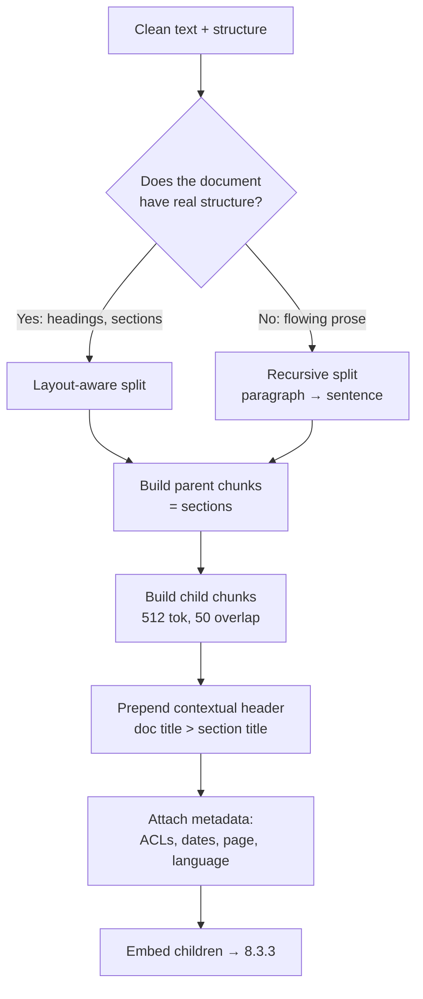
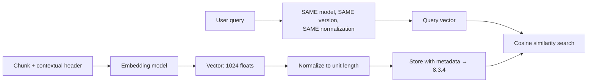
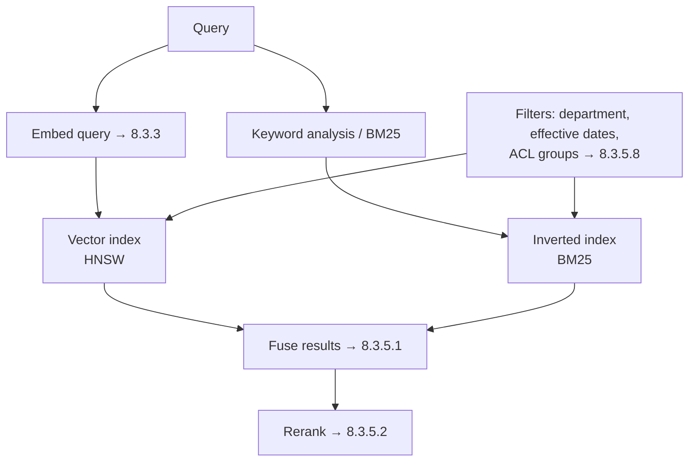
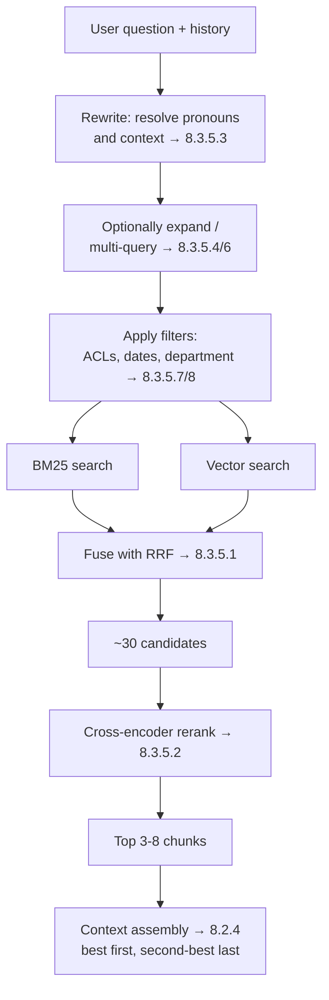
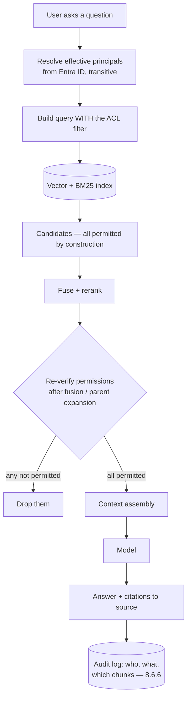
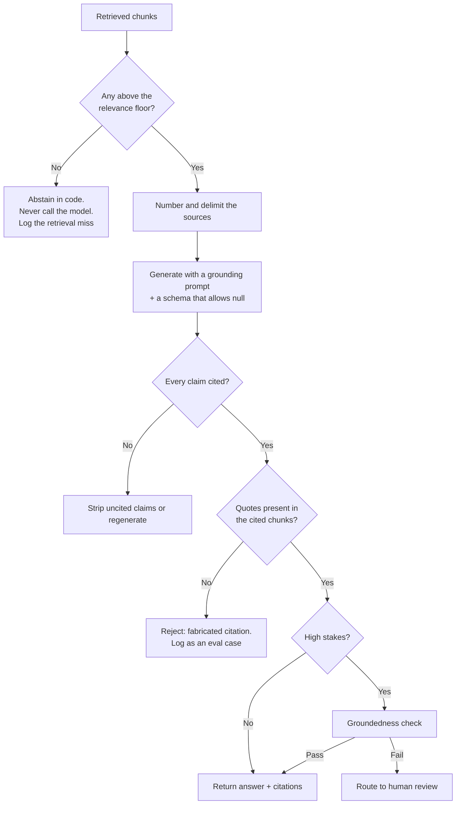
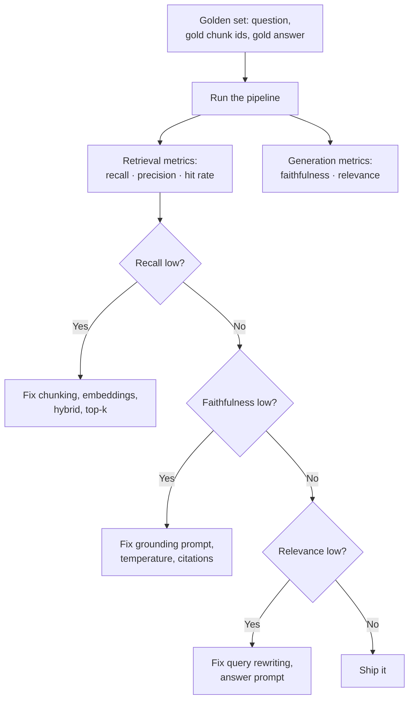

# Stage 3 — Retrieval-Augmented Generation (8.3)

*Two layers: **Part A** is the build narrative. **Part B** is the complete reference. **Part C**
assembles it. Each reference entry links back to the build step that raised it.*

**Where we are:** Stage 1 gave us a reliable model. Stage 2 gave us a managed context window
with a slot labelled "retrieved documents" that is still empty. This stage fills it — and it is
the largest stage in the whole build, because retrieval is where an LLM stops being a clever
autocomplete and starts being useful to an organisation.

*Order note: the topics appear here in pipeline order, not numeric order — 8.3.5.8 (security
trimming) sits immediately after 8.3.5 because it is a property of retrieval, and 8.3.9 /
8.3.10 (lifecycle, caching) come before 8.3.7 / 8.3.8 because the index must be honest and fast
before advanced techniques or evaluation are worth discussing. The numbers themselves never
change.*

---

# Part A — THE BUILD: Stage 3

## Step 1. We need our own documents in the system

8.1.5 settled the argument: knowledge that changes goes in retrieval, not in weights. So we
need every HR policy, circular and procedure — currently spread across SharePoint, a file
share, and an old document management system — pulled in, kept current, and made searchable.

"Kept current" is the hard half. A one-off load is a demo. A pipeline that notices a policy was
updated on Sunday and reflects it on Monday is a system.

> **→ [8.3.1 Ingestion](#831-ingestion)** — connectors, incremental sync, change detection

## Step 2. Half of them are scans, not documents

A third of the corpus is scanned PDFs — signed circulars, stamped forms, photographed pages.
There is no text in them at all, only pixels. And several of the most-asked-about policies are
in tables, where reading order determines whether the extracted text means anything.

> **→ [8.3.1.3 Document processing](#8313-document-processing)** — OCR, Document Intelligence, tables, images

## Step 3. And half of *those* are in Arabic

Arabic OCR is materially harder than English: cursive script, contextual letter forms,
diacritics, and right-to-left flow that many extraction tools mangle into reversed strings.
Several documents are bilingual, with Arabic and English in parallel columns.

> **→ [8.3.1.4 Arabic document handling](#8314-arabic-document-handling)**

## Step 4. A 40-page policy will not fit, and should not

We have clean text. A single policy is 26,000 tokens (8.1.1). We cannot put it in the prompt on
every question, and we should not — the answer usually lives in one paragraph, and the other
39 pages are cost and dilution.

So we split. And *how* we split turns out to determine the ceiling on the whole system's
quality, because you cannot retrieve well from badly-cut chunks.

> **→ [8.3.2 Chunking](#832-chunking)** — fixed, recursive, semantic, layout-aware; size, overlap, parent-child, metadata

## Step 5. Keyword search doesn't find it

Someone asks about "leave". The policy is titled *Annual Entitlement Framework* and never uses
the word. Keyword search returns nothing.

We need to search by **meaning**, which means turning every chunk into a vector (8.1.1) and
comparing directions rather than words. And because our corpus is bilingual, the embedding
model must place the Arabic and English versions of the same idea near each other.

> **→ [8.3.3 Embeddings](#833-embeddings)** — model choice, dimensions, normalization, multilingual, Arabic, re-embedding, cost

## Step 6. Where do 400,000 vectors live?

We have 400,000 chunks, each a vector of 1,024 floats, and we need the nearest few in under
100 milliseconds — while filtering by department, document type and, crucially, who is allowed
to see them.

> **→ [8.3.4 Vector stores](#834-vector-stores)** — Azure AI Search, pgvector, HNSW/IVFFlat, filters, hybrid indexes, scale, refresh

## Step 7. Semantic search alone is not enough either

Vector search finds the *Annual Entitlement Framework* beautifully. It also fails on
`Circular 2024/17` — an exact identifier where meaning is irrelevant and characters are
everything. And when someone asks a vague question, the top result is often merely
topical rather than actually answering.

Two fixes, and they are different: combine lexical and semantic search, then re-score the
combined candidates with something more accurate than a vector distance.

> **→ [8.3.5 Retrieval](#835-retrieval)** — hybrid search, reranking, query rewriting, expansion, HyDE, multi-query, metadata filtering

## Step 8. Ali just retrieved the CEO's salary

Our retriever is working perfectly, and that is the problem. The compensation document is
semantically an excellent match for Ali's question about pay scales, so it was retrieved, put
in the context window, and summarised back to him.

Nothing was hacked. The system did exactly what it was built to do. We simply never told it
that *who is asking* changes *what may be found*.

**This is the single most important topic in this file, and the first thing a
government panel will ask about.**

> **→ [8.3.5.8 Security trimming / permission-aware retrieval](#8358-security-trimming--permission-aware-retrieval)**

## Step 9. It still invents things, just more convincingly now

With documents in context, the assistant's answers *sound* sourced. Some of them are not — it
blends a retrieved fact with a remembered one, or cites a section that exists in a different
document. Retrieval reduced hallucination (8.1.7); it did not eliminate it.

> **→ [8.3.6 Generation](#836-generation)** — grounding prompts, citations, "I don't know", answer verification

## Step 10. A policy was withdrawn last month and it is still answering from it

Someone deleted the document from SharePoint. The chunks are still in our index, still
retrievable, still being cited as current policy. And when the data protection officer asks
whether we can delete an individual's data on request, we discover we have no mechanism at all.

> **→ [8.3.9 Index lifecycle](#839-index-lifecycle--deletions-freshness-right-to-erasure-re-index-strategy)** `+`

## Step 11. The same forty questions, two hundred times a day

Traffic analysis shows the top forty questions account for over half of all volume, and each
one runs a full retrieve → rerank → generate cycle every time.

> **→ [8.3.10 Retrieval caching](#8310-retrieval-caching)** `+`

## Step 12. Some questions don't fit the pattern

*"How does the new remote-work circular change the old attendance policy?"* — spans two
documents and requires comparison. *"How many staff took more than 20 days last year?"* — the
answer is not in any document; it is in a database. *"Who approves an exception to clause 7?"*
— requires following a chain of references.

> **→ [8.3.7 Advanced RAG](#837-advanced-rag)** — GraphRAG, agentic RAG, contextual retrieval, multi-hop, Table RAG, SQL RAG

## Step 13. How do we actually know any of this works?

Everything above was a design decision made on judgement. Chunk size, overlap, top-k, hybrid
weighting, reranking, which embedding model. Each one could be wrong, and "it seems better" is
not an engineering statement.

> **→ [8.3.8 RAG evaluation](#838-rag-evaluation)** — groundedness, faithfulness, relevance, context precision/recall, hit rate, RAGAS, Azure AI Evaluation SDK
> **→ [8.3.8.10 Building the golden set](#83810-building-the-golden-question-set)** `+`

**End of Stage 3.** The assistant now answers from our real, current, permission-filtered
documents, with citations, and we can measure whether it is getting better. It still cannot
*do* anything. That is Stage 4.

---

# Part B — THE REFERENCE

## 8.3.1 Ingestion
> **In the build:** Stage 3, Steps 1–3 — *"we need our documents, half are scans, half of those are Arabic."*

### 8.3.1.1 Data connectors  `[WORKING]`

**Definition** — The components that pull content out of source systems and into the pipeline,
preserving not just text but the metadata that later becomes filters and permissions.

**Example**
```
SharePoint Online  → Graph API      → doc, ACLs, modified date, site, library
Network file share → SMB crawl      → doc, NTFS ACLs, path, modified date
Legacy DMS         → vendor API/DB  → doc, department, classification
Confluence / wiki  → REST API       → page, space permissions, version
```
The metadata is not a nice-to-have. `ACLs` becomes 8.3.5.8, `modified date` becomes 8.3.9,
`department` becomes a retrieval filter, and `classification` becomes a DLP control (8.6.13).
**Metadata you fail to capture at ingestion cannot be reconstructed later** — you would have to
re-crawl the entire corpus.

**Where it fits** — KNOWLEDGE layer, step 1. In: source systems. Out: raw documents + metadata.

**Library**
Azure AI Search **indexers** (built-in SharePoint / Blob / SQL connectors) · Microsoft Graph
SDK · LlamaIndex readers · LangChain document loaders · Unstructured.io · Azure Data Factory
for scheduled bulk movement.

**Used when** — always. The only question is build-vs-buy: a managed indexer is faster to
stand up; a custom connector gives control over permissions and change detection, which usually
matters more in an enterprise.

**Fails when**
- Permissions are not captured, making 8.3.5.8 impossible without a full re-crawl.
- The connector runs as a service account with broad read access — the classic finding, because
  it means the *index* now contains everything even if retrieval filters later.
- Source throttling (Graph API limits) is not handled, so large crawls fail halfway.
- Deleted and moved documents are not detected (→ 8.3.9).

### 8.3.1.2 Incremental sync & change detection  `[WORKING]`

**Definition** — Processing only what changed since the last run, rather than re-ingesting
everything. The difference between a pipeline that runs nightly in 20 minutes and one that
takes 14 hours and gets switched off.

**Example**
```python
# Three mechanisms, in descending order of preference:

# 1. CHANGE FEED / DELTA QUERY — the source tells you what changed. Best.
delta = graph.get(f"/sites/{site}/drive/root/delta?token={saved_token}")
for item in delta["value"]:
    if item.get("deleted"):
        remove_from_index(item["id"])      # deletions matter as much as edits (8.3.9)
    else:
        reindex(item)
save_token(delta["@odata.deltaLink"])       # resume point for the next run

# 2. TIMESTAMP WATERMARK — poll for modified > last_run. Simple, misses deletions.
# 3. CONTENT HASH — hash each document, compare. Catches everything, but you must
#    still READ everything, so it saves embedding cost, not crawl cost.
```

**Where it fits** — KNOWLEDGE layer, wrapping step 1. Determines freshness, which is a
user-visible property: "the assistant is quoting last month's policy" is a freshness bug.

**Library** — Microsoft Graph delta queries · Azure AI Search indexer change-tracking
policies · SQL change tracking / CDC · your own watermark table.

**Used when** — any corpus that changes, which is all of them.

**Fails when**
- Only additions and edits are handled, never deletions — the most common gap, and it is a
  compliance problem, not just a quality one (8.3.9).
- The watermark advances even when processing failed, so documents are silently skipped
  forever.
- Re-embedding everything on every run — correct, and the embedding bill is 50× what it needs
  to be (8.3.3.7).
- No dead-letter queue, so one malformed document stops the whole crawl.

### 8.3.1.3 Document processing  `[WORKING]`

**Definition** — Turning a file into clean text plus structure: OCR for images, layout analysis
for reading order, table extraction, and figure handling.

**Example**
```
Native PDF        → text extraction preserving reading order      (pypdf, PyMuPDF)
Scanned PDF/image → OCR                                           (Document Intelligence)
Word / PowerPoint → text + heading hierarchy                      (python-docx)
Excel / CSV       → treat as data, not prose (→ 8.3.7.6)
Tables in PDFs    → structured extraction, NOT flattened text
Figures/diagrams  → caption, or a multimodal description (8.1.11)
```

**The table problem, concretely** — it is worth seeing why this matters:
```
❌ Naive text extraction of a leave-entitlement table:
   "Grade Days A 22 B 30 C 35"
   → the model cannot tell which number belongs to which grade

✅ Structure-preserving extraction:
   | Grade | Annual leave days |
   | A     | 22                |
   | B     | 30                |
   | C     | 35                |
   → unambiguous, and survives chunking
```
Roughly the most common silent quality failure in enterprise RAG: entitlement tables flattened
into meaningless token soup, producing confidently wrong answers about numbers.

**Where it fits** — KNOWLEDGE layer, step 2. In: raw files. Out: clean text + structure +
per-element metadata (page number, section, bounding box — which later powers citations, 8.3.6.2).

**Library**
**Azure AI Document Intelligence** (layout, tables, key-value, handwriting, Arabic support) ·
AWS Textract · `pypdf` / `pdfplumber` / `PyMuPDF` · `python-docx` · Tesseract / PaddleOCR ·
Unstructured.io · multimodal LLM as a fallback for unusual layouts (8.1.11).

**Used when** — always, and the effort scales with how messy the corpus is. Budget more time
here than feels reasonable: extraction quality sets a hard ceiling on retrieval quality that no
amount of clever chunking or reranking can lift.

**Fails when**
- Tables flattened into prose (above).
- Multi-column layouts read straight across, interleaving two unrelated columns.
- Headers, footers and page numbers left in, polluting every chunk.
- No page/section metadata captured, so citations cannot point anywhere precise.
- OCR confidence scores discarded, so you cannot flag low-quality extractions for review.

### 8.3.1.4 Arabic document handling  `[WORKING]`
> *Directly relevant to any UAE or wider GCC deployment; usually the difference between a demo and a system that serves everybody.*

**Definition** — The additional handling Arabic content requires at every stage: OCR, text
extraction, direction, normalization, and bilingual document structure.

**The specific problems, and what each one does to you:**

| Problem | What happens | Handling |
|---|---|---|
| **Cursive, context-dependent letterforms** | Arabic letters change shape by position; naive OCR accuracy drops sharply | Use an OCR engine with explicit Arabic training — Document Intelligence, or PaddleOCR's Arabic models |
| **RTL flow** | Extractors emit reversed or interleaved strings, especially mixed with Latin text or digits | Handle bidirectional text properly; verify extracted text renders correctly before indexing |
| **Diacritics (tashkeel)** | The same word appears with and without marks and fails to match | Normalize: strip tashkeel, unify alef forms (أ إ آ → ا), unify ya/alef maqsura, unify ta marbuta |
| **Bilingual parallel columns** | Two-column Arabic/English documents interleave into nonsense | Layout-aware extraction (8.3.1.3), then split by language before chunking |
| **Tokenizer inefficiency** | Arabic consumes ~2–3× the tokens of English for the same meaning (8.1.1) | Budget accordingly; chunk size in *tokens* not characters |
| **Embedding quality** | Many embedding models are markedly weaker on Arabic | Choose a genuinely multilingual model and **test it on your own Arabic corpus** (8.3.3.4) |
| **Mixed-language queries** | Arabic question, English document (or vice versa) | Cross-lingual embeddings, or index both and search both |

**Example**
```python
import re
def normalize_arabic(text: str) -> str:
    text = re.sub(r'[ً-ْ]', '', text)      # strip tashkeel (diacritics)
    text = re.sub(r'[إأآا]', 'ا', text)               # unify alef forms
    text = text.replace('ى', 'ي').replace('ة', 'ه')   # unify ya / ta marbuta
    return re.sub(r'\s+', ' ', text).strip()
# Apply the SAME normalization to documents at index time AND to queries at
# search time. Applying it to only one side is worse than applying it to neither.
```

**Used when** — any corpus or user base including Arabic. In a UAE government context this is
not an enhancement; official documents are frequently Arabic-first with English as the
translation.

**Fails when**
- English-tuned OCR used on Arabic scans — quality is poor and nobody notices until an Arabic
  speaker tests it.
- Normalization applied at index time but not query time (or vice versa).
- Chunk sizes tuned on English and applied to Arabic, so Arabic chunks hold ~40% of the content.
- Retrieval quality is only ever evaluated in English — so the golden set (8.3.8.10) must be
  bilingual, or you are measuring half your service.

---

## 8.3.2 Chunking
> **In the build:** Stage 3, Step 4 — *"a 40-page policy will not fit, and should not."*

### 1. Definition

```
  ONE DOCUMENT (40 pages, ~26,000 tokens) — too big to send, and mostly irrelevant
  ════════════════════════════════════════════════════════════════════════════════
                                      │
                    ┌─────────────────┴─────────────────┐
                    │  WHERE DO YOU CUT?                │
                    └─────────────────┬─────────────────┘
       ┌──────────────┬───────────────┼───────────────┬──────────────┐
       ▼              ▼               ▼               ▼              ▼
   ┌────────┐   ┌───────────┐   ┌──────────┐   ┌─────────────┐
   │ FIXED  │   │ RECURSIVE │   │ SEMANTIC │   │LAYOUT-AWARE │
   │ every  │   │ para →    │   │ where    │   │ on the doc's│
   │ N chars│   │ sent →    │   │ meaning  │   │ OWN headings│
   │        │   │ word      │   │ shifts   │   │ & sections  │
   └────┬───┘   └─────┬─────┘   └────┬─────┘   └──────┬──────┘
        │             │              │                │
     baseline      default        costly           BEST for
     only         + fallback     (embeds every     policies,
                                  sentence)        circulars

                                      │
                   PARENT-CHILD resolves the size trade-off
                                      │
   ┌─ PARENT: Section 4.2 in full (1,400 tok) ──── what the MODEL receives ──┐
   │   child 1: the lead-in sentence        ─┐                              │
   │   child 2: the grade table             ─┼─ embedded & indexed (512 tok) │
   │   child 3: the notice requirement      ─┘   what SEARCH matches         │
   └──────────────────────────────────────────────────────────────────────────┘
        precision of small chunks  +  context of large ones,  for one extra lookup

  ⚠ The chunk IS the unit of retrieval. Nothing downstream — not the reranker,
    not the model — can recover information that was cut in half here.
```

**Plain English:** Cutting documents into pieces small enough to retrieve precisely and put in
a prompt, without cutting through the middle of an idea.

**Precisely:** Chunking splits documents into retrievable units. Each chunk is embedded and
indexed independently, so the chunk **is** the unit of retrieval — the model will see the chunk,
not the document. Chunking strategy determines the ceiling on retrieval quality, because no
retriever, reranker or model can recover information that was cut in half.

### 2. Scenario

Our leave policy contains:

```
Section 4.2 Annual Leave
Employees are entitled to annual leave according to grade, as set out below.

  Grade A — 22 days    Grade B — 30 days    Grade C — 35 days

Leave must be requested at least 14 days in advance.
```

A naive fixed-size split lands the boundary between "according to grade, as set out below" and
the table. Now there are two chunks: one saying entitlement depends on grade but not what the
values are, and one containing three numbers with no idea what they mean.

Ask "how many days does a Grade B employee get?" and retrieval returns chunk one — semantically
the best match, since it contains the words "annual leave" and "grade" — and the model, having
been given text that promises a table it cannot see, either abstains or invents.

**The retrieval was correct. The chunking made the correct answer unreachable.**

### 3. Example

The four strategies on the same document:

```
FIXED (500 characters, no respect for structure)
  ✂ "...entitled to annual leave according to grade, as set" | "out below. Grade A — 22..."
  Fast, trivial, and cuts mid-sentence. Use only as a baseline.

RECURSIVE (split on paragraphs → sentences → words, until it fits)
  ✂ "Section 4.2 Annual Leave\nEmployees are entitled...as set out below." | "Grade A — 22..."
  Respects natural boundaries. The sensible default. Still separated the table from its lead-in.

SEMANTIC (split where meaning shifts, measured by embedding distance between sentences)
  ✂ [whole of 4.2 as one chunk] | [Section 4.3 begins]
  Keeps the idea intact. Costs an embedding pass over every sentence to compute.

LAYOUT-AWARE (split on the document's own structure: headings, sections, table boundaries)
  ✂ [Section 4.2 heading + body + full table] | [Section 4.3 heading + body]
  Best for structured corpora — which policies, circulars and contracts always are.
```

For a government policy corpus, layout-aware is usually the correct answer and recursive is the
correct fallback. Fixed is a baseline you measure against, not a strategy you ship.

### 4. How it works

**Size and overlap — the central trade-off:**

```
SMALL CHUNKS (200-300 tokens)
  + precise retrieval — the match is the answer, little dilution
  + more chunks fit in the context budget
  - context is lost; "it" and "the above" refer to something not present
  - one idea gets split across several chunks

LARGE CHUNKS (1,000-1,500 tokens)
  + self-contained; the surrounding context comes along
  - imprecise retrieval — the embedding averages several topics into one vector
  - a large chunk retrieved for one sentence wastes the rest of the budget

OVERLAP (10-20% of chunk size)
  + an idea crossing a boundary survives in at least one chunk intact
  - duplicate content in the index: storage, embedding cost, and near-duplicate results
```

Practical starting point: **512 tokens with ~50 tokens of overlap**, split recursively on
structure, then tuned against a golden set (8.3.8.10). Treat those numbers as a starting
hypothesis, not a recommendation — the right values depend on your documents, and the only way
to know is to measure.

**Parent-child (small-to-big) retrieval — the technique that resolves the trade-off.** Search
over small, precise chunks, but send the *larger* parent to the model:

```
   ┌─ PARENT: Section 4.2 in full (1,400 tokens) ──────────────┐
   │  child 1: the lead-in sentence      (embedded, indexed)   │
   │  child 2: the grade table           (embedded, indexed)   │
   │  child 3: the notice requirement    (embedded, indexed)   │
   └───────────────────────────────────────────────────────────┘

   Query "Grade B days" → matches child 2 precisely
                        → but the MODEL receives the whole parent
   Precision of small chunks, context of large ones.
```
This is the single highest-value chunking technique, and it costs one extra lookup.

**Metadata enrichment.** Every chunk carries fields that later become filters, citations and
security controls:

```json
{
  "chunk_id": "hr-policy-2026::s4.2::c2",
  "text": "Grade A — 22 days | Grade B — 30 days | Grade C — 35 days",
  "parent_id": "hr-policy-2026::s4.2",
  "document_id": "hr-policy-2026",
  "document_title": "HR Policy Manual 2026",
  "section": "4.2 Annual Leave",
  "page": 14,
  "language": "en",
  "effective_from": "2026-01-01",
  "superseded": false,
  "acl_groups": ["all-staff"],
  "classification": "internal",
  "source_url": "https://sharepoint/.../HR-Policy-2026.pdf#page=14",
  "content_hash": "sha256:..."
}
```
Every field earns its place: `acl_groups` → 8.3.5.8 · `superseded`/`effective_from` → 8.3.9 ·
`section`/`page`/`source_url` → citations, 8.3.6.2 · `language` → 8.3.1.4 · `classification` →
8.6.13 · `content_hash` → change detection, 8.3.1.2.

**Contextual chunk headers** — cheap and unreasonably effective. Prefix each chunk with its
document and section title before embedding:
```
"HR Policy Manual 2026 > Section 4.2 Annual Leave >
 Grade A — 22 days | Grade B — 30 days | Grade C — 35 days"
```
The orphaned table now embeds with the meaning of its heading attached, and retrieval improves
noticeably for a few tokens per chunk.



### 5. Where it fits

```
   ingest → process → ▶ CHUNK ◀ → embed → index → retrieve → rerank → context
                       you are here
```
**In:** clean text with structure. **Out:** retrievable units with metadata, ready to embed.

Downstream everything depends on this: embeddings represent chunks, retrieval returns chunks,
the model reads chunks, citations point at chunks. Get it wrong and every later stage inherits
the damage.

### 6. Libraries & code

| Job | Python | .NET | JavaScript |
|---|---|---|---|
| Recursive splitting | `langchain_text_splitters` `RecursiveCharacterTextSplitter` | Semantic Kernel `TextChunker` | LangChain.js |
| Token-aware splitting | same, with `tiktoken` length function | `Microsoft.ML.Tokenizers` | `js-tiktoken` |
| Semantic chunking | `llama_index` `SemanticSplitterNodeParser` | — | — |
| Layout-aware | Unstructured.io, Document Intelligence output | — | — |
| Parent-child | `langchain` `ParentDocumentRetriever`, or your own | — | — |
| Managed | Azure AI Search **integrated vectorization** (built-in split skill) | same | same |

```python
from langchain_text_splitters import RecursiveCharacterTextSplitter
import tiktoken

enc = tiktoken.encoding_for_model("gpt-4o")

splitter = RecursiveCharacterTextSplitter(
    chunk_size=512,                       # measured in TOKENS, not characters —
    chunk_overlap=50,                     # critical for Arabic, where the
                                          # token:character ratio is very different (8.3.1.4)
    length_function=lambda t: len(enc.encode(t)),

    # Separators are tried IN ORDER. It only falls back to a cruder split when
    # a finer one cannot make the chunk fit — which is what makes it "recursive".
    separators=["\n## ", "\n### ", "\n\n", "\n", ". ", " ", ""],
    #            ↑ headings first: never split across a section boundary if avoidable
)

def chunk_document(doc: dict) -> list[dict]:
    chunks = []
    for section in doc["sections"]:                 # layout-aware outer loop:
                                                    # the PARENT is the section
        parent_id = f"{doc['id']}::{section['id']}"

        for i, child_text in enumerate(splitter.split_text(section["text"])):
            # Contextual header: cheap, and it rescues orphaned tables and lists
            # by carrying their heading's meaning into the embedding.
            embedded_text = (f"{doc['title']} > {section['title']}\n\n{child_text}")

            chunks.append({
                "chunk_id":  f"{parent_id}::c{i}",
                "text":      child_text,        # what the MODEL sees
                "embed_text": embedded_text,    # what gets EMBEDDED — deliberately
                                                # different, and worth the extra field
                "parent_id": parent_id,         # what is actually SENT (parent-child)
                "document_id": doc["id"],
                "section":   section["title"],
                "page":      section.get("page"),
                "language":  section.get("language", "en"),
                "acl_groups": doc["acl_groups"],   # captured at ingest — see 8.3.5.8
                "effective_from": doc["effective_from"],
                "superseded": False,
                "source_url": f"{doc['url']}#page={section.get('page', 1)}",
            })
    return chunks
```

### 7. Knobs & real numbers

| Knob | Typical | Effect |
|---|---|---|
| Chunk size | 256–1,024 tokens; **512 a common start** | Smaller = precise but context-poor |
| Overlap | 10–20% (≈50 tokens at 512) | Insurance against boundary cuts; costs duplication |
| Parent size | 1,000–2,000 tokens, or a whole section | What the model actually receives |
| Contextual header | 10–30 tokens per chunk | Consistently worth it |
| Chunks per document | 5–100 | Depends on document size |
| Arabic chunk size | same *token* count, ~40% of the English text | Never size in characters |
| Table handling | keep whole, never split | Split tables are worse than no table |

### 8. Perspectives grid

| Lens | What matters here |
|---|---|
| **Theory** | The chunk is the atomic unit of retrieval. A single embedding vector must represent the whole chunk, so a chunk containing three topics has a vector representing none of them well. |
| **Engineering** | Split on structure, not on character counts. Separate `embed_text` from `text`. Use parent-child. Never split a table. Attach metadata at chunk time — it cannot be added later without a full re-index. |
| **Operations** | Chunking changes require a **full re-index**, which is expensive and slow. Get metadata right the first time; you will change chunk size more than once, and each change is a migration (8.3.9). |
| **Cost** | Overlap duplicates content: 20% overlap is ~20% more vectors to embed and store. Larger chunks mean fewer vectors but more tokens per retrieved result — the cost moves from indexing to inference. |
| **Security** | ACLs must be attached at chunk level and must match the source document's permissions *at the time of retrieval*. Chunk-level ACLs that drift from source ACLs are how permission-trimming quietly fails (8.3.5.8). |
| **Decision** | Structured corpus → layout-aware. Prose → recursive. Always parent-child if you can afford the extra lookup. Then stop guessing and tune against the golden set. |

### 9. Trade-offs & failure modes

- **Splitting a table.** The most common silent quality failure in enterprise RAG — numbers
  divorced from their labels, producing confidently wrong answers.
- **Sizing in characters on a multilingual corpus.** Arabic chunks end up holding a fraction of
  the content of English ones.
- **Chunks too small.** "It must be requested 14 days in advance" — what must?
- **Chunks too large.** The embedding averages several topics; retrieval becomes vague.
- **No overlap on flowing prose.** Ideas that straddle a boundary are unreachable.
- **Too much overlap.** Near-duplicate results crowd out genuinely different content in top-k.
- **Metadata added later.** It cannot be — you must re-crawl and re-index.
- **Tuning chunking by intuition.** It is the most-tuned and least-measured parameter in RAG.
  Without a golden set you are guessing (8.3.8.10).

---

## 8.3.3 Embeddings
> **In the build:** Stage 3, Step 5 — *"someone asks about 'leave'; the policy is called 'Annual Entitlement Framework'."*

### 1. Definition

```
  INDEX TIME                                      QUERY TIME
  ──────────                                      ──────────
  "Grade B — 30 days"                             "how much leave do I get?"
          │                                                │
          ▼                                                ▼
  ┌───────────────────┐                          ┌───────────────────┐
  │ EMBEDDING MODEL   │  ◄── MUST BE THE ──►     │ EMBEDDING MODEL   │
  │ model + version   │      SAME THREE          │ model + version   │
  │ + dimensions      │                          │ + dimensions      │
  └─────────┬─────────┘                          └─────────┬─────────┘
            ▼                                              ▼
     [0.021, -0.056, ...]                          [0.019, -0.051, ...]
      1,024 floats                                  1,024 floats
            │                                              │
            ▼  normalize to unit length                     ▼
      stored beside the chunk  ─────► cosine similarity ◄───┘
                                     (= dot product, once normalized)

   "annual leave entitlement" ↔ "vacation days policy"      0.87  ✓
   "annual leave entitlement" ↔ "استحقاق الإجازة السنوية"     0.81  ✓ cross-lingual
   "annual leave entitlement" ↔ "fire evacuation procedure"  0.11  ✓ correctly distant

  ⚠ Index with model-v1, query with model-v2 → same SHAPE, different SPACE.
    Similarity scores become meaningless. NOTHING errors. Retrieval goes random.
```

**Plain English:** Turning a piece of text into a list of numbers that represents its meaning,
so that two texts saying the same thing in different words end up with similar numbers.

**Precisely:** An embedding model maps text to a fixed-length dense vector in a space where
semantic similarity corresponds to geometric proximity, measured by cosine similarity. Unlike
keyword matching, which compares tokens, embeddings compare *meaning* — which is what makes
"annual leave" retrieve a document titled "Entitlement Framework". Introduced in 8.1.1; this
section is the production detail.

### 2. Scenario

Three requirements land at once on our bilingual corpus:

1. *"leave"* must find *"Annual Entitlement Framework"* — semantic matching.
2. An Arabic question must find the English policy, and vice versa — cross-lingual matching.
3. 400,000 chunks must be embedded within a sensible budget, and re-embedded when we upgrade
   the model, which is a migration nobody has scheduled.

The third one is the one that gets forgotten, and it is the one that hurts.

### 3. Example

```python
"annual leave entitlement"        → [0.021, -0.056, 0.112, ...]   (1024 numbers)
"vacation days policy"            → [0.019, -0.051, 0.108, ...]   similarity 0.87  ✓
"استحقاق الإجازة السنوية"          → [0.023, -0.049, 0.115, ...]   similarity 0.81  ✓ cross-lingual
"fire evacuation procedure"       → [-0.08,  0.140, -0.03, ...]   similarity 0.11  ✓ correctly distant
```

The middle line is the whole reason to care about multilingual models: the Arabic phrase and the
English phrase land near each other **without translation**, because a genuinely multilingual
model was trained to place meaning, not words.

And the failure that makes this section matter:
```
Index built with model-v1 (3072 dims) → 400,000 vectors stored
Query embedded with model-v2          → 3072 dims, same shape, DIFFERENT SPACE
Result: similarity scores are meaningless. Nothing errors. Retrieval quietly becomes random.
```

### 4. How it works

**Choosing a model** — four criteria, in this order:

| Criterion | Why it matters |
|---|---|
| **Language coverage** | A model weak on Arabic makes half your corpus unsearchable. Test on *your* documents, never on a leaderboard |
| **Domain fit** | General models handle policy prose well; specialised domains may need a domain-tuned model |
| **Dimensionality** | Directly drives storage and search cost |
| **Where it runs** | A hosted API sends your text to the provider — which may fail a residency constraint (8.6.7.2). Open models can run in-country |

**Dimensionality.** More dimensions carry more nuance and cost more to store and search.
Storage is roughly `chunks × dimensions × 4 bytes`:

```
400,000 chunks × 3,072 dims × 4 bytes ≈ 4.9 GB
400,000 chunks × 1,024 dims × 4 bytes ≈ 1.6 GB     ← usually a small quality loss
400,000 chunks ×   256 dims × 4 bytes ≈ 0.4 GB     ← noticeable loss; test before adopting
```
Some models support **Matryoshka** truncation — trained so that the first N dimensions remain
usable on their own, which is why you can ask for 1,024 instead of 3,072 and lose little. This
only works on models built for it; naively truncating another model's vectors destroys them.

**Normalization.** Cosine similarity compares direction, not magnitude. Most modern embedding
APIs return vectors already normalized to unit length, which makes the dot product equal to the
cosine similarity — cheaper to compute. If you self-host, normalize explicitly, and **use the
same distance metric at index time and query time**. Mixing cosine and L2 is a subtle, silent
quality killer.

**Multilingual and Arabic.** A multilingual model places translations near each other in one
shared space. The practical guidance: verify the model's Arabic performance on your own data;
apply the same normalization (8.3.1.4) to documents and queries; consider indexing both the
Arabic and English versions of bilingual documents as separate chunks with a `language` field,
so you can filter or boost by query language.

**Re-embedding — the migration everyone forgets.** Vectors from different models, or the same
model at different dimensions or versions, are **not comparable**. Changing the embedding model
means re-embedding the entire corpus. That is a cost, a batch job, and a cutover:

```
1. Build a new index alongside the old one (never in place)
2. Embed everything with the new model
3. Evaluate both against the golden set (8.3.8) — confirm the new one is actually better
4. Swap the alias / connection string
5. Keep the old index until confidence is established, then delete
```
Pin the embedding model version explicitly, and store it in the index metadata. Then a
mismatch is detectable rather than silent.

**Cost.** Embeddings are cheap per token but you embed *everything*, twice over the lifetime
(initial load plus at least one model migration), and once per query:

```
Initial:  400,000 chunks × 400 tokens = 160M tokens.  At ~$0.02/1M ≈ $3.20   (one-off)
Queries:  220,000/month × 15 tokens   = 3.3M tokens.  ≈ $0.07/month          (negligible)
Re-embed: another $3.20 per migration.
```
The lesson is the reverse of what people expect: **embedding cost is trivial; the generation
cost it saves is not.** Do not over-optimise here. Do budget the *time* of a re-embed on a
large corpus.



### 5. Where it fits

```
   ingest → process → chunk → ▶ EMBED ◀ → index → retrieve → rerank → context
                               you are here
```
**In:** chunk text (with contextual header). **Out:** a normalized vector, stored beside the
chunk and its metadata. **Also at query time** — the identical model must embed the question.

### 6. Libraries & code

| Job | Python | .NET | JavaScript |
|---|---|---|---|
| Hosted embeddings | `openai`, `azure-ai-inference`, `cohere` | `Azure.AI.OpenAI` | `openai` |
| Local / open models | `sentence-transformers`, `transformers` | ONNX Runtime | `transformers.js` |
| Integrated in the index | Azure AI Search integrated vectorization | same | same |
| Batch pipelines | `llama_index`, `langchain` | Semantic Kernel | LangChain.js |

```python
from openai import OpenAI
import numpy as np

client = OpenAI()
EMBED_MODEL = "text-embedding-3-large"   # PIN this. Store it in the index metadata.
EMBED_DIMS  = 1024                        # PIN this too. Both must match at query time.

def embed_batch(texts: list[str]) -> list[list[float]]:
    """
    Batch aggressively. Per-request overhead dominates for short texts, and
    embedding 400k chunks one at a time takes days instead of hours.
    """
    out = []
    for i in range(0, len(texts), 256):          # batch size: tune to the API limit
        resp = client.embeddings.create(
            model=EMBED_MODEL,
            input=texts[i:i + 256],
            dimensions=EMBED_DIMS,               # Matryoshka truncation: 3072 -> 1024.
                                                 # Only valid on models trained for it.
        )
        out.extend(d.embedding for d in resp.data)
    return out


def embed_query(question: str) -> list[float]:
    # The query MUST use the same model, version and dimensions as the index.
    # A mismatch produces no error — just silently meaningless similarity scores,
    # which is the worst possible failure mode.
    return client.embeddings.create(
        model=EMBED_MODEL, input=[question], dimensions=EMBED_DIMS
    ).data[0].embedding


def cosine(a, b) -> float:
    a, b = np.array(a), np.array(b)
    return float(np.dot(a, b) / (np.linalg.norm(a) * np.linalg.norm(b)))
    # If your provider already normalizes, np.dot(a, b) alone is equivalent
    # and cheaper. Just be consistent — and use the same metric your index uses.


# ── Guard against the silent failure ─────────────────────────────────────
INDEX_META = {"embed_model": EMBED_MODEL, "dims": EMBED_DIMS, "version": "2026-08-01"}

def assert_compatible(index_meta: dict):
    if (index_meta["embed_model"], index_meta["dims"]) != (EMBED_MODEL, EMBED_DIMS):
        raise RuntimeError(
            f"Embedding mismatch: index built with {index_meta}, "
            f"querying with {EMBED_MODEL}/{EMBED_DIMS}. Retrieval would be meaningless."
        )
    # Cheap, and it converts a silent quality collapse into a loud startup failure.
```

### 7. Knobs & real numbers

| Knob | Typical | Notes |
|---|---|---|
| Dimensions | 768 / 1,024 / 1,536 / 3,072 | 1,024 is a common quality/cost balance |
| Storage | dims × 4 bytes per vector | 400k × 1,024 ≈ 1.6 GB |
| Max input per embedding | ~8,000 tokens | Far larger than any sensible chunk |
| Batch size | 100–500 texts | Tune to provider limits |
| Embedding cost | ~$0.02–0.13 per 1M tokens | Trivial relative to generation |
| Query embedding latency | 10–50 ms | Add it to your latency budget |
| Similarity threshold | 0.7–0.8 typical cut-off | **Calibrate on your data** — absolute values are not comparable across models |
| Re-embed 400k chunks | hours, a few dollars | The time matters more than the money |

### 8. Perspectives grid

| Lens | What matters here |
|---|---|
| **Theory** | Meaning becomes geometry. Similarity is direction, not magnitude — which is why normalization and a consistent metric matter. |
| **Engineering** | Pin model, version and dimensions, and store them in the index. Batch at load. Embed the contextual-header version, store the plain text. Assert compatibility at startup. |
| **Operations** | Changing the embedding model is a full corpus migration with a build-alongside-and-swap cutover. Never in place. Never without evaluating both. |
| **Cost** | Genuinely cheap — do not over-optimise. Storage and search cost scale with dimensions, so that is the knob worth tuning, not the embedding calls. |
| **Security** | A hosted embedding API receives the full text of every document you index — for a confidential corpus that is an egress decision requiring the same scrutiny as generation (8.6.7). Vectors are also not anonymous: embedding-inversion research shows meaningful text can be recovered from them, so treat the vector store as holding the source data (8.6.1.8). |
| **Decision** | Multilingual if any part of your corpus or audience is non-English, verified on your own data. 1,024 dimensions as a default. Same model everywhere, pinned. |

### 9. Trade-offs & failure modes

- **Query and index embedded with different models or dimensions.** No error, meaningless
  results. Assert at startup.
- **Different distance metric at index and query time.** The same silent failure.
- **Changing the embedding model without re-embedding.** Retrieval becomes random overnight.
- **Choosing a model on a leaderboard.** Benchmarks are mostly English; test on your corpus.
- **Ignoring Arabic performance.** Half the service quietly does not work.
- **Normalization applied to documents but not queries** (or vice versa) — see 8.3.1.4.
- **Treating similarity thresholds as portable.** 0.75 means different things in different
  models. Calibrate against your own golden set.
- **Assuming vectors are safe to store loosely** because "they're just numbers". They are
  derived data of the source text, and should be protected like it.

---

## 8.3.4 Vector stores
> **In the build:** Stage 3, Step 6 — *"where do 400,000 vectors live, and how do we search them in under 100ms?"*

### 1. Definition

```
  400,000 vectors. Return the best 20 in under 100 ms — but ONLY the permitted ones.
  ┌────────────────────────────────────────────────────────────────────────────┐
  │  GEOMETRY                        │  ORDINARY DATABASE FILTERING            │
  │  approximate nearest neighbour   │  acl_groups · department · superseded   │
  │  (exact NN is linear = unusable) │  · effective_from · language            │
  └────────────────┬─────────────────┴──────────────────┬─────────────────────┘
                   └───────────  AT THE SAME TIME  ─────┘
                          = the entire engineering problem

   TWO WAYS TO COMBINE THEM, AND THEY ARE NOT EQUIVALENT
   ┌──────────────────────────────┐    ┌──────────────────────────────────────┐
   │ PRE-FILTER                   │    │ POST-FILTER                          │
   │ restrict the candidate set,  │    │ search everything, then drop what    │
   │ THEN search vectors in it    │    │ the user may not see                 │
   │ ✓ top-k of the PERMITTED set │    │ ✓ fast — uses the index as designed  │
   │ ✗ selective filter may force │    │ ✗ WRONG FOR SECURITY: restricted     │
   │   something near a full scan │    │   content was already read, ranked,  │
   │                              │    │   logged and cached                  │
   │  ★ the only acceptable mode  │    │                                      │
   │    for permissions (8.3.5.8) │    │                                      │
   └──────────────────────────────┘    └──────────────────────────────────────┘

   THE INDEX ITSELF                HNSW                    IVFFlat
                            layered proximity graph   clustered, probe nearest
   incremental inserts      handles them well         degrades (clusters fitted)
   needs training data      no                        YES — build after loading
   memory / recall          higher / higher           lower / good
                            ★ DEFAULT                 only if memory-constrained
```

**Plain English:** A database that can find the vectors closest to a query vector, fast, while
also filtering on ordinary fields like department or who is allowed to see the document.

**Precisely:** A vector store indexes high-dimensional vectors for **approximate nearest
neighbour (ANN)** search. Exact nearest-neighbour search is linear in corpus size and too slow
past a few thousand vectors, so production systems use index structures — most commonly HNSW —
that trade a small amount of recall for orders-of-magnitude speed. The essential production
requirement, beyond speed, is **filtered** search: vector similarity combined with structured
predicates, which is what makes permission trimming possible (8.3.5.8).

### 2. Scenario

400,000 chunks. A user asks a question. We must return the 20 best candidates in under 100
milliseconds — but only from documents in their department, only from policies currently in
force, and only those their security groups permit them to see.

Three of those four conditions are ordinary database filtering. One is geometry. Doing both
*at the same time*, correctly, is the entire engineering problem of this section.

### 3. Example

The two realistic choices for a Microsoft-centric enterprise:

```
AZURE AI SEARCH                            POSTGRESQL + pgvector
──────────────────────────────             ──────────────────────────────
Managed service                            Extension on a database you run
Built-in BM25 + vector + RRF fusion        Vector search; BM25 via tsvector, wired by you
Built-in semantic reranker                 Bring your own reranker
Built-in indexers (SharePoint, Blob)       Build your own ingestion
Security filters via OData $filter         Security filters via SQL WHERE
Scales by replicas and partitions          Scales as your Postgres does
Higher per-month cost                      Cheaper if you already run Postgres

Reach for it when: you want retrieval        Reach for it when: your data is already in
quality features out of the box, and         Postgres, you want one system, and you are
the corpus is enterprise content.            comfortable assembling hybrid search yourself.
```

For a government entity already on Azure with content in SharePoint, AI Search usually wins on
integration and on the reranker alone. For a team with strong Postgres skills and data already
there, pgvector is entirely credible and a lot cheaper.

### 4. How it works

**ANN index types — the two you must be able to compare:**

| | **HNSW** (Hierarchical Navigable Small World) | **IVFFlat** (Inverted File) |
|---|---|---|
| Structure | A layered proximity graph; search descends from coarse to fine | Vectors clustered; search probes the nearest clusters |
| Build time | Slower | Faster |
| Memory | Higher | Lower |
| Query speed | Very fast | Fast |
| Recall | Higher | Good, degrades if clusters are poorly chosen |
| Incremental inserts | Handles them well | Degrades — clusters were fitted to the original data |
| Needs training data | No | **Yes** — must be built after data is loaded |
| Default choice | **Yes, for most workloads** | Only when memory-constrained or the corpus is static |

The practical rule: **HNSW unless memory forces otherwise.** IVFFlat's need to be trained on
existing data makes it awkward for a corpus that grows continuously, which enterprise corpora
always do.

**HNSW parameters** you will be asked about:
- `m` — connections per node (typical 16–64). Higher = better recall, more memory.
- `ef_construction` — candidate list size at build time (typical 100–400). Higher = better
  index, slower build.
- `ef_search` — candidate list size at query time (typical 40–200). **The runtime
  recall/latency dial** — raise it when recall is poor, lower it when latency is.

**Filtered vector search — where the real subtlety lives.** There are two ways to combine a
filter with a vector search, and they behave very differently:

```
PRE-FILTER: restrict the candidate set first, then search vectors within it
  ✓ Correct results — you always get the top-k of the PERMITTED set
  ✗ Can be slow: the ANN graph is built over everything, so a very selective
    filter may force something closer to a brute-force scan

POST-FILTER: run the vector search, then drop results that fail the filter
  ✓ Fast — uses the index as designed
  ✗ WRONG for security. If the top 20 are all documents the user cannot see,
    you return zero results — or, worse, an implementation that "tops up" to
    k after filtering can behave unpredictably.
```

**For permissions, pre-filtering is the only acceptable answer** (8.3.5.8). Both Azure AI
Search and pgvector support genuine filtered search; know which mode your store uses and
verify it, because the difference is invisible until it is a data-leakage incident.

**Hybrid indexes.** Production retrieval needs both a vector index and a keyword (BM25) index
over the same documents, with results fused — covered in 8.3.5.1. Azure AI Search provides
both plus fusion natively; on Postgres you maintain a `tsvector` column alongside the vector
column and fuse in SQL or in application code.

**Scaling and refresh.** Vector indexes are memory-hungry and rebuild-expensive:
- Size the memory: roughly `vectors × dims × 4 bytes`, plus graph overhead for HNSW (often
  1.5–2× the raw vector size).
- Partition for corpus size, replicate for query throughput and availability.
- Inserts and updates are online; large-scale re-embedding is not (8.3.3, 8.3.9) — build a new
  index alongside and swap.
- Deletions must actually remove or hard-filter the vector, not merely mark it (8.3.9).



### 5. Where it fits

```
   ingest → process → chunk → embed → ▶ INDEX / STORE ◀ → retrieve → rerank → context
                                        you are here
```
**In:** vectors + text + metadata. **Out:** a searchable index that supports filtered ANN
search. **At query time:** the candidate set that everything downstream operates on.

### 6. Libraries & code

| Store | Python client | Notes |
|---|---|---|
| **Azure AI Search** | `azure-search-documents` | Managed; BM25 + vector + RRF + semantic reranker built in |
| **PostgreSQL pgvector** | `psycopg`, `pgvector`, SQLAlchemy | Extension; combine with `tsvector` for hybrid |
| Qdrant / Weaviate / Milvus | vendor clients | Purpose-built vector databases |
| Pinecone | `pinecone` | Fully managed, serverless |
| FAISS / Chroma | `faiss`, `chromadb` | In-process; prototyping, not multi-user production |

```python
# ── Azure AI Search: index definition (the shape is the lesson) ──────────
from azure.search.documents.indexes.models import (
    SearchIndex, SearchField, SearchFieldDataType,
    VectorSearch, HnswAlgorithmConfiguration, VectorSearchProfile,
)

index = SearchIndex(
    name="hr-policies",
    fields=[
        SearchField(name="chunk_id", type=SearchFieldDataType.String, key=True),

        # The text the model will read, and the text BM25 will search.
        SearchField(name="text", type=SearchFieldDataType.String,
                    searchable=True, analyzer_name="standard.lucene"),
        SearchField(name="text_ar", type=SearchFieldDataType.String,
                    searchable=True, analyzer_name="ar.microsoft"),
                    # A language-specific analyzer handles Arabic stemming and
                    # normalization for the KEYWORD half of hybrid search (8.3.1.4).

        # The vector.
        SearchField(name="vector", type="Collection(Edm.Single)",
                    searchable=True, vector_search_dimensions=1024,
                    vector_search_profile_name="hnsw-profile"),

        # FILTERABLE metadata. Every one of these is a retrieval control:
        SearchField(name="acl_groups", type="Collection(Edm.String)",
                    filterable=True),                    # ← security trimming (8.3.5.8)
        SearchField(name="department", type=SearchFieldDataType.String, filterable=True),
        SearchField(name="effective_from", type=SearchFieldDataType.DateTimeOffset,
                    filterable=True, sortable=True),     # ← freshness (8.3.9)
        SearchField(name="superseded", type=SearchFieldDataType.Boolean, filterable=True),
        SearchField(name="language", type=SearchFieldDataType.String, filterable=True),

        # RETRIEVABLE-only: returned with results, never searched. Powers citations.
        SearchField(name="source_url", type=SearchFieldDataType.String,
                    searchable=False, filterable=False),
        SearchField(name="page", type=SearchFieldDataType.Int32, searchable=False),
    ],
    vector_search=VectorSearch(
        algorithms=[HnswAlgorithmConfiguration(
            name="hnsw-config",
            parameters={"m": 16,                 # connections per node
                        "efConstruction": 400,   # build-time quality
                        "efSearch": 100,         # QUERY-TIME recall/latency dial
                        "metric": "cosine"},     # MUST match how you embedded (8.3.3)
        )],
        profiles=[VectorSearchProfile(name="hnsw-profile",
                                      algorithm_configuration_name="hnsw-config")],
    ),
)


# ── PostgreSQL + pgvector: the same idea in SQL ──────────────────────────
"""
CREATE EXTENSION IF NOT EXISTS vector;

CREATE TABLE chunks (
    chunk_id       TEXT PRIMARY KEY,
    document_id    TEXT NOT NULL,
    text           TEXT NOT NULL,
    embedding      vector(1024),                    -- pin the dimension
    acl_groups     TEXT[]        NOT NULL,          -- security trimming
    department     TEXT,
    effective_from DATE,
    superseded     BOOLEAN DEFAULT FALSE,
    tsv            tsvector GENERATED ALWAYS AS     -- the BM25 half of hybrid
                   (to_tsvector('english', text)) STORED
);

-- HNSW index. vector_cosine_ops MUST match the metric you use at query time.
CREATE INDEX ON chunks USING hnsw (embedding vector_cosine_ops)
    WITH (m = 16, ef_construction = 400);

-- Indexes that make the FILTER fast. Without these, a selective filter forces
-- a scan and your 100ms budget evaporates.
CREATE INDEX ON chunks USING gin (acl_groups);
CREATE INDEX ON chunks USING gin (tsv);
CREATE INDEX ON chunks (superseded, effective_from);

-- Query: filter and vector search TOGETHER, in one statement.
-- The WHERE clause is applied as a pre-filter, which is what makes this safe.
SELECT chunk_id, text, 1 - (embedding <=> $1) AS similarity
FROM   chunks
WHERE  acl_groups && $2::text[]       -- user's groups overlap the chunk's  ← MANDATORY
  AND  superseded = FALSE
  AND  effective_from <= CURRENT_DATE
ORDER  BY embedding <=> $1            -- <=> is cosine distance
LIMIT  20;
"""
```

### 7. Knobs & real numbers

| Knob | Typical | Effect |
|---|---|---|
| HNSW `m` | 16–64 | Recall vs memory |
| HNSW `ef_construction` | 100–400 | Index quality vs build time |
| HNSW `ef_search` | 40–200 | **Runtime recall vs latency** |
| Distance metric | cosine | Must match your embedding normalization |
| Memory | vectors × dims × 4 B × ~1.5–2 | 400k × 1,024 ≈ 1.6 GB raw, ~3 GB with graph |
| Query latency target | < 100 ms for top-20 | Before reranking |
| Candidates retrieved (`k`) | 20–50 | Then reranked down to 3–8 |
| Partitions / replicas | by size / by QPS | Partition for data, replicate for load |

### 8. Perspectives grid

| Lens | What matters here |
|---|---|
| **Theory** | Exact nearest-neighbour is linear and unusable at scale; ANN trades a little recall for enormous speed. HNSW is a navigable graph; IVFFlat is clustering. |
| **Engineering** | HNSW by default. Index every field you will filter on, or filtering becomes a scan. Pin the distance metric to match your embeddings. Separate searchable from retrievable fields. |
| **Operations** | Memory-bound. Build alongside and swap for any re-embed. Monitor query latency at p95 and recall against the golden set — recall degrades silently as the corpus grows. |
| **Cost** | Managed services bill on capacity units and replicas; self-hosted bills on memory. Dimensions are the biggest single lever (8.3.3). |
| **Security** | **Pre-filter, never post-filter, for permissions.** The vector store is the enforcement point, so it must hold current ACLs and support filtered search natively. Deleted content must be genuinely removed (8.3.9). Treat the store as holding the source text, because vectors are recoverable (8.6.1.8). |
| **Decision** | Already on Azure with SharePoint content → AI Search, for the indexers and the reranker. Already running Postgres with the data in it → pgvector. Purpose-built vector DBs when scale or vector-specific features dominate. |

### 9. Trade-offs & failure modes

- **Post-filtering for permissions.** The defining security failure of this section.
- **Filter fields not indexed.** A selective filter degrades into a full scan; latency collapses.
- **Distance metric mismatch** between index and query. Silent quality loss.
- **IVFFlat on a growing corpus.** Recall degrades as data diverges from the trained clusters.
- **Under-provisioned memory.** The index spills, latency becomes unpredictable.
- **`ef_search` left at the default** when recall is poor — the cheapest available fix, and
  routinely overlooked.
- **In-process stores (FAISS, Chroma) in production.** Fine for prototypes; no concurrency,
  durability or filtered security model.
- **Soft-deleting without filtering on the flag.** Withdrawn documents keep being retrieved.

---

## 8.3.5 Retrieval
> **In the build:** Stage 3, Step 7 — *"vector search alone misses `Circular 2024/17`."*

### 1. Definition

```
  RETRIEVAL IS A PIPELINE, NOT A LOOKUP

   question + history + WHO IS ASKING
            │
            ▼
   ┌──────────────────┐  "what about carry-over?" → "can unused annual leave be
   │ REWRITE / EXPAND │   carried over to the next year?"     [8.3.5.3/4/6]
   └────────┬─────────┘   raw follow-ups are meaningless standalone
            ▼
   ┌──────────────────────────────────────────┐
   │ FILTERS — applied INSIDE the query        │  acl_groups ∩ principals
   │ as a PRE-filter, never after   [8.3.5.8]  │  superseded = false
   └────────┬────────────────────────┬─────────┘
            ▼                        ▼
   ┌─────────────────┐      ┌──────────────────┐
   │ BM25 / lexical  │      │ VECTOR / semantic│   they fail in OPPOSITE
   │ ✓ Circular      │      │ ✓ "leave" →      │   directions — which is
   │   2024/17       │      │   "Entitlement   │   exactly why you need
   │ ✗ paraphrase    │      │    Framework"    │   both
   │ ✗ cross-lingual │      │ ✗ exact IDs      │
   └────────┬────────┘      └────────┬─────────┘
            └──────────┬─────────────┘
                       ▼
            ┌────────────────────┐   fuse by RANK, not score — BM25 scores and
            │ RRF FUSION         │   cosine similarities are not comparable
            │ Σ 1/(60 + rank)    │   [8.3.5.1]
            └─────────┬──────────┘
                      ▼   ~30-50 candidates   ← the RECALL CEILING
            ┌────────────────────────────────────┐
            │ CROSS-ENCODER RERANK    [8.3.5.2]  │  scores "does this ANSWER
            │ [query + chunk] → one score        │  the question?", not "is
            │ reads BOTH together, full attention│  this about the topic?"
            └─────────┬──────────────────────────┘
                      ▼   top 3-8, above a RELEVANCE FLOOR
              nothing above the floor?  →  return NOTHING.
              Noise causes hallucination; an empty set is the safer answer.

  cheap recall  ─────────────────────────────────────────►  expensive precision
```

**Plain English:** Getting the *right* few chunks in front of the model. Vector search finds
things that mean the same; keyword search finds things that say the same; reranking decides
which of the candidates actually answers the question; and query rewriting fixes the fact that
users do not ask well-formed questions.

**Precisely:** Retrieval is a pipeline, not a single lookup. A query is optionally rewritten
and expanded, executed against both a lexical (BM25) and a semantic (vector) index with
metadata and security filters applied, the two result sets are fused, the fused candidates are
re-scored by a more accurate but more expensive model, and the top few survive into the context
window.

### 2. Scenario

Three failures in the same week, each needing a different fix:

1. *"What does Circular 2024/17 say?"* — vector search returns thematically related circulars
   and not that one. Exact identifiers are a **lexical** problem; meaning is irrelevant.
2. *"What about the new thing HR sent round?"* — vague, no keywords, no clear semantics. This
   is a **query rewriting** problem.
3. *"Can I carry over unused leave?"* — the top result is the general leave policy (topically
   perfect) while the answer is in a short paragraph ranked ninth. This is a **reranking**
   problem: the vector was a good topical match, not a good *answer* match.

### 3. Example

```
QUERY: "carry over unused leave"

VECTOR SEARCH (top 5)                        BM25 KEYWORD SEARCH (top 5)
1. Annual Leave Policy overview   0.81       1. "...unused leave shall not..."  12.4
2. Leave Types and Grades         0.79       2. Leave Application Procedure      9.8
3. Public Holidays                0.74       3. Annual Leave Policy overview     8.1
4. Sick Leave Provisions          0.72       4. Leave Encashment Rules           7.9
5. Leave Encashment Rules         0.71       5. Unpaid Leave                     6.2

FUSED WITH RECIPROCAL RANK FUSION (RRF)
1. Annual Leave Policy overview   (ranked by both)
2. Leave Encashment Rules         (ranked by both)
3. "...unused leave shall not..."  (BM25 rank 1)
...

AFTER CROSS-ENCODER RERANKING — scored on "does this ANSWER the question?"
1. "...unused leave shall not be carried forward beyond 31 March..."   0.94  ← the answer
2. Leave Encashment Rules                                              0.61
3. Annual Leave Policy overview                                        0.38
```

The chunk that actually answers the question started at BM25 rank 1, vector rank ~9, and
finished at rank 1 after reranking. **Any single method would have missed it or buried it.**
That progression is the argument for the whole pipeline.

### 4. How it works

**Hybrid search (8.3.5.1).** BM25 and vector search fail in opposite directions, which is
exactly why combining them works:

| | BM25 / keyword | Vector / semantic |
|---|---|---|
| Strong on | exact terms, IDs, codes, names, rare words | paraphrase, synonyms, cross-lingual |
| Weak on | synonyms, paraphrase, cross-lingual | exact identifiers, rare tokens, numbers |
| `Circular 2024/17` | ✓ finds it | ✗ misses it |
| "leave" → "Entitlement Framework" | ✗ misses it | ✓ finds it |

**Fusion** combines the two ranked lists. **Reciprocal Rank Fusion (RRF)** is the standard,
because it uses *ranks* rather than scores — and BM25 scores and cosine similarities are not on
comparable scales, so anything score-based requires fragile normalization:

```
RRF_score(doc) = Σ over each ranked list of  1 / (k + rank_in_that_list)     k typically 60

A document at rank 1 in BM25 and rank 9 in vector:
    1/(60+1) + 1/(60+9) = 0.0164 + 0.0145 = 0.0309
A document at rank 3 in both:
    1/(60+3) + 1/(60+3) = 0.0159 + 0.0159 = 0.0318   ← consistent beats spiky
```

**Reranking (8.3.5.2)** is the highest-value single improvement in most RAG systems. The
distinction is architectural:

```
BI-ENCODER (what your vector index uses)
  query → vector  ┐
                  ├→ cosine similarity
  chunk → vector  ┘
  Chunks embedded ONCE, offline. Fast, scalable, and the query and chunk never
  "see" each other — the comparison is between two independent summaries.

CROSS-ENCODER (a reranker)
  [query + chunk] → model → a single relevance score
  The model reads the query and the chunk TOGETHER, with full attention across
  both. Far more accurate. Far too slow to run over 400,000 chunks — so you run
  it over the ~30 candidates the first stage returned.
```
That two-stage shape — cheap recall, then expensive precision — is the core pattern.

Options: Azure AI Search **semantic ranker** (built in, one flag), Cohere Rerank, open
cross-encoders (`bge-reranker`, `mxbai-rerank`) self-hosted, or an LLM as a reranker (accurate,
slow, expensive — usually not worth it over a dedicated model).

**Query transformation** — three related techniques for three different problems:

- **Rewriting (8.3.5.3)** — resolve pronouns and context from conversation history. *"What
  about carry-over?"* after a leave discussion becomes *"Can unused annual leave be carried over
  to the next year?"*. **Essential in multi-turn systems**, and frequently the single largest
  quality gain for a chat interface, because raw follow-up questions are near-meaningless
  standalone.
- **Expansion (8.3.5.4)** — add synonyms and domain terms: *leave* → *leave, vacation, annual
  entitlement, إجازة*. Particularly useful in bilingual corpora.
- **Multi-query (8.3.5.6)** — generate 3–5 phrasings, retrieve for each, and union the results.
  Improves recall at 3–5× retrieval cost (retrieval, not generation — so it is cheap).

**HyDE (8.3.5.5)** — Hypothetical Document Embeddings. Ask the model to *write* an imaginary
ideal answer, embed that, and search with it. The insight is that answers look more like
documents than questions do, so the hypothetical answer sits closer in embedding space to the
real passage than the question does. Costs an extra generation call per query; genuinely helps
on short or vague queries. Note the hypothetical answer may be entirely wrong — it is used only
as a *search probe*, never shown to the user.

**Metadata filtering (8.3.5.7)** — narrow by structured fields before the search: department,
document type, effective dates, language, classification. Cheap, and it improves both precision
and latency. It is also the mechanism that 8.3.5.8 depends on.



### 5. Where it fits

```
   ingest → process → chunk → embed → index → ▶ RETRIEVE + RERANK ◀ → context → model
                                                you are here
```
**In:** a user question plus conversation history plus the asking user's identity.
**Out:** 3–8 chunks, ranked, permitted, and ready to be placed by 8.2.4.

### 6. Libraries & code

| Job | Library |
|---|---|
| Hybrid + RRF + rerank, managed | Azure AI Search (`azure-search-documents`) — all three built in |
| Hybrid on Postgres | pgvector + `tsvector`, fused in SQL or in code |
| Standalone reranking | Cohere Rerank API, `sentence-transformers` CrossEncoder, `FlagEmbedding` |
| Query rewriting / HyDE / multi-query | any LLM call; LangChain `MultiQueryRetriever`, LlamaIndex |

```python
# ── Azure AI Search: hybrid + filters + semantic reranking in ONE call ───
from azure.search.documents.models import VectorizedQuery

def retrieve(question: str, history: list, user_groups: list[str], top_k: int = 8):

    # 1. REWRITE — resolve "what about carry-over?" into a standalone question.
    #    In multi-turn chat this is often the single biggest quality win.
    standalone = rewrite_query(question, history)          # one cheap LLM call (8.1.3)

    # 2. EMBED the rewritten query with the SAME model as the index (8.3.3).
    qvec = embed_query(standalone)

    results = search_client.search(
        # ── the keyword half ──
        search_text=standalone,                 # BM25 over the text fields
        query_type="semantic",                  # enable the built-in semantic reranker
        semantic_configuration_name="default",

        # ── the vector half ──
        vector_queries=[VectorizedQuery(
            vector=qvec,
            k_nearest_neighbors=50,             # retrieve WIDE, rerank NARROW.
                                                # 50 candidates -> 8 survivors.
            fields="vector",
        )],
        # Providing both search_text and vector_queries makes this HYBRID;
        # the service fuses the two rankings with RRF automatically.

        # ── filters: applied as a PRE-filter, not after the search ──
        filter=(
            f"acl_groups/any(g: search.in(g, '{','.join(user_groups)}'))"  # 8.3.5.8
            " and superseded eq false"                                     # 8.3.9
            " and effective_from le now()"
        ),

        top=top_k,
        select=["chunk_id", "text", "parent_id", "source_url", "page", "section"],
    )
    return [dict(r) for r in results]


# ── The same shape, assembled by hand (pgvector or any store) ────────────
def retrieve_manual(question, user_groups, k=8):
    qvec = embed_query(question)

    vector_hits  = vector_search(qvec, filters=user_groups, limit=30)
    keyword_hits = bm25_search(question, filters=user_groups, limit=30)

    # Reciprocal Rank Fusion: combine by RANK, not by score, because BM25 scores
    # and cosine similarities are not on a comparable scale.
    K = 60
    fused: dict[str, float] = {}
    for ranked in (vector_hits, keyword_hits):
        for rank, hit in enumerate(ranked, start=1):
            fused[hit["chunk_id"]] = fused.get(hit["chunk_id"], 0) + 1 / (K + rank)

    candidates = sorted(fused, key=fused.get, reverse=True)[:30]

    # Cross-encoder rerank: the query and chunk are scored TOGETHER.
    # Too slow for 400k chunks, ideal for 30.
    from sentence_transformers import CrossEncoder
    reranker = CrossEncoder("BAAI/bge-reranker-v2-m3")     # multilingual, handles Arabic
    texts  = [chunk_text(c) for c in candidates]
    scores = reranker.predict([(question, t) for t in texts])

    ranked = sorted(zip(candidates, scores), key=lambda x: x[1], reverse=True)
    return [c for c, s in ranked[:k] if s > 0.3]   # a relevance FLOOR: returning
                                                   # nothing is better than returning
                                                   # noise, because noise causes
                                                   # hallucination (8.1.7)
```

### 7. Knobs & real numbers

| Knob | Typical | Effect |
|---|---|---|
| Candidates before rerank (`k`) | 30–100 | Recall ceiling — the reranker cannot recover what was never retrieved |
| Chunks after rerank | 3–8 | Precision; more dilutes (8.2.4) |
| RRF constant `k` | 60 | Standard; rarely worth tuning |
| Hybrid weighting | roughly equal, or RRF | RRF avoids the score-scaling problem entirely |
| Rerank latency | 50–300 ms for 30 candidates | The main latency cost of the pipeline |
| Query rewrite | 1 small-model call | ~100–300 ms; usually worth it in chat |
| Multi-query | 3–5 variants | 3–5× retrieval cost, cheap in absolute terms |
| HyDE | 1 generation call | Helps short/vague queries; costs latency |
| Relevance floor | tune on the golden set | Below it, return nothing rather than noise |

### 8. Perspectives grid

| Lens | What matters here |
|---|---|
| **Theory** | Bi-encoders scale because chunks are embedded once, independently. Cross-encoders are accurate because query and chunk attend to each other. Two-stage retrieval buys both. |
| **Engineering** | Always hybrid. Always rerank. Rewrite queries in multi-turn systems. Retrieve wide, rerank narrow. Set a relevance floor and return nothing when nothing qualifies. |
| **Operations** | Reranking dominates retrieval latency — measure it separately. Track retrieval hit rate against the golden set (8.3.8.6); it degrades silently as the corpus grows. |
| **Cost** | Retrieval is cheap relative to generation. Spending a little more here (multi-query, rerank) to send *fewer, better* chunks usually **reduces** total cost, because generation is the expensive part. |
| **Security** | Filters must be applied **inside** the query as a pre-filter, and re-applied after any reranking or fusion step that could reintroduce a document. Never log retrieved content without applying the same access controls to the logs (8.6.6). |
| **Decision** | Start with hybrid + rerank + metadata filters — that combination handles the large majority of cases. Add rewriting for chat, multi-query for recall problems, HyDE for short vague queries. |

### 9. Trade-offs & failure modes

- **Vector search only.** Fails on identifiers, codes, names and numbers — the exact things
  users quote.
- **Keyword search only.** Fails on paraphrase and cross-lingual, which is most natural
  questioning.
- **No reranking.** Topically-relevant beats actually-answering, and the right chunk sits at
  rank nine.
- **Fusing by raw score.** BM25 and cosine are not comparable scales; use RRF.
- **Retrieving too few candidates before reranking.** The reranker can only reorder what it was
  given.
- **Returning top-k regardless of score.** Guarantees irrelevant context on out-of-scope
  questions, which directly causes hallucination.
- **No query rewriting in chat.** Follow-up questions retrieve nothing useful.
- **Filters applied after fusion or reranking.** A permission-filtered document can re-enter
  the candidate set — see 8.3.5.8 for why this is the failure that matters most.

---

## 8.3.5.8 Security trimming / permission-aware retrieval
> **In the build:** Stage 3, Step 8 — *"Ali just retrieved the CEO's salary, and nothing was hacked."*
>
> **The single most important topic in this file.** In a government or enterprise deployment it
> is the first question asked and the last thing signed off. Everything else in RAG is quality;
> this is the one that is a breach.

### 1. Definition

```
   WITHOUT TRIMMING — every component works, and the result is a breach
   Ali (Grade B) ──► "what are senior management pay scales?"
                     ──► retrieval: exec compensation doc is a SUPERB semantic match
                     ──► ranked #1 ──► into the context window
                     ──► summarised back, WITH A GENUINE CITATION
   nothing hacked · no injection · retrieval correct · model correct · = DATA BREACH

   WITH TRIMMING — identity is part of the query
   ┌─────────────────────────────────────────────────────────────────────────┐
   │ 1. SOURCE            ACLs authoritative in SharePoint                    │
   │ 2. INGESTION         copied onto EVERY chunk, and RE-SYNCED              │
   │ 3. RETRIEVAL   ★     PRE-FILTER on the asking user's effective,          │
   │                      TRANSITIVE principals        ← THE CONTROL          │
   │ 4. POST-RETRIEVAL    re-verify after fusion / rerank / PARENT EXPANSION  │
   │                      / cache — each can reintroduce a document          │
   │ 5. GENERATION        model only ever sees permitted content:            │
   │                      there is nothing to leak                            │
   │ 6. CITATION          links to the source, which enforces access AGAIN   │
   │ 7. AUDIT             who asked what, and which chunks    (8.6.6)        │
   └─────────────────────────────────────────────────────────────────────────┘

   FAIL CLOSED: principals cannot be resolved → retrieve NOTHING.
   An empty result is a service failure. An unfiltered result is a breach.

   Enforcement lives at layer 3 because after the context window there is no
   reliable enforcement point — the model can paraphrase anything it was given.
```

**Plain English:** Filtering what can be retrieved by *who is asking*, at the moment they ask,
before anything reaches the model. If a user could not open the document in SharePoint, the
assistant must not be able to find it either.

**Precisely:** Security trimming applies the asking user's effective permissions as a
**pre-filter** inside the retrieval query, so that the candidate set contains only documents
that user is entitled to see. It is enforcement at the *retrieval* layer, not the presentation
layer, because once content enters the context window it is in the model's working memory and
can be summarised, paraphrased or leaked in ways no output filter can reliably catch.

### 2. Scenario

Ali, a Grade B employee, asks: *"What are the pay scales for senior management?"*

The executive compensation document is semantically a superb match. It is retrieved, ranked
first, placed in the context window, and faithfully summarised back to him — with a citation.

Walk through what actually happened:

- No system was compromised.
- No prompt injection occurred.
- Retrieval worked *exactly* as designed.
- The model behaved correctly — it answered from its sources.
- The citation is genuine, which makes the answer more credible, not less.

**Every component did its job, and the outcome is a data breach.** The system was never told
that identity changes what is findable. That is why this is an architectural property and not a
feature you add later.

And the variant that matters just as much: Ali leaves the organisation on Monday. His access is
revoked in Entra ID on Monday. If our ACLs were copied into the index six months ago and never
refreshed, he — or anyone inheriting his group memberships — keeps retrieving on Tuesday.

### 3. Example

```
❌ POST-FILTER — retrieve first, then remove what the user cannot see
   1. vector search over ALL 400,000 chunks        → top 20
   2. drop the ones Ali lacks permission for       → 3 remain
   Problems:
     · If all 20 are restricted, Ali gets nothing — but a "top-up" implementation
       silently widens the search, and behaviour becomes unpredictable.
     · The restricted content was already read out of the store, so it appears in
       application logs, traces, reranker inputs and any cache (8.6.6).
     · Ranking is computed over documents Ali cannot see, so relevance scores leak
       information about content he has no right to know exists.

✅ PRE-FILTER — the permission is part of the query
   1. resolve Ali's effective groups from the identity provider
   2. vector search over ONLY chunks whose acl_groups intersect his groups → top 20
   3. all 20 are legitimately his
   The restricted content is never read, never ranked, never logged, never cached.
```

The SQL, so the difference is unambiguous:

```sql
-- ❌ WRONG: the filter is not part of the search
SELECT * FROM (
    SELECT chunk_id, text, acl_groups FROM chunks
    ORDER BY embedding <=> $1 LIMIT 20         -- searches EVERYTHING
) sub
WHERE sub.acl_groups && $2::text[];            -- filters afterwards

-- ✅ RIGHT: the filter constrains the search itself
SELECT chunk_id, text
FROM   chunks
WHERE  acl_groups && $2::text[]                -- ← evaluated as part of the query
  AND  superseded = FALSE
ORDER  BY embedding <=> $1
LIMIT  20;
```

### 4. How it works

**The four things you must get right**, and they fail independently:

**(a) Capture permissions at ingestion.** Every chunk inherits the ACLs of its source document
(8.3.1.1, 8.3.2). If you did not capture them at crawl time, you cannot add them later without
re-crawling the whole corpus — the index simply does not know.

**(b) Resolve the user's effective permissions at query time.** Not at login, not from a cached
profile written last month — at query time, from the identity provider, including **transitive
group membership**:

```python
# Entra ID: transitive membership matters. A user in "HR-Team", which is nested
# inside "All-Staff", must inherit All-Staff's access. Querying direct membership
# only produces under-permissioning: users mysteriously cannot find documents
# they can open in SharePoint — the complaint that reveals the bug.
groups = graph.get(f"/users/{user_id}/transitiveMemberOf")
principals = [user_id] + [g["id"] for g in groups] + ["all-staff"]
```
Cache this if you must for latency, but **cache it briefly** — minutes, not hours — and
invalidate on any access-change event. Every minute of cache is a minute of stale access after
a revocation.

**(c) Apply it as a pre-filter, and re-apply after any step that can reintroduce documents.**
Fusion (RRF), reranking, multi-query union, parent-child expansion and caching are all places
where a document can re-enter the candidate set. **Parent-child is the subtle one:** you
retrieve a permitted child chunk and then fetch its parent — but the parent may span content
with broader scope. Verify the parent against the same filter before sending it.

**(d) Never let cached results cross users.** A retrieval cache (8.3.10) keyed only on the
question text will serve one user's permitted results to another. The cache key must include
the permission scope, or the cache must sit *before* the permission filter, never after.

**The layered model** — trimming is the primary control, not the only one:

```
   ┌─────────────────────────────────────────────────────────────┐
   │ 1. SOURCE            ACLs are authoritative in SharePoint / │
   │                      the source system                      │
   │ 2. INGESTION         ACLs copied onto every chunk, and      │
   │                      re-synced when they change             │
   │ 3. RETRIEVAL   ★     PRE-FILTER on the asking user's        │
   │                      effective principals   ← the control   │
   │ 4. POST-RETRIEVAL    re-verify after fusion, rerank,        │
   │                      parent expansion, cache                │
   │ 5. GENERATION        the model only ever sees permitted     │
   │                      content — nothing to leak              │
   │ 6. CITATION          links point to the source, where the   │
   │                      source system enforces access AGAIN    │
   │ 7. AUDIT             log who asked what and which chunks    │
   │                      were used (8.6.6)                      │
   └─────────────────────────────────────────────────────────────┘
```

Layer 6 is worth stressing: because citations link back to the source system, a user clicking
through hits SharePoint's own access check. That is a genuine second line of defence, and it is
also why citations should link to the source rather than reproduce the whole document.

**Late-binding vs early-binding**, the standard vocabulary for this trade-off:

| | **Early binding** (ACLs copied into the index) | **Late binding** (permissions checked live at query time) |
|---|---|---|
| Speed | Fast — one query | Slower — an extra call per candidate |
| Freshness | Stale until re-synced | Always current |
| Complexity | ACL sync pipeline required | Source system must answer fast enough |
| Common choice | **Yes** — with frequent ACL re-sync | Used for the most sensitive corpora |

Early binding is the normal answer, and **the ACL re-sync pipeline is the part people forget**.
Permissions change more often than documents do, so the sync that matters most is the one that
carries no content at all.



### 5. Where it fits

```
   ingest → chunk (ACLs attached) → embed → index
                                              │
   user identity ──────────────────────────►  ▼
                              ▶ RETRIEVE WITH PRE-FILTER ◀  ← you are here
                                              │
                                     rerank → re-verify → context → model
```

It is *the* boundary between the knowledge layer and the model. Everything past this point
assumes the content is permitted, so if the boundary leaks, nothing downstream will catch it.

### 6. Libraries & code

| Job | How |
|---|---|
| Capture ACLs | Microsoft Graph (SharePoint permissions), source system APIs |
| Resolve user groups | `msgraph-sdk`, `/transitiveMemberOf`; Entra ID tokens |
| Filter in Azure AI Search | OData `$filter` with `search.in` on an ACL collection field |
| Filter in pgvector | SQL `WHERE acl_groups && $groups` with a GIN index |
| Managed end-to-end | Microsoft 365 Copilot / Graph connectors inherit M365 permissions natively |

```python
# ── The complete pattern ─────────────────────────────────────────────────
from datetime import timedelta

def get_user_principals(user_id: str) -> list[str]:
    """
    TRANSITIVE membership, resolved at query time.
    Cache briefly (minutes). Every minute cached is a minute of stale access
    after a revocation — which is exactly the window an auditor will ask about.
    """
    cached = cache.get(f"principals:{user_id}")
    if cached:
        return cached
    groups = graph.get(f"/users/{user_id}/transitiveMemberOf")["value"]
    principals = [user_id] + [g["id"] for g in groups] + ["all-staff"]
    cache.set(f"principals:{user_id}", principals, ttl=timedelta(minutes=5))
    return principals


def secure_retrieve(question: str, user_id: str, top_k: int = 8) -> list[dict]:
    principals = get_user_principals(user_id)

    if not principals:
        # FAIL CLOSED. If we cannot establish who this is, we retrieve NOTHING.
        # An empty result is a service failure; an unfiltered result is a breach.
        raise PermissionError("Could not resolve user principals")

    acl_filter = "acl_groups/any(g: search.in(g, '{}'))".format(",".join(principals))

    results = search_client.search(
        search_text=question,
        vector_queries=[VectorizedQuery(vector=embed_query(question),
                                        k_nearest_neighbors=50, fields="vector")],
        filter=f"{acl_filter} and superseded eq false",   # PRE-filter, inside the query
        query_type="semantic",
        top=top_k,
    )
    chunks = [dict(r) for r in results]

    # ── Re-verify AFTER fusion/rerank, and before any parent expansion ──
    # Parent-child (8.3.2) is the subtle hole: a permitted CHILD may sit inside a
    # parent with broader content. Check the parent separately.
    verified = []
    for c in chunks:
        parent = fetch_parent(c["parent_id"])
        if set(parent["acl_groups"]) & set(principals):
            verified.append({**c, "text": parent["text"]})
        else:
            verified.append(c)              # fall back to the child alone
            log_parent_denied(user_id, c["parent_id"])

    # ── Audit: who asked what, and exactly which chunks were used (8.6.6) ──
    audit_log.write({
        "user_id": user_id,
        "question": question,
        "chunk_ids": [c["chunk_id"] for c in verified],
        "principals_count": len(principals),
        "timestamp": utcnow(),
    })
    return verified


# ── The cache trap, stated plainly (see 8.3.10) ──────────────────────────
# ❌ cache_key = hash(question)
#    -> serves Ali's permitted results to Fatima. A breach with a 100% hit rate.
# ✅ cache_key = hash(question + sorted(principals))
#    -> correct, but the hit rate collapses because principal sets are near-unique.
# ✅ Better: cache the EMBEDDING and the rewritten query (identity-independent),
#    and always execute the filtered search per user.
```

### 7. Knobs & real numbers

| Knob | Typical | Notes |
|---|---|---|
| Principal cache TTL | 1–5 minutes | Directly equals your worst-case stale-access window |
| ACL re-sync frequency | hourly, or event-driven | Permissions change more often than documents |
| Filter mode | **pre-filter, always** | Post-filter is not an acceptable option for permissions |
| Fail behaviour | **fail closed** | No principals → no results, never unfiltered results |
| ACL field | a collection of group IDs | Indexed (GIN / filterable) or the filter becomes a scan |
| Deny lists | supported by some stores | Explicit deny must override allow |
| Audit retention | per policy, often years | 8.6.6.6 |

### 8. Perspectives grid

| Lens | What matters here |
|---|---|
| **Theory** | Retrieval is the only place where identity can constrain what the model knows. After the context window, there is no reliable enforcement point — the model can paraphrase anything it was given. |
| **Engineering** | Capture ACLs at ingestion. Resolve transitively at query time. Pre-filter inside the query. Re-verify after fusion, reranking and parent expansion. Fail closed. Key caches by principal scope. |
| **Operations** | The ACL sync pipeline needs its own monitoring and alerting — it fails silently and the symptom is either invisible (over-permissioning) or a confusing user complaint (under-permissioning). Test with a deliberately restricted account on every release. |
| **Cost** | Negligible: an extra identity lookup and an indexed filter. It is one of the cheapest controls in this entire body of material, and the most consequential. |
| **Security** | This *is* the security topic. Over-permissioning is a breach; under-permissioning is a service failure. Both are bugs, but only one ends up in an incident report. Combine with audit logging (8.6.6) so you can answer "who saw what?" after the fact. |
| **Decision** | Early binding with frequent ACL re-sync for most corpora; late binding for the most sensitive. Never no binding — and if permissions cannot be captured for a source, exclude that source from the index entirely rather than indexing it unprotected. |

### 9. Trade-offs & failure modes

- **Post-filtering instead of pre-filtering.** The defining failure. Restricted content is read,
  ranked, logged and cached even when it is not shown.
- **ACLs captured once and never re-synced.** Access revoked on Monday, still retrievable in
  November.
- **Direct group membership instead of transitive.** Under-permissioning; users complain they
  cannot find documents they can open elsewhere.
- **Caching keyed on the question alone.** One user's results served to another — a breach with
  a high hit rate.
- **Parent expansion without re-verification.** A permitted child pulls in a broader parent.
- **Indexing a source whose permissions you cannot capture.** The index becomes a
  permission-bypass copy of the source system, which is precisely what auditors look for.
- **Failing open on an identity-provider outage.** Never. No principals means no results.
- **Logging retrieved content without access control on the logs.** The trimming worked, and
  the data leaked through the trace store instead (8.6.6.4).
- **Testing only with an administrator account.** Everything works, because that account can
  see everything. Every release needs a restricted test account.

---

## 8.3.6 Generation
> **In the build:** Stage 3, Step 9 — *"it still invents things, just more convincingly now."*
>
> *8.1.7 covered hallucination in general. This section is the retrieval-specific half: how you
> ground, cite, abstain and verify when you have real sources to point at.*

### 1. Definition

```
   ranked, permitted chunks
            │
            ▼
   ┌──────────────────────┐   NO   ┌──────────────────────────────────────┐
   │ anything above the   ├───────►│ ABSTAIN IN CODE. Never call the      │
   │ relevance floor?     │        │ model with an empty candidate set —   │
   └──────────┬───────────┘        │ that is guaranteed hallucination,     │
              │ YES                │ and you pay for it.                   │
              ▼                    └──────────────────────────────────────┘
   ┌────────────────────────────────────────────────────────────────┐
   │ GROUNDING PROMPT — four elements, each closing one failure      │
   │  "ONLY from these sources"      → closes BLENDING               │
   │  numbered + delimited sources   → closes data-vs-instruction    │
   │  "cite the id after each claim" → closes MISATTRIBUTION         │
   │  "if not present, answer null"  → closes ANSWERING ANYWAY       │
   └───────────────────────────┬────────────────────────────────────┘
                               ▼
   { "answer": nullable,  "citations": [{source_id, chunk_id, QUOTE, url, page}],
     "sufficient_context": bool }
                               │
                               ▼   VERIFY — cheapest first
   ┌──────────────────────────────────────────────────────────────────────┐
   │ 1. every claim carries a source id ................. FREE            │
   │ 2. the QUOTE appears in the cited chunk ............ FREE, string match│
   │    └─ this is what catches a FABRICATED citation, which is otherwise  │
   │       indistinguishable from a genuine one                            │
   │ 3. groundedness — is the answer entailed? .......... one extra call   │
   │ 4. self-consistency — sample n, compare ............ n× cost          │
   └──────────────────────────────────────────────────────────────────────┘
      run 1 and 2 on EVERY request · 3 on high stakes and a 5-10% sample

   Citation rigour:  document-level (weak) → chunk-level (standard)
                     → SPAN-LEVEL (the only one that is machine-verifiable)
```

**Plain English:** Turning retrieved chunks into an answer that is actually *based on* them,
says where each fact came from, admits when the chunks do not contain the answer, and can be
checked afterwards.

**Precisely:** The generation stage constrains the model to the retrieved context, requires
per-claim attribution to specific chunks, permits and encourages abstention when context is
insufficient, and verifies the produced answer against the sources before it is returned.

### 2. Scenario

Three failures that only appear once retrieval is working:

1. **Blending.** The answer mixes a retrieved fact with a remembered one. *"30 days annual
   leave, and public holidays are additional"* — the first half from the document, the second
   half from the model's memory of employment law generally. It is 50% correct and 100%
   confident.
2. **Misattribution.** The fact is right, the citation points at a different document. A user
   clicks through, cannot find the statement, and stops trusting the whole system.
3. **Answering anyway.** Retrieval returned three tangentially related chunks. Rather than
   abstaining, the model produces a plausible synthesis of things that do not answer the
   question.

### 3. Example

```
❌ WEAK GROUNDING PROMPT
   "Use the following documents to answer the question."
   → the model treats documents as HELPFUL CONTEXT, not as the sole authority,
     and freely supplements from memory

✅ STRONG GROUNDING PROMPT
   "Answer ONLY from the numbered sources below.
    After each sentence, cite the source id in square brackets, e.g. [3].
    Quote the exact sentence you relied on in the `quotes` field.
    If the sources do not contain the answer, set `answer` to null.
    Do not use any knowledge from outside the sources, even if you are confident."
```

And the resulting output shape, which is the point:

```json
{
  "answer": "Employees are entitled to 30 calendar days of annual leave per year [2]. Leave must be requested at least 14 days in advance [2].",
  "citations": [
    {"source_id": "2", "chunk_id": "hr-policy-2026::s4.2::c1",
     "quote": "Employees are entitled to 30 calendar days of annual leave",
     "url": "https://sharepoint/.../HR-Policy-2026.pdf#page=14", "page": 14}
  ],
  "sufficient_context": true
}
```
Every claim traceable to a chunk, every chunk traceable to a page, every page traceable to a
document the user can open — where the source system will enforce access again (8.3.5.8).

### 4. How it works

**Grounding prompts.** Four elements, each closing a specific failure:

| Element | Closes |
|---|---|
| "ONLY from these sources" | Blending with parametric memory |
| Numbered sources with delimiters (8.2.6) | Confusion about what is data vs instruction |
| "Cite the source id after each claim" | Misattribution — and makes it checkable |
| "If not present, answer null" | Answering anyway |

**Citations — three levels of rigour:**

```
DOCUMENT-LEVEL     "See the HR Policy Manual"          — weak, unverifiable
CHUNK-LEVEL        "[2] → chunk hr-policy::s4.2::c1"   — the practical standard
SPAN-LEVEL         quote the exact sentence relied on  — strongest, and VERIFIABLE
```
Span-level is what makes automated verification possible: you can check by string matching
whether the quoted sentence actually appears in the cited chunk. That check costs nothing and
catches fabricated citations, which are otherwise indistinguishable from genuine ones.

**"I don't know" as a designed outcome.** Covered in 8.1.7; the retrieval-specific additions:

- **Never call the model with an empty candidate set.** If retrieval returned nothing above the
  relevance floor (8.3.5), abstain in code before spending a token.
- Distinguish *no documents found* from *documents found but they don't answer this*. The first
  is a retrieval problem to fix; the second is correct behaviour. Log them separately — they
  are different work items.
- Give the user a next step: "contact HR", "try these related policies", "raise a request".
  An abstention with a route forward is a good user experience; a bare refusal is not.

**Answer verification — four checks, cheapest first:**

| Check | Method | Cost |
|---|---|---|
| **Citation presence** | Every claim has a source id | Free |
| **Quote verification** | The quoted string appears in the cited chunk | Free — string match |
| **Groundedness** | An LLM or dedicated service judges whether the answer is entailed by the sources | One extra call |
| **Self-consistency** | Sample n times, compare (8.2.2) | n× cost |

Run the two free checks on every request. Run groundedness on high-stakes answers, on a sample
of all traffic for monitoring, and on your golden set continuously (8.3.8).



### 5. Where it fits

```
   retrieve → rerank → ▶ CONTEXT + GENERATE + VERIFY ◀ → response
                        you are here
```
**In:** ranked, permitted chunks. **Out:** an answer with per-claim citations, or a logged
abstention.

### 6. Libraries & code

| Job | Library |
|---|---|
| Structured grounded answers | `pydantic` + structured outputs (8.1.4) |
| Groundedness scoring | RAGAS `faithfulness`, Azure AI Evaluation SDK, Azure AI Content Safety groundedness detection |
| Citation plumbing | your own — a schema plus a string check |
| Managed citation-first RAG | Azure AI Search + "On Your Data", Bedrock Knowledge Bases |

```python
from pydantic import BaseModel
from typing import Optional

class Citation(BaseModel):
    source_id: str
    quote: str            # the EXACT sentence relied on — this is what we verify

class GroundedAnswer(BaseModel):
    answer: Optional[str]         # nullable: "I don't know" must be representable
    citations: list[Citation]
    sufficient_context: bool

GROUNDING_PROMPT = """Answer ONLY from the numbered sources between <source> tags.
Cite the source id in square brackets after each sentence, e.g. [2].
For each citation, quote the exact sentence you relied on.
If the sources do not answer the question, set answer to null and
sufficient_context to false. Not knowing is a correct outcome.
Answer in the same language as the question."""     # bilingual corpora (8.3.1.4)


def generate(question: str, chunks: list[dict]) -> GroundedAnswer | None:
    if not chunks:
        log_retrieval_miss(question)      # abstain BEFORE spending a token (8.1.7)
        return None

    sources = "\n".join(
        f'<source id="{i+1}">{c["text"]}</source>' for i, c in enumerate(chunks)
    )   # numbered AND delimited (8.2.6)

    result = client.beta.chat.completions.parse(
        model="gpt-4o",
        messages=[{"role": "system", "content": GROUNDING_PROMPT},
                  {"role": "user",   "content": f"{sources}\n\nQuestion: {question}"}],
        response_format=GroundedAnswer,
        temperature=0,
    ).choices[0].message.parsed

    if result.answer is None:
        log_insufficient_context(question, [c["chunk_id"] for c in chunks])
        return result                      # a valid, correct outcome

    # ── Free verification: does the quoted text actually exist? ──────────
    by_id = {str(i + 1): c for i, c in enumerate(chunks)}
    for cit in result.citations:
        chunk = by_id.get(cit.source_id)
        if chunk is None or normalize(cit.quote) not in normalize(chunk["text"]):
            log_fabricated_citation(question, cit)
            return None                    # fail closed — a fabricated citation is
                                           # worse than no answer, because it is
                                           # more persuasive
    return result
```

### 7. Knobs & real numbers

| Knob | Typical |
|---|---|
| Chunks in context | 3–8 after reranking |
| Temperature | 0–0.2 |
| Citation granularity | chunk-level minimum, span-level preferred |
| Relevance floor for abstention | tuned on the golden set |
| Groundedness threshold | 0.7–0.8 (calibrate) |
| Groundedness sampling | 100% high-stakes, 5–10% of routine traffic |
| Expected abstention rate | 5–20% of real traffic — **a healthy system abstains** |

### 8. Perspectives grid

| Lens | What matters here |
|---|---|
| **Theory** | The model can attend to context and to its own parameters simultaneously; grounding is the instruction and structure that makes it privilege the former. |
| **Engineering** | Number and delimit sources. Require span-level quotes. Nullable answer field. Verify quotes by string match — it is free. Abstain in code when retrieval is empty. |
| **Operations** | Abstention rate is a headline metric. A sudden fall usually means retrieval broke and the model started guessing. Failed verifications are free labelled evaluation data (8.3.8). |
| **Cost** | Verification adds a call for groundedness; the string checks are free. Sample rather than checking everything, except where stakes are high. |
| **Security** | Citations must link to the source system so access is enforced again on click (8.3.5.8). Never reproduce whole documents in the answer — summarise and link. Answers are also derived data: log them under the same controls as the sources (8.6.6). |
| **Decision** | Span-level citation and quote verification on everything — the cost is zero and the credibility gain is large. Groundedness scoring where a wrong answer has consequences. |

### 9. Trade-offs & failure modes

- **Weak grounding language.** "Use these documents" invites supplementation from memory.
- **Document-level citations.** Unverifiable, and users cannot find the statement.
- **Not verifying quotes.** Fabricated citations read exactly like genuine ones.
- **No nullable answer field.** Structurally forces invention (8.1.7).
- **Calling the model with an empty candidate set.** Guaranteed hallucination, paid for.
- **Treating abstention as failure.** Teams tune the abstention rate to zero and celebrate,
  having removed the system's only honest behaviour.
- **Answering in the wrong language.** Common in bilingual deployments; fix in the prompt.
- **Reproducing whole documents.** Turns the assistant into an uncontrolled distribution
  channel for content the source system was carefully governing.

---

## 8.3.9 Index lifecycle — deletions, freshness, right-to-erasure, re-index strategy  `+`
> **In the build:** Stage 3, Step 10 — *"a policy was withdrawn last month and it is still answering from it."*

### 1. Definition

```
   THE INDEX IS DERIVED, CACHED STATE — so every classic cache problem applies

   SOURCE SYSTEM ──── change feed ────► INGESTION ────► INDEX
                      three event types, and most pipelines handle only the first
   ┌──────────────────────┬──────────────────────────────────────────────────┐
   │ created / modified   │ re-chunk, re-embed, DELETE-THEN-INSERT            │
   │                      │ (a merge orphans chunks when the count changes)   │
   ├──────────────────────┼──────────────────────────────────────────────────┤
   │ DELETED              │ remove every chunk for that document_id           │
   │                      │ AND purge caches                        (8.3.10) │
   ├──────────────────────┼──────────────────────────────────────────────────┤
   │ PERMISSIONS CHANGED  │ update acl_groups — NO content change at all.     │
   │                      │ ★ the row nobody builds, and it is a SECURITY     │
   │                      │   control, not a quality one           (8.3.5.8) │
   └──────────────────────┴──────────────────────────────────────────────────┘

   TEMPORAL CORRECTNESS — supersession, not deletion, for policy content
     effective_from · effective_to · superseded_by · superseded
     default filter:  superseded = false AND effective_from <= now()
     historical query ("what was the rule in 2024?") deliberately OPTS OUT
     — a real government requirement: a case is judged under the rules then in force

   ERASURE — the index is NOT the only copy
     index · replicas · retrieval cache · semantic cache · conversation history
     · traces and telemetry (usually forgotten) · audit logs (often RETAINED
     under a different obligation) · backups (document restore-then-re-purge)
     ⚠ removing the text but keeping the VECTOR is not erasure (8.6.1.8)

   STRUCTURAL CHANGE — blue/green, never in place
     build v2 alongside → backfill FROM SOURCE, never from v1 → evaluate both
     → dual-write → swap the alias → keep v1 for a rollback window → delete
```

**Plain English:** Keeping the index honest over time — removing what was deleted, superseding
what was replaced, and being able to erase a specific person's data on request.

**Precisely:** Index lifecycle management covers propagation of deletions and updates from
source to index, temporal correctness (which version of a policy was in force when), the
ability to purge specific records for data-protection compliance, and the migration procedure
for changes that require rebuilding everything.

### 2. Scenario

Four separate problems, all of which surface months after go-live:

1. A policy is withdrawn in SharePoint. Our chunks remain, retrievable, cited as current.
2. A policy is *superseded* rather than deleted. Both versions are in the index. Retrieval
   sometimes returns the 2023 version, sometimes the 2026 one, and the user cannot tell.
3. The data protection officer asks how we would erase an individual's personal data from the
   system on request. We have no mechanism — the data is in chunks, in vectors, in caches, in
   logs, and in traces.
4. We want to change chunk size from 512 to 384 tokens. That means re-chunking and re-embedding
   400,000 chunks — while the service stays up.

### 3. Example

```
❌ SOFT DELETE WITHOUT FILTERING
   UPDATE chunks SET deleted = TRUE WHERE document_id = 'old-policy';
   -- and the retrieval query never checks `deleted`
   -- Result: withdrawn policy is still retrieved and cited. Worse than useless.

✅ SUPERSESSION MODEL — the shape that handles all four problems
   {
     "chunk_id": "hr-policy-2023::s4.2::c1",
     "effective_from": "2023-01-01",
     "effective_to":   "2025-12-31",     ← temporal validity
     "superseded_by":  "hr-policy-2026", ← what replaced it
     "superseded":     true
   }
   Default retrieval filter:  superseded eq false and effective_from le now()
   Historical queries ("what was the policy in 2024?") can deliberately
   opt out of that filter — which is a real requirement in government, where
   a case is judged under the rules in force at the time.
```

### 4. How it works

**Deletion propagation.** The delta/change feed (8.3.1.2) must handle three distinct events, and
most pipelines only handle the first:

| Event | Action |
|---|---|
| Created / modified | Re-chunk, re-embed, upsert |
| **Deleted** | Remove every chunk with that `document_id` — and purge caches |
| **Permissions changed** | Update `acl_groups` on every chunk — no content change needed (8.3.5.8) |

That third row is the one nobody builds, and it is a security control, not a quality one.

**Hard vs soft delete.** Soft delete is operationally convenient and legally insufficient. For
right-to-erasure you must genuinely remove the record — including the **vector**, which is
derived data of the source text and, per embedding-inversion research, partially recoverable
(8.6.1.8). "We removed the text but kept the embedding" is not erasure.

**The erasure checklist** — the point is that the index is not the only copy:

```
□ chunks + vectors in the primary index
□ any replica or secondary index
□ retrieval cache (8.3.10)
□ semantic / prompt cache
□ conversation history stores (8.2.4 memory tiers)
□ traces and telemetry payloads (8.5.5) — usually the forgotten one
□ audit logs — which frequently must be RETAINED by a different obligation
□ backups — document your restore-then-re-purge procedure
```
The last two are where erasure gets genuinely difficult, and where "we'd have to check" is not
an acceptable answer to a data-protection officer. Decide the position in advance and write it
down.

**Re-index strategy — blue/green, never in place:**

```
1. Build index-v2 alongside index-v1 (new chunking, new embeddings, new schema)
2. Backfill from the source of truth, not from index-v1 — never migrate derived data
3. Evaluate BOTH against the golden set (8.3.8). Confirm v2 is actually better.
4. Dual-write new documents to both while backfilling
5. Swap the alias / connection string
6. Keep v1 for a rollback window, then delete it
```
This is the same pattern as the embedding-model migration in 8.3.3, because it is the same
problem: derived data that cannot be updated in place.

### 5. Where it fits

```
   source system ──(delete/permission events)──► ingestion ──► index
                                                                 │
   retrieval query always carries:  superseded = false           ▼
                                    effective_from <= now     RETRIEVE
```

### 6. Libraries & code

```python
def handle_change_event(event: dict):
    """Every source change is one of three things. Most pipelines handle one."""

    if event["type"] == "deleted":
        # HARD delete everywhere. Soft-delete only if you also filter on it,
        # and never for a right-to-erasure request.
        search_client.delete_documents(
            [{"chunk_id": c} for c in chunk_ids_for(event["document_id"])]
        )
        retrieval_cache.invalidate_by_document(event["document_id"])   # 8.3.10
        audit.write({"action": "index_delete", "document_id": event["document_id"]})

    elif event["type"] == "permissions_changed":
        # NO content change — but this is a security-critical update, and it is
        # the event type that is almost always missing from ingestion pipelines.
        search_client.merge_documents([
            {"chunk_id": c, "acl_groups": event["new_acl_groups"]}
            for c in chunk_ids_for(event["document_id"])
        ])

    else:  # created or modified
        # Delete-then-insert, not merge: the new version may produce a DIFFERENT
        # NUMBER of chunks, and a merge would leave orphans from the old version.
        search_client.delete_documents(
            [{"chunk_id": c} for c in chunk_ids_for(event["document_id"])]
        )
        search_client.upload_documents(embed_all(chunk_document(fetch(event["id"]))))


def erase_subject_data(subject_id: str) -> dict:
    """Right-to-erasure. The index is not the only copy — this is the whole point."""
    report = {}
    report["chunks"]    = delete_chunks_mentioning(subject_id)   # text AND vectors
    report["caches"]    = purge_caches_for(subject_id)
    report["history"]   = delete_conversations_of(subject_id)
    report["traces"]    = purge_traces_for(subject_id)           # usually forgotten
    report["audit"]     = "RETAINED under a separate legal obligation"  # decide in advance
    report["backups"]   = "restore-then-re-purge procedure documented, ref DPP-014"
    audit.write({"action": "erasure", "subject": subject_id, "report": report})
    return report
```

### 7. Knobs & real numbers

| Knob | Typical |
|---|---|
| Change-feed poll interval | 15 min – 1 hour |
| Permission re-sync | hourly or event-driven — more often than content |
| Freshness SLO | "updates visible within N hours" — publish it |
| Rollback window after swap | 7–30 days |
| Erasure SLA | set by your data-protection regime |
| Full re-index of 400k chunks | hours; plan it as a migration, not a job |

### 8. Perspectives grid

| Lens | What matters here |
|---|---|
| **Theory** | An index is derived, cached state. All the classic cache problems apply: invalidation, staleness, and the impossibility of updating derived data in place. |
| **Engineering** | Handle three event types, not one. Delete-then-insert on update. Blue/green for re-index. Always filter on `superseded` and effective dates. |
| **Operations** | Monitor index freshness lag as a metric with an SLO. A silently stalled change feed produces confidently outdated answers — the most reputationally damaging failure mode a policy assistant has. |
| **Cost** | Full re-index costs embedding calls plus time. Blue/green means paying for two indexes during the cutover — budget it. |
| **Security** | Permission-change events are a security control (8.3.5.8). Erasure must include vectors, caches, traces and history. Know your audit-log retention position before you are asked. |
| **Decision** | Supersession model over hard delete for policy content, because historical queries are a genuine requirement. Hard delete for personal data. Blue/green for anything structural. |

### 9. Trade-offs & failure modes

- **Deletions never propagated.** Withdrawn policies cited as current — the worst failure in
  this file for a policy assistant.
- **Soft delete without a matching filter.** Same outcome, with extra confidence.
- **Permission changes not propagated.** A silent, ongoing access-control breach.
- **Merge-updating a document whose chunk count changed.** Orphaned chunks from the old version.
- **Migrating index-v1 into index-v2.** You carry forward every past extraction bug. Rebuild
  from the source.
- **No temporal fields.** You cannot answer "what was the rule in 2024?", which is a routine
  government question.
- **Erasure that stops at the index.** Caches, traces and conversation history still hold it.
- **Watermark advancing on failure.** Documents skipped permanently, invisibly.

---

## 8.3.10 Retrieval caching  `+`  `[WORKING]`
> **In the build:** Stage 3, Step 11 — *"the same forty questions, two hundred times a day."*

**Definition** — Reusing the result of previous retrieval or generation for a repeated or
near-identical query, to cut latency and cost. Distinct from prompt caching (8.2.5), which
caches *model prefill*; this caches *retrieval results and answers*.

**Three layers, in ascending order of risk:**

| Layer | Key | Hit rate | Risk |
|---|---|---|---|
| **Embedding cache** | exact query text | high on repeats | **None** — identity-independent |
| **Exact-match answer cache** | normalized query + permission scope | moderate | Staleness, and permission leakage if keyed wrongly |
| **Semantic cache** | nearest cached query above a similarity threshold | high | **Highest** — "can I carry over leave?" ≈ "can I carry over *sick* leave?" |

**Example**
```python
# ✅ SAFE: cache the embedding. It depends only on the text.
qvec = embed_cache.get_or_compute(question, lambda: embed_query(question))

# ✅ SAFE: cache the rewritten query (8.3.5.3). Also identity-independent.
standalone = rewrite_cache.get_or_compute((question, history_hash), rewrite)

# ⚠ CAREFUL: caching ANSWERS requires the permission scope in the key.
key = hash(normalize(question) + "|" + "|".join(sorted(user_principals)))
#                                          ↑ omit this and you serve Ali's
#                                            permitted answer to Fatima (8.3.5.8)
# But including it collapses the hit rate, because principal sets are near-unique.
# Practical resolution: cache per PERMISSION CLASS rather than per user, e.g.
# a hash of the sorted group set, so everyone in "all-staff" shares a cache entry
# while anyone with extra groups gets their own.

# ⚠⚠ SEMANTIC CACHE: a similarity threshold is a correctness decision.
if best_similarity > 0.97:      # deliberately high. At 0.90 you WILL serve the
    return cached_answer         # answer to a subtly different question.
```

**Where it fits** — wraps the KNOWLEDGE layer. Sits before retrieval (embedding/query cache) or
after generation (answer cache).

**Library** — Redis / Azure Cache for Redis · GPTCache · LangChain caches · Azure AI Search
does not cache results for you; this is application-level.

**Used when** — traffic has a heavy head (a few questions dominating), which is nearly always
true for an internal assistant.

**Fails when**
- **Cache key omits the permission scope.** A breach with a high hit rate.
- **Semantic threshold too low.** Wrong answers served fast and confidently.
- **No invalidation on document change.** Cached answers cite withdrawn policies (8.3.9).
- **Caching abstentions.** A retrieval bug is fixed, and users keep getting "I don't know".
- **Personal data in cache keys or values** with no erasure path (8.3.9).

---

## 8.3.7 Advanced RAG  `[WORKING]`
> **In the build:** Stage 3, Step 12 — *"some questions don't fit the pattern."*

*Six techniques for six specific failures. Do not adopt any of them before basic hybrid +
rerank + filter is working and measured — they add substantial complexity and each solves a
narrow problem.*

### 8.3.7.1 GraphRAG

**Definition** — Build a knowledge graph of entities and relationships from the corpus, and
retrieve over the graph as well as over vectors.

**Solves** — global and relational questions that no single chunk answers: *"which policies
reference the delegation of authority framework?"*, *"summarise all changes to leave rules since
2023"*. Vector search retrieves *passages*; some questions need *structure*.

**Example** — extract `(Circular 2024/17) --[amends]--> (HR Policy s4.2)` and
`(HR Policy s4.2) --[references]--> (Delegation Framework)`. Now "what does 2024/17 change?" is
a graph traversal, not a similarity search.

**Library** — Microsoft GraphRAG · LlamaIndex `KnowledgeGraphIndex` · Neo4j + vector ·
Azure AI Search with a relationship index.

**Fails when** — entity extraction is noisy (garbage graph, confident wrong traversals); the
corpus is small enough that it was never needed; nobody budgeted the substantial indexing cost
of building the graph with an LLM.

### 8.3.7.2 Agentic RAG

**Definition** — The model decides *whether*, *what* and *how many times* to retrieve, instead
of a fixed retrieve-then-generate pipeline. Retrieval becomes a tool (Stage 4).

**Solves** — questions needing several different searches, or none at all. *"Compare our leave
policy to the new circular"* requires two distinct retrievals the pipeline cannot anticipate.

**Fails when** — loops are uncapped (8.4.8.5); cost becomes unpredictable; a deterministic
pipeline would have done the job for a fraction of the price (8.4.3.7).

### 8.3.7.3 Contextual retrieval

**Definition** — Before embedding, prepend to each chunk a short LLM-generated description of
its place in the document. A stronger version of the contextual header in 8.3.2.

**Solves** — chunks that are meaningless standalone: *"This must be submitted within 14 days"* —
what must?

**Example** — the chunk is stored as *"From HR Policy 2026, Section 4.2 on annual leave, about
the advance-notice requirement: This must be submitted within 14 days."*

**Fails when** — the cost is not budgeted: it is one LLM call per chunk at index time, so
400,000 chunks is a real bill and a long batch job.

### 8.3.7.4 Multi-hop retrieval

**Definition** — Retrieve, read, formulate a follow-up query from what was found, retrieve
again.

**Solves** — chained questions: *"who approves an exception to clause 7?"* → find clause 7 →
it refers to the delegation framework → retrieve that → find the approver.

**Fails when** — hop count is uncapped; errors compound across hops; latency multiplies.

### 8.3.7.5 Table RAG

**Definition** — Treating tables as structured data rather than as text: indexing rows,
preserving headers, and answering by lookup rather than by reading.

**Solves** — the entitlement-table problem from 8.3.1.3 and 8.3.2, which is otherwise the most
common source of confidently wrong numeric answers.

**Fails when** — tables were already destroyed at extraction. This technique cannot repair what
8.3.1.3 lost.

### 8.3.7.6 SQL RAG / text-to-SQL

**Definition** — Translate a natural-language question into SQL against a governed schema,
execute it, and answer from the result. The answer is not in any document — it is in a database.

**Solves** — *"how many staff took more than 20 days last year?"* No amount of document
retrieval answers this.

**Example**
```python
# The security model IS the design here.
sql = generate_sql(question, schema=allowed_schema)   # a NARROW schema, not the whole DB

assert is_select_only(sql)          # parse it — no INSERT/UPDATE/DELETE/DDL
assert tables_in(sql) <= ALLOWED_TABLES
sql = add_row_level_predicate(sql, user_id)           # the user's own data only

rows = db.execute_readonly(sql, timeout=5, row_limit=1000)   # read-only role,
                                                             # timeout, row cap
answer = summarize(question, rows)                    # the model explains the ROWS,
                                                      # never invents numbers
```
**Library** — LangChain SQL agents · LlamaIndex `NLSQLTableQueryEngine` · Vanna · Fabric and
Power BI natural-language query features.

**Fails when** — the model is given a database connection rather than a *narrow, read-only,
row-level-filtered view*; generated SQL is executed without parsing and validation (this is
8.6.1.5, improper output handling, and it is a critical vulnerability); the schema is too large
for the model to reason about; nobody caps rows or execution time.

**Where all six fit** — KNOWLEDGE layer, replacing or wrapping the retrieve step. Each keeps
everything downstream (generation, citation, verification) unchanged.

**The decision rule for the whole section:** get hybrid + rerank + filters measured first. Then
adopt exactly the one technique that addresses a failure your golden set demonstrates. Adopting
these speculatively is how RAG systems become unmaintainable.

---

## 8.3.8 RAG evaluation
> **In the build:** Stage 3, Step 13 — *"every decision above was made on judgement."*

### 1. Definition

```
   "QUALITY IS BAD" is not actionable. Split it, and the diagnosis takes minutes.

   GOLDEN SET ROW: question · question_ar · gold_chunk_ids · gold_answer
                   · as_user · should_abstain
            │
            ▼  run the pipeline
   ┌────────────────────────┐        ┌──────────────────────────────┐
   │ RETRIEVAL METRICS      │        │ GENERATION METRICS           │
   │ did the right chunks   │        │ was the answer supported by, │
   │ come back?             │        │ and responsive to, them?     │
   ├────────────────────────┤        ├──────────────────────────────┤
   │ hit rate    > 0.90     │        │ faithfulness     > 0.90      │
   │ context recall  > 0.85 │        │ answer relevance > 0.85      │
   │ context precision >0.75│        │                              │
   │ MRR                    │        │                              │
   ├────────────────────────┤        ├──────────────────────────────┤
   │ FREE · deterministic   │        │ LLM-judged · slow · noisy    │
   │ → run on EVERY commit  │        │ → nightly + release candidates│
   └───────────┬────────────┘        └───────────────┬──────────────┘
               │                                     │
               ▼                                     ▼
      recall low?  → fix CHUNKING,            faithfulness low? → fix the
      embeddings, hybrid, top-k                GROUNDING PROMPT, temperature
      precision low? → fix RERANKING,          relevance low?    → fix QUERY
      relevance floor, top-k                   REWRITING

   Worked: recall 0.61 · precision 0.82 · faithfulness 0.94 · relevance 0.88
   → retrieval is the bottleneck. A better MODEL would have changed almost nothing.

  ⚠ One aggregate "quality" number destroys exactly the information you need to act.
```

**Plain English:** Measuring whether the system actually retrieves the right things and answers
from them — separately, because when quality is bad you need to know *which half* is broken.

**Precisely:** RAG evaluation splits into **retrieval metrics** (did the right chunks come
back?) and **generation metrics** (was the answer supported by, and responsive to, those
chunks?). The split is the entire point: an unsupported answer caused by missing context needs
a chunking or retrieval fix, while an unsupported answer despite correct context needs a prompt
or model fix. One aggregate "quality" number tells you neither.

### 2. Scenario

Quality is disappointing. Someone proposes increasing chunk size. Someone else proposes a
better model. A third suggests more retrieved chunks. All three are plausible, all three are
guesses, and each takes days to try.

With the metrics split, the diagnosis takes ten minutes:

```
Context recall     0.61  ← the right chunk is not being retrieved 39% of the time
Context precision  0.82
Faithfulness       0.94  ← when it HAS the right context, it answers from it correctly
Answer relevance   0.88

Diagnosis: retrieval is the bottleneck, not generation.
A better model would have changed almost nothing.
Fix chunking and retrieval; leave the prompt alone.
```

### 3. Example

The four metrics on one question, made concrete:

```
QUESTION:  "How much annual leave does a Grade B employee get?"
GROUND TRUTH CHUNK:  hr-policy-2026::s4.2::c2   (the entitlement table)
GROUND TRUTH ANSWER: "30 calendar days"

RETRIEVED: [s4.2::c1 (lead-in), s4.2::c2 (the table), s7.1::c3 (sick leave)]
ANSWER:    "Grade B employees receive 30 calendar days of annual leave [2]."

  Context recall     = 1/1  = 1.00   ← the required chunk WAS retrieved
  Context precision  = 2/3  = 0.67   ← one of three retrieved chunks was irrelevant
  Faithfulness       = 1.00          ← every claim is supported by the retrieved text
  Answer relevance   = 1.00          ← it answers the question that was asked
  Retrieval hit rate = 1             ← the gold chunk appeared in top-k
```

### 4. How it works

**The metrics, and what each one tells you to fix:**

| Metric | Question it answers | If it is low, fix |
|---|---|---|
| **Context recall** (8.3.8.5) | Of the chunks needed, how many were retrieved? | Chunking, embeddings, hybrid search, top-k |
| **Context precision** (8.3.8.4) | Of the chunks retrieved, how many were needed, and were they ranked highly? | Reranking, relevance floor, top-k |
| **Retrieval hit rate** (8.3.8.6) | Did the gold chunk appear in top-k at all? | The coarsest retrieval signal; the recall ceiling |
| **Groundedness / faithfulness** (8.3.8.1/2) | Is every claim supported by the retrieved context? | Grounding prompt, temperature, citation enforcement |
| **Answer relevance** (8.3.8.3) | Does the answer address the question asked? | Prompt, query rewriting |
| **Answer correctness** | Does it match the known-correct answer? | The end-to-end number — good for reporting, useless for diagnosis |

**Groundedness vs faithfulness** — the terms are used almost interchangeably, and the
distinction worth holding is: *is the answer entailed by the provided context* (faithfulness /
groundedness) versus *is the answer true in the world* (correctness). A perfectly faithful
answer can be wrong if the source document is wrong. Faithfulness is what you can hold the
system responsible for; correctness depends on the corpus.

**Offline vs online.** Offline evaluation runs the golden set on every change — in CI, as a
gate. Online evaluation samples real traffic and scores it continuously, because real questions
drift away from your golden set within weeks. You need both (8.5.1.6/7).



### 5. Where it fits

```
   OBSERVABILITY & EVALUATION LAYER  ── wraps the entire knowledge layer
        │
        ├── measures retrieval:  chunk → embed → index → retrieve → rerank
        └── measures generation: context → model → answer → citations
```

### 6. Libraries & code

| Job | Library |
|---|---|
| RAG metrics | **RAGAS** (faithfulness, answer relevance, context precision/recall) |
| Managed evaluation | **Azure AI Evaluation SDK** (`azure-ai-evaluation`) — groundedness, relevance, retrieval, fluency |
| General eval frameworks | DeepEval, TruLens, promptfoo |
| Tracing + datasets | LangSmith, Azure AI Foundry evaluation |
| CI integration | pytest + any of the above (8.5.1.2) |

```python
# ── RAGAS: the standard RAG metric set ───────────────────────────────────
from ragas import evaluate
from ragas.metrics import (
    faithfulness,          # are the claims supported by the retrieved contexts?
    answer_relevancy,      # does the answer address the question?
    context_precision,     # were retrieved contexts relevant, and ranked well?
    context_recall,        # were the NEEDED contexts retrieved? (requires ground truth)
)
from datasets import Dataset

records = []
for case in golden_set:                     # see 8.3.8.10
    chunks = secure_retrieve(case["question"], user_id=case["as_user"])  # 8.3.5.8
    answer = generate(case["question"], chunks)
    records.append({
        "question":     case["question"],
        "contexts":     [c["text"] for c in chunks],
        "answer":       answer.answer if answer else "",
        "ground_truth": case["gold_answer"],
        # retrieval metrics computed separately, against gold chunk ids:
        "retrieved_ids": [c["chunk_id"] for c in chunks],
        "gold_ids":      case["gold_chunk_ids"],
    })

scores = evaluate(
    Dataset.from_list(records),
    metrics=[faithfulness, answer_relevancy, context_precision, context_recall],
)
print(scores)
# {'faithfulness': 0.94, 'answer_relevancy': 0.88,
#  'context_precision': 0.82, 'context_recall': 0.61}
#                                              ↑ the bottleneck, immediately visible


# ── Retrieval metrics you can compute yourself, no LLM judge needed ──────
def retrieval_metrics(records: list[dict], k: int = 8) -> dict:
    hits, recalls, mrrs = [], [], []
    for r in records:
        got, gold = r["retrieved_ids"][:k], set(r["gold_ids"])
        hits.append(1 if gold & set(got) else 0)                  # hit rate
        recalls.append(len(gold & set(got)) / len(gold))          # context recall
        rank = next((i + 1 for i, c in enumerate(got) if c in gold), None)
        mrrs.append(1 / rank if rank else 0)                      # MRR: rank quality
    n = len(records)
    return {"hit_rate": sum(hits)/n, "recall": sum(recalls)/n, "mrr": sum(mrrs)/n}
# These are cheap, deterministic and fast — run them on EVERY commit. The
# LLM-judged generation metrics are slower and noisier; run them nightly
# and on release candidates.


# ── CI gate (8.5.1.2) ────────────────────────────────────────────────────
def test_rag_quality():
    m = retrieval_metrics(run_golden_set())
    assert m["hit_rate"] >= 0.90, f"retrieval regression: {m}"
    assert m["recall"]   >= 0.85, f"recall regression: {m}"
    # Thresholds are set from the CURRENT baseline, then ratcheted upward.
    # A build that lowers retrieval quality does not merge.
```

### 8.3.8.10 Building the golden question set  `+`
> *The dataset is the hard part. Everything above is mechanical once it exists — and most teams
> never build it, which is why most RAG systems are tuned by anecdote.*

**What one row must contain:**
```json
{
  "id": "gold-041",
  "question": "How much annual leave does a Grade B employee get?",
  "question_ar": "كم يبلغ رصيد الإجازة السنوية لموظف من الدرجة ب؟",
  "gold_chunk_ids": ["hr-policy-2026::s4.2::c2"],
  "gold_answer": "30 calendar days per year",
  "as_user": "test-grade-b-employee",        ← permissions matter (8.3.5.8)
  "category": "entitlement-lookup",
  "difficulty": "easy",
  "should_abstain": false
}
```

**Where the questions come from**, in order of value:

1. **Real user questions from logs.** The single best source, and it is free. Sample across the
   whole distribution, not just the frequent ones.
2. **Abstentions and failed verifications** (8.3.6). Already-labelled failures.
3. **Subject-matter experts.** Ask HR what people actually ask them, and what the answers are.
4. **LLM-generated from documents.** Fastest to bootstrap, weakest quality — the questions tend
   to be answerable by construction, so they overstate performance. Use to fill gaps, not to
   form the core.

**Composition — the part that is usually wrong.** A set of 100 easy answerable questions
measures almost nothing. Deliberately include:

| Category | Share | Why |
|---|---|---|
| Straightforward lookups | ~40% | The base case |
| Multi-chunk / comparison | ~15% | Tests retrieval breadth |
| **Unanswerable — should abstain** | **~15%** | **The most important category.** Tests that the system says "I don't know" (8.3.6) |
| Exact identifiers (`Circular 2024/17`) | ~10% | Tests the lexical half of hybrid (8.3.5.1) |
| **Arabic and bilingual** | **~15%** | Otherwise you measure half your service (8.3.1.4) |
| **Permission-sensitive** | **~5%** | A restricted user asking about restricted content **must** get nothing (8.3.5.8) |

Those last three are the ones teams omit, and they are exactly where a government deployment
fails.

**Size and maintenance** — 50 questions is enough to start and better than none; 200–500 is a
good working set. Add every production failure to it, permanently: the golden set should grow
monotonically, and it becomes the institutional memory of everything that has ever gone wrong.
Re-review it quarterly, because policies change and gold answers go stale — a golden set that
silently rots is worse than none, since it reports confident passes against wrong answers.

### 7. Knobs & real numbers

| Metric | Reasonable target | Notes |
|---|---|---|
| Retrieval hit rate @8 | > 0.90 | The ceiling on everything downstream |
| Context recall | > 0.85 | Low → chunking and retrieval |
| Context precision | > 0.75 | Low → reranking and top-k |
| Faithfulness | > 0.90 | Low → grounding prompt |
| Answer relevance | > 0.85 | Low → query rewriting |
| Correct abstention rate | > 0.90 on the unanswerable set | Frequently the worst-performing metric |
| Golden set size | 50 to start, 200–500 working | Grows with every production failure |
| Eval run cost | a few dollars per full LLM-judged run | Retrieval metrics are free |

### 8. Perspectives grid

| Lens | What matters here |
|---|---|
| **Theory** | Retrieval and generation fail independently and are fixed independently. Any single "quality score" destroys the information you need to act. |
| **Engineering** | Compute retrieval metrics yourself — they are deterministic, free and fast. Reserve LLM-judged metrics for generation. Gate CI on the cheap ones. |
| **Operations** | Run retrieval metrics on every commit, full evaluation nightly and pre-release, and sample live traffic continuously. Ratchet thresholds upward; never lower them to make a build pass. |
| **Cost** | Retrieval metrics: free. LLM-judged metrics: a few dollars a run — trivial against the cost of shipping a regression. |
| **Security** | Evaluate **as different users**. A golden set run entirely as an administrator will never catch a permission-trimming failure. Golden sets contain real questions and answers — govern them like the corpus. |
| **Decision** | Build the golden set before tuning anything. Every parameter in this file — chunk size, overlap, top-k, hybrid weight, reranker, embedding model — is unjustifiable without it. |

### 9. Trade-offs & failure modes

- **No golden set.** Every decision in Stage 3 becomes an opinion.
- **One aggregate quality number.** You know it got worse; you do not know where.
- **Only answerable questions.** Never measures abstention, so the system is rewarded for
  guessing.
- **English-only evaluation** on a bilingual corpus. Half the service is unmeasured.
- **Evaluating as an admin user.** Permission failures are structurally invisible.
- **LLM-as-judge without calibration.** Judges have biases — length, position, self-preference
  (8.5.1.3). Spot-check against human labels.
- **A golden set that goes stale.** Gold answers based on a superseded policy report confident
  passes on wrong behaviour.
- **Lowering thresholds to make CI green.** The metric now measures nothing.

---

# Part C — Stage 3 assembled

## C1. One request, end to end

Everything in this file, in the order it executes — the nightly index-time half first, then the
query-time half on a single real request. As in Stages 1 and 2, this section is deliberately
self-contained: each step carries its own mechanism, its own numbers and its own failure mode
inline, not just a bracket pointing elsewhere. Read this section on its own and you should be
able to reconstruct the whole file from memory.

**Before the trace starts, four decisions are already locked in** — they shape every request and
every nightly run, but are not re-taken per call:

- **Early binding: ACLs are copied onto every chunk at ingestion, with a frequent re-sync**
  [8.3.5.8]. Late binding (checking each candidate live against the source system) is always
  current but costs an extra call per candidate, so it is reserved for the most sensitive
  corpora. If this flips to late binding, retrieval latency stops being a single indexed query.
  The part people forget either way: **the ACL re-sync pipeline** — permissions change more
  often than documents do, so the sync that matters most is the one carrying no content at all.
- **The embedding model, its version and its dimensionality are pinned and written into the
  index metadata** [8.3.3]. Vectors from different models — or the same model at different
  dimensions — are **not comparable**. If this flips (someone upgrades the model), it is a full
  corpus re-embed and a blue/green cutover, not a config change. Get it wrong and **nothing
  errors**; retrieval quietly becomes random.
- **Chunking is layout-aware with parent-child, 512 tokens and ~50 overlap** [8.3.2]. Policy
  corpora have real structure, so the split follows headings and sections rather than character
  counts. If this flips — a different chunk size, a different strategy — it is a **full
  re-index**, because the chunk is the unit of embedding, retrieval and citation.
- **The store is a managed hybrid index (Azure AI Search) with an HNSW vector index** [8.3.4].
  Chosen for the built-in SharePoint indexers, native BM25 + vector + RRF fusion, and the
  semantic reranker. If this flips to pgvector, all three of those become things you assemble
  and maintain yourself — entirely credible, and materially cheaper if Postgres is already run.

```
USER (Ali, Grade B): "Can I carry over unused leave?"

 A. INDEX-TIME (already done, nightly)
    1. crawl SharePoint via delta query, ACLs captured   [8.3.1.1 / 8.3.1.2]
    2. scanned Arabic PDFs → Document Intelligence       [8.3.1.3 / 8.3.1.4]
    3. layout-aware split, 512 tok, parent = section     [8.3.2]
    4. contextual header prepended, metadata attached    [8.3.2]
    5. embed with pinned multilingual model, 1024 dims   [8.3.3]
    6. upsert into HNSW index with filterable ACLs       [8.3.4]
    7. deletions + permission changes propagated         [8.3.9]

 B. QUERY-TIME
    1. resolve Ali's transitive principals from Entra ID [8.3.5.8]
       → fail closed if this cannot be established
    2. rewrite: "Can unused annual leave be carried over
       to the following year?"                          [8.3.5.3]
    3. embed the rewritten query, SAME model             [8.3.3]
    4. hybrid search WITH pre-filter:
         acl_groups ∩ principals, superseded = false     [8.3.5.1 / 8.3.5.8]
       → 50 candidates
    5. fuse BM25 + vector with RRF                       [8.3.5.1]
    6. cross-encoder rerank 50 → 8, relevance floor 0.3  [8.3.5.2]
    7. re-verify permissions after parent expansion      [8.3.5.8]
    8. nothing above the floor? abstain in code          [8.3.6]
    9. place chunks: best first, second-best last        [8.2.4]
   10. generate with grounding prompt + nullable schema  [8.3.6]
   11. verify every quote appears in its cited chunk     [8.3.6]
   12. return answer + citations linking to SharePoint   [8.3.6]
   13. audit: who asked what, which chunks              [8.3.5.8 / 8.6.6]
   14. record metrics for online evaluation              [8.3.8]
```

### Every step, unpacked — the crux of each topic, as points, in execution order

#### A. Index-time — the nightly half

**A1. Crawl via delta query, ACLs captured** — `[8.3.1.1] [8.3.1.2]`
- Connectors pull content out of source systems and preserve **not just text but the metadata
  that later becomes filters and permissions**: SharePoint Online → Graph API → doc + ACLs +
  modified date + site + library; file share → SMB crawl → doc + NTFS ACLs + path; legacy DMS →
  vendor API → doc + department + classification; Confluence → REST → page + space permissions.
- Each metadata field earns its place downstream: `acl_groups` → 8.3.5.8 · `modified date` →
  8.3.9 · `department` → a retrieval filter · `classification` → DLP (8.6.13).
- Three change-detection mechanisms, in **descending order of preference**:
  1. **Change feed / delta query** — the source tells you what changed, including deletions, and
     hands back a resume token. Best.
  2. **Timestamp watermark** — poll for `modified > last_run`. Simple, and **misses deletions**.
  3. **Content hash** — hash each document and compare. Catches everything, but you still have
     to *read* everything, so it saves embedding cost, not crawl cost.
- This is the difference between a pipeline that runs nightly in 20 minutes and one that takes
  14 hours and gets switched off.
- ⚠ **Owns:** metadata not captured at ingestion **cannot be reconstructed later** — adding
  `acl_groups` after the fact means re-crawling the entire corpus.
- ⚠ **Owns:** running the connector as a service account with broad read access. The classic
  audit finding, because the *index* then contains everything even if retrieval filters later.
- ⚠ **Owns:** the watermark advancing even when processing failed → documents silently skipped
  forever. And no dead-letter queue → one malformed document stops the whole crawl.

**A2. Scans and Arabic → Document Intelligence** — `[8.3.1.3] [8.3.1.4]`
- Document processing turns a file into **clean text plus structure**: OCR for images, layout
  analysis for reading order, table extraction, figure handling. Native PDF → text extraction
  preserving reading order · scanned PDF/image → OCR · Word/PowerPoint → text + heading
  hierarchy · Excel/CSV → treat as data, not prose (→ 8.3.7.6) · tables → structured extraction,
  never flattened · figures → caption or a multimodal description (8.1.11).
- **The table problem, concretely:** naive extraction of the entitlement table gives
  `"Grade Days A 22 B 30 C 35"` — the model cannot tell which number belongs to which grade.
  Structure-preserving extraction keeps `| Grade | Annual leave days |` with `A 22 / B 30 /
  C 35` — unambiguous, and it survives chunking.
- **Arabic adds seven specific problems**, each with its own handling: cursive
  context-dependent letterforms (use an OCR engine with explicit Arabic training) · RTL flow
  (extractors emit reversed or interleaved strings — verify rendering before indexing) ·
  diacritics/tashkeel (normalize: strip tashkeel, unify `أ إ آ → ا`, unify ya/alef maqsura,
  unify ta marbuta) · bilingual parallel columns (layout-aware extraction, then split by
  language before chunking) · tokenizer inefficiency (Arabic ≈ **2–3× the tokens** of English
  for the same meaning — size chunks in *tokens*) · weaker embedding quality (choose a genuinely
  multilingual model and test it on *your* Arabic corpus) · mixed-language queries (cross-lingual
  embeddings, or index both and search both).
- **The normalization rule:** apply the *same* normalization to documents at index time **and**
  to queries at search time. Applying it to only one side is **worse than applying it to
  neither**.
- ⚠ **Owns:** extraction quality sets a **hard ceiling** on retrieval quality that no amount of
  clever chunking or reranking can lift. Budget more time here than feels reasonable.
- ⚠ **Owns:** flattened tables — roughly the most common silent quality failure in enterprise
  RAG, producing confidently wrong answers about numbers.
- ⚠ **Owns:** multi-column layouts read straight across, interleaving two unrelated columns;
  headers/footers/page numbers left in, polluting every chunk; no page/section metadata, so
  citations cannot point anywhere precise; OCR confidence scores discarded, so low-quality
  extractions cannot be flagged.
- ⚠ **Owns:** English-tuned OCR on Arabic scans — quality is poor and **nobody notices until an
  Arabic speaker tests it**.

**A3. Layout-aware split, 512 tokens, parent = section** — `[8.3.2]`
- **The chunk is the unit of retrieval.** The model sees the chunk, not the document — so
  chunking sets the ceiling on retrieval quality, because no retriever, reranker or model can
  recover information that was cut in half.
- The scenario that proves it: a naive fixed split lands the boundary between *"entitled to
  annual leave according to grade, as set out below"* and the grade table. Chunk one promises a
  table it does not contain; chunk two holds three numbers with no idea what they mean. Ask
  "how many days does a Grade B employee get?" and retrieval returns chunk one — **the retrieval
  was correct, and the chunking made the correct answer unreachable.**
- **Four strategies, on the same document:**
  - **Fixed** (500 characters, no respect for structure) — fast, trivial, cuts mid-sentence. A
    baseline you measure against, not a strategy you ship.
  - **Recursive** (paragraphs → sentences → words, until it fits) — respects natural boundaries.
    The sensible default and the correct fallback.
  - **Semantic** (split where meaning shifts, measured by embedding distance between sentences)
    — keeps the idea intact; costs an embedding pass over every sentence.
  - **Layout-aware** (split on the document's own structure: headings, sections, table
    boundaries) — **best for structured corpora, which policies, circulars and contracts always
    are.** This is what the build uses.
- **Size and overlap, the central trade-off:**
  - Small (200–300 tokens): precise retrieval, more chunks fit the budget — but context is lost
    ("it", "the above" refer to something absent) and one idea splits across chunks.
  - Large (1,000–1,500 tokens): self-contained — but the embedding **averages several topics
    into one vector**, so retrieval becomes vague, and a large chunk retrieved for one sentence
    wastes the rest of the budget.
  - Overlap (10–20% of chunk size): an idea crossing a boundary survives intact somewhere — at
    the cost of duplicate content in the index and near-duplicate results.
  - Starting point: **512 tokens with ~50 overlap**, split recursively on structure, then tuned
    against the golden set. A starting *hypothesis*, not a recommendation.
- **Parent-child (small-to-big) is the technique that resolves the trade-off** — search over
  small precise children, send the larger parent to the model. Query "Grade B days" matches
  child 2 (the table) precisely; the model receives the whole 1,400-token Section 4.2. Precision
  of small chunks, context of large ones. **The single highest-value chunking technique, and it
  costs one extra lookup.**
- ⚠ **Owns:** splitting a table. The most common silent quality failure in enterprise RAG —
  numbers divorced from their labels. **Keep tables whole; a split table is worse than no
  table.**
- ⚠ **Owns:** sizing in characters on a multilingual corpus — Arabic chunks end up holding
  roughly **40%** of the content of English ones at the same character count.
- ⚠ **Owns:** chunking changes require a **full re-index**. You will change chunk size more than
  once, and each change is a migration (8.3.9).

**A4. Contextual header prepended, metadata attached** — `[8.3.2]`
- **Contextual chunk headers** — cheap and unreasonably effective. Prefix each chunk with its
  document and section title *before embedding*: `"HR Policy Manual 2026 > Section 4.2 Annual
  Leave > Grade A — 22 days | Grade B — 30 days | Grade C — 35 days"`. The orphaned table now
  embeds with the meaning of its heading attached. **10–30 tokens per chunk**, consistently
  worth it.
- The implementation detail that makes this work: `embed_text` and `text` are **deliberately
  different fields**. The header-prefixed version is what gets embedded; the plain text is what
  the model reads.
- **Metadata enrichment** — every field earns its place: `chunk_id` · `parent_id` (parent-child)
  · `document_id` · `document_title` · `section` / `page` / `source_url` → citations (8.3.6.2) ·
  `language` → 8.3.1.4 · `effective_from` / `superseded` → 8.3.9 · `acl_groups` → 8.3.5.8 ·
  `classification` → 8.6.13 · `content_hash` → change detection (8.3.1.2).
- ⚠ **Owns:** metadata added later. It cannot be — you must re-crawl and re-index. Get it right
  the first time.
- ⚠ **Owns:** chunk-level ACLs that drift from source ACLs. That is how permission trimming
  quietly fails (8.3.5.8).

**A5. Embed with the pinned multilingual model, 1,024 dimensions** — `[8.3.3]`
- An embedding model maps text to a fixed-length dense vector where **semantic similarity is
  geometric proximity**, measured by cosine similarity. That is what makes *"annual leave"*
  retrieve a document titled *"Entitlement Framework"*.
- Worked similarities on the real corpus: `"annual leave entitlement"` vs `"vacation days
  policy"` → **0.87** ✓ · vs `"استحقاق الإجازة السنوية"` → **0.81** ✓ cross-lingual, without
  translation · vs `"fire evacuation procedure"` → **0.11** ✓ correctly distant.
- **Four criteria for choosing a model, in this order:** language coverage (a model weak on
  Arabic makes half the corpus unsearchable — test on *your* documents, never a leaderboard) ·
  domain fit · dimensionality (drives storage and search cost directly) · where it runs (a
  hosted API sends the full text of every document to the provider, which may fail a residency
  constraint, 8.6.7.2).
- **Dimensionality and storage** — roughly `chunks × dims × 4 bytes`:
  - 400,000 × 3,072 × 4 ≈ **4.9 GB**
  - 400,000 × 1,024 × 4 ≈ **1.6 GB** ← usually a small quality loss; the build's choice
  - 400,000 × 256 × 4 ≈ **0.4 GB** ← noticeable loss; test before adopting
  - **Matryoshka** truncation makes the 3,072 → 1,024 move safe *only on models trained for it*.
    Naively truncating another model's vectors destroys them.
- **Normalization:** cosine compares direction, not magnitude. Most modern APIs return unit-length
  vectors, so the dot product **is** the cosine similarity. Use the same metric at index time and
  query time — mixing cosine and L2 is a subtle, silent quality killer.
- **Cost, and the lesson is the reverse of what people expect:** initial load 400,000 chunks ×
  400 tokens = 160M tokens at ~$0.02/1M ≈ **$3.20 one-off** · queries 220,000/month × 15 tokens
  = 3.3M tokens ≈ **$0.07/month** · re-embed another **$3.20** per migration. **Embedding cost
  is trivial; the generation cost it saves is not.** Do not over-optimise here — but *do* budget
  the **time** of a re-embed on a large corpus (hours).
- ⚠ **Owns:** the silent failure of the whole stage. Index built with model-v1, query embedded
  with model-v2 → same shape, **different space** → similarity scores are meaningless, **nothing
  errors**, retrieval quietly becomes random. Fix: pin model + version + dims, store them in the
  index metadata, and `assert_compatible()` at startup — which converts a silent quality collapse
  into a loud startup failure.
- ⚠ **Owns:** treating similarity thresholds as portable. `0.75` means different things in
  different models — calibrate against your own golden set.
- ⚠ **Owns:** assuming vectors are safe to store loosely "because they're just numbers".
  Embedding-inversion research shows meaningful text is recoverable, so **treat the vector store
  as holding the source data** (8.6.1.8).

**A6. Upsert into the HNSW index with filterable ACLs** — `[8.3.4]`
- A vector store indexes vectors for **approximate nearest neighbour (ANN)** search. Exact NN is
  linear in corpus size and unusable past a few thousand vectors, so production trades a little
  recall for orders-of-magnitude speed. The essential production requirement beyond speed is
  **filtered** search — vector similarity combined with structured predicates, which is what
  makes permission trimming possible at all.
- **HNSW vs IVFFlat**, the comparison you must be able to make:
  - **HNSW** — a layered proximity graph, search descends coarse to fine. Slower build, higher
    memory, very fast queries, higher recall, **handles incremental inserts well**, needs no
    training data. **The default.**
  - **IVFFlat** — vectors clustered, search probes the nearest clusters. Faster build, lower
    memory, fast queries, good recall that **degrades if clusters are poorly chosen**,
    **degrades on incremental inserts** because clusters were fitted to the original data, and
    **must be built after data is loaded**. Only when memory-constrained or the corpus is static.
  - Practical rule: **HNSW unless memory forces otherwise** — enterprise corpora always grow.
- **HNSW parameters:** `m` = connections per node (16–64; higher = better recall, more memory) ·
  `ef_construction` = build-time candidate list (100–400; higher = better index, slower build) ·
  `ef_search` = query-time candidate list (40–200) — **the runtime recall/latency dial**: raise
  it when recall is poor, lower it when latency is.
- **Memory sizing:** `vectors × dims × 4 bytes`, plus HNSW graph overhead of roughly **1.5–2×**
  the raw vector size → 400k × 1,024 ≈ 1.6 GB raw, **~3 GB with the graph**.
- Field design is a control surface: `text` searchable with a language-specific analyzer
  (`ar.microsoft` handles Arabic stemming for the *keyword* half of hybrid) · `vector` searchable
  with the HNSW profile · `acl_groups`, `department`, `effective_from`, `superseded`, `language`
  **filterable** · `source_url`, `page` retrievable-only, powering citations.
- ⚠ **Owns:** filter fields not indexed → a selective filter degrades into a full scan and the
  100 ms budget evaporates. On Postgres that means GIN indexes on `acl_groups` and `tsv`.
- ⚠ **Owns:** distance-metric mismatch between index and query — the same silent quality loss as
  A5.
- ⚠ **Owns:** in-process stores (FAISS, Chroma) in production. Fine for prototypes; no
  concurrency, durability or filtered security model.

**A7. Deletions and permission changes propagated** — `[8.3.9]`
- The change feed must handle **three distinct events, and most pipelines only handle the
  first**:
  1. **Created / modified** → re-chunk, re-embed, upsert. Use **delete-then-insert, not merge**:
     the new version may produce a *different number* of chunks, and a merge leaves orphans.
  2. **Deleted** → remove every chunk with that `document_id`, **and purge caches** (8.3.10).
  3. **Permissions changed** → update `acl_groups` on every chunk, with **no content change at
     all**. This is the row nobody builds, and it is a **security control**, not a quality one.
- **The supersession model** handles policy content properly: `effective_from` /
  `effective_to` / `superseded_by` / `superseded`. Default retrieval filter is
  `superseded eq false and effective_from le now()` — and historical queries ("what was the
  policy in 2024?") can deliberately opt out, which is a **real government requirement**, since
  a case is judged under the rules in force at the time.
- **Hard vs soft delete:** soft delete is operationally convenient and **legally insufficient**.
  Right-to-erasure requires genuinely removing the record **including the vector**, which is
  derived data of the source text and partially recoverable (8.6.1.8). "We removed the text but
  kept the embedding" is not erasure.
- ⚠ **Owns:** deletions never propagated → withdrawn policies cited as current. **The worst
  failure in this file for a policy assistant.**
- ⚠ **Owns:** soft delete without a matching filter in the retrieval query — the same outcome,
  with extra confidence.
- ⚠ **Owns:** permission changes not propagated → a silent, ongoing access-control breach.

#### B. Query-time — one request

**B1. Resolve Ali's transitive principals, fail closed** — `[8.3.5.8]`
- **The topic this file exists for.** Security trimming applies the asking user's effective
  permissions as a **pre-filter inside the retrieval query**, so the candidate set contains only
  documents that user is entitled to see. Enforcement at the *retrieval* layer, not the
  presentation layer — because once content enters the context window it is in the model's
  working memory and can be summarised, paraphrased or leaked in ways no output filter reliably
  catches.
- **The scenario, and why it is architectural:** Ali asks about senior-management pay scales.
  The compensation document is a superb semantic match, is retrieved, ranked first, and
  faithfully summarised back to him — with a genuine citation, which makes it *more* credible.
  No system was compromised. No injection occurred. Retrieval worked exactly as designed. The
  model answered from its sources. **Every component did its job, and the outcome is a data
  breach.**
- **Resolve at query time, from the identity provider — not at login, not from a profile cached
  last month — and resolve transitively.** A user in `HR-Team`, nested inside `All-Staff`, must
  inherit `All-Staff`'s access. Querying *direct* membership only produces **under-permissioning**:
  users mysteriously cannot find documents they can open in SharePoint, which is the complaint
  that reveals the bug.
- **Cache principals briefly — minutes, not hours (TTL 1–5 min)** — and invalidate on any
  access-change event. **Every minute cached is a minute of stale access after a revocation**,
  which is exactly the window an auditor will ask about.
- ⚠ **Owns:** **fail closed.** No principals resolved → retrieve nothing. An empty result is a
  service failure; an unfiltered result is a breach. Never fail open on an identity-provider
  outage.
- ⚠ **Owns:** ACLs captured once and never re-synced. Access revoked on Monday, still
  retrievable in November.

**B2. Rewrite the query** — `[8.3.5.3]`
- Rewriting resolves pronouns and conversational context into a standalone question: *"What
  about carry-over?"* after a leave discussion becomes *"Can unused annual leave be carried over
  to the next year?"*.
- **Essential in multi-turn systems**, and frequently the single largest quality gain for a chat
  interface, because **raw follow-up questions are near-meaningless standalone**.
- Cost: one small-model call, ~100–300 ms. Usually worth it in chat.
- Two neighbours for different problems: **expansion** (8.3.5.4) adds synonyms and domain terms
  — *leave* → *leave, vacation, annual entitlement, إجازة* — particularly useful in bilingual
  corpora; **multi-query** (8.3.5.6) generates 3–5 phrasings and unions the results, improving
  recall at 3–5× *retrieval* cost, which is cheap in absolute terms because retrieval is not the
  expensive part.
- **HyDE** (8.3.5.5) is the third: ask the model to *write* an imaginary ideal answer, embed
  that, and search with it. The insight is that **answers look more like documents than
  questions do**, so the hypothetical sits closer in embedding space to the real passage. Costs
  an extra generation call; genuinely helps on short or vague queries. The hypothetical answer
  may be entirely wrong — **it is a search probe, never shown to the user**.
- ⚠ **Owns:** no query rewriting in chat → follow-up questions retrieve nothing useful.

**B3. Embed the rewritten query with the same model** — `[8.3.3]`
- The query must use the **same model, same version, same dimensions and same normalization** as
  the index. Query embedding latency 10–50 ms — put it in the latency budget.
- ⚠ **Owns:** a mismatch produces **no error**, just silently meaningless similarity scores.
  This is the worst possible failure mode, and the `assert_compatible()` guard from A5 is what
  turns it into a startup crash instead.

**B4. Hybrid search with the ACL pre-filter → 50 candidates** — `[8.3.5.1] [8.3.5.7] [8.3.5.8]`
- **BM25 and vector search fail in opposite directions, which is exactly why combining them
  works:**
  - BM25 is strong on exact terms, IDs, codes, names and rare words; weak on synonyms,
    paraphrase and cross-lingual. It **finds** `Circular 2024/17`; it **misses** *"leave"* →
    *"Entitlement Framework"*.
  - Vector search is the mirror image: strong on paraphrase, synonyms and cross-lingual; weak on
    exact identifiers, rare tokens and numbers. It **misses** `Circular 2024/17`; it **finds**
    the Entitlement Framework.
- **Retrieve wide, rerank narrow:** 50 candidates here, 8 survivors after B6. The candidate
  count is the **recall ceiling** — the reranker cannot recover what was never retrieved
  (typical 30–100).
- **Pre-filter vs post-filter, the distinction that matters most:**
  - **Pre-filter** restricts the candidate set first, then searches vectors within it. Correct —
    you always get the top-k of the *permitted* set. Can be slow, because the ANN graph is built
    over everything, so a very selective filter may force something closer to a brute-force scan.
  - **Post-filter** runs the search then drops what fails. Fast, uses the index as designed, and
    **wrong for security**: if the top 20 are all restricted, the user gets nothing — or an
    implementation that "tops up" to k behaves unpredictably.
  - **For permissions, pre-filtering is the only acceptable answer.** Three distinct reasons,
    worth being able to give separately: (1) a "top-up" implementation makes behaviour
    unpredictable; (2) the restricted content was **already read out of the store**, so it
    appears in application logs, traces, reranker inputs and any cache; (3) **ranking is computed
    over documents the user cannot see**, so relevance scores leak information about content he
    has no right to know exists.
- Metadata filtering (8.3.5.7) rides along in the same clause — `superseded eq false`,
  `effective_from le now()`, department, language — and it is cheap, improving both precision
  and latency.
- ⚠ **Owns:** vector-only retrieval fails on identifiers, codes, names and numbers — **the exact
  things users quote**. Keyword-only fails on paraphrase and cross-lingual, which is most
  natural questioning.

**B5. Fuse BM25 + vector with RRF** — `[8.3.5.1]`
- **Reciprocal Rank Fusion is the standard because it uses *ranks*, not scores** — BM25 scores
  and cosine similarities are not on comparable scales, so anything score-based needs fragile
  normalization.
- `RRF_score(doc) = Σ over each ranked list of 1 / (k + rank_in_that_list)`, with **k typically
  60** (rarely worth tuning).
- The worked arithmetic, which shows what RRF actually rewards:
  - Rank 1 in BM25, rank 9 in vector → `1/61 + 1/69 = 0.0164 + 0.0145 = 0.0309`
  - Rank 3 in both → `1/63 + 1/63 = 0.0159 + 0.0159 = 0.0318` ← **consistent beats spiky**
- ⚠ **Owns:** fusing by raw score instead of rank.

**B6. Cross-encoder rerank 50 → 8, relevance floor 0.3** — `[8.3.5.2]`
- **Reranking is the highest-value single improvement in most RAG systems**, and the distinction
  is architectural:
  - **Bi-encoder** (what the vector index uses): query → vector, chunk → vector, compare by
    cosine. Chunks are embedded **once, offline**, so it scales — but the query and the chunk
    never "see" each other; the comparison is between two independent summaries.
  - **Cross-encoder** (a reranker): `[query + chunk] → model → one relevance score`. The model
    reads both **together, with full attention across both**. Far more accurate, far too slow
    over 400,000 chunks — so you run it over the ~30–50 candidates the first stage returned.
  - That two-stage shape — **cheap recall, then expensive precision** — is the core pattern.
- The worked progression on this exact query, which is the argument for the whole pipeline:
  the chunk that actually answers *"can I carry over unused leave?"* (*"...unused leave shall
  not be carried forward beyond 31 March..."*) started at **BM25 rank 1, vector rank ~9**, and
  finished at **rank 1 with score 0.94** after reranking. Leave Encashment Rules 0.61, the
  general Annual Leave Policy overview 0.38. **Any single method would have missed it or buried
  it.**
- Options: Azure AI Search **semantic ranker** (built in, one flag) · Cohere Rerank · open
  cross-encoders (`bge-reranker-v2-m3` is multilingual and handles Arabic) self-hosted · an LLM
  as reranker (accurate, slow, expensive — usually not worth it over a dedicated model).
- **The relevance floor is a design decision, not a tuning knob:** below it, return **nothing**
  rather than noise, because **noise causes hallucination** (8.1.7).
- Rerank latency 50–300 ms for 30 candidates — **the main latency cost of the pipeline**, and it
  should be measured separately.
- ⚠ **Owns:** no reranking → topically-relevant beats actually-answering, and the right chunk
  sits at rank nine.
- ⚠ **Owns:** returning top-k regardless of score → guaranteed irrelevant context on
  out-of-scope questions, which **directly causes hallucination**.

**B7. Re-verify permissions after fusion and parent expansion** — `[8.3.5.8]`
- Pre-filtering is necessary and **not sufficient**. Fusion (RRF), reranking, multi-query union,
  parent-child expansion and caching are all places a document can **re-enter** the candidate
  set.
- **Parent-child is the subtle one:** you retrieved a permitted *child* chunk and now fetch its
  *parent* — but the parent may span content with broader scope. Verify the parent against the
  same filter before sending it; on failure, fall back to the child alone and log it.
- **The seven-layer model** — trimming is the primary control, not the only one: (1) source
  system holds authoritative ACLs → (2) ingestion copies them onto every chunk and re-syncs →
  (3) **retrieval pre-filters on effective principals ← the control** → (4) post-retrieval
  re-verifies after fusion, rerank, parent expansion and cache → (5) generation only ever sees
  permitted content, so there is nothing to leak → (6) **citations link to the source, where the
  source system enforces access again** → (7) audit logs who asked what and which chunks were
  used.
- Layer 6 is a genuine second line of defence, and it is also why citations should **link** to
  the source rather than reproduce the document.
- ⚠ **Owns:** parent expansion without re-verification.
- ⚠ **Owns:** indexing a source whose permissions you cannot capture. The index becomes a
  **permission-bypass copy** of the source system — precisely what auditors look for. Exclude
  the source instead.
- ⚠ **Owns:** testing only with an administrator account. Everything works, because that account
  can see everything. Every release needs a **restricted test account**.

**B8. Nothing above the floor → abstain in code** — `[8.3.6]`
- **Never call the model with an empty candidate set.** If retrieval returned nothing above the
  relevance floor, abstain **before spending a token**.
- Distinguish *no documents found* from *documents found but they don't answer this*: the first
  is a retrieval bug to fix, the second is correct behaviour. **Log them separately — they are
  different work items.**
- Give the user a next step ("contact HR", "try these related policies", "raise a request"). An
  abstention with a route forward is good service; a bare refusal is not.
- **Expected abstention rate on real traffic: 5–20%. A healthy system abstains.**
- ⚠ **Owns:** calling the model with an empty candidate set — **guaranteed hallucination, paid
  for**.
- ⚠ **Owns:** treating abstention as failure. Teams tune the abstention rate to zero and
  celebrate, **having removed the system's only honest behaviour**.

**B9. Place the chunks — best first, second-best last** — `[8.2.4]`
- Stage 2's box, unchanged, now with real chunks in it: attention over long contexts is uneven,
  so the best chunk goes first, the second-best **last**, and the rest in the weak middle. The
  question goes last of all.
- **Fewer, better chunks beat more:** 3–8 after reranking. More dilutes; fewer starves.

**B10. Generate with a grounding prompt and a nullable schema** — `[8.3.6]`
- **Weak vs strong grounding language is the whole difference.** *"Use the following documents
  to answer the question"* → the model treats documents as **helpful context, not sole
  authority**, and freely supplements from memory. The strong version: *"Answer ONLY from the
  numbered sources below. After each sentence, cite the source id in square brackets. Quote the
  exact sentence you relied on in the `quotes` field. If the sources do not contain the answer,
  set `answer` to null. Do not use any knowledge from outside the sources, even if you are
  confident."*
- **Four elements, each closing a specific failure:** "ONLY from these sources" closes blending
  with parametric memory · numbered sources with delimiters (8.2.6) closes confusion about data
  vs instruction · "cite the source id after each claim" closes misattribution *and makes it
  checkable* · "if not present, answer null" closes answering anyway.
- The three failures this closes, which only appear once retrieval works: **blending** (*"30
  days annual leave, and public holidays are additional"* — first half from the document, second
  half from the model's memory of employment law; 50% correct and 100% confident) ·
  **misattribution** (fact right, citation points at a different document; the user clicks
  through, cannot find it, and stops trusting the whole system) · **answering anyway** (three
  tangentially related chunks synthesised into a plausible non-answer).
- Temperature 0–0.2. The `answer` field is **nullable** and `sufficient_context` is a first-class
  boolean.
- ⚠ **Owns:** answering in the wrong language — common in bilingual deployments, fixed in the
  prompt with "answer in the same language as the question".

**B11. Verify every quote appears in its cited chunk** — `[8.3.6]`
- **Three levels of citation rigour:** document-level (*"see the HR Policy Manual"*) — weak,
  unverifiable · chunk-level (`[2] → hr-policy::s4.2::c1`) — the practical standard ·
  **span-level** (quote the exact sentence relied on) — strongest, **and verifiable**.
- Span-level is what makes automated verification possible: **string-match whether the quoted
  sentence actually appears in the cited chunk.** That check costs nothing and catches
  fabricated citations, which are otherwise **indistinguishable from genuine ones**.
- **Four checks, cheapest first:** citation presence (free) · quote verification (free, string
  match) · groundedness — an LLM or dedicated service judges entailment (one extra call) ·
  self-consistency — sample n and compare (n× cost).
- **Run the two free checks on every request.** Run groundedness on high-stakes answers, on
  **5–10% of routine traffic** for monitoring, and continuously on the golden set. Groundedness
  threshold 0.7–0.8, calibrated.
- **Fail closed on a failed quote check** — a fabricated citation is *worse* than no answer,
  because it is **more persuasive**.
- ⚠ **Owns:** not verifying quotes; document-level citations; no nullable answer field, which
  structurally forces invention (8.1.7).

**B12. Return the answer with citations linking to SharePoint** — `[8.3.6]`
- Every claim traceable to a chunk, every chunk to a page, every page to a document the user can
  open — **where the source system enforces access again** (8.3.5.8).
- ⚠ **Owns:** reproducing whole documents in the answer. That turns the assistant into an
  **uncontrolled distribution channel** for content the source system was carefully governing.
  Summarise and link.

**B13. Audit — who asked what, and which chunks** — `[8.3.5.8] [8.6.6]`
- Write `user_id`, the question, the `chunk_ids` actually used, the principal count and a
  timestamp. This is what makes "who saw what?" answerable after the fact.
- ⚠ **Owns:** logging retrieved content **without access control on the logs**. The trimming
  worked, and the data leaked through the trace store instead (8.6.6.4).

**B14. Record metrics for online evaluation** — `[8.3.8]`
- Offline evaluation runs the golden set on every change, in CI, as a gate. **Online evaluation
  samples real traffic continuously, because real questions drift away from your golden set
  within weeks.** You need both.
- The free, deterministic retrieval metrics — hit rate, recall, MRR — run on **every commit**.
  The LLM-judged generation metrics are slower and noisier: run them nightly and on release
  candidates.
- Abstention rate is a headline operational metric: **a sudden fall usually means retrieval
  broke and the model started guessing.**
- Failed verifications and abstentions are **free, labelled evaluation data** — feed them
  straight back into the golden set.

### Full cram reference — every topic in this file, fact by fact

The walkthrough above hits each topic's *role in one request*. This section is different: it is
every definition, mechanism, number, table and failure mode from Part B (8.3.1–8.3.10), in full,
in bullet form, so this one section is enough to revise from — no need to re-read Part B the
night before an interview.

#### 8.3.1.1 — Data connectors `[WORKING]`

- **What it is:** the components that pull content out of source systems and into the pipeline,
  **preserving not just text but the metadata that later becomes filters and permissions.**
- **The four sources and what each yields:** SharePoint Online → Graph API → doc, ACLs, modified
  date, site, library · network file share → SMB crawl → doc, NTFS ACLs, path, modified date ·
  legacy DMS → vendor API/DB → doc, department, classification · Confluence/wiki → REST API →
  page, space permissions, version.
- **Every field has a downstream owner:** `ACLs` → 8.3.5.8 · `modified date` → 8.3.9 ·
  `department` → a retrieval filter · `classification` → DLP (8.6.13).
- **The rule:** metadata you fail to capture at ingestion **cannot be reconstructed later** —
  you would have to re-crawl the entire corpus.
- **Where it fits:** KNOWLEDGE layer, step 1. In: source systems. Out: raw documents + metadata.
- **Libraries:** Azure AI Search **indexers** (built-in SharePoint / Blob / SQL connectors) ·
  Microsoft Graph SDK · LlamaIndex readers · LangChain document loaders · Unstructured.io ·
  Azure Data Factory for scheduled bulk movement.
- **Used when:** always. The only question is build-vs-buy — a managed indexer is faster to
  stand up; a custom connector gives control over permissions and change detection, which
  usually matters more in an enterprise.
- **Failure modes:** permissions not captured, making 8.3.5.8 impossible without a full
  re-crawl · the connector running as a **service account with broad read access** (the classic
  finding — the index then contains everything even if retrieval filters later) · source
  throttling (Graph API limits) unhandled, so large crawls fail halfway · deleted and moved
  documents not detected (→ 8.3.9).

#### 8.3.1.2 — Incremental sync & change detection `[WORKING]`

- **What it is:** processing only what changed since the last run. **The difference between a
  pipeline that runs nightly in 20 minutes and one that takes 14 hours and gets switched off.**
- **Three mechanisms, descending order of preference:**
  1. **Change feed / delta query** — the source tells you what changed, deletions included, and
     returns a resume token (`@odata.deltaLink`). Best.
  2. **Timestamp watermark** — poll for `modified > last_run`. Simple, **misses deletions**.
  3. **Content hash** — hash each document and compare. Catches everything, but you must still
     *read* everything, so it **saves embedding cost, not crawl cost**.
- **Where it fits:** KNOWLEDGE layer, wrapping step 1. Determines **freshness**, which is a
  user-visible property — "the assistant is quoting last month's policy" is a freshness bug.
- **Libraries:** Microsoft Graph delta queries · Azure AI Search indexer change-tracking policies
  · SQL change tracking / CDC · your own watermark table.
- **Failure modes:** only additions and edits handled, never deletions — **the most common gap,
  and a compliance problem, not just a quality one** · the watermark advancing even when
  processing failed, so documents are **silently skipped forever** · re-embedding everything on
  every run (correct, and the bill is 50× what it needs to be) · no dead-letter queue, so one
  malformed document stops the whole crawl.

#### 8.3.1.3 — Document processing `[WORKING]`

- **What it is:** turning a file into clean text **plus structure** — OCR for images, layout
  analysis for reading order, table extraction, figure handling.
- **By file type:** native PDF → text extraction preserving reading order (`pypdf`, `PyMuPDF`) ·
  scanned PDF/image → OCR (Document Intelligence) · Word/PowerPoint → text + heading hierarchy
  (`python-docx`) · Excel/CSV → treat as data, not prose (→ 8.3.7.6) · tables in PDFs →
  structured extraction, **not flattened text** · figures/diagrams → caption, or a multimodal
  description (8.1.11).
- **The table problem, concretely:**
  - ❌ `"Grade Days A 22 B 30 C 35"` → the model cannot tell which number belongs to which grade.
  - ✅ `| Grade | Annual leave days |` with rows `A 22`, `B 30`, `C 35` → unambiguous, **and it
    survives chunking**.
  - This is **roughly the most common silent quality failure in enterprise RAG**: entitlement
    tables flattened into meaningless token soup, producing confidently wrong numeric answers.
- **Where it fits:** KNOWLEDGE layer, step 2. In: raw files. Out: clean text + structure +
  per-element metadata (page number, section, bounding box — which later powers citations).
- **Libraries:** **Azure AI Document Intelligence** (layout, tables, key-value, handwriting,
  Arabic support) · AWS Textract · `pypdf` / `pdfplumber` / `PyMuPDF` · `python-docx` ·
  Tesseract / PaddleOCR · Unstructured.io · a multimodal LLM as fallback for unusual layouts.
- **Used when:** always, with effort scaling to corpus messiness. **Budget more time here than
  feels reasonable: extraction quality sets a hard ceiling on retrieval quality that no amount
  of clever chunking or reranking can lift.**
- **Failure modes:** tables flattened into prose · multi-column layouts read straight across,
  interleaving two unrelated columns · headers, footers and page numbers left in, polluting
  every chunk · no page/section metadata captured, so citations cannot point anywhere precise ·
  OCR confidence scores discarded, so low-quality extractions cannot be flagged for review.

#### 8.3.1.4 — Arabic document handling `[WORKING]`

- **What it is:** the additional handling Arabic content requires at **every** stage — OCR,
  extraction, direction, normalization, and bilingual document structure. In a UAE government
  context this is not an enhancement: official documents are frequently **Arabic-first with
  English as the translation**.
- **The seven problems, what each does, and the handling:**
  | Problem | What happens | Handling |
  |---|---|---|
  | Cursive, context-dependent letterforms | Letters change shape by position; naive OCR accuracy drops sharply | OCR engine with explicit Arabic training — Document Intelligence, PaddleOCR Arabic models |
  | RTL flow | Extractors emit reversed or interleaved strings, especially mixed with Latin text or digits | Handle bidirectional text properly; **verify rendering before indexing** |
  | Diacritics (tashkeel) | The same word appears with and without marks and fails to match | Normalize: strip tashkeel, unify alef forms (أ إ آ → ا), unify ya/alef maqsura, unify ta marbuta |
  | Bilingual parallel columns | Two-column Arabic/English documents interleave into nonsense | Layout-aware extraction, **then split by language before chunking** |
  | Tokenizer inefficiency | Arabic consumes **~2–3× the tokens** of English for the same meaning | Budget accordingly; **chunk size in tokens, never characters** |
  | Embedding quality | Many embedding models are markedly weaker on Arabic | Choose a genuinely multilingual model and **test it on your own Arabic corpus** |
  | Mixed-language queries | Arabic question, English document or vice versa | Cross-lingual embeddings, or index both and search both |
- **The normalization rule:** apply the **same** normalization to documents at index time **and**
  to queries at search time. **Applying it to only one side is worse than applying it to
  neither.**
- **Failure modes:** English-tuned OCR on Arabic scans — poor quality, and **nobody notices
  until an Arabic speaker tests it** · normalization applied at index time but not query time
  (or vice versa) · chunk sizes tuned on English and applied to Arabic, so Arabic chunks hold
  ~40% of the content · retrieval quality only ever evaluated in English — **so the golden set
  must be bilingual, or you are measuring half your service**.

#### 8.3.2 — Chunking `[CORE]`

- **Plain English:** cutting documents into pieces small enough to retrieve precisely and put in
  a prompt, **without cutting through the middle of an idea.**
- **Precisely:** chunking splits documents into retrievable units. Each chunk is embedded and
  indexed independently, so **the chunk *is* the unit of retrieval** — the model sees the chunk,
  not the document. Chunking determines the **ceiling** on retrieval quality, because no
  retriever, reranker or model can recover information that was cut in half.
- **The scenario:** a naive fixed split lands between *"entitled to annual leave according to
  grade, as set out below"* and the grade table. Chunk one promises a table it lacks; chunk two
  holds three numbers with no labels. "How many days does a Grade B employee get?" retrieves
  chunk one — semantically the best match — and the model either abstains or invents. **The
  retrieval was correct. The chunking made the correct answer unreachable.**
- **Four strategies:**
  - **Fixed** (500 characters, structure-blind) — fast, trivial, cuts mid-sentence. **A baseline
    you measure against, not a strategy you ship.**
  - **Recursive** (paragraphs → sentences → words until it fits) — respects natural boundaries.
    **The sensible default**, and the correct fallback. Still separates a table from its lead-in.
  - **Semantic** (split where meaning shifts, by embedding distance between sentences) — keeps
    the idea intact; costs an embedding pass over every sentence.
  - **Layout-aware** (split on headings, sections, table boundaries) — **best for structured
    corpora, which policies, circulars and contracts always are.**
  - For a government policy corpus: layout-aware is usually correct, recursive is the fallback.
- **Size and overlap:**
  - Small (200–300 tok): + precise retrieval, little dilution, more chunks fit the budget;
    − context lost ("it", "the above"), one idea split across several chunks.
  - Large (1,000–1,500 tok): + self-contained; − **the embedding averages several topics into
    one vector**, retrieval becomes vague, and budget is wasted on the unused remainder.
  - Overlap (10–20%, ≈50 tok at 512): + ideas crossing a boundary survive somewhere intact;
    − duplicate content — storage, embedding cost, near-duplicate results.
  - **Starting point: 512 tokens, ~50 overlap, recursive on structure**, then tuned against the
    golden set. A starting *hypothesis*, not a recommendation.
- **Parent-child (small-to-big) — the technique that resolves the trade-off:** search over small,
  precise children; send the **larger parent** to the model. Parent = Section 4.2 in full
  (1,400 tok); children = the lead-in sentence, the grade table, the notice requirement, each
  embedded and indexed. Query "Grade B days" matches child 2 precisely; the model receives the
  whole parent. **Precision of small chunks, context of large ones — the single highest-value
  chunking technique, and it costs one extra lookup.**
- **Contextual chunk headers** — cheap and unreasonably effective. Prefix each chunk with
  `document title > section title` **before embedding**, so the orphaned table embeds with its
  heading's meaning attached. 10–30 tokens per chunk. Keep `embed_text` and `text` as
  **deliberately different fields**.
- **Metadata enrichment — every field earns its place:** `chunk_id` · `text` · `parent_id` ·
  `document_id` · `document_title` · `section` · `page` · `language` (→ 8.3.1.4) ·
  `effective_from` and `superseded` (→ 8.3.9) · `acl_groups` (→ 8.3.5.8) · `classification`
  (→ 8.6.13) · `source_url` (→ citations, 8.3.6.2) · `content_hash` (→ 8.3.1.2).
- **Knobs (`typical`):**
  | Knob | Typical | Effect |
  |---|---|---|
  | Chunk size | 256–1,024 tokens; **512 a common start** | Smaller = precise but context-poor |
  | Overlap | 10–20% (≈50 tokens at 512) | Insurance against boundary cuts; costs duplication |
  | Parent size | 1,000–2,000 tokens, or a whole section | What the model actually receives |
  | Contextual header | 10–30 tokens per chunk | Consistently worth it |
  | Chunks per document | 5–100 | Depends on document size |
  | Arabic chunk size | same *token* count, ~40% of the English text | **Never size in characters** |
  | Table handling | keep whole, never split | Split tables are worse than no table |
- **Libraries:** `langchain_text_splitters` `RecursiveCharacterTextSplitter` (with a `tiktoken`
  length function) / SK `TextChunker` / LangChain.js · `llama_index`
  `SemanticSplitterNodeParser` · Unstructured.io or Document Intelligence output (layout-aware)
  · `langchain` `ParentDocumentRetriever` · Azure AI Search **integrated vectorization** for the
  managed path.
- **Decision rule:** structured corpus → layout-aware. Prose → recursive. **Always parent-child
  if you can afford the extra lookup.** Then stop guessing and tune against the golden set.
- **Operations note:** chunking changes require a **full re-index**. Get metadata right the
  first time; you will change chunk size more than once, and **each change is a migration**.
- **Failure modes:** splitting a table (most common silent quality failure) · sizing in
  characters on a multilingual corpus · chunks too small (*"It must be requested 14 days in
  advance"* — what must?) · chunks too large (the embedding averages several topics) · no overlap
  on flowing prose · too much overlap (near-duplicates crowd out genuinely different content in
  top-k) · metadata added later (it cannot be) · **tuning chunking by intuition — the most-tuned
  and least-measured parameter in RAG.**

#### 8.3.3 — Embeddings `[CORE]`

- **Plain English:** turning text into a list of numbers representing its meaning, so two texts
  saying the same thing in different words end up with similar numbers.
- **Precisely:** an embedding model maps text to a fixed-length dense vector in a space where
  **semantic similarity corresponds to geometric proximity**, measured by cosine similarity.
  Unlike keyword matching, which compares tokens, embeddings compare *meaning* — which is what
  makes "annual leave" retrieve "Entitlement Framework".
- **Worked similarities:** `"annual leave entitlement"` ↔ `"vacation days policy"` = **0.87** ✓ ·
  ↔ `"استحقاق الإجازة السنوية"` = **0.81** ✓ cross-lingual **without translation** · ↔ `"fire
  evacuation procedure"` = **0.11** ✓ correctly distant.
- **Four criteria for model choice, in order:** language coverage (a model weak on Arabic makes
  half the corpus unsearchable — test on *your* documents, never a leaderboard) · domain fit ·
  dimensionality (drives storage and search cost) · where it runs (a hosted API receives the
  **full text of every document you index** — an egress decision, 8.6.7.2; open models can run
  in-country).
- **Dimensionality and storage** (`chunks × dims × 4 bytes`):
  - 400,000 × 3,072 ≈ **4.9 GB**
  - 400,000 × 1,024 ≈ **1.6 GB** ← usually a small quality loss
  - 400,000 × 256 ≈ **0.4 GB** ← noticeable loss; test before adopting
  - **Matryoshka** truncation (trained so the first N dimensions stand alone) is why 3,072 → 1,024
    loses little — **only on models built for it**; naive truncation of another model's vectors
    destroys them.
- **Normalization:** cosine compares direction, not magnitude. Most modern APIs return
  unit-length vectors, making the dot product **equal to** the cosine similarity — cheaper. If
  self-hosting, normalize explicitly, and **use the same distance metric at index and query
  time**. Mixing cosine and L2 is a subtle, silent quality killer.
- **Multilingual and Arabic:** verify Arabic performance on your own data; apply the same
  normalization to documents and queries; consider indexing Arabic and English versions of
  bilingual documents as **separate chunks with a `language` field**, so you can filter or boost
  by query language.
- **Re-embedding — the migration everyone forgets.** Vectors from different models, or the same
  model at different dimensions or versions, are **not comparable**. The five-step cutover:
  1. Build a new index **alongside** the old one — never in place.
  2. Embed everything with the new model.
  3. Evaluate **both** against the golden set; confirm the new one is actually better.
  4. Swap the alias / connection string.
  5. Keep the old index until confidence is established, then delete.
  - **Pin the model version explicitly and store it in the index metadata**, so a mismatch is
    detectable rather than silent.
- **Cost — the lesson is the reverse of what people expect:** initial 400,000 × 400 tokens =
  **160M tokens at ~$0.02/1M ≈ $3.20** one-off · queries 220,000/month × 15 tokens = 3.3M tokens
  ≈ **$0.07/month** · re-embed **another $3.20** per migration. **Embedding cost is trivial; the
  generation cost it saves is not.** Do not over-optimise — but do budget the **time** (hours).
- **Knobs (`typical`):**
  | Knob | Typical | Notes |
  |---|---|---|
  | Dimensions | 768 / 1,024 / 1,536 / 3,072 | 1,024 is a common quality/cost balance |
  | Storage | dims × 4 bytes per vector | 400k × 1,024 ≈ 1.6 GB |
  | Max input per embedding | ~8,000 tokens | Far larger than any sensible chunk |
  | Batch size | 100–500 texts | Tune to provider limits |
  | Embedding cost | ~$0.02–0.13 per 1M tokens (*verify*) | Trivial relative to generation |
  | Query embedding latency | 10–50 ms | Add it to your latency budget |
  | Similarity threshold | 0.7–0.8 typical cut-off | **Calibrate on your data** — absolute values are not comparable across models |
  | Re-embed 400k chunks | hours, a few dollars | The **time** matters more than the money |
- **Libraries:** `openai` / `azure-ai-inference` / `cohere` (hosted) · `sentence-transformers`,
  `transformers`, ONNX Runtime, `transformers.js` (local/open) · Azure AI Search integrated
  vectorization · `llama_index` / `langchain` for batch pipelines.
- **Decision rule:** multilingual if any part of your corpus or audience is non-English,
  **verified on your own data**. 1,024 dimensions as a default. Same model everywhere, pinned.
- **Failure modes:** query and index embedded with different models or dimensions (**no error,
  meaningless results** — assert at startup) · different distance metric at index and query time
  (same silent failure) · changing the embedding model without re-embedding (retrieval becomes
  random overnight) · choosing a model on a leaderboard (benchmarks are mostly English) ·
  ignoring Arabic performance (half the service quietly does not work) · normalization applied
  to documents but not queries · treating similarity thresholds as portable · assuming vectors
  are safe to store loosely "because they're just numbers" — **they are derived data of the
  source text and should be protected like it** (8.6.1.8).

#### 8.3.4 — Vector stores `[CORE]`

- **Plain English:** a database that finds the vectors closest to a query vector, fast, while
  also filtering on ordinary fields like department or who is allowed to see the document.
- **Precisely:** a vector store indexes high-dimensional vectors for **approximate nearest
  neighbour (ANN)** search. Exact NN is linear in corpus size and too slow past a few thousand
  vectors, so production trades a small amount of recall for orders-of-magnitude speed. **The
  essential production requirement beyond speed is *filtered* search** — vector similarity
  combined with structured predicates, which is what makes permission trimming possible.
- **The scenario:** 400,000 chunks, top-20 in under 100 ms, but only from the user's department,
  only policies in force, and only what their security groups permit. **Three of those four are
  ordinary database filtering; one is geometry. Doing both at the same time, correctly, is the
  entire engineering problem.**
- **The two realistic choices:**
  | Azure AI Search | PostgreSQL + pgvector |
  |---|---|
  | Managed service | Extension on a database you run |
  | Built-in BM25 + vector + RRF fusion | Vector search; BM25 via `tsvector`, wired by you |
  | Built-in semantic reranker | Bring your own reranker |
  | Built-in indexers (SharePoint, Blob) | Build your own ingestion |
  | Security filters via OData `$filter` | Security filters via SQL `WHERE` |
  | Scales by replicas and partitions | Scales as your Postgres does |
  | Higher per-month cost | Cheaper if you already run Postgres |
  - Government entity already on Azure with SharePoint content → **AI Search usually wins on
    integration and on the reranker alone**. Strong Postgres skills with data already there →
    **pgvector is entirely credible and a lot cheaper**.
- **HNSW vs IVFFlat:**
  | | **HNSW** | **IVFFlat** |
  |---|---|---|
  | Structure | Layered proximity graph, coarse → fine | Vectors clustered; probe nearest clusters |
  | Build time | Slower | Faster |
  | Memory | Higher | Lower |
  | Query speed | Very fast | Fast |
  | Recall | Higher | Good, degrades if clusters poorly chosen |
  | Incremental inserts | Handles them well | **Degrades** — clusters fitted to original data |
  | Needs training data | No | **Yes** — must be built after data is loaded |
  | Default | **Yes, for most workloads** | Only when memory-constrained or the corpus is static |
  - **The rule: HNSW unless memory forces otherwise.** IVFFlat's training requirement makes it
    awkward for a corpus that grows continuously, which enterprise corpora always do.
- **HNSW parameters:** `m` = connections per node (**16–64**; higher = better recall, more
  memory) · `ef_construction` = build-time candidate list (**100–400**; higher = better index,
  slower build) · `ef_search` = query-time candidate list (**40–200**) — **the runtime
  recall/latency dial**, and the cheapest available fix when recall is poor.
- **Filtered vector search — pre vs post:**
  - **Pre-filter:** restrict the candidate set first, then search vectors within it. ✓ correct —
    always the top-k of the *permitted* set. ✗ can be slow, because the ANN graph is built over
    everything, so a very selective filter may force something closer to a brute-force scan.
  - **Post-filter:** search, then drop failures. ✓ fast, uses the index as designed. ✗ **wrong
    for security** — if the top 20 are all restricted you return zero results, or a "top-up"
    implementation behaves unpredictably.
  - **For permissions, pre-filtering is the only acceptable answer.** Both Azure AI Search and
    pgvector support genuine filtered search; **know which mode your store uses and verify it,
    because the difference is invisible until it is a data-leakage incident.**
- **Hybrid indexes:** production retrieval needs a vector index *and* a BM25 index over the same
  documents, with results fused. AI Search provides both plus fusion natively; on Postgres you
  maintain a `tsvector` column alongside the vector column and fuse in SQL or application code.
- **Scaling and refresh:** size memory as `vectors × dims × 4 bytes` **plus HNSW graph overhead
  of ~1.5–2×** · **partition for corpus size, replicate for query throughput and availability** ·
  inserts and updates are online, large-scale re-embedding is not — build alongside and swap ·
  deletions must actually **remove or hard-filter** the vector, not merely mark it.
- **Knobs (`typical`):** `m` 16–64 · `ef_construction` 100–400 · `ef_search` 40–200 · metric
  cosine (must match your embedding normalization) · memory `vectors × dims × 4 B × ~1.5–2`
  (400k × 1,024 ≈ 1.6 GB raw, **~3 GB with graph**) · query latency target **< 100 ms for top-20
  before reranking** · candidates `k` 20–50, reranked down to 3–8 · partitions by size, replicas
  by QPS.
- **Libraries:** `azure-search-documents` · `psycopg` + `pgvector` + SQLAlchemy · Qdrant /
  Weaviate / Milvus vendor clients · `pinecone` · `faiss` / `chromadb` (in-process; prototyping
  only).
- **Failure modes:** **post-filtering for permissions — the defining security failure of this
  section** · filter fields not indexed (a selective filter degrades into a full scan; latency
  collapses) · distance-metric mismatch between index and query · IVFFlat on a growing corpus ·
  under-provisioned memory (the index spills, latency becomes unpredictable) · **`ef_search` left
  at the default when recall is poor — the cheapest available fix, routinely overlooked** ·
  in-process stores in production · **soft-deleting without filtering on the flag.**

#### 8.3.5 — Retrieval `[CORE]`

- **Plain English:** getting the *right* few chunks in front of the model. Vector search finds
  things that **mean** the same; keyword search finds things that **say** the same; reranking
  decides which candidates actually **answer** the question; query rewriting fixes the fact that
  users do not ask well-formed questions.
- **Precisely: retrieval is a pipeline, not a single lookup.** Rewrite/expand → execute against
  both a lexical (BM25) and semantic (vector) index **with metadata and security filters
  applied** → fuse the two result sets → re-score with a more accurate, more expensive model →
  the top few survive into the context window.
- **Three failures in one week, each needing a different fix:**
  1. *"What does Circular 2024/17 say?"* — vector search returns thematically related circulars,
     not that one. Exact identifiers are a **lexical** problem; meaning is irrelevant.
  2. *"What about the new thing HR sent round?"* — vague, no keywords, no clear semantics. A
     **query rewriting** problem.
  3. *"Can I carry over unused leave?"* — the top result is the general leave policy (topically
     perfect) while the answer is in a short paragraph ranked ninth. A **reranking** problem: the
     vector was a good *topical* match, not a good *answer* match.
- **Hybrid search (8.3.5.1) — BM25 and vector fail in opposite directions:**
  | | BM25 / keyword | Vector / semantic |
  |---|---|---|
  | Strong on | exact terms, IDs, codes, names, rare words | paraphrase, synonyms, cross-lingual |
  | Weak on | synonyms, paraphrase, cross-lingual | exact identifiers, rare tokens, numbers |
  | `Circular 2024/17` | ✓ finds it | ✗ misses it |
  | "leave" → "Entitlement Framework" | ✗ misses it | ✓ finds it |
- **RRF fusion:** `RRF_score(doc) = Σ over each ranked list of 1 / (k + rank_in_that_list)`,
  **k typically 60**. Uses **ranks, not scores**, because BM25 scores and cosine similarities are
  not on comparable scales and anything score-based needs fragile normalization.
  - Rank 1 in BM25 + rank 9 in vector → `1/61 + 1/69 = 0.0309`
  - Rank 3 in both → `1/63 + 1/63 = 0.0318` ← **consistent beats spiky**
- **The worked progression on "carry over unused leave":**
  - Vector top-5: Annual Leave Policy overview 0.81 · Leave Types and Grades 0.79 · Public
    Holidays 0.74 · Sick Leave Provisions 0.72 · Leave Encashment Rules 0.71
  - BM25 top-5: *"…unused leave shall not…"* 12.4 · Leave Application Procedure 9.8 · Annual
    Leave Policy overview 8.1 · Leave Encashment Rules 7.9 · Unpaid Leave 6.2
  - After RRF: Annual Leave Policy overview (both lists) · Leave Encashment Rules (both) ·
    *"…unused leave shall not…"* (BM25 rank 1)
  - After cross-encoder rerank, scored on *does this ANSWER the question?*: ***"…unused leave
    shall not be carried forward beyond 31 March…"* 0.94** · Leave Encashment Rules 0.61 ·
    Annual Leave Policy overview 0.38
  - The answering chunk started at **BM25 rank 1, vector rank ~9**, finished at rank 1.
    **Any single method would have missed it or buried it.**
- **Reranking (8.3.5.2) — the highest-value single improvement in most RAG systems:**
  - **Bi-encoder** (your vector index): query → vector, chunk → vector, cosine. Chunks embedded
    **once, offline**. Fast, scalable, and **the query and chunk never "see" each other** — the
    comparison is between two independent summaries.
  - **Cross-encoder** (a reranker): `[query + chunk] → model → one relevance score`. The model
    reads both **together, with full attention across both**. Far more accurate, far too slow
    over 400,000 chunks — so run it over the ~30 candidates the first stage returned.
  - **Cheap recall, then expensive precision. That two-stage shape is the core pattern.**
  - Options: Azure AI Search **semantic ranker** (one flag) · Cohere Rerank · open cross-encoders
    (`bge-reranker`, `mxbai-rerank`) self-hosted · an LLM as reranker (accurate, slow, expensive
    — usually not worth it over a dedicated model).
- **Query transformation — three techniques, three problems:**
  - **Rewriting (8.3.5.3):** resolve pronouns and context from history. **Essential in
    multi-turn**, and frequently the single largest quality gain for a chat interface, because
    raw follow-ups are near-meaningless standalone.
  - **Expansion (8.3.5.4):** add synonyms and domain terms — *leave* → *leave, vacation, annual
    entitlement, إجازة*. Particularly useful in bilingual corpora.
  - **Multi-query (8.3.5.6):** generate 3–5 phrasings, retrieve for each, union. Improves recall
    at **3–5× retrieval cost** — retrieval, not generation, so it is cheap.
- **HyDE (8.3.5.5):** ask the model to write an imaginary ideal answer, embed **that**, and search
  with it. **Answers look more like documents than questions do**, so the hypothetical sits
  closer to the real passage than the question does. Costs an extra generation call; genuinely
  helps on short or vague queries. **The hypothetical may be entirely wrong — it is a search
  probe, never shown to the user.**
- **Metadata filtering (8.3.5.7):** narrow by structured fields before the search — department,
  document type, effective dates, language, classification. Cheap, improves **both precision and
  latency**, and it is the mechanism 8.3.5.8 depends on.
- **Knobs (`typical`):**
  | Knob | Typical | Effect |
  |---|---|---|
  | Candidates before rerank (`k`) | 30–100 | **Recall ceiling** — the reranker cannot recover what was never retrieved |
  | Chunks after rerank | 3–8 | Precision; more dilutes |
  | RRF constant `k` | 60 | Standard; rarely worth tuning |
  | Hybrid weighting | roughly equal, or RRF | RRF avoids the score-scaling problem entirely |
  | Rerank latency | 50–300 ms for 30 candidates | **The main latency cost of the pipeline** |
  | Query rewrite | 1 small-model call | ~100–300 ms; usually worth it in chat |
  | Multi-query | 3–5 variants | 3–5× retrieval cost, cheap in absolute terms |
  | HyDE | 1 generation call | Helps short/vague queries; costs latency |
  | Relevance floor | tune on the golden set | Below it, **return nothing rather than noise** |
- **Cost framing, and it is counter-intuitive:** retrieval is cheap relative to generation.
  Spending a little more here (multi-query, rerank) to send **fewer, better** chunks usually
  **reduces** total cost, because generation is the expensive part.
- **Decision rule:** start with **hybrid + rerank + metadata filters** — that combination handles
  the large majority of cases. Add rewriting for chat, multi-query for recall problems, HyDE for
  short vague queries.
- **Failure modes:** vector search only (fails on identifiers, codes, names, numbers — the exact
  things users quote) · keyword search only (fails on paraphrase and cross-lingual) · no
  reranking (topically-relevant beats actually-answering; the right chunk sits at rank nine) ·
  fusing by raw score · retrieving too few candidates before reranking · **returning top-k
  regardless of score — guarantees irrelevant context on out-of-scope questions, which directly
  causes hallucination** · no query rewriting in chat · **filters applied after fusion or
  reranking, so a permission-filtered document can re-enter the candidate set.**

#### 8.3.5.8 — Security trimming / permission-aware retrieval `[CORE]` — the single most important topic in this file

- **Plain English:** filtering what can be retrieved by *who is asking*, at the moment they ask,
  **before anything reaches the model**. If a user could not open the document in SharePoint, the
  assistant must not be able to find it either.
- **Precisely:** security trimming applies the asking user's effective permissions as a
  **pre-filter inside the retrieval query**, so the candidate set contains only documents that
  user is entitled to see. **Enforcement at the retrieval layer, not the presentation layer** —
  because once content enters the context window it is in the model's working memory and can be
  summarised, paraphrased or leaked in ways no output filter reliably catches.
- **The scenario, walked through:** Ali (Grade B) asks about senior-management pay scales. The
  executive compensation document is a superb semantic match → retrieved → ranked first → placed
  in context → faithfully summarised back **with a genuine citation, which makes it more
  credible, not less**. No system compromised. No injection. Retrieval worked exactly as
  designed. The model answered from its sources. **Every component did its job, and the outcome
  is a data breach** — because the system was never told that identity changes what is findable.
  **That is why this is an architectural property, not a feature you add later.**
- **The revocation variant:** Ali leaves on Monday and access is revoked in Entra ID on Monday.
  If ACLs were copied into the index six months ago and never refreshed, he — or anyone
  inheriting his group memberships — **keeps retrieving on Tuesday.**
- **Post-filter vs pre-filter, and the three separate reasons post-filter is unacceptable:**
  - ❌ Post-filter: search all 400,000 → top 20 → drop what Ali cannot see → 3 remain.
    (1) If all 20 are restricted Ali gets nothing — and a "top-up" implementation silently widens
    the search, making behaviour unpredictable. (2) **The restricted content was already read out
    of the store**, so it appears in application logs, traces, reranker inputs and any cache.
    (3) **Ranking is computed over documents Ali cannot see**, so relevance scores leak
    information about content he has no right to know exists.
  - ✅ Pre-filter: resolve Ali's effective groups → search **only** chunks whose `acl_groups`
    intersect them → all 20 are legitimately his. **The restricted content is never read, never
    ranked, never logged, never cached.**
- **The four things you must get right, and they fail independently:**
  - **(a) Capture permissions at ingestion.** Every chunk inherits its source document's ACLs.
    Not captured at crawl time → **cannot be added later without re-crawling the whole corpus.**
  - **(b) Resolve effective permissions at query time** — not at login, not from a profile cached
    last month — from the identity provider, **including transitive group membership**. A user in
    `HR-Team` nested inside `All-Staff` must inherit `All-Staff`'s access. Direct-membership-only
    produces **under-permissioning**: users mysteriously cannot find documents they can open in
    SharePoint, **which is the complaint that reveals the bug**. Cache briefly — **minutes, not
    hours** — and invalidate on any access-change event.
  - **(c) Apply it as a pre-filter, and re-apply after any step that can reintroduce documents.**
    Fusion (RRF), reranking, multi-query union, **parent-child expansion** and caching are all
    such steps. **Parent-child is the subtle one:** a permitted child may sit inside a parent with
    broader scope — verify the parent against the same filter before sending it.
  - **(d) Never let cached results cross users.** A cache keyed only on question text serves one
    user's permitted results to another. The key must include the permission scope, or the cache
    must sit **before** the permission filter, never after.
- **The seven-layer model:** (1) source system holds authoritative ACLs → (2) ingestion copies
  them onto every chunk and re-syncs → (3) **★ retrieval pre-filters on effective principals —
  the control** → (4) post-retrieval re-verifies after fusion, rerank, parent expansion, cache →
  (5) generation only ever sees permitted content, so there is nothing to leak → (6) **citations
  link to the source, where the source system enforces access again** → (7) audit logs who asked
  what and which chunks were used.
  - Layer 6 is a **genuine second line of defence**, and it is why citations should link rather
    than reproduce.
- **Early vs late binding — the standard vocabulary:**
  | | **Early binding** (ACLs copied into the index) | **Late binding** (checked live at query time) |
  |---|---|---|
  | Speed | Fast — one query | Slower — an extra call per candidate |
  | Freshness | Stale until re-synced | Always current |
  | Complexity | ACL sync pipeline required | Source system must answer fast enough |
  | Common choice | **Yes** — with frequent ACL re-sync | Used for the most sensitive corpora |
  - **The ACL re-sync pipeline is the part people forget.** Permissions change more often than
    documents do, so **the sync that matters most is the one that carries no content at all**.
- **Knobs (`typical`):** principal cache TTL **1–5 minutes** — *directly equals your worst-case
  stale-access window* · ACL re-sync hourly or event-driven · filter mode **pre-filter, always** ·
  fail behaviour **fail closed** · ACL field a collection of group IDs, **indexed (GIN /
  filterable) or the filter becomes a scan** · deny lists must override allow where supported ·
  audit retention per policy, often years.
- **Cost framing:** negligible — an extra identity lookup and an indexed filter. **One of the
  cheapest controls in this entire body of material, and the most consequential.**
- **Operations note:** the ACL sync pipeline **needs its own monitoring and alerting** — it fails
  silently, and the symptom is either invisible (over-permissioning) or a confusing user
  complaint (under-permissioning). **Test with a deliberately restricted account on every
  release.**
- **Decision rule:** early binding with frequent re-sync for most corpora; late binding for the
  most sensitive. **Never no binding — and if permissions cannot be captured for a source,
  exclude that source from the index entirely rather than indexing it unprotected.**
- **Failure modes:** post-filtering instead of pre-filtering (**the defining failure**) · ACLs
  captured once and never re-synced · direct instead of transitive group membership · caching
  keyed on the question alone (**a breach with a high hit rate**) · parent expansion without
  re-verification · **indexing a source whose permissions you cannot capture — the index becomes
  a permission-bypass copy of the source system, precisely what auditors look for** · **failing
  open on an identity-provider outage — never; no principals means no results** · logging
  retrieved content without access control on the logs (the trimming worked and the data leaked
  through the trace store) · **testing only with an administrator account.**

#### 8.3.6 — Generation `[CORE]`

- **Plain English:** turning retrieved chunks into an answer that is actually *based on* them,
  says where each fact came from, admits when the chunks do not contain the answer, and can be
  checked afterwards.
- **Precisely:** the generation stage constrains the model to the retrieved context, requires
  **per-claim attribution to specific chunks**, permits and encourages abstention when context is
  insufficient, and **verifies the produced answer against the sources before returning it**.
- **Three failures that only appear once retrieval is working:**
  1. **Blending** — *"30 days annual leave, and public holidays are additional"*: first half from
     the document, second half from the model's memory of employment law generally. **50% correct
     and 100% confident.**
  2. **Misattribution** — the fact is right, the citation points at a different document. A user
     clicks through, cannot find the statement, **and stops trusting the whole system.**
  3. **Answering anyway** — three tangentially related chunks synthesised into a plausible
     non-answer instead of an abstention.
- **Weak vs strong grounding prompt:** *"Use the following documents to answer the question"* →
  the model treats documents as **helpful context, not sole authority**, and freely supplements
  from memory. Strong: *"Answer ONLY from the numbered sources below. After each sentence, cite
  the source id in square brackets. Quote the exact sentence you relied on. If the sources do not
  contain the answer, set `answer` to null. Do not use any knowledge from outside the sources,
  even if you are confident."*
- **Four grounding elements, each closing one failure:**
  | Element | Closes |
  |---|---|
  | "ONLY from these sources" | Blending with parametric memory |
  | Numbered sources with delimiters (8.2.6) | Confusion about data vs instruction |
  | "Cite the source id after each claim" | Misattribution — **and makes it checkable** |
  | "If not present, answer null" | Answering anyway |
- **The output shape:** `answer` (nullable) + `citations[{source_id, chunk_id, quote, url, page}]`
  + `sufficient_context` (boolean). Every claim traceable to a chunk, every chunk to a page,
  every page to a document the user can open — **where the source system enforces access again**.
- **Three levels of citation rigour:** document-level (*"see the HR Policy Manual"*) — weak,
  unverifiable · **chunk-level** (`[2] → hr-policy::s4.2::c1`) — the practical standard ·
  **span-level** (quote the exact sentence) — strongest, **and verifiable**. Span-level is what
  makes automated verification possible: string-match whether the quoted sentence appears in the
  cited chunk. **That check costs nothing and catches fabricated citations, which are otherwise
  indistinguishable from genuine ones.**
- **"I don't know" as a designed outcome — the retrieval-specific additions:**
  - **Never call the model with an empty candidate set.** Nothing above the relevance floor →
    abstain in code, **before spending a token**.
  - Distinguish *no documents found* (a retrieval problem to fix) from *documents found but they
    don't answer this* (correct behaviour). **Log them separately — different work items.**
  - Give a next step: "contact HR", "try these related policies", "raise a request". **An
    abstention with a route forward is good service; a bare refusal is not.**
- **Four verification checks, cheapest first:**
  | Check | Method | Cost |
  |---|---|---|
  | Citation presence | Every claim has a source id | Free |
  | Quote verification | The quoted string appears in the cited chunk | **Free — string match** |
  | Groundedness | LLM or dedicated service judges entailment | One extra call |
  | Self-consistency | Sample n and compare (8.2.2) | n× cost |
  - **Run the two free checks on every request.** Groundedness on high-stakes answers, on a
    sample of traffic for monitoring, and continuously on the golden set.
  - **Fail closed on a failed quote check** — a fabricated citation is worse than no answer,
    **because it is more persuasive**.
- **Knobs (`typical`):** chunks in context 3–8 after reranking · temperature 0–0.2 · citation
  granularity chunk-level minimum, span-level preferred · relevance floor tuned on the golden set
  · groundedness threshold 0.7–0.8 (calibrate) · groundedness sampling **100% high-stakes, 5–10%
  of routine traffic** · **expected abstention rate 5–20% of real traffic — a healthy system
  abstains.**
- **Operations note:** abstention rate is a **headline metric**. A sudden fall usually means
  **retrieval broke and the model started guessing**. Failed verifications are **free labelled
  evaluation data**.
- **Failure modes:** weak grounding language · document-level citations · not verifying quotes ·
  no nullable answer field (**structurally forces invention**) · calling the model with an empty
  candidate set (**guaranteed hallucination, paid for**) · **treating abstention as failure —
  teams tune the abstention rate to zero and celebrate, having removed the system's only honest
  behaviour** · answering in the wrong language · **reproducing whole documents, which turns the
  assistant into an uncontrolled distribution channel for content the source system was carefully
  governing.**

#### 8.3.9 — Index lifecycle: deletions, freshness, right-to-erasure, re-index `+` `[CORE]`

- **Plain English:** keeping the index honest over time — removing what was deleted, superseding
  what was replaced, and being able to erase a specific person's data on request.
- **Precisely:** propagation of deletions and updates from source to index, **temporal
  correctness** (which version of a policy was in force when), the ability to purge specific
  records for data-protection compliance, and the migration procedure for changes that require
  rebuilding everything.
- **Four problems, all of which surface months after go-live:** a withdrawn policy whose chunks
  remain retrievable and cited as current · a *superseded* policy where both versions are indexed
  and retrieval sometimes returns 2023, sometimes 2026, **and the user cannot tell** · the DPO
  asking how you would erase an individual's data (it is in chunks, vectors, caches, logs and
  traces) · wanting to change chunk size from 512 to 384, meaning re-chunk and re-embed 400,000
  chunks **while the service stays up**.
- **Three change-feed event types, and most pipelines handle only the first:**
  | Event | Action |
  |---|---|
  | Created / modified | Re-chunk, re-embed, upsert — **delete-then-insert, not merge** |
  | **Deleted** | Remove every chunk with that `document_id` — **and purge caches** |
  | **Permissions changed** | Update `acl_groups` on every chunk — **no content change needed** |
  - **The third row is the one nobody builds, and it is a security control, not a quality one.**
  - Delete-then-insert on update because the new version may produce a **different number of
    chunks**, and a merge would leave orphans from the old version.
- **The supersession model** — the shape that handles all four problems: `effective_from` ·
  `effective_to` · `superseded_by` · `superseded`. Default retrieval filter
  `superseded eq false and effective_from le now()`. **Historical queries ("what was the policy
  in 2024?") deliberately opt out of that filter — a real requirement in government, where a case
  is judged under the rules in force at the time.**
- **Hard vs soft delete:** soft delete is operationally convenient and **legally insufficient**.
  Right-to-erasure requires genuinely removing the record **including the vector**, which is
  derived data of the source text and partially recoverable (8.6.1.8). **"We removed the text but
  kept the embedding" is not erasure.**
- **The erasure checklist — the point is that the index is not the only copy:**
  `□` chunks + vectors in the primary index · `□` any replica or secondary index · `□` retrieval
  cache · `□` semantic / prompt cache · `□` conversation history stores (8.2.4 memory tiers) ·
  `□` **traces and telemetry payloads — usually the forgotten one** · `□` audit logs, **which
  frequently must be RETAINED under a different obligation** · `□` backups — document your
  restore-then-re-purge procedure.
  - **The last two are where erasure gets genuinely difficult, and "we'd have to check" is not an
    acceptable answer to a data-protection officer. Decide the position in advance and write it
    down.**
- **Re-index strategy — blue/green, never in place:**
  1. Build index-v2 alongside index-v1 (new chunking, embeddings, schema).
  2. **Backfill from the source of truth, not from index-v1 — never migrate derived data.**
  3. Evaluate **both** against the golden set; confirm v2 is actually better.
  4. Dual-write new documents to both while backfilling.
  5. Swap the alias / connection string.
  6. Keep v1 for a rollback window, then delete.
  - Same pattern as the embedding-model migration in 8.3.3, **because it is the same problem:
    derived data that cannot be updated in place.**
- **Knobs (`typical`):** change-feed poll interval 15 min – 1 hour · permission re-sync hourly or
  event-driven — **more often than content** · freshness SLO "updates visible within N hours",
  and **publish it** · rollback window after swap 7–30 days · erasure SLA set by your
  data-protection regime · full re-index of 400k chunks: **hours — plan it as a migration, not a
  job**.
- **Operations note:** monitor **index freshness lag** as a metric with an SLO. A silently stalled
  change feed produces confidently outdated answers — **the most reputationally damaging failure
  mode a policy assistant has.**
- **Decision rule:** supersession model over hard delete for **policy** content, because
  historical queries are a genuine requirement. **Hard delete for personal data.** Blue/green for
  anything structural.
- **Failure modes:** deletions never propagated (**the worst failure in this file for a policy
  assistant**) · soft delete without a matching filter · permission changes not propagated (**a
  silent, ongoing access-control breach**) · merge-updating a document whose chunk count changed
  (orphans) · **migrating index-v1 into index-v2 — you carry forward every past extraction bug;
  rebuild from the source** · no temporal fields, so "what was the rule in 2024?" is unanswerable
  · erasure that stops at the index · watermark advancing on failure.

#### 8.3.10 — Retrieval caching `+` `[WORKING]`

- **What it is:** reusing the result of previous retrieval or generation for a repeated or
  near-identical query, to cut latency and cost. **Distinct from prompt caching (8.2.5), which
  caches *model prefill*; this caches *retrieval results and answers*.**
- **Three layers, in ascending order of risk:**
  | Layer | Key | Hit rate | Risk |
  |---|---|---|---|
  | **Embedding cache** | exact query text | high on repeats | **None** — identity-independent |
  | **Exact-match answer cache** | normalized query + permission scope | moderate | Staleness, and permission leakage if keyed wrongly |
  | **Semantic cache** | nearest cached query above a similarity threshold | high | **Highest** — *"can I carry over leave?"* ≈ *"can I carry over **sick** leave?"* |
- **What is safe to cache, and what is not:**
  - ✅ **The embedding** — it depends only on the text. Identity-independent.
  - ✅ **The rewritten query** (8.3.5.3) — also identity-independent.
  - ⚠ **Answers require the permission scope in the key.** `hash(question)` alone **serves Ali's
    permitted answer to Fatima**. But including the full principal set **collapses the hit rate**,
    because principal sets are near-unique.
  - **Practical resolution: cache per PERMISSION CLASS rather than per user** — e.g. a hash of
    the sorted group set, so everyone in `all-staff` shares an entry while anyone with extra
    groups gets their own.
  - ⚠⚠ **A semantic-cache similarity threshold is a correctness decision, not a tuning knob.**
    Set it **deliberately high (≈0.97)**; at 0.90 you **will** serve the answer to a subtly
    different question.
- **Where it fits:** wraps the KNOWLEDGE layer — before retrieval (embedding/query cache) or
  after generation (answer cache).
- **Libraries:** Redis / Azure Cache for Redis · GPTCache · LangChain caches. **Azure AI Search
  does not cache results for you; this is application-level.**
- **Used when:** traffic has a heavy head — a few questions dominating — **which is nearly always
  true for an internal assistant.**
- **Failure modes:** cache key omits the permission scope (**a breach with a high hit rate**) ·
  semantic threshold too low (**wrong answers served fast and confidently**) · no invalidation on
  document change (cached answers cite withdrawn policies) · **caching abstentions** — a retrieval
  bug is fixed and users keep getting "I don't know" · personal data in cache keys or values with
  no erasure path.

#### 8.3.7 — Advanced RAG `[WORKING]` — six techniques for six specific failures

> **Do not adopt any of them before basic hybrid + rerank + filter is working and measured.**
> Each adds substantial complexity and solves a narrow problem.

- **8.3.7.1 GraphRAG** — build a knowledge graph of entities and relationships and retrieve over
  the graph as well as over vectors. **Solves** global and relational questions no single chunk
  answers: *"which policies reference the delegation of authority framework?"*, *"summarise all
  changes to leave rules since 2023"* — **vector search retrieves passages; some questions need
  structure.** Extract `(Circular 2024/17) --[amends]--> (HR Policy s4.2)`, so "what does 2024/17
  change?" becomes a **graph traversal**, not a similarity search. Libraries: Microsoft GraphRAG,
  LlamaIndex `KnowledgeGraphIndex`, Neo4j + vector. **Fails when** entity extraction is noisy
  (garbage graph, confident wrong traversals); the corpus was small enough not to need it;
  **nobody budgeted the substantial indexing cost of building the graph with an LLM.**
- **8.3.7.2 Agentic RAG** — the model decides *whether*, *what* and *how many times* to retrieve,
  instead of a fixed pipeline. **Retrieval becomes a tool** (Stage 4). **Solves** questions
  needing several different searches, or none: *"compare our leave policy to the new circular"*
  requires two retrievals the pipeline cannot anticipate. **Fails when** loops are uncapped
  (8.4.8.5); cost becomes unpredictable; **a deterministic pipeline would have done the job for a
  fraction of the price.**
- **8.3.7.3 Contextual retrieval** — before embedding, prepend an **LLM-generated** description of
  each chunk's place in the document. A stronger version of 8.3.2's contextual header. **Solves**
  chunks meaningless standalone: *"This must be submitted within 14 days"* — what must? Stored as
  *"From HR Policy 2026, Section 4.2 on annual leave, about the advance-notice requirement: This
  must be submitted within 14 days."* **Fails when** the cost is not budgeted: **one LLM call per
  chunk at index time**, so 400,000 chunks is a real bill and a long batch job.
- **8.3.7.4 Multi-hop retrieval** — retrieve, read, formulate a follow-up query from what was
  found, retrieve again. **Solves** chained questions: *"who approves an exception to clause 7?"*
  → find clause 7 → it refers to the delegation framework → retrieve that → find the approver.
  **Fails when** hop count is uncapped; **errors compound across hops**; latency multiplies.
- **8.3.7.5 Table RAG** — treat tables as structured data: index rows, preserve headers, answer by
  **lookup rather than reading**. **Solves** the entitlement-table problem, otherwise the most
  common source of confidently wrong numeric answers. **Fails when** tables were already destroyed
  at extraction — **this technique cannot repair what 8.3.1.3 lost.**
- **8.3.7.6 SQL RAG / text-to-SQL** — translate a question into SQL against a governed schema,
  execute, answer from the result. **Solves** *"how many staff took more than 20 days last year?"*
  — **no amount of document retrieval answers this.** **The security model IS the design:**
  generate against a **narrow schema, not the whole DB** → `assert is_select_only(sql)` by
  **parsing** it (no INSERT/UPDATE/DELETE/DDL) → `assert tables_in(sql) <= ALLOWED_TABLES` → add a
  **row-level predicate** for the user's own data → execute on a **read-only role with a timeout
  (5 s) and a row limit (1,000)** → the model explains the **rows**, never invents numbers.
  Libraries: LangChain SQL agents, LlamaIndex `NLSQLTableQueryEngine`, Vanna, Fabric/Power BI NLQ.
  **Fails when** the model is given a database connection rather than a narrow, read-only,
  row-level-filtered view; **generated SQL is executed without parsing and validation — this is
  8.6.1.5, improper output handling, and it is a critical vulnerability**; the schema is too large
  for the model to reason about; nobody caps rows or execution time.
- **Where all six fit:** KNOWLEDGE layer, replacing or wrapping the retrieve step. **Each keeps
  everything downstream — generation, citation, verification — unchanged.**
- **The decision rule for the whole section:** get hybrid + rerank + filters **measured** first,
  then adopt **exactly the one technique that addresses a failure your golden set demonstrates**.
  Adopting these speculatively is how RAG systems become unmaintainable.

#### 8.3.8 — RAG evaluation `[CORE]`

- **Plain English:** measuring whether the system actually retrieves the right things and answers
  from them — **separately, because when quality is bad you need to know which half is broken.**
- **Precisely:** evaluation splits into **retrieval metrics** (did the right chunks come back?)
  and **generation metrics** (was the answer supported by, and responsive to, those chunks?).
  **The split is the entire point:** an unsupported answer caused by *missing context* needs a
  chunking or retrieval fix, while an unsupported answer *despite correct context* needs a prompt
  or model fix. **One aggregate "quality" number tells you neither.**
- **The diagnosis, in ten minutes instead of days:**
  ```
  Context recall     0.61  ← the right chunk is not retrieved 39% of the time
  Context precision  0.82
  Faithfulness       0.94  ← when it HAS the right context, it answers from it correctly
  Answer relevance   0.88
  → retrieval is the bottleneck, not generation.
  → a better model would have changed almost nothing.
  → fix chunking and retrieval; leave the prompt alone.
  ```
- **The metrics, and what each one tells you to fix:**
  | Metric | Question it answers | If low, fix |
  |---|---|---|
  | **Context recall** | Of the chunks needed, how many were retrieved? | Chunking, embeddings, hybrid search, top-k |
  | **Context precision** | Of those retrieved, how many were needed, and ranked highly? | Reranking, relevance floor, top-k |
  | **Retrieval hit rate** | Did the gold chunk appear in top-k at all? | The coarsest signal; **the recall ceiling** |
  | **Groundedness / faithfulness** | Is every claim supported by the retrieved context? | Grounding prompt, temperature, citation enforcement |
  | **Answer relevance** | Does the answer address the question asked? | Prompt, query rewriting |
  | **Answer correctness** | Does it match the known-correct answer? | End-to-end — **good for reporting, useless for diagnosis** |
- **Worked example on one question** (*"How much annual leave does a Grade B employee get?"*,
  gold chunk `s4.2::c2`, retrieved `[s4.2::c1, s4.2::c2, s7.1::c3]`): context recall **1/1 =
  1.00** · context precision **2/3 = 0.67** · faithfulness **1.00** · answer relevance **1.00** ·
  retrieval hit rate **1**.
- **Groundedness vs faithfulness vs correctness:** the first two are used almost
  interchangeably — *is the answer entailed by the provided context*. **Correctness** is *is the
  answer true in the world*. **A perfectly faithful answer can be wrong if the source document is
  wrong. Faithfulness is what you can hold the system responsible for; correctness depends on the
  corpus.**
- **Offline vs online — you need both:** offline runs the golden set on **every change, in CI, as
  a gate**. Online **samples real traffic continuously, because real questions drift away from
  your golden set within weeks**.
- **What to run when:** the deterministic retrieval metrics — hit rate, recall, **MRR** — are
  **free, deterministic and fast: run them on every commit**. The LLM-judged generation metrics
  are slower and noisier: **nightly and on release candidates**.
- **The CI gate:** `assert hit_rate >= 0.90` and `assert recall >= 0.85`, with thresholds set
  from the **current baseline then ratcheted upward**. **A build that lowers retrieval quality
  does not merge.**
- **Libraries:** **RAGAS** (faithfulness, answer relevance, context precision/recall) · **Azure AI
  Evaluation SDK** (`azure-ai-evaluation`) · DeepEval, TruLens, promptfoo · LangSmith / Azure AI
  Foundry for tracing and datasets · pytest for CI.
- **Targets (`typical`):**
  | Metric | Reasonable target | Notes |
  |---|---|---|
  | Retrieval hit rate @8 | > 0.90 | **The ceiling on everything downstream** |
  | Context recall | > 0.85 | Low → chunking and retrieval |
  | Context precision | > 0.75 | Low → reranking and top-k |
  | Faithfulness | > 0.90 | Low → grounding prompt |
  | Answer relevance | > 0.85 | Low → query rewriting |
  | Correct abstention rate | > 0.90 on the unanswerable set | **Frequently the worst-performing metric** |
  | Golden set size | 50 to start, 200–500 working | Grows with every production failure |
  | Eval run cost | a few dollars per full LLM-judged run | **Retrieval metrics are free** |
- **Failure modes:** no golden set (**every decision in Stage 3 becomes an opinion**) · one
  aggregate quality number (you know it got worse; you do not know where) · only answerable
  questions (**never measures abstention, so the system is rewarded for guessing**) · English-only
  evaluation on a bilingual corpus · **evaluating as an admin user — permission failures are
  structurally invisible** · LLM-as-judge without calibration (judges have length, position and
  self-preference biases — spot-check against human labels) · **a golden set that goes stale —
  gold answers based on a superseded policy report confident passes on wrong behaviour** ·
  lowering thresholds to make CI green.

#### 8.3.8.10 — Building the golden question set `+` `[CORE]`

> **The dataset is the hard part. Everything above is mechanical once it exists — and most teams
> never build it, which is why most RAG systems are tuned by anecdote.**

- **What one row must contain:** `id` · `question` · **`question_ar`** · `gold_chunk_ids` ·
  `gold_answer` · **`as_user`** (permissions matter — 8.3.5.8) · `category` · `difficulty` ·
  **`should_abstain`**.
- **Where the questions come from, in order of value:**
  1. **Real user questions from logs.** The single best source, **and it is free.** Sample across
     the whole distribution, not just the frequent ones.
  2. **Abstentions and failed verifications** (8.3.6) — **already-labelled failures**.
  3. **Subject-matter experts.** Ask HR what people actually ask them, and what the answers are.
  4. **LLM-generated from documents.** Fastest to bootstrap, **weakest quality** — the questions
     tend to be answerable by construction, **so they overstate performance**. Use to fill gaps,
     never to form the core.
- **Composition — the part that is usually wrong.** A set of 100 easy answerable questions
  measures almost nothing:
  | Category | Share | Why |
  |---|---|---|
  | Straightforward lookups | ~40% | The base case |
  | Multi-chunk / comparison | ~15% | Tests retrieval breadth |
  | **Unanswerable — should abstain** | **~15%** | **The most important category.** Tests that the system says "I don't know" |
  | Exact identifiers (`Circular 2024/17`) | ~10% | Tests the lexical half of hybrid |
  | **Arabic and bilingual** | **~15%** | Otherwise you measure half your service |
  | **Permission-sensitive** | **~5%** | A restricted user asking about restricted content **must** get nothing |
  - **The last three are the ones teams omit, and they are exactly where a government deployment
    fails.**
- **Size and maintenance:** 50 questions is enough to start and **better than none**; **200–500 is
  a good working set**. Add **every production failure** to it, permanently — the golden set
  should **grow monotonically** and becomes the institutional memory of everything that has ever
  gone wrong. **Re-review quarterly**, because policies change and gold answers go stale: **a
  golden set that silently rots is worse than none, since it reports confident passes against
  wrong answers.**
- **Security framing:** **evaluate as different users.** A golden set run entirely as an
  administrator **will never catch a permission-trimming failure**. Golden sets contain real
  questions and answers — **govern them like the corpus**.
- **Decision rule:** **build the golden set before tuning anything.** Every parameter in this
  file — chunk size, overlap, top-k, hybrid weight, reranker, embedding model — **is
  unjustifiable without it.**

### What this trace doesn't re-run, and why

- **8.3.7 (advanced RAG)** is not a numbered step because it is not the standard path. Each of the
  six techniques *replaces or wraps* the retrieve step for a specific question class that the
  baseline pipeline cannot serve — and each is adopted only after the golden set demonstrates the
  failure it fixes. Everything downstream (generation, citation, verification) is unchanged.
- **8.3.8 (evaluation) and 8.3.8.10 (the golden set)** wrap the whole pipeline rather than sitting
  inside it: offline in CI as a gate on every change, and online as a continuous sample of real
  traffic. The trace's only evaluation footprint is step B14's metric record.
- **8.3.10 (retrieval caching)** wraps the trace rather than appearing in it. On a repeat question
  the two *safe* layers — the embedding cache and the rewritten-query cache — short-circuit steps
  B2 and B3, both identity-independent. The **answer** cache is deliberately not in the default
  path, because it is the layer that can turn into a permission breach with a high hit rate.
- **The index-time half (A1–A7) runs nightly, not per request** — but it is in the trace because
  every query-time decision inherits from it: B4 can only filter on ACLs that A1 captured, B6 can
  only rerank chunks that A3 cut correctly, and B12 can only cite pages that A4 recorded.
- See **C2** for how this pipeline reconfigures under four different constraints, and **C3** for
  the three problems that survive it and force Stages 4, 5 and 6.

Twenty-one steps, each with its own mechanism, number and failure mode above — not just a
citation. And the **Full cram reference** above means this one C1 section now carries every fact
in the file: nothing in 8.3.1 through 8.3.10 is missing from it.
## C2. The same pipeline, four ways

The identical corpus and the identical question under four different constraints. Every row is
something this stage's own topics change.

| | **Cheapest** | **Fastest** | **Most private** | **Highest quality** |
|---|---|---|---|---|
| Extraction | text layer only, skip OCR | text layer only | Document Intelligence in-region | Document Intelligence + table structure + Arabic |
| Chunking | fixed 512 | recursive 512 | layout-aware | layout-aware + parent-child + contextual |
| Embeddings | 256 dims | 768 dims | self-hosted multilingual | 1024–3072 multilingual |
| Index | pgvector | pgvector, IVFFlat | pgvector in-country | Azure AI Search |
| ANN tuning | `ef_search` low | `ef_search` low | tuned to hardware | `ef_search` high, recall-first |
| Retrieval | vector only, k=3 | hybrid, k=5, no rerank | hybrid + self-hosted reranker | hybrid + rerank + rewrite + multi-query |
| Query transformation | none | none | rewriting only | rewriting + expansion + HyDE on short queries |
| Security trimming | **pre-filter — never optional** | **pre-filter** | **pre-filter + late binding** | **pre-filter + re-verify** |
| Caching | embedding + answer cache by permission class | embedding + answer cache | embedding + rewritten query only | embedding + rewritten query only |
| Freshness | nightly crawl | nightly crawl | nightly + event-driven ACL re-sync | delta feed + hourly ACL re-sync |
| Verification | citations only | citations only | citations + groundedness | citations + groundedness + self-consistency |
| Evaluation | retrieval metrics in CI | retrieval metrics in CI | + permission-sensitive cases | full RAGAS nightly + online sampling |
| Retrieval latency | ~50 ms | ~40 ms | depends on hardware | ~250 ms |
| Give up | recall and precision | answer quality | newest models, managed reranker | money and latency |

**Note the one row that does not vary.** Cost, speed and quality all trade. Permission trimming
does not — there is no configuration in which it is optional, which is why it is the only row in
this table set in bold in every column.

## C3. What Stage 3 hands to Stage 4

The assistant now answers from real, current, permission-filtered documents, with verifiable
citations, and we can measure whether changes help. Three things remain, and each traces to
something Part A left open:

| Problem | Goes to |
|---|---|
| It can only talk. Staff want it to raise a ticket, submit a leave request, check a balance in the HR system — and Step 12's *"how many staff took more than 20 days last year?"* already showed the answer is not in any document | **Stage 4 — 8.4** tools, agent loop, human approval |
| Retrieved documents are untrusted content. Step 2's delimiters raise the cost of injection but do not prevent it, and a document containing "ignore your instructions" is now inside our prompt on **every** request | **Stage 5 — 8.6.2.2** indirect prompt injection (not the adjacent stage — nothing in Stage 4 closes this) |
| Nothing here is monitored in production. Step 13 gave us offline evaluation and a golden set; real questions drift away from that set within weeks | **Stage 6 — 8.5** telemetry and online evaluation |

## C4. Self-test

Answer out loud. Every question here is answerable from `C1` alone — if one isn't, `C1` is
missing something concrete, not the question.

1. Why does chunking set a ceiling that no reranker or model can lift?
2. What is the parent-child pattern, and which trade-off does it resolve?
3. Your entitlement table was split across two chunks. Walk through what the user experiences and
   why retrieval was not at fault.
4. Why must chunk size be measured in tokens rather than characters on a bilingual corpus, and
   roughly what happens if you don't?
5. What breaks, and how loudly, if the query is embedded with a different model than the index?
6. HNSW vs IVFFlat — when would you ever choose IVFFlat?
7. What is `ef_search`, when do you change it, and why is it described as the cheapest available
   fix?
8. Explain why post-filtering for permissions is unacceptable, in three distinct ways.
9. Why must group membership be resolved *transitively*, and what is the user-visible symptom
   when it isn't?
10. A permitted child chunk expands to its parent. What must happen before the parent is sent?
11. Why do BM25 and vector search need to be fused by rank rather than by score? Show the
    arithmetic for a document at rank 1 and 9 versus one at rank 3 in both.
12. Explain the difference between a bi-encoder and a cross-encoder, and why you need both.
13. What is HyDE, why does it help on short queries, and why is its output never shown to the
    user?
14. What does query rewriting fix in a multi-turn assistant?
15. A withdrawn policy is still being cited. Name three places the deletion needed to propagate.
16. What three event types must an ingestion change feed handle? Which is usually missing, and is
    it a quality problem or a security one?
17. What does a right-to-erasure request need to touch beyond the index? Name the two hardest
    items and say why.
18. Your cache key is `hash(question)`. What have you built, and what is the fix that doesn't
    destroy the hit rate?
19. Context recall 0.61, faithfulness 0.94 — what do you fix, and what do you leave alone?
20. Name the three categories most teams omit from a golden set, and what each one catches.
21. Why is running the golden set as an administrator account dangerous?
22. Why is a healthy abstention rate non-zero, and what does it mean if it suddenly drops?
23. When would you reach for GraphRAG, and what is the cost nobody budgets?
24. In text-to-SQL, name four controls that must sit between the generated SQL and the database.
25. Why should citations link to the source system rather than reproduce the document — and what
    security property does that give you for free?
26. Ali retrieved the CEO's salary. Nothing was hacked and every component worked. Explain what
    went wrong, and why it cannot be fixed at the output layer.
27. Someone proposes upgrading the embedding model to a newer one. Describe the work, in order.
28. Your team wants to change chunk size from 512 to 384. What is the actual scope of that
    change?
29. Retrieval latency was 40 ms and is now 900 ms after you added a department filter. What
    happened?
30. You are asked to cut embedding costs. Give the honest answer.

*If you can only recite the definition and not the failure mode, it is not learned yet.*

---

*End of Stage 3. Continue to `04-Stage4-Agentic-AI.md`.*
